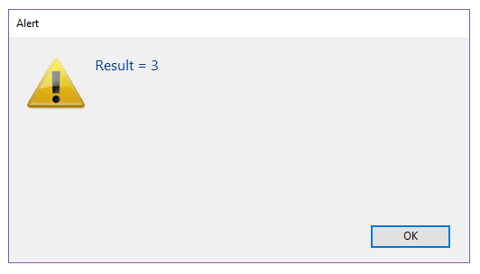

A **`4D.Function`** object contains a piece of code that can be executed from an object, either using the `()` operator, or using the [`apply()`](#apply) and [`call()`](#call) functions. 4D proposes three kinds of `Function` objects:

- **native functions**, i.e. built-in functions from various 4D classes such as `collection.sort()` or `file.copyTo()`.
- **user functions**, created in user [classes](Concepts/classes.md) using the [Function keyword](Concepts/classes.md#function).
- **formula functions**, i.e. functions that can execute any 4D formula.

### Objetos fórmula

The [Formula](#formula) and [Formula from string](#formula-from-string) commands allow you to create [`4D.Function` objects](#about-4dfunction-objects) to execute any 4D expression or code expressed as text.

Los objetos Formula pueden encapsularse en las propiedades de objeto:

```4d
 var $f : 4D.Function
 $f:=New object
 $f.message:=Formula(ALERT("Hello world"))
```

Esta propiedad es una "función objeto", es decir una función que está vinculada a su objeto padre. To execute a function stored in an object property, use the **()** operator after the property name, such as:

```4d
 $f.message() //muestra "Hello world"
```

También se admite la sintaxis con paréntesis:

```4d
 $f["message"]() //muestra "Hello world"
```

Tenga en cuenta que, aunque no tenga parámetros (ver arriba), una función objeto a ejecutar debe ser llamada con paréntesis ( ). Llamar sólo a la propiedad del objeto devolverá una nueva referencia a la fórmula (y no la ejecutará):

```4d
 $o:=$f.message //devuelve el objeto fórmula en $o
```

You can also execute a function using the [`apply()`](#apply) and [`call()`](#call) functions:

```4d
 $f.message.apply() //muestra "Hello world"
```

#### Paso de parámetros

You can pass parameters to your formulas using the [sequential parameter syntax](Concepts/parameters.md#sequential-parameters) based upon $1, $2...$n. Por ejemplo, puede escribir:

```4d
 var $f : Object
 $f:=New object
 $f.message:=Formula(ALERT("Hello "+$1))
 $f.message("John") //muestra "Hello John"
```

Or using the [.call()](#call) function:

```4d
 var $f : Object
 $f:=Formula($1+" "+$2)
 $text:=$f.call(Null;"Hello";"World") //devuelve "Hello World"
 $text:=$f.call(Null;"Welcome to";String(Year of(Current date))) //devuelve "Welcome to 2019" (por ejemplo)
```

#### Parámetros de un solo método

Para mayor comodidad, cuando la fórmula se compone de un único método proyecto, se pueden omitir los parámetros en la inicialización del objeto fórmula. Simplemente se pueden pasar la fórmula se llama. Por ejemplo:

```4d
 var $f : 4D.Function

 $f:=Formula(myMethod)
  //Writing Formula(myMethod($1;$2)) is not necessary
 $text:=$f.call(Null;"Hello";"World") //returns "Hello World"
 $text:=$f.call() //returns "How are you?"

  //myMethod
 #DECLARE ($param1 : Text; $param2 : Text)->$return : Text
 If(Count parameters=2)
    $return:=$param1+" "+$param2
 Else
    $return:="How are you?"
 End if
```

Los parámetros se reciben en el método, en el orden en que se especifican en la llamada.

### Resumen

|                                                                                                              |
| ------------------------------------------------------------------------------------------------------------ |
| [<!-- INCLUDE #FunctionClass.apply().Syntax -->](#apply)<br/><!-- INCLUDE #FunctionClass.apply().Summary --> |
| [<!-- INCLUDE #FunctionClass.call().Syntax -->](#call)<br/><!-- INCLUDE #FunctionClass.call().Summary -->    |
| [<!-- INCLUDE #FunctionClass.source.Syntax -->](#source)<br/><!-- INCLUDE #FunctionClass.source.Summary -->  |

## Formula

<details><summary>Historia</summary>

| Lanzamiento | Modificaciones                                      |
| ----------- | --------------------------------------------------- |
| 17 R6       | Renamed (New formula -> Formula) |
| 17 R3       | Añadidos                                            |

</details>

<!-- REF #_command_.Formula.Syntax -->**Formula** ( *formulaExp* : Expression ) : 4D.Function<!-- END REF -->

<!-- REF #_command_.Formula.Params -->

| Parámetros | Tipo                        |     | Descripción                             |
| ---------- | --------------------------- | :-: | --------------------------------------- |
| formulaExp | Expression                  |  -> | Fórmula a devolver como objeto          |
| Result     | 4D.Function |  <- | Función nativa que encapsula la fórmula |

<!-- END REF -->

#### Descripción

The `Formula` command <!-- REF #_command_.Formula.Summary -->creates a `4D Function` object based upon the _formulaExp_ expression<!-- END REF -->. _formulaExp_ can be as simple as a single value or complex, such as a project method with parameters.

Tener una fórmula como objeto permite pasarla como parámetro (atributo calculado) a los comandos o a los métodos o ejecutarla desde varios componentes sin necesidad de declararla como "compartida por los componentes y la base de datos local". Cuando se llama, el objeto fórmula se evalúa en el contexto de la base de datos o del componente que lo creó.

La fórmula devuelta puede ser llamada con:

- [`.call()`](#call) or [`.apply()`](#apply) methods, or
- object notation syntax (see [formula object](#formula-object)).

```4d
 var $f : 4D.Function
 $f:=Formula(1+2)
 $o:=New object("myFormula";$f)

  //tres formas diferentes de llamar a la fórmula
 $f.call($o) //devuelve 3
 $f.apply($o) //devuelve 3
 $o.myFormula() //devuelve 3
```

You can pass [parameters](#passing-parameters) to the `Formula`, as seen below in [example 4](#example-4).

You can specify the object on which the formula is executed, as seen in [example 5](#example-5). The properties of the object can then be accessed via the `This` command.

If _formulaExp_ uses local variables, their values are copied and stored in the returned formula object when it is created. Cuando se ejecuta, la fórmula utiliza estos valores copiados en lugar del valor actual de las variables locales. Tenga en cuenta que no se soporta el uso de arrays como variables locales.

The object created by `Formula` can be saved, for example, in a database field or in a blob document.

#### Ejemplo 1

Una fórmula simple:

```4d
 var $f : 4D.Function
 $f:=Formula(1+2)

 var $o : Object
 $o:=New object("f";$f)

 $result:=$o.f() // devuelve 3
```

#### Ejemplo 2

Una fórmula utilizando variables locales:

```4d


 $value:=10
 $o:=New object("f";Formula($value))
 $value:=20

 $result:=$o.f() // returns 10
```

#### Ejemplo 3

Una fórmula sencilla que utiliza parámetros:

```4d
 $o:=New object("f";Formula($1+$2))
 $result:=$o.f(10;20) //devuelve 30
```

#### Ejemplo 4

Una fórmula utilizando un método proyecto con parámetros:

```4d
 $o:=New object("f";Formula(myMethod))
 $result:=$o.f("param1";"param2") // equivalente a $result:=myMethod("param1";"param2")
```

#### Ejemplo 5

Utilizando `This`:

```4d
 $o:=New object("fullName";Formula(This.firstName+" "+This.lastName))
 $o.firstName:="John"
 $o.lastName:="Smith"
 $result:=$o.fullName() //devuelve "John Smith"
```

#### Ejemplo 6

Llamar a una fórmula utilizando la notación de objetos:

```4d
 var $feta; $robot : Object
 var $calc : 4D.Function
 $robot:=New object("name";"Robot";"price";543;"quantity";2)
 $feta:=New object("name";"Feta";"price";12.5;"quantity";5)

 $calc:=Formula(This.total:=This.price*This.quantity)

  //sets the formula to object properties
 $feta.calc:=$calc
 $robot.calc:=$calc

  //call the formula
 $feta.calc() // $feta={name:Feta,price:12.5,quantity:5,total:62.5,calc:"[object Formula]"}
 $robot.calc() // $robot={name:Robot,price:543,quantity:2,total:1086,calc:"[object Formula]"}
```

## Formula from string

<details><summary>Historia</summary>

| Lanzamiento | Modificaciones                                         |
| ----------- | ------------------------------------------------------ |
| 20 R3       | Support of _context_ parameter                         |
| 17 R6       | Renamed New formula from string -> Formula from string |
| 17 R3       | Añadidos                                               |

</details>

<!-- REF #_command_.Formula from string.Syntax -->**Formula from string**( *formulaString* : Text ) : 4D.Function<br/>**Formula from string**( *formulaString* : Text ; *context* : Longint ) : 4D.Function<!-- END REF -->

<!-- REF #_command_.Formula from string.Params -->

| Parámetros    | Tipo                        |     | Descripción                                                                                    |
| ------------- | --------------------------- | :-: | ---------------------------------------------------------------------------------------------- |
| formulaString | Text                        |  -> | Fórmula texto a devolver como objeto                                                           |
| context       | Number                      |  -> | `sk execute in current database` (default) or `sk execute in host database` |
| Result        | 4D.Function |  <- | Objeto nativo que encapsula la fórmula                                                         |

<!-- END REF -->

#### Descripción

The `Formula from string` command <!-- REF #_command_.Formula from string.Summary -->creates a `4D.Function` object based upon the _formulaString_ and, optionnally, a _context_<!-- END REF -->.  _formulaString_ can be as simple as a single value or complex, such as a project method with parameters.

This command is similar to [`Formula`](#formula), except that it handles a text-based formula and allows to define an execution context. It is usually recommended to use the `Formula` command, except if the original formula was expressed as text (e.g., stored externally in a JSON file), or if you want to create a formula in a host database while calling `Formula from string` from a component. Se recomienda especialmente utilizar sintaxis con tokens con este comando.

> Because local variable contents can not be accessed by name in compiled mode, they can not be used in _formulaString_. An attempt to access a local variable with `Formula from string` will result in an error (-10737).

If the formula is created in a component, you might consider using the _context_ parameter. Por defecto, dado que las fórmulas se ejecutan en el contexto en el que fueron creadas, no podrá llamar a una variable, función o método no compartido de la base de datos local. In this case, you can pass the `sk execute in host database` constant in the _context_ parameter to execute the `4D.Function` object in the context of the host database. Las siguientes constantes están disponibles:

| Constante                        | Tipo    | Descripción                                                                               |
| -------------------------------- | ------- | ----------------------------------------------------------------------------------------- |
| `sk execute in current database` | Longint | (por defecto) La fórmula se ejecutará en el contexto en el que se creó |
| `sk execute in host database`    | Longint | La fórmula se ejecutará en el contexto de la base de datos local                          |

#### Ejemplo

El siguiente código creará un diálogo que acepta una fórmula en formato texto:

```4d
 var $textFormula : Text
 var $f : 4D.Function
 $textFormula:=Request("Please type a formula")
 If(ok=1)
    $f:=Formula from string($textFormula)
    ALERT("Result = "+String($f.call()))
 End if
```


...y ejecuta la fórmula:



<!-- REF FunctionClass.apply().Desc -->

## .apply()

<details><summary>Historia</summary>

| Lanzamiento | Modificaciones |
| ----------- | -------------- |
| 17 R3       | Añadidos       |

</details>

<!-- REF #FunctionClass.apply().Syntax -->**.apply**() : any<br/>**.apply**( *thisObj* : Object { ; *formulaParams* : Collection } ) : any<!-- END REF -->

<!-- REF #FunctionClass.apply().Params -->

| Parámetros    | Tipo       |     | Descripción                                                                                                             |
| ------------- | ---------- | :-: | ----------------------------------------------------------------------------------------------------------------------- |
| thisObj       | Object     |  -> | Objeto a devolver por el comando This en la fórmula                                                                     |
| formulaParams | Collection |  -> | Collection of values to be passed as $1...$n when `formula` is executed |
| Result        | any        |  <- | Valor obtenido de la ejecución de la fórmula                                                                            |

<!-- END REF -->

#### Descripción

The `.apply()` function <!-- REF #FunctionClass.apply().Summary -->executes the `formula` object to which it is applied and returns the resulting value<!-- END REF -->. The formula object can be created using the `Formula` or `Formula from string` commands.

In the _thisObj_ parameter, you can pass a reference to the object to be used as `This` within the formula.

You can also pass a collection to be used as $1...$n parameters in the formula using the optional _formulaParams_ parameter.

Note that `.apply()` is similar to [`.call()`](#call) except that parameters are passed as a collection. Esto puede ser útil para pasar los resultados calculados.

#### Ejemplo 1

```4d
 var $f : 4D.Function
 $f:=Formula($1+$2+$3)

 $c:=New collection(10;20;30)
 $result:=$f.apply(Null;$c) // returns 60
```

#### Ejemplo 2

```4d
 var $calc : 4D.Function
 var $feta; $robot : Object
 $robot:=New object("name";"Robot";"price";543;"quantity";2)
 $feta:=New object("name";"Feta";"price";12.5;"quantity";5)

 $calc:=Formula(This.total:=This.price*This.quantity)

 $calc.apply($feta) // $feta={name:Feta,price:12.5,quantity:5,total:62.5}
 $calc.apply($robot) // $robot={name:Robot,price:543,quantity:2,total:1086}
```

<!-- END REF -->

<!-- REF FunctionClass.call().Desc -->

## .call()

<details><summary>Historia</summary>

| Lanzamiento | Modificaciones |
| ----------- | -------------- |
| 17 R3       | Añadidos       |

</details>

<!-- REF #FunctionClass.call().Syntax -->**.call**() : any<br/>**.call**( *thisObj* : Object { ; ...*params* : any } ) : any<!-- END REF -->

<!-- REF #FunctionClass.call().Params -->

| Parámetros | Tipo   |    | Descripción                                                                                                                                              |
| ---------- | ------ | -- | -------------------------------------------------------------------------------------------------------------------------------------------------------- |
| thisObj    | Object | -> | Objeto a devolver por el comando This en la fórmula                                                                                                      |
| params     | any    | -> | Valor(es) que se pasa(n) como $1...$n cuando se ejecuta la fórmula |
| Result     | any    | <- | Valor obtenido de la ejecución de la fórmula                                                                                                             |

<!-- END REF -->

#### Descripción

The `.call()` function <!-- REF #FunctionClass.call().Summary -->executes the `formula` object to which it is applied and returns the resulting value<!-- END REF -->. The formula object can be created using the `Formula` or `Formula from string` commands.

In the _thisObj_ parameter, you can pass a reference to the object to be used as `This` within the formula.

You can also pass values to be used as _$1...$n_ parameters in the formula using the optional _params_ parameter(s).

Note that `.call()` is similar to [`.apply()`](#apply) except that parameters are passed directly.

#### Ejemplo 1

```4d
 var $f : 4D.Function
 $f:=Formula(Uppercase($1))
 $result:=$f.call(Null;"hello") // returns "HELLO"
```

#### Ejemplo 2

```4d
 $o:=New object("value";50)
 $f:=Formula(This.value*2)
 $result:=$f.call($o) // returns 100
```

<!-- END REF -->

<!-- REF FunctionClass.source.Desc -->

## .source

<details><summary>Historia</summary>

| Lanzamiento | Modificaciones |
| ----------- | -------------- |
| 18 R2       | Añadidos       |

</details>

<!-- REF #FunctionClass.source.Syntax -->**.source** : Text <!-- END REF -->

#### Descripción

The `.source` property <!-- REF #FunctionClass.source.Summary -->contains the source expression of the `formula` as text<!-- END REF -->.

Esta propiedad es de **solo lectura**.

#### Ejemplo

```4d
 var $of : 4D.Function
 var $tf : Text
 $of:=Formula(String(Current time;HH MM AM PM))
 $tf:=$of.source //"String(Current time;HH MM AM PM)"
```

<!-- END REF -->
