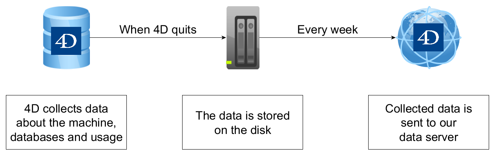

Para que nuestros productos sean siempre mejores, recogemos automáticamente los datos relativos a las estadísticas de uso de las aplicaciones 4D Server en funcionamiento. Los datos recogidos son completamente anónimos y se transfieren sin afectar la experiencia del usuario.

Esta página explica:

- what information is collected,
- where information is stored and when it is sent to 4D,
- cómo desactivar la recopilación automática de datos en las aplicaciones integradas cliente/servidor.

## Información recopilada

Los datos se recogen durante los siguientes eventos:

- database startup,
- cierre de base de datos,
- web server startup,
- php execution,
- client connection,
- data collection sending.

Some data is also collected at regular intervals.

### Collected at database startup

| Datos                   | Tipo                 | Notas                                                                                            |
| ----------------------- | -------------------- | ------------------------------------------------------------------------------------------------ |
| CPU                     | Text                 | Nombre, tipo y velocidad del procesador                                                          |
| numberOfCores           | Number               | Número total de núcleos                                                                          |
| memory                  | Number               | Volumen de almacenamiento de memoria (en bytes) disponible en la máquina                         |
| system                  | Text                 | Versión del sistema operativo y número de build                                                  |
| headless                | Boolean              | True si la aplicación se ejecuta en modo sin interfaz                                            |
| version                 | Number               | Número de versión de la aplicación 4D                                                            |
| buildNumber             | Number               | Número de build de la aplicación 4D                                                              |
| license                 | Object               | Nombre comercial y descripción de las licencias de los productos                                 |
| isRosetta               | Boolean              | True if 4D is emulated through Rosetta on macOS, False otherwise (not emulated or on Windows).   |
| uniqueID                | Text                 | Unique ID of the 4D Server                                                                       |
| id                      | Text (hashed string) | Identificador único asociado a la base de datos (*Polinomio Rolling hash del nombre de la base*) |
| dataFileSize            | Number               | Tamaño del archivo de datos en bytes                                                             |
| indexesSize             | Number               | Tamaño del índice en bytes                                                                       |
| cacheSize               | Number               | Tamaño de caché en bytes                                                                         |
| usingLegacyNetworkLayer | Boolean              | True si se utiliza la capa de red heredada para el servidor de aplicaciones                      |
| usingQUICNetworkLayer   | Boolean              | True if the database uses the QUIC network layer                                                 |
| encryptedConnections    | Boolean              | True if client/server connections are encrypted                                                  |
| encrypted               | Boolean              | True si el archivo de datos está encriptado                                                      |
| compiled                | Boolean              | True si la aplicación está compilada                                                             |
| isEngined               | Boolean              | True si la aplicación se fusiona con 4D Volume Desktop                                           |
| projectMode             | Boolean              | True si la aplicación es un proyecto                                                             |
| mobile                  | Collection           | Información sobre sesiones móviles                                                               |

### Collected at web server startup and data collection sending

| Datos     | Tipo   | Notas                                                   |
| --------- | ------ | ------------------------------------------------------- |
| webServer | Object | "started":true if the web server is starting or started |

### Collected at regular intervals

| Datos                       | Tipo   | Notas                                        |
| --------------------------- | ------ | -------------------------------------------- |
| maximumNumberOfWebProcesses | Number | Maximum number of simultaneous web processes |
| maximumUsedPhysicalMemory   | Number | Maximum use of physical memory               |
| maximumUsedVirtualMemory    | Number | Maximum use of virtual memory                |

### Collected at data collection sending

| Datos                       | Tipo   | Notas                                                                 |
| --------------------------- | ------ | --------------------------------------------------------------------- |
| uptime                      | Number | Tiempo transcurrido (en segundos) desde que se abrió la base 4D local |
| cacheReadBytes              | Object | Number of bytes read from cache                                       |
| cacheMissBytes              | Object | Number of bytes missed from cache                                     |
| cacheReadCount              | Object | Number of reads in the cache                                          |
| cacheMissCount              | Object | Number of reads missed in the cache                                   |
| dataSegment1.diskReadBytes  | Object | Number of bytes read in the data file                                 |
| dataSegment1.diskWriteBytes | Object | Number of bytes written in the data file                              |
| dataSegment1.diskReadCount  | Object | Number of reads in the data file                                      |
| dataSegment1.diskWriteCount | Object | Number of writes in the data file                                     |
| indexSegment.diskReadBytes  | Number | Number of bytes read in the index file                                |
| indexSegment.diskWriteBytes | Number | Number of bytes written in the index file                             |
| indexSegment.diskReadCount  | Number | Number of reads in the index file                                     |
| indexSegment.diskWriteCount | Number | Number of writes in the index file                                    |

### Collected at database closure and data collection sending

| Datos             | Tipo   | Notas                                                        |
| ----------------- | ------ | ------------------------------------------------------------ |
| webserverHits     | Number | Number of hits on the web server during the data collection  |
| restHits          | Number | Number of hits on the REST server during the data collection |
| webserverBytesIn  | Number | Bytes received by the web server during the data collection  |
| webserverBytesOut | Number | Bytes sent by the web server during the data collection      |

### Collected every time PHP execute is called

| Datos       | Tipo    | Notas                                                                               |
| ----------- | ------- | ----------------------------------------------------------------------------------- |
| phpCall     | Number  | Number of calls to `PHP execute`                                                    |
| externalPHP | Boolean | True if the client performs a call to `PHP execute` and uses its own version of php |

### Collected at client connection

| Datos                      | Tipo       | Notas                                                                              |
| -------------------------- | ---------- | ---------------------------------------------------------------------------------- |
| maximum4DClientConnections | Number     | Maximum number of 4D Client connections to the server                              |
| connectionSystems          | Collection | Client OS without the build number (in parenthesis) and number of clients using it |

## ¿Dónde se almacena y envía?

Collected data is written in a text file (JSON format) per database when 4D Server quits. The file is stored inside the [active 4D folder](https://doc.4d.com/4dv20/help/command/en/page485.html), i.e.:

- en Windows: `Users\[userName]\AppData\Roaming\4D Server`
- en macOS: `/Users/[userName]/Library/ApplicationSupport/4D Server`

Una vez a la semana, el archivo se envía automáticamente por la red a 4D. A continuación, el archivo se elimina de la carpeta activa de 4D.

> Si el archivo no ha podido ser enviado por alguna razón, no obstante se elimina y no se muestra ningún mensaje de error del lado de 4D Server.

El archivo se envía a la siguiente dirección del servidor: `https://dcollector.4d.com` (ip: 195.68.52.83).

## Desactivar la recopilación de datos en las aplicaciones cliente/servidor integradas

Puede desactivar la recolección automática de datos en [aplicaciones integradas cliente/servidor](../Desktop/building.md#clientserver-page).

Para desactivar la colección, pasar el valor **False** a la llave [`ServerDataCollection`](https://doc.4d.com/4Dv19R6/4D/19-R6/ServerDataCollection.300-6011712.en.html) en el archivo `buildApp. Archivo Dsettings`, utilizado para crear la aplicación cliente/servidor.