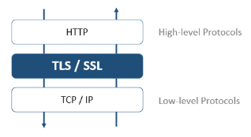

Todos los servidores 4D pueden comunicarse en modo seguro a través del protocolo TLS (Transport Layer Security):

- el servidor HTTP
- el servidor de aplicaciones (aplicaciones de escritorio cliente-servidor)
- el servidor SQL

Además, el cliente HTTP de 4D (comando `HTTP get` por ejemplo) también soporta el protocolo TLS.

## Generalidades

El protocolo TLS (sucesor de SSL) ha sido diseñado para asegurar los intercambios de datos entre dos aplicaciones, principalmente entre un servidor web y un navegador. Este protocolo es ampliamente utilizado y es compatible con la mayoría de los navegadores web.

A nivel de red, el protocolo de seguridad se inserta entre la capa TCP/IP (nivel bajo) y el protocolo de alto nivel HTTP. Ha sido diseñado principalmente para trabajar con HTTP.

Configuración de red utilizando TLS:

El protocolo TLS está diseñado para autenticar al emisor y al receptor y para garantizar la confidencialidad e integridad de la información intercambiada:

- **Autenticación**: se confirma la identidad del emisor y del receptor.
- **Confidencialidad**: los datos enviados se cifran para que ninguna tercera persona pueda entender el mensaje.
- **Integridad**: los datos recibidos no han sido modificados, por accidente o de forma malintencionada.

TLS utiliza una técnica de cifrado de llave pública basada en un par de llaves asimétricas para el cifrado y el descifrado: una llave pública y una llave privada. La llave privada se utiliza para encriptar los datos. El remitente (el sitio web) no se la da a nadie.

La llave pública se utiliza para descifrar la información y se envía a los receptores (navegadores web) a través de un **certificado**. El certificado se entrega a través de una autoridad de certificación. El sitio web paga al proveedor de certificados para que le entregue un certificado que garantiza la autenticación del servidor y contiene la llave pública que permite intercambiar datos de forma segura.

:::note

Los navegadores web solo autorizan los certificados emitidos por una autoridad de certificación referenciada en sus propiedades.

:::

## Versión mínima

Por defecto, la versión mínima del protocolo de seguridad aceptado por los servidores 4D es TLS 1.3. Puede modificar este valor utilizando el selector `Min TLS version` con el comando `SET DATABASE PARAMETER`.

:::note

Puedes controlar de forma separada la [versión mínima de TLS](WebServer/webServerConfig.md#minimum-tls-version) para **objetos webServer**.

:::

## Habilitar TLS con el servidor HTTP

Para poder utilizar el protocolo TLS con el servidor HTTP de 4D, debe:

1. Obtener sus archivos de certificado.
2. Instale sus archivos de certificado en la(s) ubicación(es) adecuada(s)
3. Activar TLS.

### Certificados

#### Formato

Los certificados TLS gestionados por 4D deben estar en formato **PEM**. Si su proveedor de certificados le envía un certificado que está en un formato binario como . rt, .pfx o .p12, tienes que convertirlo a formato PEM para poder utilizarlo. Hay sitios web donde se puede hacer esta conversión en línea.

#### Encripción

4D soporta certificados en los siguientes formatos estándar de cifrado:

- [**RSA**](https://en.wikipedia.org/wiki/RSA_\(cryptosystem\))
- [**ECDSA**](https://en.wikipedia.org/wiki/Elliptic_Curve_Digital_Signature_Algorithm)

:::info Compatibilidad

El formato de cifrado ECDSA no es compatible por 4D [capa de red legacy](../settings/client-server.md#network-layer).

:::

:::note

4D le propone dos comandos para ayudarle a solicitar un certificado RSA, [vea el tutorial más abajo](#how-to-get-a-rsa-certificate-tutorial).

:::

### Instalación de archivos de certificados

Los archivos de certificados incluyen:

- **key.pem**: documento que contiene la llave de encriptación privada,
- **cert.pem**: documento que contiene el certificado.

Ambos archivos **key.pem** y **cert.pem** deben ubicarse:

- con 4D Server o 4D en modo local, junto a la [carpeta Project](Project/architecture.md#project-folder)
- con 4D en modo remoto, en la carpeta de la base cliente en la máquina remota (para más información sobre la ubicación de esta carpeta, ver el comando [`Get 4D folder`](https://doc.4d.com/4dv20/help/command/en/page485.html)). Debe copiar estos archivos manualmente en la máquina remota.

### Activar TLS

Para que el servidor HTTP acepte conexiones TLS, debe activar HTTPS. Consulte el párrafo [**Activar HTTPS**](WebServer/webServerConfig.md#enable-https) para conocer las diferentes maneras de habilitar TLS para el servidor HTTP.

:::note

El servidor web 4D también soporta [la opción HSTS](WebServer/webServerConfig.md#enable-hsts) para declarar que los navegadores sólo deben interactuar con él a través de conexiones seguras HTTPS.

:::

### Perfect Forward Secrecy (PFS)

[PFS](https://en.wikipedia.org/wiki/Forward_secrecy) añade una capa adicional de seguridad a sus comunicaciones. En lugar de utilizar llaves de intercambio predefinidas, PFS crea llaves de sesión de forma cooperativa entre las partes que se comunican utilizando algoritmos Diffie-Hellman (DH). La forma conjunta en que se construyen las llaves crea un "secreto compartido" que impide que partes externas puedan comprometerlas.

Cuando se habilita TLS en el servidor, PFS se habilita automáticamente. Si el archivo *dhparams.pem* (documento que contiene la llave privada DH del servidor) no existe todavía, 4D lo generará automáticamente con un tamaño de llave de 2048. La generación inicial de este archivo puede llevar varios minutos. El archivo se coloca junto con los archivos [*key.pem* y *cert.pem*](#instalación-de-archivos-de-certificado).

Si utiliza una [lista de cifrado personalizada](WebServer/webServerConfig.md##cipher-list) y desea activar PFS, debe verificar que contiene entradas con algoritmos DH o ECDH (Elliptic-curve Diffie-Hellman).

## Activar TLS con los otros servidores

Para utilizar TLS con el servidor de aplicaciones 4D (aplicaciones cliente-servidor de escritorio) o el servidor SQL, solo tiene que habilitar las comunicaciones TLS y el servidor configura automáticamente las conexiones al inicio.

- Con el servidor de aplicaciones, seleccione la opción **Encriptar las comunicaciones cliente-servidor** en la página ["Opciones cliente-servidor/red" del diálogo Parámetros](../settings/client-server#encrypt-client-server-communications).
- Con el servidor SQL, seleccione la opción **Activar TLS** en la [página "SQL" del cuadro de diálogo Parámetros](../settings/sql#sql-server-publishing).

## ¿Cómo obtener un certificado RSA? (tutorial)

Un servidor que funciona en modo seguro significa que necesita un certificado digital de una autoridad de certificación. Este certificado contiene diversa información, como el ID del sitio, así como la llave pública utilizada para comunicarse con el servidor. Este certificado se transmite a los clientes (por ejemplo, los navegadores web) que se conectan a este servidor. Una vez identificado y aceptado el certificado, la comunicación se realiza en modo seguro.

> Los navegadores web sólo autorizan los certificados emitidos por una autoridad de certificación referenciada en sus propiedades.

La autoridad de certificación se elige en función de varios criterios. If the certification authority is well known, the certificate will be authorized by many browsers, however the price to pay will be expensive.

Para obtener un certificado digital:

1. Genere una llave privada utilizando el comando `GENERATE ENCRYPTION KEYPAIR`.

> **Atención**: por razones de seguridad, la llave privada debe mantenerse siempre en secreto. En realidad, debería permanecer siempre en la máquina del servidor. Para el servidor web, el archivo Key.pem debe colocarse en la carpeta Project.

2. Utilice el comando `GENERATE CERTIFICATE REQUEST` para emitir una solicitud de certificado.

3. Envíe la solicitud de certificado a la autoridad de certificación elegida.
   Para llenar una solicitud de certificado, es posible que tenga que ponerse en contacto con la autoridad de certificación. La autoridad de certificación comprueba que la información transmitida es correcta. La petición de certificado se genera en un BLOB utilizando el formato PKCS codificado en base64 (formato PEM). Este principio permite copiar y pegar las llaves como texto y enviarlas por correo electrónico sin modificar el contenido de la llave. Por ejemplo, puede guardar el BLOB que contiene la solicitud de certificado en un documento de texto (usando el comando `BLOB TO DOCUMENT`), luego abrir y copiar y pegar su contenido en un correo electrónico o un formulario Web para ser enviado a la autoridad de certificación.

4. Una vez que tenga el certificado, cree un archivo de texto llamado "cert.pem" y pegue en él el contenido del certificado.
   Puede recibir un certificado de diferentes maneras (normalmente por correo electrónico o formulario HTML). 4D acepta todos los formatos de texto relacionados con la plataforma para los certificados (OS X, PC, Linux, etc.). Sin embargo, el certificado debe estar en [formato PEM](#format), *es decir,*, PKCS codificado en base64.

> Los caracteres de fin de línea CR no se soportan por sí solos; debe utilizar CRLF o LF.

5. Coloca el archivo “cert.pem” en la [ubicación apropiada](#installing-certificate-files).

El servidor 4D puede ahora trabajar en modo seguro. Un certificado suele tener una validez de entre 3 meses y un año.
