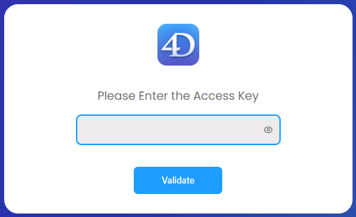

An embedded web server component, named `WebAdmin`, is used by 4D and 4D Server to provide a secured web access to specific features:

- Accesos REST al proyecto
- el [Explorador de datos](dataExplorer.md)
- the [Qodly Studio preview rendering](https://developer.4d.com/qodly/4DQodlyPro/rendering#preview-in-qodly-studio)

Puede conectarse local o remotamente a este servidor web desde un navegador o cualquier aplicación web y acceder a la aplicación 4D asociada.

The Web Administration Server handles the authentication of users with `WebAdmin` privileges, so that they can open administration sessions and access dedicated interfaces.

Esta funcionalidad se puede utilizar en aplicaciones 4D que se ejecutan con o sin interfaces.

## Iniciando el servidor de administración web

By default, the Web Administration Server web server is not launched. Es necesario configurar el lanzamiento al inicio, o (en las versiones con interfaz) lanzarlo manualmente mediante una opción de menú.

### Lanzamiento al inicio

You can configure the Web Administration Server to be launched at 4D or 4D Server application startup (before any project is loaded).

- Si utiliza una aplicación 4D con interfaz, seleccione la opción de menú **Archivo > Administración web > Parámetros....**.


Seleccione la opción **Iniciar servidor WebAdmin al inicio** en la caja de diálogo de parámetros:


- Tanto si utiliza la aplicación 4D con o sin interfaz, puede habilitar el modo de inicio automático utilizando el siguiente argumento *Interfaz de línea de comandos*:

```
open ~/Desktop/4D.app --webadmin-auto-start true
```

> If the TCP port used by the Web Administration Server ([HTTPS](#https-port) or [HTTP](#http-port), depending on the settings) is not free at startup, 4D will try successively the 20 following ports, and use the first one that is available. Si no hay ningún puerto disponible, el servidor web no se lanza y se muestra un error o para las aplicaciones sin interfaz, aparece en la consola.

### Iniciar y detener

If you use a 4D application with interface, you can start or stop the Web Administration Server for your project at any moment:

Seleccione la opción de menú **Archivo > Administración web > Iniciar el servidor**.


The menu item becomes **Stop Server** when the server is launched; select **Stop Server** to stop the Web Administration Server.

## Settings {#settings}

Configuring the Web Administration Server is mandatory in particular to define the [**access key**](#access-key). Por defecto, cuando la clave de acceso no está configurada, no se permite el acceso a través de una URL.

You can configure the Web Administration Server using the [Web Administration settings dialog box](#settings-dialog-box) (see below).

> Si utiliza una aplicación 4D sin interfaz, puede utilizar los [argumentos de la *Interfaz de Línea de Comandos*](#webadmin-headless-configuration) para definir la configuración básica. Tendrá que personalizar el archivo de configuración para definir los parámetros avanzados.

### Caja de diálogo de parámetros

Para abrir la caja de diálogo de configuración de administración web, seleccione **Archivo > Administración Web > Configuración....**.


Se muestra la siguiente caja de diálogo:


#### Iniciar el servidor WebAdmin al inicio

Check this option if you want the Web Administration Server to be automatically launched when the 4D or 4D Server application starts ([see above](#launch-at-startup)). Por defecto, esta opción no está seleccionada.

#### Conexiones HTTP en localhost aceptadas

When this option is checked, you will be able to connect to the Web Administration Server through HTTP on the same machine as the 4D application. Por defecto, esta opción está seleccionada.

:::note Notas

- Nunca se aceptan conexiones con HTTP que no sean localhost.
- Incluso si esta opción está activada, cuando [HTTPS aceptada](#accept-https) está activada y la configuración TLS es válida, las conexiones localhost utilizan HTTPS.

:::

#### Puerto HTTP

Port number to use for connections through HTTP to the Web Administration Server when the **Accept HTTP connections on localhost** option is checked. El valor por defecto es 7080.

#### Aceptar HTTPS

When this option is checked, you will be able to connect to the Web Administration Server through HTTPS. Por defecto, esta opción está seleccionada.

#### Puerto HTTPS

Port number to use for connections through HTTPS to the Web Administration Server when the **Accept HTTPS** option is checked. El valor por defecto es 7443.

#### Ruta de la carpeta de certificados

Ruta de la carpeta donde se encuentran los archivos del certificado TLS. Por defecto, la ruta de la carpeta de certificados está vacía y 4D o 4D Server utiliza los archivos de certificados contenidos en la aplicación 4D (los certificados personalizados deben almacenarse junto a la carpeta de proyecto).

#### Modo de registro de depuración

Estado o formato del archivo de registro de peticiones HTTP (HTTPDebugLog_*nn*.txt, almacenado en la carpeta "Logs" de la aplicación -- *nn* es el número de archivo). Las siguientes opciones están disponibles:

- **Desactivado** (por defecto)
- **Con todas las partes del body** - activado con las partes del cuerpo en respuesta y petición
- \*\*Sin las partes del body \*\* - activado sin partes del cuerpo (se indica el tamaño del cuerpo)
- **Con los cuerpos de las peticiones** - activado con la partes del cuerpo únicamente en las peticiones
- **Con la respuesta body** - activado con la partes del cuerpo únicamente en las respuestas

#### Llave de acceso

Defining an access key is mandatory to unlock access to the Web Administration Server through a URL (access via a 4D menu command does not require an access key). Cuando no se define ninguna llave de acceso, no se permite que ningún cliente web se conecte a través de una URL a una interfaz de administración web como la [página Explorador de datos](dataExplorer.md). Se devuelve una página de error en caso de solicitud de conexión:


Una llave de acceso es similar a una contraseña pero no está asociada a un inicio de sesión.

- Para definir una nueva llave de acceso: haga clic en el botón **Definir**, introduzca la cadena de la llave de acceso en la caja de diálogo y haga clic en **OK**. La etiqueta del
  botón se convierte en **Modificar**.
- Para modificar la llave de acceso: haga clic en el botón **Modificar**, introduzca la nueva cadena de la llave de acceso en la caja de diálogo y haga clic en **OK**.
- Para eliminar la llave de acceso: haga clic en el botón **Modificar**, deje vacía el área de la llave de acceso y haga clic en **OK**.

#### Activar el acceso a Qodly Studio

:::note

Esta opción sólo aparece si la licencia de Qodly Studio está activa.

:::

Esta opción permite al usuario acceder a [Qodly Studio](../WebServer/qodly-studio.md) a nivel de la aplicación 4D. Tenga en cuenta que también necesita [habilitar el acceso en cada nivel de proyecto](../settings/web.md#enable-access-to-qodly-studio).

:::note

This option is automatically checked if you used the [One-click configuration dialog box](https://developer.4d.com/qodly/4DQodlyPro/gettingStarted#one-click-configuration).

:::

## Headless Configuration

All [Web Administration Server settings](#settings) are stored in the `WebAdmin.4DSettings` file. Hay un archivo `WebAdmin.4DSettings` por defecto por cada aplicación 4D y 4D Server, por lo que es posible desplegar varias aplicaciones en la misma máquina local.

Cuando se ejecuta una aplicación 4D o 4D Server sin interfaz, se puede configurar y utilizar el archivo `WebAdmin.4DSettings` por defecto, o designar un archivo `.4DSettings` personalizado.

Para definir el contenido del archivo, puedes utilizar la [ventana de parámetros WebAdmin](#settings-dialog-box) de la aplicación 4D con interfaz y luego ejecutarla sin interfaz. Se utiliza entonces
el archivo por defecto `WebAdmin.4DSettings`.

O bien, puede definir un archivo personalizado `.4DSettings` (formato xml) y utilizarlo en lugar del archivo predeterminado. Hay varios argumentos dedicados disponibles en la [Interfaz de línea de comandos](cli.md) para soportar esta funcionalidad.

> La llave de acceso no se almacena de manera transparente en el archivo `.4DSettings`.

Ejemplo:

```
"%HOMEPATH%\Desktop\4D Server.exe" MyApp.4DLink --webadmin-access-key 
	"my Fabulous AccessKey" --webadmin-auto-start true   
	--webadmin-store-settings

```

## Autenticación

When a web page controlled by the Web Administration Server is accessed by entering a URL and without prior identification, an authentication is required. El usuario debe introducir la [llave-de-acceso](#access-key) en una ventana de autenticación:



If the access key was not defined in the Web Administration Server settings, no access via URL is possible (a specific message is displayed).

When a web page controlled by the Web Administration Server page is accessed directly from a 4D or 4D Server menu item (such as **Records > Data Explorer** or **Window > Data Explorer** (4D Server)), access is granted without authentication, the user is automatically authenticated.

:::note

Once the access is granted, a [web session](WebServer/sessions.md) with a specific "WebAdmin" privilege is created by the Web Administration Server. This privilege provides an open access to all data through web processes, as soon as no [specific permissions are applied to resources](../ORDA/privileges.md).

:::

