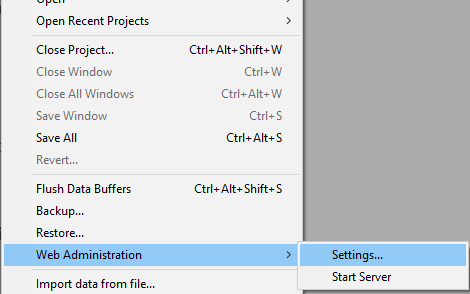
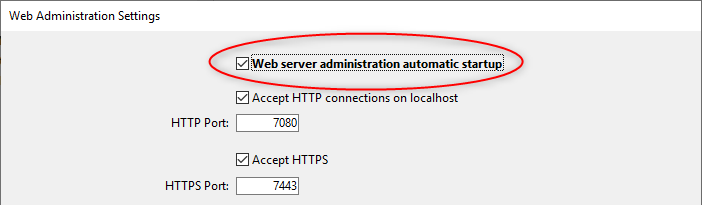
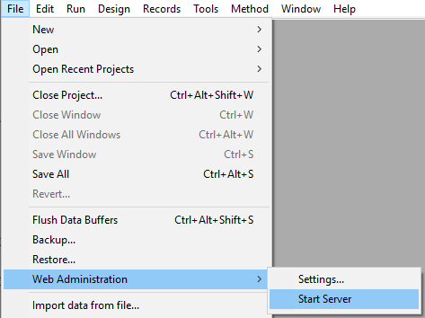
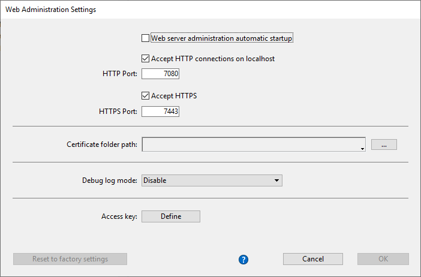
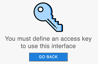
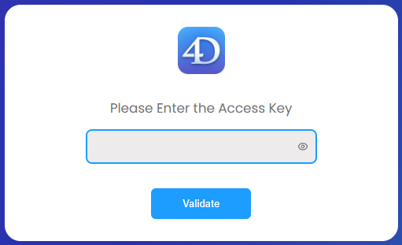

Un servidor web integrado, llamado `WebAdmin`, es utilizado por 4D y 4D Server para proporcionar un acceso web seguro a funcionalidades específicas:

- Accesos REST al proyecto
- el [Explorador de datos](dataExplorer.md)
- el [renderizado de la vista previa de Qodly Studio](https://developer.4d.com/qodly/4DQodlyPro/rendering#preview-in-qodly-studio)

Puede conectarse local o remotamente a este servidor web desde un navegador o cualquier aplicación web y acceder a la aplicación 4D asociada.

El Servidor de administración Web gestiona la autenticación de los usuarios con privilegios `WebAdmin`, para que puedan abrir sesiones de administración y acceder a las interfaces dedicadas.

Esta funcionalidad se puede utilizar en aplicaciones 4D que se ejecutan con o sin interfaces.

## Iniciando el servidor de administración web

Por defecto, el servidor web del Servidor de Administración Web no se inicia. Es necesario configurar el lanzamiento al inicio, o (en las versiones con interfaz) lanzarlo manualmente mediante una opción de menú.

### Lanzamiento al inicio

Puede configurar el servidor de administración web para que se ejecute al inicio de la aplicación 4D o 4D Server (antes de que se cargue cualquier proyecto).

- Si utiliza una aplicación 4D con interfaz, seleccione la opción de menú **Archivo > Administración web > Parámetros....**.



Seleccione la opción **Iniciar servidor WebAdmin al inicio** en la caja de diálogo de parámetros:



- Tanto si utiliza la aplicación 4D con o sin interfaz, puede habilitar el modo de inicio automático utilizando el siguiente argumento *Interfaz de línea de comandos*:

```
open ~/Desktop/4D.app --webadmin-auto-start true
```

> Si el puerto TCP utilizado por el servidor de administración web ([HTTPS](#https-port) o [HTTP](#http-port), según la configuración) no está disponible al inicio, 4D intentará sucesivamente los 20 puertos siguientes, y utilizará el primero que esté disponible. Si no hay ningún puerto disponible, el servidor web no se lanza y se muestra un error o para las aplicaciones sin interfaz, aparece en la consola.

### Iniciar y detener

Si utiliza una aplicación 4D con interfaz, puede iniciar o detener el Servidor de Administración Web para su proyecto en cualquier momento:

Seleccione la opción de menú **Archivo > Administración web > Iniciar el servidor**.



El elemento de menú se convierte en **Detener el servidor** cuando se inicia el servidor; seleccione **Detener el servidor** para detener el Servidor de administración Web.

## Propiedades {#settings}

La configuración del servidor de administración Web es obligatoria en particular para definir la [**llave de acceso**](#access-key). Por defecto, cuando la clave de acceso no está configurada, no se permite el acceso a través de una URL.

Puede configurar el servidor de administración web con la [caja de diálogo de las propiedades de administración web](#settings-dialog-box) (ver abajo).

> Si utiliza una aplicación 4D sin interfaz, puede utilizar los [argumentos de la *Interfaz de Línea de Comandos*](#headless-configuration) para definir la configuración básica. Tendrá que personalizar el archivo de configuración para definir los parámetros avanzados.

### Caja de diálogo de parámetros

Para abrir la caja de diálogo de configuración de administración web, seleccione **Archivo > Administración Web > Configuración....**.


Se muestra la siguiente caja de diálogo:



#### Iniciar el servidor WebAdmin al inicio

Marque esta opción si desea que el servidor de administración web se lance automáticamente cuando la aplicación 4D o 4D Server se inicie ([ver arriba](#launch-at-startup)). Por defecto, esta opción no está seleccionada.

#### Conexiones HTTP en localhost aceptadas

Cuando esta opción está marcada, podrá conectarse al servidor de administración Web a través de HTTP en la misma máquina que la aplicación 4D. Por defecto, esta opción está seleccionada.

:::note Notas

- Nunca se aceptan conexiones con HTTP que no sean localhost.
- Incluso si esta opción está activada, cuando [HTTPS aceptada](#accept-https) está activada y la configuración TLS es válida, las conexiones localhost utilizan HTTPS.

:::

#### Puerto HTTP

Número de puerto a utilizar para conexiones a través de HTTP al Servidor de administración Web cuando la opción **Aceptar conexiones HTTP en localhost** está marcada. El valor por defecto es 7080.

#### Aceptar HTTPS

Cuando esta opción esté marcada, podrá conectarse al Servidor de Administración Web a través de HTTPS. Por defecto, esta opción está seleccionada.

#### Puerto HTTPS

Número de puerto a utilizar para las conexiones al servidor de administracion web a través de HTTPS cuando la opción **HTTPS aceptada** está marcada. El valor por defecto es 7443.

#### Ruta de la carpeta de certificados

Ruta de la carpeta donde se encuentran los archivos del certificado TLS. Por defecto, la ruta de la carpeta de certificados está vacía y 4D o 4D Server utiliza los archivos de certificados contenidos en la aplicación 4D (los certificados personalizados deben almacenarse junto a la carpeta de proyecto).

#### Modo de registro de depuración

Estado o formato del archivo de registro de peticiones HTTP (HTTPDebugLog_*nn*.txt, almacenado en la carpeta "Logs" de la aplicación -- *nn* es el número de archivo). Las siguientes opciones están disponibles:

- **Desactivado** (por defecto)
- **Con todas las partes del body** - activado con las partes del cuerpo en respuesta y petición
- \*\*Sin las partes del body \*\* - activado sin partes del cuerpo (se indica el tamaño del cuerpo)
- **Con los cuerpos de las peticiones** - activado con la partes del cuerpo únicamente en las peticiones
- **Con la respuesta body** - activado con la partes del cuerpo únicamente en las respuestas

#### Llave de acceso

Cuando no se define ninguna llave de acceso, no se permite que ningún cliente web se conecte a través de una URL a una interfaz de administración web como la [página Explorador de datos](dataExplorer.md). La configuración de una llave de acceso es obligatoria para desbloquear el acceso al servidor de administración web a través de una URL (el acceso a través de un comando del menú 4D no requiere una llave de acceso). Se devuelve una página de error en caso de solicitud de conexión:



Una llave de acceso es similar a una contraseña pero no está asociada a un inicio de sesión.

- Para definir una nueva llave de acceso: haga clic en el botón **Definir**, introduzca la cadena de la llave de acceso en la caja de diálogo y haga clic en **OK**. La etiqueta del
  botón se convierte en **Modificar**.
- Para modificar la llave de acceso: haga clic en el botón **Modificar**, introduzca la nueva cadena de la llave de acceso en la caja de diálogo y haga clic en **OK**.
- Para eliminar la llave de acceso: haga clic en el botón **Modificar**, deje vacía el área de la llave de acceso y haga clic en **OK**.

#### Activar el acceso a Qodly Studio

:::note

Esta opción sólo aparece si la licencia de Qodly Studio está activa.

:::

Esta opción permite al usuario acceder a [Qodly Studio](developer.4d.com/qodly/) a nivel de la aplicación 4D. Tenga en cuenta que también necesita [habilitar el acceso en cada nivel de proyecto](../settings/web.md#enable-access-to-qodly-studio).

:::note

Esta opción se marca automáticamente si ha utilizado la [caja de diálogo de configuración en un solo clic](https://developer.4d.com/qodly/4DQodlyPro/gettingStarted#one-click-configuration).

:::

## Configuración sin interfaz

Todas las [propiedades del servidor de administración Web](#settings) se almacenan en el archivo `WebAdmin.4DSettings`. Hay un archivo `WebAdmin.4DSettings` por defecto por cada aplicación 4D y 4D Server, por lo que es posible desplegar varias aplicaciones en la misma máquina local.

Cuando se ejecuta una aplicación 4D o 4D Server sin interfaz, se puede configurar y utilizar el archivo `WebAdmin.4DSettings` por defecto, o designar un archivo `.4DSettings` personalizado.

Para definir el contenido del archivo, puedes utilizar la [ventana de parámetros WebAdmin](#settings-dialog-box) de la aplicación 4D con interfaz y luego ejecutarla sin interfaz. Se utiliza entonces
el archivo por defecto `WebAdmin.4DSettings`.

O bien, puede definir un archivo personalizado `.4DSettings` (formato xml) y utilizarlo en lugar del archivo predeterminado. Hay varios argumentos dedicados disponibles en la [Interfaz de línea de comandos](cli.md) para soportar esta funcionalidad.

> La llave de acceso no se almacena de manera transparente en el archivo `.4DSettings`.

Ejemplo:

```
"%HOMEPATH%\Desktop\4D Server.exe" MyApp.4DLink --webadmin-access-key 
	"my Fabulous AccessKey" --webadmin-auto-start true   
	--webadmin-store-settings

```

## Autenticación

Cuando se accede a una página web controlada por el Servidor de Administración Web introduciendo una URL y sin identificación previa, se requiere una autenticación. El usuario debe introducir la [llave-de-acceso](#access-key) en una ventana de autenticación:



Si la llave de acceso no se ha definido en la configuración del servidor de administración Web, no es posible acceder a través de la URL (se muestra un mensaje específico).

Cuando se accede a una página web controlada por la página del servidor de administración web directamente desde un elemento de menú de 4D o 4D Server (como **Registros > Explorador de datos** o **Ventana > Explorador de datos** (4D Server)), el acceso se concede sin autenticación, el usuario se autentifica automáticamente.

:::note

Una vez que se concede el acceso, una [sesión web](WebServer/sessions.md) con un privilegio específico "WebAdmin" es creada por el servidor de administración web. Este privilegio permite acceder libremente a todos los datos a través de los procesos web, en cuanto no se apliquen [permisos específicos a los recursos](../ORDA/privileges.md).

:::

