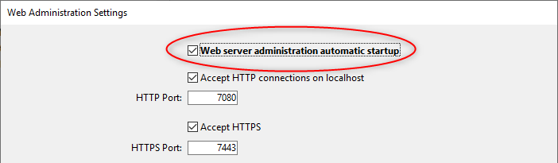
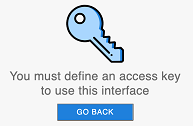

An embedded web server component, named `WebAdmin`, is used by 4D and 4D Server to provide a secured web access to specific management features such as the [Data Explorer](dataExplorer.md). Puede conectarse local o remotamente a este servidor web desde un navegador o cualquier aplicación web y acceder a la aplicación 4D asociada.

El WebAdmin se encarga de la autenticación de los usuarios con privilegios "WebAdmin", para que puedan abrir sesiones de administración y acceder a las interfaces dedicadas.

Esta funcionalidad se puede utilizar en aplicaciones 4D que se ejecutan con o sin interfaces.

## Iniciar el servidor web WebAdmin

By default, the `WebAdmin` web server is not launched. Es necesario configurar el lanzamiento al inicio, o (en las versiones con interfaz) lanzarlo manualmente mediante una opción de menú.

### Lanzamiento al inicio

You can configure the `WebAdmin` web server to be launched at 4D or 4D Server application startup (before any project is loaded).

- If you use a 4D application with interface, select the **File > Web Administration > Settings...** menu item.


Check the **Launch WebAdmin server at startup** option in the settings dialog box:



- Whether you use 4D application which is headless or not, you can enable the automatic startup mode using the following _Command Line Interface_ argument:

```
open ~/Desktop/4D.app --webadmin-auto-start true
```

> If the TCP port used by the `WebAdmin` web server ([HTTPS](#https-port) or [HTTP](#http-port), depending on the settings) is not free at startup, 4D will try successively the 20 following ports, and use the first one that is available. Si no hay ningún puerto disponible, el servidor web no se lanza y se muestra un error o para las aplicaciones sin interfaz, aparece en la consola.

### Iniciar y detener

If you use a 4D application with interface, you can start or stop the `WebAdmin` web server for your project at any moment:

Select the **File > Web Administration > Start Server** menu item.


The menu item becomes **Stop Server** when the server is launched; select **Stop Server** to stop the `WebAdmin` web server.

## Propiedades WebAdmin

Configuring the `WebAdmin` component is mandatory in particular to define the [**access key**](#access-key). Por defecto, cuando la clave de acceso no está configurada, no se permite el acceso a través de una URL.

You can configure the `WebAdmin` component using the [Web Administration settings dialog box](#settings-dialog-box) (see below).

> If you use a headless 4D application, you can use [_Command Line Interface_ arguments](#webadmin-headless-configuration) to define basic settings. Tendrá que personalizar el archivo de configuración para definir los parámetros avanzados.

### Caja de diálogo de parámetros

To open the Web Administration settings dialog box, select the **File > Web Administration > Settings...** menu item.


Se muestra la siguiente caja de diálogo:


#### Iniciar el servidor WebAdmin al inicio

Check this option if you want the `WebAdmin` web server to be automatically launched when the 4D or 4D Server application starts ([see above](#launching-at-startup)). Por defecto, esta opción no está seleccionada.

#### Conexiones HTTP en localhost aceptadas

When this option is checked, you will be able to connect to the `WebAdmin` web server through HTTP on the same machine as the 4D application. Por defecto, esta opción está seleccionada.

**Notas:**

- Nunca se aceptan conexiones con HTTP que no sean localhost.
- Even if this option is checked, when [Accept HTTPS](#accept-https) is checked and the TLS configuration is valid, localhost connections use HTTPS.

#### Puerto HTTP

Port number to use for connections through HTTP to the `WebAdmin` web server when the **Accept HTTP connections on localhost** option is checked. El valor por defecto es 7080.

#### Aceptar HTTPS

When this option is checked, you will be able to connect to the `WebAdmin` web server through HTTPS. Por defecto, esta opción está seleccionada.

#### Puerto HTTPS

Port number to use for connections through HTTPS to the `WebAdmin` web server when the **Accept HTTPS** option is checked. El valor por defecto es 7443.

#### Ruta de la carpeta de certificados

Ruta de la carpeta donde se encuentran los archivos del certificado TLS. Por defecto, la ruta de la carpeta de certificados está vacía y 4D o 4D Server utiliza los archivos de certificados contenidos en la aplicación 4D (los certificados personalizados deben almacenarse junto a la carpeta de proyecto).

#### Modo de registro de depuración

Status or format of the HTTP request log file (HTTPDebugLog__nn_.txt, stored in the "Logs" folder of the application -- _nn_ is the file number). Las siguientes opciones están disponibles:

- **Desactivado** (por defecto)
- **With all body parts** - enabled with body parts in response and request
- **Without body parts** - enabled without body parts (body size is provided)
- **With request body** - enabled with body part in request only
- **With response body** - enabled with body part in response only

#### Llave de acceso

Defining an access key is mandatory to unlock access to the `WebAdmin` web server through a URL (access via a 4D menu command does not require an access key). When no access key is defined, no web client is allowed to connect through a URL to a web administration interface like the [Data Explorer page](dataExplorer.md). Se devuelve una página de error en caso de solicitud de conexión:



Una llave de acceso es similar a una contraseña pero no está asociada a un inicio de sesión.

- To define a new access key: click the **Define** button, enter the access key string in the dialog box and click **OK**. The button label becomes **Modify**.
- To modify the access key: click the **Modify** button, enter the new access key string in the dialog box and click **OK**.
- To delete the access key: click the **Modify** button, let the access key area empty and click **OK**.

#### Activar el acceso a Qodly Studio

:::note

Esta opción sólo aparece si la licencia de Qodly Studio está activa.

:::

This option enables user access to [Qodly Studio](../WebServer/qodly-studio.md) at the 4D application level. Note that you also need to [enable the access at every project level](../settings/web.md#enable-access-to-qodly-studio).

## Configuración de WebAdmin sin interfaz

All [WebAdmin settings](#webadmin-settings) are stored in the `WebAdmin.4DSettings` file. There is one default `WebAdmin.4DSettings` file per 4D and 4D Server application, so that it is possible to deploy multiple applications on the same host machine.

When running a 4D or 4D Server application headless, you can set and use the default `WebAdmin.4DSettings` file, or designate a custom `.4DSettings` file.

To set the file contents, you can use the [WebAdmin settings dialog](#settings-dialog-box) of the 4D application with interface and run it headless afterwards. The default `WebAdmin.4DSettings` file is then used.

Or, you can set a custom `.4DSettings` file (xml format) and use it instead of the default file. Several dedicated arguments are available in the [Command line interface](cli.md) to support this feature.

> The access key is not stored in clear in the `.4DSettings` file.

Ejemplo:

```
"%HOMEPATH%\Desktop\4D Server.exe" MyApp.4DLink --webadmin-access-key 
	"my Fabulous AccessKey" --webadmin-auto-start true   
	--webadmin-store-settings

```

## Autenticación y sesión

- Cuando se accede a una página de gestión web introduciendo una URL y sin identificación previa, se requiere una autenticación. The user must enter the [access key](#access-key) in an authentication dialog box. If the access key was not defined in the `WebAdmin` settings, no access via URL is possible.

- When a web management page is accessed directly from a 4D or 4D Server menu item (such as **Records > Data Explorer** or **Window > Data Explorer** (4D Server)), access is granted without authentication, the user is automatically authenticated.

Once the access is granted, a web [session](WebServer/sessions.md) with the "WebAdmin" privilege is created on the 4D application. As long as the current session has "WebAdmin" privilege, the `WebAdmin` component delivers requested pages.
