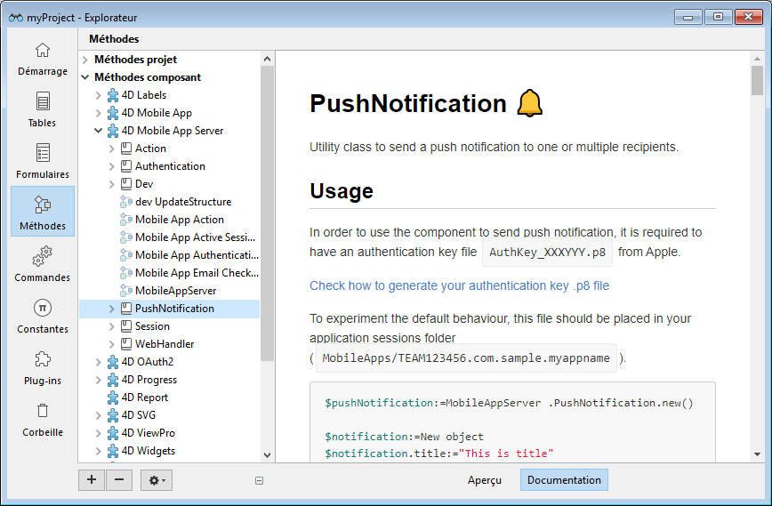

A 4D component is a set of 4D code and forms representing one or more functionalities that you can install and use in your projects. Por ejemplo, el [componente 4D SVG](https://doc.4d.com/4Dv19R3/4D/19-R3/4D-SVG-Component.100-5681501.en.html) añade comandos avanzados y un motor de renderizado integrado que puede utilizarse para mostrar los archivos SVG.

## ¿Dónde encontrar los componentes?

Varios componentes están [preinstalados en el entorno de desarrollo 4D](Extensions/overview.md), pero muchos componentes 4D de la comunidad 4D [están disponibles en GitHub](https://github.com/search?q=4d-component&type=Repositories). Adicionalmente, puede [desarrollar sus propios componentes 4D](Extensions/develop-components.md).

## Instalación de los componentes

Para instalar un componente, basta con copiar los archivos del componente en la carpeta [`Components` del proyecto](Project/architecture.md). Puede utilizar alias o atajos.

Un proyecto local que se ejecuta en modo interpretado puede utilizar componentes interpretados o compilados. Un proyecto local que se ejecuta en modo compilado no puede utilizar componentes interpretados. En este caso, sólo se pueden utilizar componentes compilados.

## Utilización de los componentes

Exposed component code (methods and functions) as well as forms can be used as standard elements in your 4D development.

When an installed component contains methods, classes, and functions, they appear in the **Component Methods** theme of the Explorer's Methods page:

:::nota

If the component is compiled, its [namespace](../Extensions/develop-components.md#declaring-the-component-namespace) is written between parentheses after its name. Use this namespace to access the component's functions.

:::

You can select a component [project method](methods.md) or [class](classes.md) and click on the **Documentation** button of the Explorer to get information about it, [if any](Project/documentation.md).

