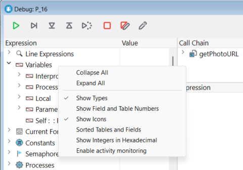
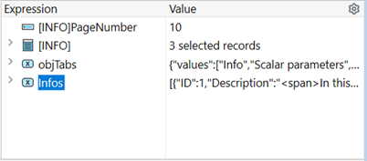
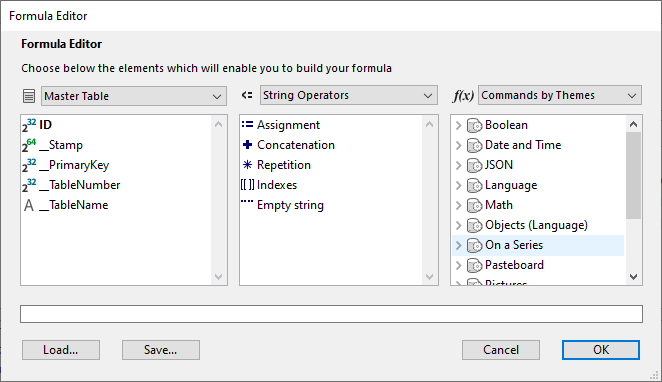
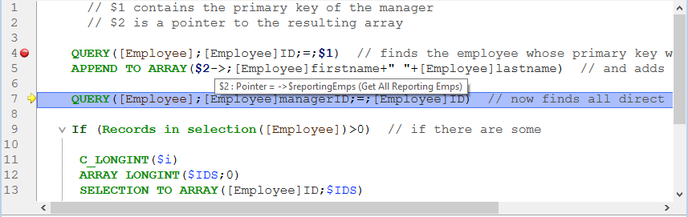

The 4D debugger is useful when you need to spot errors or monitor the execution of methods. Le permite recorrer su código lentamente y examinar la información. Este proceso se llama "rastreo".


:::info

If you are used to coding with **VS Code**, you can also use this editor to debug 4D code on 4D Server after installing the [4D-Debugger](https://github.com/4d/4D-Debugger-VSCode) extension.

:::

## Llamada al depurador

Hay varias formas de conseguir que el depurador se muestre:

- Haciendo clic en el botón **Trace** en [la ventana de errores de sintaxis](basics.md#syntax-error-window)
- Utilizando el comando [`TRACE`](https://doc.4d.com/4dv19/help/command/en/page157.html)
- Haciendo clic en el botón **Debug** en la ventana de ejecución del método o seleccionando **Run and debug...** en el Code Editor
- Utilizando **Alt+Shift+Clic derecho** (Windows) o **Ctrl+Option+Cmd+Clic** (macOS) mientras se ejecuta un método, seleccionando entonces el proceso a rastrear en el menú emergente:


- Haciendo clic en el botón **Trace** cuando se selecciona un proceso en la página de procesos del Explorador de ejecución.
- Añadiendo un punto de ruptura en la ventana del Editor de Código o en las páginas Break y Catch del explorador de ejecución.

Cuando se llama, la ventana del depurador ofrece el nombre del método o de la función de clase que se está rastreando en ese momento, y la acción que provoca la aparición inicial de la ventana del depurador. Por ejemplo, en la ventana del depurador arriba:

- _Clients_BuildLogo_ es el método en que se hace seguimiento
- La ventana del depurador apareció porque detectó una llamada al comando `C_PICTURE` y este comando fue uno de los a identificar

La visualización de una nueva ventana del depurador utiliza la misma configuración que la última ventana visualizada en la misma sesión. Si ejecuta varios procesos usuario, puede rastrearlos independientemente y tener una ventana de depuración abierta para cada proceso.

La ventana del depurador suele aparecer en la máquina donde se ejecuta el código. Con una aplicación mono usuario, siempre se muestra en la máquina que ejecuta la aplicación. Con una aplicación cliente/servidor se muestra:

- en el 4D remoto para el código que se ejecuta localmente
- en la máquina del servidor para el código que se ejecuta en el servidor (por ejemplo, un método con la opción **Ejecutar en el servidor**).

:::note Notas

- Si el servidor se ejecuta en modo sin interfaz, no se puede mostrar ninguna ventana de depuración en el servidor, es necesario utilizar el depurador remoto. Ver [Depuración desde máquinas remotas](./debugging-remote.md).
- También puede [adjuntar el depurador de Qodly Studio a una aplicación 4D Server](../WebServer/qodly-studio.md#using-qodly-debugger-on-4d-server) si necesita depurar páginas Qodly en un entorno desplegado.

:::

## Botones barra de herramientas

La barra de herramientas del depurador incluye varios botones, asociados a accesos directos por defecto:


> Los accesos directos predeterminados pueden personalizarse en la página Atajos del diálogo Preferencias.

#### Fin del rastreo

Detener el modo Seguimiento y reanudar el curso normal de la ejecución del método.

> **Shift** + **F5** o **Shift** + clic en el botón **No Trace** retoma la ejecución. También desactiva todas las llamadas a TRACE posteriores en el proceso actual.

#### Pasar por encima

Ejecuta la línea de método actual, indicada por el contador del programa (la flecha amarilla). El depurador pasa a la siguiente línea.

El botón Ejecutar no entra en las subrutinas y las funciones, sino que se queda al nivel del método que está rastreando en ese momento. Si desea también rastrear las llamadas a las subrutinas y a las funciones, utilice el botón **Paso a paso detallado**.

En la depuración remota, si el método se ejecuta en el servidor, se llama al método padre después de que se ejecute la última línea del método hijo. Si el método padre se ejecuta en el lado remoto, el botón **Step Over** tiene el mismo efecto que el botón **No Trace**.

#### Paso a paso detallado

Cuando se ejecuta una línea que llama a otro método (subrutina o función), haga clic en este botón para mostrar el otro método y recorrerlo paso a paso.

El nuevo método se convierte en el método actual (superior) en la [Ventana cadena de llamada ](#call-chain-pane) de la ventana del depurador.

Cuando se ejecuta una línea que no llama a otro método, este botón tiene el mismo efecto que el botón **Ejectuar paso a paso**.

#### Ejecutar y salir

Si está rastreando subrutinas y funciones, al hacer clic en este botón podrá ejecutar todo el método que se está rastreando en ese momento y retroceder hasta el método llamante. La ventana del depurador vuelve al método anterior de la cadena de llamada. Si el método actual es el último método de la cadena de llamada, se cierra la ventana del depurador.

En la depuración remota, al ejecutarse la última línea del método, si el método se ejecuta en el servidor, se llama al método padre. Si el método padre se ejecuta en el lado remoto, el botón actúa de la misma manera que el botón Reanudar.

#### Paso a paso del nuevo proceso

Al ejecutar una línea que crea un nuevo proceso (es decir, al llamar al comando New process), este botón abre una nueva ventana del depurador que permite rastrear el método de gestión del proceso recién creado. En la ejecución de una línea que no crea un nuevo proceso, este botón actúa de la misma manera que el botón Ejecutar paso a paso.

#### Abortar

Detiene la ejecución del método y vuelve al estado anterior al inicio de la ejecución del método:

- Cuando se rastrea un método formulario o un objeto que se ejecuta en respuesta a un evento: se detiene y vuelve al formulario.
- Cuando se rastrea un método que se ejecuta desde el entorno de la aplicación: se detiene y vuelve al entorno.

#### Detener y editar

El método que se está ejecutando cuando se presiona el botón **Abortar y Editar** se abre en el Editor de Código.

> **Consejo**: utilice este botón cuando sepa qué cambios son necesarios en su código, y el momento en que deben ser efectuados para proseguir con las pruebas de sus métodos. Una vez haya terminado con los cambios, vuelva a ejecutar el método.

#### Acción de edición

El método que se está ejecutando en el momento de presionar el botón Editar se abre en el Editor de código.

Si utiliza este botón para modificar un método, las modificaciones sólo serán efectivas la próxima vez que se ejecute.

> **Consejo:** utilice este botón cuando sepa qué cambios son necesarios en su código y cuando no interfieran con el resto del código a ejecutar o rastrear.

#### Parámetros Guardar

Guarda la configuración actual de la ventana del depurador y la convierte en la configuración por defecto. Esto incluye:

- el tamaño y la posición de la ventana
- la posición de las líneas de división y el contenido del área que evalúa las expresiones

Estos parámetros se almacenan en el proyecto.

Esta acción no está disponible en el modo de depuración remota (ver [Depuración desde máquinas remotas](./debugging-remote)).

## Ventana de expresión

El **panel de expresión** se muestra en la esquina superior izquierda de la ventana del depurador, debajo de la barra de herramientas de control de ejecución. Aquí un ejemplo:


> Este panel no está disponible en el modo de depuración remota.

El **panel de expresión** muestra información general útil sobre el sistema, el entorno 4D y el entorno de ejecución.

La columna **Expression** muestra los nombres de los objetos y expresiones. La columna **Valor** muestra sus valores correspondientes actuales. Al hacer clic en cualquier valor de la parte derecha del panel, se puede modificar el valor del objeto, si está permitido para ese objeto.

En cualquier momento, puede arrastrar y soltar temas, sublistas de temas (si las hay) y elementos de temas en el panel de expresión personalizado .

### Lista de expresiones

#### Objetos línea

Este tema le permite seguir los valores de los objetos o expresiones:

- utilizado en la línea de código a ejecutar (la marcada con el contador de programa-la flecha amarilla en el [Panel de Código Fuente](#source-code-pane)),
- utilizado en la línea de código anterior

Como la línea de código anterior es la que se acaba de ejecutar antes, este tema muestra por tanto los objetos o expresiones de la línea actual antes y después de que se ejecutara la línea.  Digamos que ejecuta el siguiente método:

```4d
TRACE
$a:=1
$b:=a+1
$c:=a+b
```

1. Se abre una ventana Depurador con el contador del programa fijado en la línea con `a:=1`. En este punto aparece el tema **Objetos Línea**:

   | $a | Indefinido |
   | -- | ---------- |

   La variable `$a` aún no está inicializada, pero se muestra porque se utiliza en la línea que se va a ejecutar.

2. Haga clic en el botón **Step Over**. El contador del programa se pone ahora en la línea `b:=a+1`. En este punto, aparece el tema **Objetos Línea**:

   | $a | 1          |
   | -- | ---------- |
   | $b | Indefinido |

   El valor de la variable `$a` es ahora 1. La variable `$b` aún no está inicializada, pero se muestra porque se utiliza en la línea que se va a ejecutar.

3. Haga clic en el botón **Step Over** nuevamente. El contador del programa ahora está en la línea con $c:=a+b. aparece el tema **Objetos en línea**:

   | $c | Indefinido |
   | -- | ---------- |
   | $a | 1          |
   | $b | 2          |

   El valor de la variable `$b` es ahora 2. La variable `$c` aún no está inicializada, pero se muestra porque se utiliza en la línea que se va a ejecutar.

#### Variables

Este tema se compone de los siguientes subtemas:

| Subtema      | Descripción                                                              | ¿Se pueden modificar los valores? |
| ------------ | ------------------------------------------------------------------------ | --------------------------------- |
| Interproceso | Lista de variables de interproceso que se están utilizando en este punto | Sí                                |
| Proceso      | Lista de variables proceso utilizadas por el proceso actual              | Sí                                |
| Local        | Lista de variables locales utilizadas por el método rastreado            | Sí                                |
| Parámetros   | Lista de parámetros recibidos por el método                              | Sí                                |
| Self         | Puntero al objeto actual, cuando se rastrea un método Objeto             | No                                |

Los arrays, al igual que otras variables, aparecen en los subtemas Interproceso, Proceso y Local, dependiendo de su alcance. El depurador muestra los primeros 100 elementos. Dentro de la columna **Valor**, puede modificar los valores de los elementos del array, pero no el tamaño de los arrays.

Para mostrar los tipos de variables y sus nombres internos, haga clic derecho y marque la opción **Mostrar tipos** del menú contextual:


Aquí está el resultado:


#### Valores actuales del formulario

Este tema contiene el nombre de cada objeto dinámico incluido en el formulario actual, así como el valor de su variable asociada:


Algunos objetos, como los arrays list box, pueden presentarse como dos objetos distintos, la variable del propio objeto y su fuente de datos.

#### Constantes

Al igual que la página de Constantes de la ventana del Explorador, este tema muestra las constantes predefinidas ofrecidas por 4D. Las expresiones de este tema no pueden ser modificadas.

#### Semáforos

Este tema lista los semáforos locales que se están configurando actualmente. Para cada semáforo, la columna Valor proporciona el nombre del proceso que define el semáforo. Las expresiones de este tema no pueden ser modificadas. The expressions from this theme cannot be modified.

#### Procesos

Este tema lista los procesos iniciados desde el comienzo de la sesión de trabajo. La columna de valores muestra el tiempo utilizado y el estado actual de cada proceso (es decir, en ejecución, en pausa, etc.). Las expresiones de este tema no pueden ser modificadas.

#### Tablas y campos

Este tema lista las tablas y los campos en la base 4D. Para cada elemento de la Tabla, la columna Valor muestra el tamaño de la selección actual para el proceso actual, así como el número de **registros bloqueados**.

Para cada elemento Campo, la columna Valor muestra el valor del campo para el registro actual (excepto imagen y BLOB). Puede modificar los valores de los campos pero no la información de las tablas.

#### Conjuntos

Este tema lista los conjuntos definidos en el proceso actual (el que está rastreando en ese momento) y los conjuntos interprocesos. Para cada conjunto, la columna Valor muestra el número de registros y el nombre de la tabla. Las expresiones de este tema no pueden ser modificadas.

#### Selecciones temporales

Este tema lista las selecciones temporales que están definidas en el proceso actual (el que está rastreando en ese momento); también lista las selecciones temporales entre procesos. Para cada selección temporal, la columna Valor muestra el número de registros y el nombre de la tabla. Las expresiones de este tema no pueden ser modificadas.

#### Información

Este tema contiene información general sobre el funcionamiento de la base de datos, como la tabla por defecto actual (si existe), el espacio de memoria físico, virtual, libre y utilizado, el destino de las consultas, etc.

#### Web

Este tema muestra información relativa al servidor Web principal de la aplicación (sólo disponible si el servidor Web está activo):

- Archivo web a enviar: nombre del archivo web en espera de ser enviado (si lo hay)
- Uso de la caché web: número de páginas presentes en la caché web, así como su porcentaje de uso
- Tiempo transcurrido del servidor web: duración del uso del servidor web en formato horas:minutos:segundos
- Conteo de accesos a la Web: número total de peticiones HTTP recibidas desde la puesta en marcha del servidor Web, así como el número instantáneo de peticiones por segundo
- Número de procesos Web activos: número de procesos Web activos, todos los procesos Web juntos

Las expresiones contenidas en este tema no pueden ser modificadas.

### Menú contextual de la ventana de expresión

Hay opciones adicionales disponibles en el menú contextual de la ventana de expresión.



- **Contraer**: contracta todos los niveles de la lista jerárquica.
- **Desplegar todo**: despliega todos los niveles de la lista jerárquica.
- **Mostrar los tipos**: muestra el tipo de cada elemento (cuando es apropiado).
- **Mostrar números de campos y tablas**: muestra el número de cada tabla o campo. Es útil si trabaja con números de tabla o de campo, o con punteros utilizando comandos como `Table` o `Field`.
- **Mostrar los iconos**: muestra un icono que denota el tipo de objeto para cada objeto. Puede desactivar esta opción para acelerar la visualización, o simplemente porque prefiere utilizar sólo la opción **Mostrar los tipos**.
- **Tablas y campos ordenados**: ordena las tablas y campos por orden alfabético dentro de sus respectivas listas.
- **Mostrar los enteros en hexadecimal**: los números se suelen mostrar en notación decimal. Esta opción los muestra en notación hexadecimal. Nota: para introducir un valor numérico en hexadecimal, escriba 0x (cero + "x"), seguido de los dígitos hexadecimales.
- **Activar el seguimiento de la actividad**: activa el seguimiento de la actividad (control avanzado de la actividad interna de la aplicación) y muestra la información obtenida en los temas adicionales: **Programador**, **Web** y **Red**.

## Panel de la cadena de llamadas

Un método puede llamar a otros métodos o funciones clase, que pueden llamar a otros métodos o funciones. El panel de la Cadena de Llamadas le permite hacer un seguimiento de esa jerarquía.


Cada elemento del nivel principal es el nombre de un método o función clase. El elemento superior es el que está rastreando actualmente, el siguiente elemento de nivel principal es el nombre del llamador (el método o función que llamó al que está rastreando actualmente), el siguiente es el llamador del llamador, y así sucesivamente.

En la imagen de arriba:

- `thirdMethod` no ha recibido ningún parámetro
- `$0` actualmente está indefinido, ya que el método no ha asignado ningún valor a `$0` (porque aún no ha ejecutado esta asignación o porque el método es una subrutina y no una función)
- `secondMethod` ha recibido tres parámetros de `firstMethod`:
  - $1 es un puntero a la tabla `[Employee]`
  - $2 es un puntero al campo `ID` en la tabla  `[Employee]`
  - $3 es un parámetro alfanumérico cuyo valor es "Z"

Puede hacer doble clic en el nombre de cualquier método para mostrar su contenido en la [Ventana de código fuente](#source-code-pane).

Al hacer clic en el icono que aparece junto al nombre de un método o función, se amplían o reducen los parámetros y el resultado (si lo hay). Los valores aparecen en el lado derecho del panel. Al hacer clic en cualquier valor del lado derecho, se puede cambiar el valor de cualquier parámetro o resultado de la función.

Para mostrar el tipo de parámetro, marque la opción **Mostrar tipos** en el menú contextual:


Después de desplegar la lista de parámetros, puede arrastrar y soltar los parámetros y los resultados de las funciones en el [Custom Watch Pane](#custom-watch-pane).

También puede utilizar el comando [Call chain](https://doc.4d.com/4dv19/help/command/en/page1662.html) para recuperar la cadena de llamadas por programación.

## Panel de vigilancia personalizado

El panel de control personalizado es útil para evaluar expresiones. Es similar al [panel de control](#watch-pane), excepto que aquí usted decide qué expresiones se muestran. Todo tipo de expresión puede ser evaluada:

- campo
- variable
- pointer
- cálculo
- Comando 4D
- method
- y cualquier otra cosa que devuelva un valor



Puede evaluar toda expresión que pueda mostrarse en forma de texto. Esto no cubre los campos o variables Imagen y BLOB. Para mostrar el contenido de los BLOB, puede utilizar comandos BLOB, como [BLOB to text](https://doc.4d.com/4dv19/help/command/en/page555.html).

### Gestión de expresiones

Hay varias formas de añadir expresiones a la lista:

- Arrastrar y soltar un objeto o expresión desde el Panel de Vigilancia o el Panel de Cadena de Llamadas
- Seleccione una expresión en el [panel código fuente](#source-code-pane) y presione **ctrl+D**  (Windows) o **cmd+D** (macOS)
- Haga doble clic en algún lugar del espacio vacío del panel de control personalizado (añade una expresión con un nombre de marcador de posición que puede editar)

Puede introducir cualquier fórmula que devuelva un resultado.

Para editar una expresión, haga clic en ella para seleccionarla y, a continuación, vuelva a hacer clic o presione **Intro** en su teclado.

Para eliminar una expresión, haga clic en ella para seleccionarla y, a continuación, presione **Retroceso** o **Borrar** en su teclado.

> **Atención:** tenga cuidado cuando evalúe una expresión 4D que modifique el valor de una de las Variables del Sistema (por ejemplo, la variable OK) porque la ejecución del resto del método puede verse alterada.

### Menú contextual de la ventana de expresión

El menú contextual del panel de control personalizado permite acceder al editor de fórmulas de 4D y a otras opciones:


**Nueva expresión**: inserta una nueva expresión y muestra el editor de fórmulas de 4D.



Para más información sobre el Editor de fórmulas, consulte el [Manual de referencia de Diseño 4D](https://doc.4d.com/4Dv19/4D/19/4D-Design-Reference.100-5416591.en.html).

- **Insertar comando**: acceso directo para insertar un comando 4D como una nueva expresión.
- **Borrar todo**: elimina todas las expresiones del panel de control personalizado.
- **Expresiones estándar**: copia la lista de expresiones del panel de control.

> Esta opción no está disponible en [modo de depuración remota](debugging-remote.md).

- **Contraer todo/Expandir todo**: contrae o expande todas las listas jerárquicas.
- **Mostrar tipos**: muestra el tipo de cada elemento de la lista (cuando es apropiado).
- **Mostrar números de campos y tablas**: muestra el número de las tabla o de los **campos**. Es útil si trabaja con números de tablas o de campos, o con punteros utilizando los comandos `Table` o `Field`.
- **Mostrar iconos**: muestra un icono que denota el tipo de cada elemento.
- **Tablas y campos ordenados**: muestra la tabla y los campos en orden alfabético.
- **Mostrar números enteros en hexadecimal**: muestra los números en notación hexadecimal. Para introducir un valor numérico en hexadecimal, escriba 0x (cero + "x"), seguido de los dígitos hexadecimales.

## Panel de evaluación del código

El panel de código fuente muestra el código fuente del método o de la función que se está rastreando actualmente.

Esta área también le permite añadir o eliminar [**puntos de ruptura**](breakpoints.md).

### Tips

Al pasar el puntero sobre una expresión, para mostrr un mensaje de ayuda que indica:

- el tipo declarado de la expresión
- el valor actual de la expresión



Esto también funciona con las selecciones:


### Añadir expresiones al panel de control personalizado

Puede copiar toda expresión seleccionada del panel de código fuente en el [Custom Watch Pane](#custom-watch-pane).

1. En el panel de código fuente, seleccione la expresión a evaluar
2. Haga una de las siguientes cosas:
   - Arrastre y suelte el texto seleccionado en el área Expresión del panel de expresión personalizado
   - Presione **Ctrl+D** (Windows) o **Cmd+D** (macOS)
   - Haga clic con el botón derecho en el texto seleccionado **>** **Copiar al panel de expresiones**

### Contador del programa

La flecha amarilla en el margen izquierdo del panel del Código Fuente se llama el contador de programa. Marca la siguiente línea a ejecutar.

Por defecto, la línea del contador de programa (también llamada línea de ejecución) aparece resaltada en el depurador. Puede personalizar el color de resaltado en la [página Métodos de las Preferencias](Preferences/methods.md).

#### Mover el contador del programa

Para fines de depuración, puede mover el contador de programa del método en la parte superior de la cadena de llamada (el método que se está ejecutando actualmente). Para ello, haga clic y arrastre la flecha amarilla a otra línea.

Esto sólo indica al depurador que continúe rastreando o ejecutando desde un punto diferente. No ejecuta líneas ni cancela su ejecución. Todos los ajustes, campos, variables, etc. actuales no se ven afectados.

Por ejemplo:

```4d
  // ...
 If(This condition)
    DO_SOMETHING
 Else
    DO_SOMETHING_ELSE
 End if
  // ...
```

Digamos que el contador del programa se define en la línea `If (This condition)`.
Al hacer clic en el botón **Step over**, el contador del programa se mueve directamente a la línea `DO_SOMETHING_ELSE`.
Para examinar los resultados de la línea `DO_SOMETHING`, puede mover el contador del programa a esa línea y ejecutarla.

### Menú contextual

El menú contextual de la Ventana de evaluación de los métodos da acceso a varias funciones útiles cuando se ejecutan métodos en el modo Rastreo:


- **Ir a definición**: va al lugar donde se define el objeto seleccionado. Este comando está disponible para:
  - _Métodos proyecto:_ muestra el contenido de los métodos en una nueva ventana del Editor de Código
  - _Campos_: muestra las propiedades de los campos en el inspector de la ventana de estructura
  - _Tablas:_ muestra las propiedades de la tabla en el inspector de la ventana de estructura
  - _Formularios:_ muestra el formulario en el editor de formularios
  - _Variables_ (locales, proceso, interproceso o parámetro $n): muestra la línea en el método actual o entre los métodos del compilador donde se declara la variable
- **Buscar Referencias** (también disponible en el Editor de Código): busca todos los objetos del proyecto (métodos y formularios) en los que se hace referencia al elemento actual del método. El elemento actual es el seleccionado o aquel en el que se encuentra el cursor. Este puede ser el nombre de un campo, variable, comando, cadena, etc. Los resultados de la búsqueda se muestran en una nueva ventana de resultados estándar.
- **Copiar**: copia estándar de la expresión seleccionada al portapapeles.
- **Copiar en la ventana de expresión**: copiar la expresión seleccionada en la Ventana de evaluación.
- **Ejecutar hasta el cursor**: ejecuta las instrucciones encontradas entre el contador del programa y la línea seleccionada del método (donde se encuentra el cursor).
- **Fijar siguiente instrucción**: mueve el contador del programa a la línea seleccionada sin ejecutar esta línea ni las intermedias. La línea designada sólo se ejecuta si el usuario hace clic en uno de los botones de ejecución.
- **Alternar punto de interrupción** (también disponible en el Editor de código): inserta o elimina alternativamente el punto de interrupción correspondiente a la línea seleccionada. Esta función modifica el punto de interrupción de forma permanente: por ejemplo, si elimina un punto de interrupción en el depurador, ya no aparece en el método original.
- **Editar punto de interrupción** (también disponible en el Editor de Código): muestra el diálogo Propiedades del punto de interrupción. Cualquier cambio realizado modifica el punto de interrupción de forma permanente.

### Buscar siguiente/anterior

Los atajos específicos permiten encontrar cadenas idénticas a la seleccionada:

- Para buscar las siguientes cadenas idénticas, presione **Ctrl+E** (Windows) o **Cmd+E** (macOS)
- Para buscar las cadenas idénticas anteriores, presione **Ctrl+Shift+E** (Windows) o **Cmd+E** (macOS)

La búsqueda se lleva a cabo sólo si se selecciona al menos un caracter en el panel de código fuente.

## Atajos

Esta sección lista todos los atajos disponibles en la ventana del depurador.

> La barra de herramientas también tiene [accesos directos](#tool-bar-buttons).

#### Ventana de evaluación & Subventana de evaluación personalizada

- Un **doble clic** en un elemento de la ventana de expresión para copiarlo en la ventana de evaluación
- Un **doble clic** en la ventana de evaluación crea una nueva expresión

#### Panel de código fuente

- Haga clic en el margen izquierdo para definiir o eliminar puntos de ruptura.
- **Alt+Mayús+clic** (Windows) o **Option+Mayús+clic** (macOS) define un punto de interrupción temporal.
- **Alt-Clic** (Windows) u **Opción-Clic** muestra la ventana de las propiedades del punto de interrupción para un punto de ruptura nuevo o existente.
- Una expresión u objeto seleccionado puede copiarse en la ventana de evaluación con sólo arrastrar y soltar.
- **Ctrl+D** (Windows) o **Comando+D** (macOS) en un texto seleccionado lo copia en la ventana de evaluación.
- **Ctrl+E** (Windows) o **Comando+E** (macOS) identifica los canales posteriores que son idénticos al canal seleccionado.
- **Ctrl+Mayús+E** (Windows) o **Comando+Mayús+E** (macOS) identifica los canales posteriores que son idénticos al canal seleccionado.

#### Todas las ventanas

- **Ctrl** + **+/-** (Windows) o **Comando** + **+/-** (macOS) aumenta o disminuye el tamaño de la fuente para una mejor legibilidad. El tamaño de fuente modificado también se aplica al Editor de código y se almacena en las Preferencias.
- **Ctrl + \*** (Windows) o **Comando + \*** (macOS) fuerza la actualización del Panel de Control.
- Si no hay ningún elemento seleccionado en las ventanas, presione **Intro** para avanzar.
- Cuando se selecciona el valor de un elemento, utilice las teclas de flecha para navegar por la lista.
- Al editar un elemento, utilice las teclas de flecha para mover el cursor. Utilice Ctrl-A/X/C/V (Windows) o Comando-A/X/C/V (macOS) como accesos directos a los comandos del menú Seleccionar todo/Cortar/Copiar/Pegar del menú Edición.
