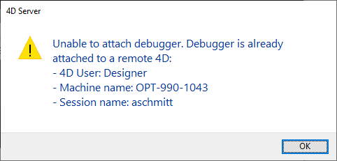

## Generalidades

Cuando una base de datos 4D se ejecuta en 4D Server en modo interpretado, puede depurar el código 4D que se ejecuta en el servidor desde un cliente 4D remoto conectado al proyecto. Sólo tiene que adjuntar el depurador a una máquina remota específica y la ejecución del código puede ser monitoreada en el depurador directamente en la máquina remota.

En una máquina remota, la [ventana de depuración](debugger.md) muestra un icono de servidor específico y un color de fondo azul para indicar que está depurando el código servidor:

Esta funcionalidad es especialmente útil cuando 4D Server se ejecuta en modo sin interfaz (ver [Command Line Interface](../Admin/cli.md)), o cuando el acceso a la máquina del servidor no es fácil.

## Depuradores adjuntos

Sólo un depurador puede depurar una aplicación 4D Server en un momento dado. Se llama el **depurador asociado**. El depurador asociado puede ser:

- el depurador local de 4D Server (por defecto) - si el servidor no está ejecutando sin interfaz.
- el depurador de un cliente 4D remoto - si la sesión remota tiene acceso al modo Diseño.
- el [depurador Qodly](../WebServer/qodly-studio.md#using-qodly-debugger-on-4d-server) en el servidor 4D - si el servidor permite el acceso a Qodly Studio.

El depurador asociado es llamado cada vez que se encuentra un 4D Server:

- un punto de ruptura
- un comando `TRACE`
- un comando de captura
- un error

Tenga en cuenta que los mensajes de error se envían a la máquina depuradora asociada. Esto significa que en el caso de un depurador remoto, los mensajes de error del servidor se muestran en el cliente 4D remoto.

Note que:

- El código ejecutado en el método `On Server Startup Database` no se puede depurar de forma remota. Sólo se puede depurar del lado del servidor
- Si no hay un depurador asociado, el código en ejecución no se detiene con los comandos de depuración

## Asociar al depurador

Por defecto, cuando se inicia una aplicación interpretada:

- si 4D Server no se está ejecutando sin interfaz, el depurador está conectado al servidor,
- si 4D Server se ejecuta sin interfaz, no se asocia ningún depurador.

Puede asociar el depurador a cualquier cliente 4D remoto que pueda conectarse a la aplicación 4D Server.

> La sesión usuario del cliente 4D remoto debe tener acceso al entorno de diseño de la base de datos.

Para asociar el depurador a un cliente 4D remoto:

1. En la barra de menús de 4D Server, seleccione **Editar** > **Separar depurador** para que el depurador esté disponible para las máquinas remotas (este paso es inútil si 4D Server está funcionando sin interfaz).
2. En un cliente 4D remoto conectado al servidor, seleccione **Ejecutar** > **Adjuntar depurador remoto**

Si se acepta el archivo adjunto (ver [Solicitudes de archivo adjunto rechazadas](#rejected-attachment-requests)), el comando de menú se convierte en **Desconectar depurador remoto**.

El depurador se conecta entonces al cliente 4D remoto:

- hasta el final de la sesión usuario
- hasta que se seleccione `Detach Remote Debugger`

Para volver a conectar el depurador al servidor:

1. En el cliente 4D remoto que tiene el depurador conectado, seleccione **Ejecutar** > **Separar depurador remoto**.
2. En la barra de menú de 4D Server, seleccione **Editar** > **Adjuntar depurador**.

> Cuando el depurador está conectado al servidor (por defecto), todos los procesos del servidor se ejecutan automáticamente en modo cooperativo para permitir la depuración. Esto puede tener un impacto significativo en el rendimiento. Cuando no necesite depurar en la máquina del servidor, se recomienda separar el depurador y adjuntarlo a una máquina remota si es necesario.

## Adjuntar el depurador al inicio

4D le permite adjuntar automáticamente el depurador a un cliente 4D remoto o al servidor al inicio:

- En el servidor (si no es headless), esta opción se llama **Attach Debugger At Startup**. Cuando el servidor se inicia, adjunta automáticamente el depurador (por defecto).

> **Advertencia**: si se selecciona esta opción para un servidor que posteriormente se lanza en modo sin interfaz, el depurador no estará disponible para este servidor.

- En un cliente 4D remoto, esta opción se llama **Attach Remote Debugger At Startup**. Cuando se selecciona, el cliente 4D remoto intentará automáticamente adjuntar el depurador remoto en cada conexión posterior a la misma base de datos 4D Server. Si el adjunto es aceptado (ver [Rejected attachment requests](#rejected-attachment-requests)), el depurador remoto se adjunta automáticamente al cliente 4D remoto y se muestra la opción **Detach Remote Debugger**.

> Esta configuración se aplica por proyecto y se almacena localmente en el archivo [`.4DPreferences`](Project/architecture.md#userpreferencesusername).

## Peticiones de adjuntos rechazadas

Mientras el depurador esté conectado a un cliente 4D remoto o a 4D Server, ninguna otra máquina puede conectar el depurador.

Si una máquina intenta conectar el depurador cuando ya está conectado, se rechaza la conexión y aparece una caja de diálogo:

Adjuntar el depurador en este caso requiere que:

- el depurador adjunto se separa del servidor o del cliente 4D remoto utilizando respectivamente el comando de menú **Detach debugger** o **Detach remote debugger**,
- se cierra la sesión del cliente 4D remoto adjunto.
