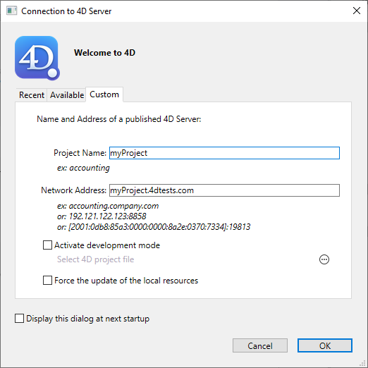

Las aplicaciones 4D Desktop pueden utilizarse en una configuración Cliente/Servidor, ya sea como aplicaciones combinadas cliente/servidor o como proyectos remotos.

- **merged client/server applications** are generated by the [Build Application manager](building.md#clientserver-page). Se utilizan para el despliegue de aplicaciones.

- **remote projects** are [.4DProject](Project/architecture.md) files opened by 4D Server and accessed with 4D in remote mode. The server sends a .4dz version of the project ([compressed format](building.md#build-compiled-structure)) to the remote 4D, thus structure files are read-only. Esta configuración se suele utilizar para probar la aplicación.

> Connecting to a remote project from the **same machine as 4D Server** allows modifying the project files. This [specific feature](#using-4d-and-4d-server-on-the-same-machine) allows to develop a client/server application in the same context as the deployment context.

## Abrir una aplicación cliente/servidor fusionada

A merged client/server application is customized and its starting is simplified:

- Para lanzar la parte del servidor, el usuario simplemente hace doble clic en la aplicación servidor. No es necesario seleccionar el archivo proyecto.
- Para lanzar la parte cliente, el usuario simplemente hace doble clic en la aplicación cliente, que se conecta directamente a la aplicación servidor.

These principles are detailed in the [Build Application](building.md#what-is-a-clientserver-application) page.

## Abrir un proyecto remoto

The first time you connect to a 4D Server project via a remote 4D, you will usually use the standard connection dialog. Thereafter, you will be able to connect directly using the **Open Recent Projects** menu or a 4DLink shortcut file.

Para conectarse remotamente a un proyecto 4D Server:

1. Haga una de las siguientes cosas:
   - Select **Connect to 4D Server** in the Welcome Wizard dialog
   - Select **Open/Remote Project...** from the **File** menu or the **Open** toolbar button.

Aparece el diálogo de conexión de 4D Server. This dialog has three tabs: **Recent**, **Available**, and **Custom**.

If 4D Server is connected to the same network as the remote 4D, select **Available**. 4D Server includes a built-in TCP/IP broadcasting system that, by default, publishes the name of the 4D Server projects available over the network. The list is sorted by order of appearance and updated dynamically.

To connect to a server from the list, double-click on its name or select it and click the **OK** button.

> A circumflex accent (^) is placed before the name of projects published with the encryption option enabled.

If the published project is not displayed in the **Available** list, select **Custom**. The Custom page allows you to connect to a published server on the network using its network address and assigning it a customized name.

- **Project name**: Defines the local name of the 4D Server project. This name will be used in the **Recent** page when referring to the project.
- **Network address**: The IP address of the machine where the 4D Server was launched.
  - If two servers are executed simultaneously on the same machine, the IP address must be followed by a colon and port number, for example: `192.168.92.104:19814`.
  - Por defecto, el puerto de publicación de un 4D Server es el 19813. Este número puede modificarse en los parámetros del proyecto.

> The **Activate development mode** option opens the remote connection in a special read/write mode and requires to access the project folder from the remote 4D (compatibility option).

Once this page assigns a server, clicking the **OK** button will allow you to connect to the server.

Once a connection to the server has been established, the remote project will be listed on the **Recent** tab.

### Actualización de los archivos del proyecto en el servidor

4D Server automatically creates and sends the remote machines a [.4dz version](building.md#build-compiled-structure) of the *.4DProject* project file (not compressed) in interpreted mode.

- An updated .4dz version of the project is automatically produced when necessary, *i.e.* when the project has been modified and reloaded by 4D Server. El proyecto se recarga:
  - automatically, when the 4D Server application window comes to the front of the OS or when the 4D application on the same machine saves a modification (see below).
  - cuando se ejecuta el comando `RELOAD PROJECT`. Calling this command is necessary for example when you have pulled a new version of the project from the source control platform.

### Actualización de los archivos de proyecto en las máquinas remotas

When an updated .4dz version of the project has been produced on 4D Server, connected remote 4D machines must log out and reconnect to 4D Server in order to benefit from the updated version.

## Utilizar 4D y 4D Server en la misma máquina

When 4D connects to a 4D Server on the same machine, the application behaves as 4D in single user mode and the design environment allows you to edit project files. This feature allows you to develop a client/server application in the same context as the deployment context.

> When 4D connects to a 4D Server on the same machine, the **development mode** is automatically activated, whatever the [opening option](#opening-a-remote-project) status.

Each time 4D performs a **Save all** action from the design environment (explicitly from **File** menu or implicitly by switching to application mode for example), 4D Server synchronously reloads project files. 4D waits for 4D Server to finish reloading the project files before it continues.

However, you need to pay attention to the following behavior differences compared to [standard project architecture](Project/architecture.md):

- the userPreferences.{username} folder used by 4D is not the same folder used by 4D Server in the project folder. Instead, it is a dedicated folder, named "userPreferences", stored in the project system folder (i.e., the same location as when opening a .4dz project).
- the folder used by 4D for derived data is not the folder named "DerivedData" in the project folder. Instead it is a dedicated folder named "DerivedDataRemote" located in the project system folder.
- el archivo catalog.4DCatalog no es editado por 4D sino por 4D Server. La información del catálogo se sincroniza mediante peticiones cliente/servidor
- el archivo directory.json no es editado por 4D sino por 4D Server. Directory information is synchronised using client/server requests
- 4D uses its own internal components and plug-ins instead of those in 4D Server.

> It is not recommended to install plug-ins or components at the 4D or 4D Server application level.
