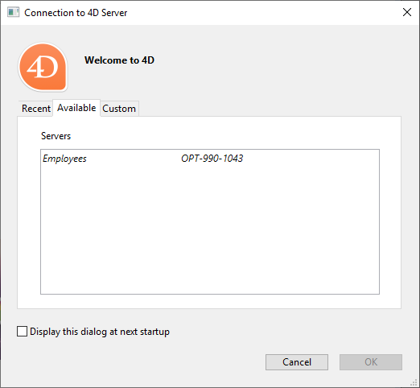
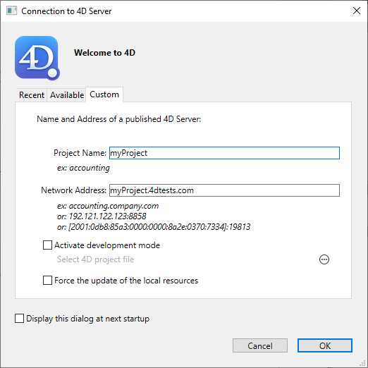
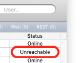
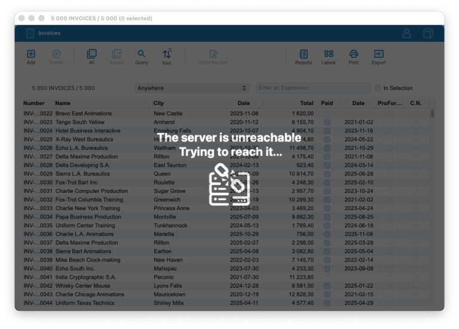

Las aplicaciones 4D Desktop pueden utilizarse en una configuración Cliente/Servidor, ya sea como aplicaciones combinadas cliente/servidor o como proyectos remotos.

- Las **aplicaciones cliente/servidor fusionadas** son generadas por el [gestor de creación de aplicaciones](building.md#clientserver-page). Se utilizan para el despliegue de aplicaciones.

- Los **proyectos remotos** son archivos [.4DProject](Project/architecture.md) abiertos por 4D Server y a los que se accede con 4D en modo remoto. El servidor envía una versión .4dz del proyecto ([formato comprimido](building.md#build-compiled-structure)) al 4D remoto, por lo que los archivos de estructura son de sólo lectura. Esta configuración se suele utilizar para probar la aplicación.

> La conexión a un proyecto remoto desde **la misma máquina que 4D Server** permite modificar los archivos del proyecto. Esta [funcionalidad específica](#using-4d-and-4d-server-on-the-same-machine) permite desarrollar una aplicación cliente/servidor en el mismo contexto del despliegue.

## Abrir una aplicación cliente/servidor fusionada

Una aplicación cliente/servidor fusionada se personaliza y su puesta en marcha se simplifica:

- Para lanzar la parte del servidor, el usuario simplemente hace doble clic en la aplicación servidor. No es necesario seleccionar el archivo proyecto.
- Para lanzar la parte cliente, el usuario simplemente hace doble clic en la aplicación cliente, que se conecta directamente a la aplicación servidor.

Estos principios se detallan en la página [Creación de aplicaciones](building.md#what-is-a-clientserver-application).

## Abrir un proyecto remoto

La primera vez que se conecte a un proyecto 4D Server a través de un 4D remoto, normalmente utilizará la caja de diálogo de conexión estándar. Cada vez que 4D realiza una acción **Guardar todo** desde el entorno de diseño (explícitamente desde el menú **Archivo** o implícitamente al cambiar al modo aplicación, por ejemplo), 4D Server recarga sincronizadamente los archivos del proyecto.

Para conectarse remotamente a un proyecto 4D Server:

1. Haga una de las siguientes cosas:
   - Seleccione **Conectar a 4D Server** en la caja de diálogo del asistente de bienvenida
   - Seleccione **Abrir/Proyecto remoto...** desde el menú **Archivo** o del botón**Abrir** de la barra de herramientas.

Aparece el diálogo de conexión de 4D Server. Este diálogo tiene tres pestañas: **Reciente**, **Disponible** y **Personalizado**.

Si 4D Server está conectado a la misma subred que el 4D remoto, seleccione **Disponible**. 4D Server incluye un sistema de difusión integrado que, por defecto, publica el nombre de los proyectos 4D Server disponibles en la red. La lista se ordena por orden de aparición y se actualiza dinámicamente.

Para conectarse a un servidor de la lista, haga doble clic en su nombre o selecciónelo y presione el botón **Aceptar**.

Si el proyecto publicado no aparece en la lista **Disponible**, seleccione **Personalizado**. La página Personalizada le permite conectarse a un servidor publicado en la red utilizando su dirección de red y asignándole un nombre personalizado.

- **Nombre del proyecto**: define el nombre local del proyecto 4D Server. Este nombre se utilizará en la página **Reciente** cuando se haga referencia al proyecto.
- **Dirección red**: la dirección IP de la máquina donde se lanzó el 4D Server.
  - Si dos servidores se ejecutan simultáneamente en la misma máquina, la dirección IP debe ir seguida de dos puntos y del número de puerto, por ejemplo: `192.168.92.104:19814`.
  - Por defecto, el puerto de publicación de un 4D Server es el 19813. Este número puede modificarse en los parámetros del proyecto.

> La opción [**Activar el modo desarrollo**](#development-mode) abre la conexión remota en un modo de lectura/escritura especial y requiere acceder a la carpeta del proyecto desde el 4D remoto.

Una vez que esta página asigna un servidor, al hacer clic en el botón **Aceptar** podrá conectarse al servidor.

Una vez establecida la conexión con el servidor, el proyecto remoto aparecerá en la pestaña **Recientes**.

### Actualización de los archivos del proyecto en el servidor

4D Server crea y envía automáticamente a las máquinas remotas una versión [.4dz](building.md#build-compiled-structure) del archivo proyecto *.4DProject* (no comprimido) en modo interpretado.

- Una versión .4dz actualizada del proyecto se produce automáticamente cuando es necesario, \*es decir, \*cuando el proyecto ha sido modificado y recargado por 4D Server. El proyecto se recarga:
  - automáticamente, cuando la ventana de la aplicación 4D Server pasa al frente del sistema operativo o cuando la aplicación 4D en la misma máquina guarda una modificación (ver abajo).
  - cuando el comando [`RELOAD PROJECT`](../commands/reload-project) es ejecutado. Llamar a este comando es necesario cuando, por ejemplo, se ha sacado una nueva versión del proyecto desde la plataforma de control de fuentes.

### Actualización de los archivos de proyecto en las máquinas remotas

Cuando se ha producido una versión .4dz actualizada del proyecto en 4D Server, las máquinas 4D remotas conectadas deben cerrar la sesión y volver a conectarse a 4D Server para poder beneficiarse de la versión actualizada.

## Utilizar 4D y 4D Server en la misma máquina

Cuando 4D se conecta a un 4D Server en la misma máquina, la aplicación se comporta como 4D en modo monopuesto y el entorno de diseño le permite editar los archivos del proyecto. Esta funcionalidad le permite desarrollar una aplicación cliente/servidor en el mismo contexto de despliegue.

> Cuando 4D se conecta a un 4D Server en la misma máquina, el **modo desarrollo** se activa automáticamente, sea cual sea el estado del [modo Desarrollo](#development-mode).

Cada vez que 4D realiza una acción **Guardar todo** desde el entorno de diseño (explícitamente desde el menú **Archivo** o implícitamente al cambiar al modo aplicación, por ejemplo), 4D Server recarga sincronizadamente los archivos del proyecto. 4D espera a que 4D Server termine de recargar los archivos del proyecto antes de continuar.

Sin embargo, debe prestar atención a las siguientes diferencias de comportamiento en comparación con [la arquitectura proyecto estándar](Project/architecture.md):

- la carpeta userPreferences.\{username\} utilizada por 4D no es la misma carpeta utilizada por 4D Server en la carpeta proyecto. la carpeta userPreferences.\{username\} utilizada por 4D no es la misma carpeta utilizada por 4D Server en la carpeta proyecto.
- la carpeta utilizada por 4D para los datos derivados no es la carpeta llamada "DerivedData" en la carpeta proyecto. En su lugar, se trata de una carpeta dedicada llamada "DerivedDataRemote" situada en la carpeta del sistema del proyecto.
- el archivo catalog.4DCatalog no es editado por 4D sino por 4D Server. La información del catálogo se sincroniza mediante peticiones cliente/servidor
- el archivo directory.json no es editado por 4D sino por 4D Server. La información del directorio se sincroniza mediante peticiones cliente/servidor
- 4D utiliza sus propios componentes internos y plug-ins en lugar de los de 4D Server.

> No se recomienda instalar plug-ins o componentes a nivel de la aplicación 4D o 4D Server.

## Modo desarrollo

El **modo Desarrollo** en el servidor 4D es un modo especial de apertura de proyectos que permite el acceso de lectura/escritura para aplicaciones 4D remotas conectadas. El proyecto debe estar disponible en [modo **interpretado**](../Concepts/interpreted.md).

Este modo permite que uno o varios desarrolladores trabajen simultáneamente en el mismo proyecto en el entorno Diseño. Cuando se abre un proyecto en **modo Desarrollo**:

- Los archivos de proyecto están disponibles en lectura/escritura para que pueda editar métodos, formularios, etc.
- Varios desarrolladores 4D remotos pueden abrir simultáneamente los mismos archivos del proyecto interpretado y editarlos. Un sistema de bloqueo automático impide el acceso simultáneo a un mismo recurso.
- Las modificaciones se ponen a disposición de todos los desarrolladores remotos. Tenga en cuenta, sin embargo, que no hay un envío automático a los desarrolladores remotos, sino que tienen que actualizar para obtener las últimas versiones de los archivos (se realiza una actualización cada vez que el desarrollador pasa del modo diseño al modo aplicación, por ejemplo, o selecciona **Guardar todo** en el menú **Archivo**).

Para utilizar este modo, seleccione la opción **Activar modo de desarrollo** en el [cuadro de diálogo de conexión](#opening-a-remote-project) desde su 4D remoto. Se le pedirá **Seleccionar el archivo de proyecto 4D**: debe seleccionar el [archivo.project](../Project/architecture.md#applicationname4dproject-file) que 4D Server ha abierto. Si selecciona un archivo diferente, un cuadro de diálogo de alerta le avisa de que el modo de desarrollo no está disponible. Esto significa que el 4D remoto debe tener acceso a la carpeta del proyecto a través de la red (toda la carpeta del proyecto debe ser compartida, es decir, la carpeta raíz del proyecto).

:::caution

Por razones de rendimiento con esta configuración, se recomienda encarecidamente que la carpeta del proyecto se almacene en un servidor de archivos dedicado (por ejemplo, un NAS) en una red local.

:::

:::note

Cuando tanto el servidor como el 4D remoto están en la misma máquina, [se aplican reglas adicionales](#using-4d-and-4d-server-on-the-same-machine).

:::

He aquí un resumen de la arquitectura del modo de desarrollo:

:::note Compatibilidad

Esta funcionalidad está diseñada para equipos de desarrollo de tamaño pequeño acostumbrados a trabajar con bases de datos binarias y que desean beneficiarse de las funciones del proyecto manteniendo su organización actual. Sin embargo, para el desarrollo multiusuario en proyectos 4D, recomendamos utilizar una arquitectura estándar en la que los desarrolladores trabajen en su máquina y gestionen su trabajo utilizando herramientas de repositorio de control de código fuente (Git, SVN, etc.). Esta organización ofrece una gran flexibilidad al permitir a los desarrolladores trabajar en distintas ramas y comparar, fusionar o revertir modificaciones.

:::

:::tip Entrada de blog relacionada

[Desarrollo simultáneo en 4D Server en modo proyecto](https://blog.4d.com/developing-concurrently-on-4d-server-in-project-mode/)

:::

## Lugar de ejecución del código

En una aplicación cliente-servidor, es importante saber dónde se ejecutará realmente el código: **del lado del servidor** o **del lado del cliente**. La ubicación de la ejecución es crucial cuando se desea implementar código relacionado con la sesión del usuario, compartir información entre procesos, acceder a datos, etc.

La siguiente tabla resume dónde se ejecuta el código por defecto y cómo cambiar su ubicación de ejecución (si está permitido). Tenga en cuenta que **local** significa que el código será ejecutado en la máquina desde donde es realmente llamado.

| Code                                                                                                                                                                                                                                                                                                                                  | Ejecución por defecto | Cómo cambiar                                                                                                                                                                                                                                 |
| ------------------------------------------------------------------------------------------------------------------------------------------------------------------------------------------------------------------------------------------------------------------------------------------------------------------------------------- | --------------------- | -------------------------------------------------------------------------------------------------------------------------------------------------------------------------------------------------------------------------------------------- |
| [Funciones del modelo de datos ORDA](../ORDA/ordaClasses.md)                                                                                                                                                                                                                                                                          | server                | utilizar la palabra clave `local` en la definición de la función                                                                                                                                                                             |
| Funciones de atributo calculadas ORDA [`get()`](../ORDA/ordaClasses.md#function-get-attributename), [`set()`](../ORDA/ordaClasses.md#function-set-attributename)                                                                                                                                                                      | server                | utilizar la palabra clave `local` en la definición de la función                                                                                                                                                                             |
| Funciones de atributo calculadas ORDA [`query()`](../ORDA/ordaClasses.md#function-query-attributename), [`orderBy()`](../ORDA/ordaClasses.md#function-orderby-attributename)                                                                                                                                                          | server                | n/a                                                                                                                                                                                                                                          |
| Funciones del evento ORDA [(general)](../ORDA/orda-events.md)                                                                                                                                                                                                                                                      | server                | n/a                                                                                                                                                                                                                                          |
| Función del evento ORDA [`constructor()`](../ORDA/ordaClasses.md#class-constructor-1)                                                                                                                                                                                                                                                 | local                 | n/a                                                                                                                                                                                                                                          |
| Función de evento ORDA [`event touched()`](../ORDA/orda-events.md#function-event-touched)                                                                                                                                                                                                                                             | server                | utilizar la palabra clave `local` en la definición de la función                                                                                                                                                                             |
| [Funciones de clase usuario](../Concepts/classes.md#function)                                                                                                                                                                                                                                                                         | local                 | n/a                                                                                                                                                                                                                                          |
| [Función singleton compartida o de sesión](../Concepts/classes.md#singleton-classes)                                                                                                                                                                                                                                                  | local                 | utilizar la palabra clave `server` en la definición de la función                                                                                                                                                                            |
| Trigger                                                                                                                                                                                                                                                                                                                               | server                | n/a                                                                                                                                                                                                                                          |
| Método proyecto llamado desde un cliente                                                                                                                                                                                                                                                                                              | client                | marcar la opción [**Ejecutar en el servidor**](../Project/project-method-properties.md#execute-on-server). El código se ejecuta en el proceso gemelo del [proceso de sesión del usuario](./sessions.md#remote-user-sessions) |
|                                                                                                                                                                                                                                                                                                                                       |                       | llamar al comando [`Execute on server`](../commands/execute-on-server). El código se ejecuta en la [sesión de procedimientos almacenados](./sessions.md#stored-procedure-sessions)                                           |
| Método proyecto llamado desde un procedimiento almacenado en el servidor                                                                                                                                                                                                                                                              | server                | llame al comando [`EXECUTE ON CLIENT`](../commands/execute-on-client). El cliente destinatario debe estar [registrado](../commands/register-client)                                                                          |
| Método objeto                                                                                                                                                                                                                                                                                                                         | local                 | n/a                                                                                                                                                                                                                                          |
| Métodos base de datos::<ul><li>On Backup Shutdown</li><li>On Backup Startup</li><li>On Server Close Connection</li><li>On Server Open Connection</li><li>On Server Shutdown</li><li>On Server Startup</li><li>On SQL Authentication</li><li>On Web Authentication</li><li>On Web Connection</li></ul> | server                | n/a                                                                                                                                                                                                                                          |
| Métodos base:<ul><li>On Startup</li><li>On Exit</li><li>On Drop</li></ul>                                                                                                                                                                                                                                             | client                | n/a                                                                                                                                                                                                                                          |

## Gestión de pares inalcanzables

When the [QUIC network layer is used](../settings/client-server.md#network-layer), client/server sessions benefit from an **automatic reconnection feature** in case of unexpected disconnections. Unexpected disconnections include for example:

- Desenchufar y enchufar el cable LAN,
- Transferencia mediante una conexión móvil,
- Switch reboot,
- un pequeño error de red.

This feature supports both server-side and client-side management in the event of a lost connection with a peer, and includes configurable timeouts and real-time information.

:::tip Entrada de blog relacionada

[Tired of network errors disrupting your users? 4D 21 R4 has the answer](https://blog.4d.com/tired-of-network-errors-disrupting-your-users-4d-21-r4-has-the-answer)

:::

### Unreachable event

The QUIC network layer automatically emits an "Unreachable" event to 4D Server when a remote 4D unexpectedly stops responding; conversely, it automatically emits an "Unreachable" event to a remote 4D when the 4D Server unexpectedly stops responding. When the "Unreachable" event is received on either side, it is immediately reflected in the interface and in the machine's [`Session`](./sessions.md) object.

#### El cliente remoto deja de responder

When a remote 4D unexpectedly stops responding, on the [Server administration window](../ServerWindow/overview.md), the [remote client status](../ServerWindow/users.md#list-of-users) is set to **Unreachable**.

#### El servidor deja de responder

If 4D Server unexpectedly stops responding, a reconnection dialog box is displayed on the remote machine:

#### Objeto Session actualizado

When the "Unreachable" event is received on either side, an [`info.unreachableSince`](../API/SessionClass.md#info) property is created in the session on the machine receiving the event (on the server, it is readable through the [`Process activity.sessions`](../commands/process-activity) property), and it starts counting seconds since the last communication. You can use this property to implement your own disconnection interface.

### Restablecer o cerrar la conexión

The QUIC session timeout is automatically used to monitor disconnections:

- If the connection is restored before the QUIC session timeout is reached, the [`info.unreachableSince`](../API/SessionClass.md#info) property is automatically removed from the session object.
- If the connection is not restored before the QUIC session timeout is reached, the session is closed.
  - In case of a remote session closed from the server, a warning entry is written in the [diagnostic log](../Debugging/debugLogFiles.md#4ddiagnosticlogtxt).
  - In case of a server session closed from a remote machine, a warning dialog box is displayed so that the user can restart the remote application or quit:
    

The QUIC session timeout is 900 seconds (15 minutes) by default, it can be modified using the `QUIC session timeout` selector of the [`SET DATABASE PARAMETER`](../commands/set-database-parameter) command.
