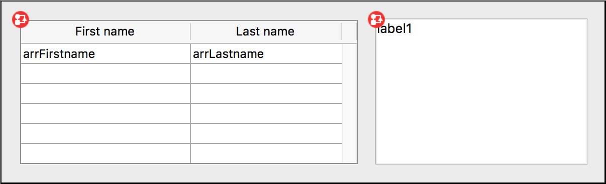

## Generalidades

4D integra una funcionalidad de arrastrar y soltar entre objetos en sus formularios y aplicaciones. Puede arrastrar y soltar un objeto sobre otro, ya sea en la misma ventana o en otra ventana. En otras palabras, arrastrar y soltar se puede realizar dentro de un proceso o de un proceso a otro.

También puede arrastrar y soltar objetos entre formularios 4D y otras aplicaciones, y viceversa. Por ejemplo, es posible arrastrar y soltar un archivo de imagen .png en un campo imagen 4D. También es posible seleccionar texto en un procesador de textos y soltarlo en una variable de texto de 4D o en un list box.

Por último, es posible soltar objetos directamente en la aplicación sin que sea necesario que haya un formulario en primer plano. El [método base `On Drop`](../commands-legacy/on-drop-database-method.md) puede ser usado para administrar la acción de arrastrar y soltar en este caso. Esto significa, por ejemplo, que puede abrir un documento 4D Write Pro soltándolo en el icono de la aplicación 4D.

4D proporciona dos modos de arrastrar y soltar:

- un **modo personalizado**, en el que toda la operación de arrastrar y soltar corre a cargo del programador. Este modo le permite implementar cualquier interfaz basada en la función de arrastrar y soltar, incluidas las interfaces que no necesariamente transportan datos, sino que pueden realizar cualquier acción como abrir archivos o activar un cálculo.
- un **modo automático**, donde una operación de arrastrar y soltar automáticamente copia o mueve datos de un objeto a otro. Este modo está disponible para objetos de texto y (en parte) para imágenes, y se puede activar simplemente seleccionando una propiedad.

## Objetos arrastrables y soltables

Varios objetos de formulario pueden arrastrarse y/o soltarse, en modo personalizado y/o automático (ver más abajo). Por defecto, los objetos de formulario recién creados no pueden ser ni arrastrados ni soltados (valor "none"). Depende de usted definir estas propiedades.

Para arrastrar y soltar un objeto sobre otro, debe configurar su [propiedad **Soltable**](../FormObjects/properties_Action.md#draggable) en "Automático" o "Personalizado". Durante una operación de arrastrar y soltar, el objeto que se arrastra es el objeto de origen.

Para hacer de un objeto el destino de una operación de arrastrar y soltar, debe establecer su [propiedad [**Soltable**](../FormObjects/properties_Action.md#droppable) en "Automático" o "Personalizado". En una operación de arrastrar y soltar, el objeto que recibe los datos es el objeto de destino.

La siguiente tabla muestra las propiedades disponibles para objetos arrastrables y/o soltables:

| Objetos de formulario                                         | Arrastrable "Personalizado" | Soltable "Personalizado" | Arrastrable "Auto" | Soltable "Auto" |
| ------------------------------------------------------------- | --------------------------- | ------------------------ | ------------------ | --------------- |
| [Áreas 4D Write Pro](../FormObjects/writeProArea_overview.md) | x                           | x                        | x                  | x               |
| [Combo Box](../FormObjects/comboBox_overview.md)              |                             | x                        | x                  | x               |
| [Entrada](../FormObjects/input_overview.md)                   | x                           | x                        | x                  | x               |
| [Lista jerárquica](../FormObjects/list_overview.md)           | x                           | x                        |                    |                 |
| [List Box](../FormObjects/listbox_overview.md)                | x                           | x                        |                    |                 |
| [Área de plugin](../FormObjects/pluginArea_overview.md)       |                             |                          | x                  | x               |
| [Botón](../FormObjects/button_overview.md)                    |                             | x                        |                    |                 |
| [Botón Imagen](../FormObjects/pictureButton_overview.md)      |                             | x                        |                    |                 |

Los elementos de una lista jerárquica o las líneas de un list box se pueden arrastrar y soltar. Por el contrario, puede arrastrar y soltar un objeto sobre un elemento de una lista jerárquica o sobre una línea de un list box. Sin embargo, no es posible arrastrar y soltar objetos desde el área de detalles de un formulario de salida. También puede gestionar la acción de arrastrar y soltar en la aplicación, fuera de cualquier formulario, utilizando el [método base `On Drop`](../commands-legacy/on-drop-database-method.md).

:::note Notas

- Por defecto, en el caso de los campos de imagen y las variables, se arrastran tanto la imagen como su referencia. Si solo quiere arrastrar la referencia, primero mantenga presionada la tecla **Alt** (Windows) u **Opción** (macOS).
- Cuando las propiedades Arrastrable "Personalizada" y ["Líneas desplazables"](../FormObjects/properties_Action.md#movable-rows) están definidas para un objeto list box array, la propiedad "Líneas desplazables" tiene prioridad cuando se mueve una línea. En este caso, no es posible arrastrar.
- Un objeto que es capaz de ser arrastrado y soltado también puede ser soltado sobre sí mismo, a menos que rechace la operación.

:::

## Arrastrar y soltar personalizado

Implementar una interfaz de arrastrar y soltar personalizada implica combinar propiedades, eventos y comandos del [*Tema Portapapeles*](../commands/theme/Pasteboard.md). El siguiente diagrama ilustra los puntos clave de una secuencia de arrastrar y soltar personalizada:


Su implementación se basará en el siguiente escenario:

1. En el evento [`On Begin Drag Over`](../Events/onBeginDragOver.md) del objeto source (con la propiedad [**Arrastrable** "Personalizada"](../FormObjects/properties_Action.md#draggable)), introduce los datos adecuados en el portapapeles utilizando [`APPEND DATA TO PASTEBOARD`](../commands/append-data-to-pasteboard), [`SET FILE TO PASTEBOARD`](../commands/set-file-to-pasteboard) u otros comandos del [tema Portapapeles](../commands/theme/Pasteboard.md). También puede definir un icono de cursor específico usando el comando [`SET DRAG ICON`](../commands/set-drag-icon).
2. En el evento [`On Drag Over`](../Events/onDragOver.md) del objeto de destino (con la propiedad [**Soltable** "Personalizable"](../FormObjects/properties_Action.md#droppable)), obtenga los tipos de datos o las firmas de datos que se encuentran en el portapapeles mediante [`GET PASTEBOARD DATA TYPE`](../commands/get-pasteboard-data-type) o [`GET PASTEBOARD DATA`](../commands/get-pasteboard-data) y compruebe si son compatibles con el objeto de destino.
   El comando [`Drop position`](../commands/drop-position) devuelve el número de elemento o la posición del elemento de destino o del elemento de la lista, si el objeto de destino es un array (es decir, un área desplazable), una lista jerárquica, un campo de texto o un combo box, así como el número de columna si el objeto es un list box.
3. El [método objeto](../Concepts/methods.md#method-types) del objeto o del elemento de destino debe devolver 0 o -1 para aceptar o rechazar la acción:
   - Si es compatible, devuelve **0** para aceptar la acción de soltar y ejecutar el evento [`On Drop`](../Events/onDrop.md) al soltar el botón del ratón.
   - De lo contrario, devuelve **-1** para rechazar el soltar.  
     4D se encarga automáticamente de la parte de la interfaz relacionada con esta interacción, mostrando un cursor en función de si la acción de soltar se acepta o se rechaza.
4. En el evento [`On Drop`](../Events/onDrop.md) del objeto de destino (que cuente con la propiedad [**Soltable** "Personalizable"](../FormObjects/properties_Action.md#droppable)), ejecuta cualquier acción en respuesta al soltar. Si la operación de arrastrar y soltar tiene como objetivo copiar los datos arrastrados, basta con asignar dichos datos al objeto de destino. Si la función de arrastrar y soltar no tiene como objetivo mover datos, sino que es una metáfora de la interfaz de usuario para una operación concreta, puede hacer lo que quiera; por ejemplo, obtener las rutas de los archivos mediante el comando [`Get file from pasteboard`](../commands/get-file-from-pasteboard).

Tenga en cuenta que el evento [`On Begin Drag Over`](../Events/onBeginDragOver.md) se genera **en el contexto del objeto source del arrastrar**, mientras que los eventos [`On Drag Over`](../Events/onDragOver.md) y [`On Drop`](../Events/onDrop.md) solo se envían al objeto de destino.

Para que la aplicación pueda procesar estos eventos, es necesario seleccionarlos adecuadamente en la lista de propiedades, tanto para el objeto de origen como para el de destino:


## Arrastrar y soltar automáticamente

El arrastrar y soltar automático consiste en mover o copiar una selección de texto o una imagen de un lugar a otro con un solo clic. Se puede utilizar en la misma área 4D, entre dos áreas 4D o entre 4D y otra aplicación.

:::note

En el caso de arrastrar y soltar automáticamente entre dos áreas 4D, los datos se mueven, en otras palabras, se eliminan del área de origen. Si quiere copiar los datos, mantenga presionada la tecla **Ctrl** (Windows) u **Opción** (macOS) durante la acción (en macOS, tiene que presionar la tecla **Opción** *después* de empezar a arrastrar el o los elemento(s)).

:::

Las propiedades [Arrastrar automático](../FormObjects/properties_Action.md#draggable) y [Soltar automático](../FormObjects/properties_Action.md#droppable) se pueden configurar por separado para cada objeto de formulario.

- **Arrastrable: automático**: cuando se selecciona esta opción, se activa el modo de arrastre automático para el objeto. En este modo, el evento formulario [`On Begin Drag`](../Events/onBeginDragOver.md) NO se genera.
  Si desea "forzar" el uso de arrastrar personalizado mientras que el arrastrar automático está habilitado, mantenga presionada la tecla **Alt** (Windows) u **Opción** (macOS) durante la acción (bajo macOS, tiene que presionar la tecla **Opción** *antes* de empezar a arrastrar el o los elemento(s)). Esta opción no está disponible para las imágenes.
- **Soltable automático**: en este modo, 4D gestiona automáticamente, si es posible, la inserción de los datos arrastrados de tipo texto o imagen que se sueltan sobre el objeto (los datos se pegan en el objeto). Los eventos formulario [`On Drag Over`](../Events/onDragOver.md) y [`On Drop`](../Events/onDrop.md) no se generan en este caso. Por otro lado, se generan los eventos [`On After Edit`](../Events/onAfterEdit.md) (durante una acción de arrastrar y soltar) y [`On Data Change`](../Events/onDataChange.md) (cuando el objeto pierde el foco).

En el caso de datos que no sean texto o imágenes (otro objeto 4D, un archivo, etc.) o de datos complejos que se sueltan, la aplicación se refiere al valor de la opción "Soltable": si no es "ninguno", los eventos formulario [`On Drag Over`](../Events/onDragOver.md) y [`On Drop`](../Events/onDrop.md) son generados; de lo contrario, el soltar se rechaza.

## Ejemplos

### List box array al área de entrada de texto

En este sencillo ejemplo, queremos llenar un campo de texto de entrada con datos arrastrados desde un list box de tipo array:



El método objeto del list box:

```4d
  //Object Method: ListBox
 If(Form event code=On Begin Drag Over)
    SET TEXT TO PASTEBOARD(arrFirstname{arrFirstname}+" "+arrLastname{arrFirstname})
 End if
```

El método del objeto área de texto contiene:

```4d

  // Método objeto: label1
If(Form event code=On Drop) // Requiere que la acción Droppable esté activada en la Lista de propiedades
    ARRAY TEXT($signatures_at;0)
    ARRAY TEXT($nativeTypes_at;0)
    ARRAY TEXT($formatNames_at;0)
    GET PASTEBOARD DATA TYPE($signatures_at;$nativeTypes_at;$formatNames_at)
    If(Find in array($signatures_at;"com.4d.private.text.native")#-1) // hay texto 4D en el portapapeles
       OBJECT Get pointer(Object current)->:=Get text from pasteboard
    End if
 End if
```

### List box de tipo selección a área de entrada de texto

La combinación de funcionalidades de arrastrar y soltar personalizadas y automáticas permite crear interfaces simples y poderosas. En este ejemplo, queremos llenar un área de texto de entrada con datos arrastrados desde un list box:


- List box: propiedad arrastrable "Personalizada" y evento "On Begin Drag Over"
- Área de texto de entrada: propiedad Soltable "Automática".

```4d
  //Método objeto list box 
 Case of
    :(Form event code=On Begin Drag Over)
       LOAD RECORD([Clients])
       $label:=[Clients]Name+Char(CR ASCII code)+[Clients]Contact+Char(CR ASCII code)+\
       [Clients]Address1+Char(CR ASCII code)+[Clients]City+", "+[Clients]State+" "+[Clients]ZipCode)
       SET TEXT TO PASTEBOARD($label)
 End case
```

El desplazamiento y el formateo de los datos se efectúan por arrastrar y soltar:


### Ruta de acceso de archivo al área de texto

Quiere que el usuario seleccione un archivo del disco y lo arrastre y suelte sobre una variable en la que se puedan introducir datos (de tipo objeto), de modo que se muestre una descripción en formato JSON del archivo.


En el método objeto de la variable, escriba:

```4d
 #DECLARE -> $result : Integer
 Case of
 
    :(Form event code=On Drag Over)
  // Aceptar el evento On Drop solo si el portapapeles contiene archivos; de lo contrario, rechazarlo.
       If(Get file from pasteboard(1)="") //no hay ningún archivo en el portapapeles
          $result:=-1 //rechazar soltar
       End if
 
    :(Form event code=On Drop) //Requiere que la acción Soltable esté habilitada en la Lista de propiedades
       var $path_t : Text
       var path_o : Object
         $path_t:=Get file from pasteboard(1)
       If($path_t#"")
          path_o:=Path to object($path_t)
       End if
 
 End case
```

### Rutas de acceso al list box

Quiere que el usuario seleccione archivos en el disco, luego arrastre y suelte los archivos en un list box para que muestre las rutas de los archivos.


En el método objeto del list box, puede escribir:

```4d
 #DECLARE -> $result : Integer
 Case of
 
    :(Form event code=On Drag Over)
  // Aceptar el evento On Drop solo si el portapapeles contiene archivos; de lo contrario, rechazarlo.
       If(Get file from pasteboard(1)#"") //se ha soltado al menos un archivo
          $result:=0 //aceptar soltar
       Else //no hay ningún archivo en el portapapeles
          $result:=-1 //rechazar soltar
       End if
 
       :(Form event code=On Drop) //Requiere que la acción Soltable esté habilitada en la Lista de propiedades
       ARRAY TEXT(importedPath_at;0)
       var $path_t :Text
       var $index_l:=1
       Repeat
          $path_t:=Get file from pasteboard($index_l)
          If($path_t#"")
             APPEND TO ARRAY(importedPath_at;$path_t)
          End if
          $index_l:=$index_l+1
       Until($path_t="")
 End case
```

## Comandos del portapapeles

Los [comandos del tema "Portapapeles"](../commands/theme/Pasteboard.md) pueden ser usados tanto para administrar las acciones de copia/pegar (**Gestión del portapapeles**), así como acciones de arrastrar y soltar entre aplicaciones.

4D utiliza dos contenedores de datos: uno para los datos copiados (o recortados), que es el portapapeles, y otro para los datos que se arrastran y sueltan.
Estos dos contenedores son administrados utilizando los mismos comandos. Se accede a uno u otro dependiendo del contexto:

- Solo se puede acceder al contenedor de arrastrar y soltar desde los eventos formulario [`On Begin Drag Over`](../Events/onBeginDragOver.md), [`On Drag over`](../Events/onDragOver.md) u [`On Drop`](../Events/onDrop.md), así como desde el [**método base On Drop**](../commands-legacy/on-drop-database-method.md). Fuera de estos contextos, el portapapeles de arrastrar y soltar no está disponible.
- Se puede acceder al portapapeles de copiar/pegar en todos los demás casos. A diferencia del portapapeles de arrastrar y soltar, conserva los datos que se introducen en él durante toda la sesión, siempre y cuando no se borren ni se reutilicen.

### Tipos de datos

Durante las acciones de arrastrar y soltar, se pueden colocar y leer diferentes tipos de datos en el portapapeles. Puede acceder a un tipo de datos de varias formas:

- A través de su firma 4D: la firma 4D es una cadena de caracteres que indica un tipo de datos al que hace referencia por la aplicación 4D. El uso de firmas 4D facilita el desarrollo de aplicaciones multiplataforma, ya que estas firmas son idénticas tanto en Mac OS como en Windows. A continuación encontrará la lista de firmas 4D.
- A través de un UTI (Uniform Type Identifier, solo para macOS): el estándar UTI, definido por Apple, asocia una cadena de caracteres a cada tipo de objeto nativo. Por ejemplo, las imágenes GIF tienen el tipo UTI "com.apple.gif". Los tipos UTI se publican en la documentación de Apple así como en los editores correspondientes.
- Mediante su número o su nombre de formato (solo en Windows): en Windows, cada tipo de datos nativo se identifica mediante su número ("3", "12", etc.) y un nombre («Rich Text Edit»). Por defecto, Microsoft especifica varios tipos nativos llamados formatos de datos estándar. Además, los editores de terceros pueden "guardar" los nombres de formato en el sistema, que luego los atribuye un número a cambio. Para más información al respecto y sobre los tipos nativos, consulte la documentación para desarrolladores de Microsoft (en concreto, en http://msdn2.microsoft.com/en-us/library/ms649013.aspx).

:::note

En los comandos 4D, los números con formato de Windows se tratan como texto.

:::

Todos los [comandos del tema "Contenedor de datos"](../commands/theme/Pasteboard.md) pueden trabajar con cada uno de estos tipos de datos. Puede averiguar qué tipos de datos están presentes en el portapapeles en cada uno de estos formatos utilizando el comando [`GET PASTEBOARD DATA TYPE`](../commands/get-pasteboard-data-type).

:::note

Se soportan los tipos de 4 caracteres (TEXT, PICT o tipos personalizados) para garantizar la compatibilidad con versiones anteriores de 4D.

:::

### Firmas 4D

Aquí está la lista de firmas 4D estándar así como su descripción:

| Firma                                                                                           | Descripción                                |
| ----------------------------------------------------------------------------------------------- | ------------------------------------------ |
| "com.4d.private.text.native"    | Texto en el conjunto de caracteres nativos |
| "com.4d.private.text.utf16"     | Texto en el conjunto de caracteres Unicode |
| "com.4d.private.text.rtf"       | Texto enriquecido                          |
| "com.4d.private.picture.pict"   | Formato de imagen PICT                     |
| "com.4d.private.picture.png"    | Formato de imagen PNG                      |
| "com.4d.private.picture.gif"    | Formato de imagen GIF                      |
| "com.4d.private.picture.jfif"   | Formato de imagen JPEG                     |
| "com.4d.private.picture.emf"    | Formato de imagen EMF                      |
| "com.4d.private.picture.bitmap" | Formato de imagen BITMAP                   |
| "com.4d.private.picture.tiff"   | Formato de imagen TIFF                     |
| "com.4d.private.picture.pdf"    | Documento PDF                              |
| "com.4d.private.file.url"       | Ruta del archivo                           |