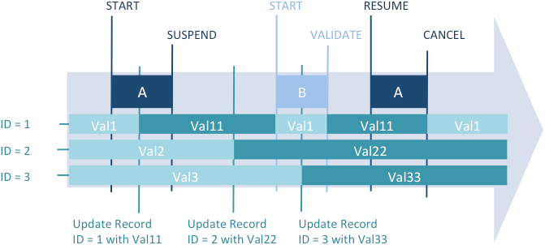

## Descripción

Las transacciones son una serie de modificaciones de datos relacionadas que se realizan en una base de datos o almacén de datos dentro de un [proceso](./processes.md). Una transacción no se guarda en una base de datos de forma permanente hasta que se valida la transacción. Si una transacción no se completa, ya sea porque se cancela o por algún evento externo, las modificaciones no se guardan.

Durante una transacción, todos los cambios realizados en los datos de la base de datos dentro de un proceso se almacenan localmente en un buffer temporal. Si la transacción se acepta con [`VALIDATE TRANSACTION`](../commands-legacy/validate-transaction.md) o [`validateTransaction()`](../API/DataStoreClass.md#validatetransaction), los cambios se guardan permanentemente. Si la transacción se cancela con [`CANCEL TRANSACTION`](../commands-legacy/cancel-transaction.md) o [`cancelTransaction()`](../API/DataStoreClass.md#canceltransaction), los cambios no se guardan. En todos los casos, ni la selección actual ni el registro actual son modificados por los comandos de gestión de transacciones.

4D soporta transacciones anidadas, es decir, transacciones en varios niveles jerárquicos. El número de subtransacciones permitidas es ilimitado. El comando [`Transaction level`](../commands-legacy/transaction-level.md) puede utilizarse para averiguar el nivel de transacción actual en el que se ejecuta el código. Cuando se utilizan transacciones anidadas, el resultado de cada subtransacción depende de la validación o cancelación de la transacción de nivel superior. Si se valida la transacción de nivel superior, se confirman los resultados de las subtransacciones (validación o cancelación). Por el contrario, si se anula la operación de nivel superior, se anulan todas las suboperaciones, independientemente de sus respectivos resultados.

4D incluye una funcionalidad que le permite [suspender y resumir transacciones](#suspending-transactions) dentro de su código 4D. Cuando una transacción está suspendida, puede ejecutar operaciones independientemente de la transacción misma y luego reanudar la transacción para validarla o cancelarla como de costumbre. 

### Ejemplo

En este ejemplo, la base de datos es un simple sistema de facturación. Las líneas de factura se almacenan en una tabla llamada [Invoice Lines], que está relacionada con la tabla [Invoices] mediante una relación entre los campos [Invoices]Invoice ID y [Invoice Lines]Invoice ID. Cuando se añade una factura, se calcula un ID único, utilizando el comando [`Sequence number`](../commands-legacy/sequence-number.md). La relación entre [Invoices] e [Invoice Lines] es una relación automática Relate Many. La casilla **Asignar automáticamente valor relacionado en subformulario** está marcada.

La relación entre [Invoice Lines] y [Parts] es manual.


Cuando un usuario introduce una factura, se ejecutan las siguientes acciones:

- Añadir un registro en la tabla [Invoices].
- Añadir varios registros en la tabla [Invoice Lines].
- Actualizar el campo [Parts]In Warehouse de cada parte listada en la factura.

Este ejemplo es una situación típica en la que necesita utilizar una transacción. Debe estar seguro de que podrá guardar todos estos registros durante la operación o de que podrá cancelar la transacción si no se puede añadir o actualizar un registro. En otras palabras, debe guardar los datos relacionados. Si no utiliza una transacción, no podrá garantizar la integridad lógica de los datos de su base de datos. Por ejemplo, si uno de los registros de [Parts] está bloqueado, no podrá actualizar la cantidad almacenada en el campo [Parts]In Warehouse. Por lo tanto, este campo será lógicamente incorrecto. La suma de las piezas vendidas y las piezas que quedan en el almacén no será igual a la cantidad original introducida en el registro. Puede evitar esta situación utilizando transacciones.

Existen varias formas de realizar la introducción de datos utilizando transacciones:

1. Puede gestionar las transacciones usted mismo utilizando los comandos de transacción [`START TRANSACTION`](../commands-legacy/start-transaction.md), [`VALIDATE TRANSACTION`](../commands-legacy/validate-transaction.md) y [`CANCEL TRANSACTION`](../commands-legacy/cancel-transaction.md). Puede escribir, por ejemplo:

```4d
 READ WRITE([Invoice Lines])
 READ WRITE([Parts])
 FORM SET INPUT([Invoices];"Input")
 Repeat
    START TRANSACTION
    ADD RECORD([Invoices])
    If(OK=1)
       VALIDATE TRANSACTION
    Else
       CANCEL TRANSACTION
    End if
 Until(OK=0)
 READ ONLY(*)
```

2. Para reducir el bloqueo de registros mientras se realiza la entrada de datos, también puede optar por gestionar las transacciones desde el método del formulario y acceder a las tablas en `READ WRITE` sólo cuando sea necesario. La entrada de datos se realiza mediante el formulario de entrada de [Invoices], que contiene la tabla relacionada [Invoice Lines] en un subformulario. El formulario tiene dos botones: *bCancel* y *bOK*, ue no son botones de acción.

El bucle de adición se convierte en:

```4d
 READ WRITE([Invoice Lines])
 READ ONLY([Parts])
 FORM SET INPUT([Invoices];"Input")
 Repeat
    ADD RECORD([Invoices])
 Until(bOK=0)
 READ ONLY([Invoice Lines])
```

Tenga en cuenta que la tabla [Parts] está ahora en modo de acceso de sólo lectura durante la entrada de datos. El acceso de lectura/escritura sólo estará disponible si se valida la entrada de datos.

La transacción se inicia en el método del formulario de entrada [Invoices] que se indica a continuación:

```4d
 Case of
    :(Form event code=On Load)
       START TRANSACTION
       [Invoices]Invoice ID:=Sequence number([Invoices]Invoice ID)
    Else
       [Invoices]Total Invoice:=Sum([Invoice Lines]Total line)
 End case
```

Si hace clic en el botón *bCancel*, e cancelará tanto la entrada de datos como la transacción. Este es el método objeto del botón *bCancel*:

```4d
 Case of
    :(Form event code=On Clicked)
       CANCEL TRANSACTION
       CANCEL
 End case
```

Si hace clic en el botón *bOK*, la entrada de datos debe ser aceptada y la transacción debe ser validada. Este es el método objeto del botón *bOK*:

```4d
 Case of
    :(Form event code=On Clicked)
       var $NbLines:=Records in selection([Invoice Lines])
       READ WRITE([Parts]) //Switch to Read/Write access for the [Parts] table
       FIRST RECORD([Invoice Lines]) //Start at the first line
       var $ValidTrans:=True //Assume everything will be OK
       var $Line : Integer
       For($Line;1;$NbLines) //For each line
          RELATE ONE([Invoice Lines]Part No)
          OK:=1 //Assume you want to continue
          While(Locked([Parts]) & (OK=1)) //Try getting the record in Read/Write access
             CONFIRM("The Part "+[Invoice Lines]Part No+" is in use. Wait?")
             If(OK=1)
                DELAY PROCESS(Current process;60)
                LOAD RECORD([Parts])
             End if
          End while
          If(OK=1)
               //Update quantity in the warehouse
             [Parts]In Warehouse:=[Parts]In Warehouse-[Invoice Lines]Quantity
             SAVE RECORD([Parts]) //Save the record
          Else
             $Line:=$NbLines+1 //Leave the loop
             $ValidTrans:=False
          End if
          NEXT RECORD([Invoice Lines]) //Go next line
       End for
       READ ONLY([Parts]) //Set the table state to read only
       If($ValidTrans)
          SAVE RECORD([Invoices]) //Save the Invoices record
          VALIDATE TRANSACTION //Validate all database modifications
       Else
          CANCEL TRANSACTION //Cancel everything
       End if
       CANCEL //Salir del formulario
 End case
```

En este código, llamamos al comando `CANCEL` independientemente del botón pulsado. El nuevo registro no se valida mediante una llamada a [`ACCEPT`](../commands-legacy/accept.md), sino mediante el comando [`SAVE RECORD`](../commands-legacy/save-record.md). Además, tenga en cuenta que `SAVE RECORD` se ejecuta justo antes del comando [`VALIDATE TRANSACTION`](../commands-legacy/validate-transaction.md). Por lo tanto, guardar el registro [Invoices] es en realidad una parte de la transacción. El comando  `ACCEPT` también validaría el registro, pero en este caso la transacción se validaría antes de guardar el registro [Invoices]. En otras palabras, el registro se guardaría fuera de la transacción.

Dependiendo de sus necesidades, puede personalizar su base de datos, como se muestra en estos ejemplos. En el último ejemplo, la gestión de registros bloqueados en la tabla [Parts] podría desarrollarse aún más.


## Suspender transacciones

### Principio

Suspender una transacción es útil cuando necesita realizar, desde dentro de una transacción, ciertas operaciones que no necesitan ser ejecutadas bajo el control de esta transacción. Por ejemplo, imagine el caso en el que un cliente realiza un pedido, por tanto dentro de una transacción, y también actualiza su dirección. A continuación, el cliente cambia de opinión y cancela el pedido. La transacción se cancela, pero usted no desea que se revierta el cambio de dirección. Este es un ejemplo típico en el que resulta útil suspender la transacción. Se utilizan tres comandos para suspender y reanudar transacciones:

- [`SUSPEND TRANSACTION`](../commands-legacy/suspend-transaction.md): pausa la transacción actual. Los registros actualizados o añadidos permanecen bloqueados.
- [`RESUME TRANSACTION`](../commands-legacy/resume-transaction.md): reactiva una transacción suspendida.
- [`Active transaction`](../commands-legacy/active-transaction.md): devuelve False si la transacción está suspendida o si no hay transacción en curso, y True si se ha iniciado o reanudado.

### Ejemplo 

Este ejemplo ilustra la necesidad de una transacción suspendida. En una base Invoices, queremos obtener un nuevo número de factura durante una transacción. Este número se calcula y almacena en una tabla [Settings]. En un entorno multiusuario, los accesos concurrentes deben estar protegidos; sin embargo, debido a la transacción, la tabla [Settings] podría estar bloqueada por otro usuario, aunque estos datos sean independientes de la transacción principal. En este caso, puede suspender la transacción cuando acceda a la tabla.

```4d
  //Método estándar que crea una factura
 START TRANSACTION
 ...
 CREATE RECORD([Invoices])
 //llamar al método para obtener un número disponible
 [Invoices]InvoiceID:=GetInvoiceNum 
 ...
 SAVE RECORD([Invoices])
 VALIDATE TRANSACTION

 ```

El método *GetInvoiceNum* suspende la transacción antes de ejecutarse. Tenga en cuenta que este código funcionará incluso cuando el método sea llamado desde fuera de una transacción:

```4d
  //Método proyecto GetInvoiceNum
  //GetInvoiceNum -> Siguiente número de factura disponible
 #DECLARE -> $freeNum : Integer
 SUSPEND TRANSACTION
 ALL RECORDS([Settings])
 If(Locked([Settings])) //acceso multiusuario
    While(Locked([Settings]))
       MESSAGE("Waiting for locked Settings record")
       DELAY PROCESS(Current process;30)
       LOAD RECORD([Settings])
    End while
 End if
 [Settings]InvoiceNum:=[Settings]InvoiceNum+1
 $freeNum:=[Settings]InvoiceNum
 SAVE RECORD([Settings])
 UNLOAD RECORD([Settings])
 RESUME TRANSACTION

```

### Operación detallada

#### ¿Cómo funciona una transacción suspendida?   

Cuando se suspende una transacción, se aplican los siguientes principios:

- Puede acceder a los registros que se añadieron o modificaron durante la transacción, y no puede ver los registros que se eliminaron durante la transacción.
- Puede crear, guardar, eliminar o modificar registros fuera de la transacción.
- Puede iniciar una nueva transacción, pero dentro de esta transacción incluida no podrá ver ningún registro o valor de registro que se haya añadido o modificado durante la transacción suspendida. De hecho, esta nueva transacción es totalmente independiente de la suspendida, similar a una transacción de otro proceso, y dado que la transacción suspendida podría reanudarse o cancelarse posteriormente, cualquier registro añadido o modificado se oculta automáticamente para la nueva transacción. En cuanto se reanude o cancele la nueva transacción, se podrán ver de nuevo estos registros.
- Los registros modificados, borrados o añadidos dentro de la transacción suspendida permanecen bloqueados para otros procesos. Si se intenta modificar o eliminar estos registros fuera de la transacción o en una nueva transacción, se genera un error.

Estas implementaciones se resumen en el siguiente gráfico:




*Los valores editados durante la transacción A (el registro ID1 obtiene Val11) no están disponibles en una nueva transacción (B) creada durante el periodo «suspendido». Los valores editados durante el periodo «suspendido» (el registro ID2 obtiene Val22 y el registro ID3 obtiene Val33) se guardan incluso después de cancelar la transacción A.*

Se han añadido funcionalidades específicas para gestionar los errores:

- El registro actual de cada tabla se bloquea temporalmente si se modifica durante la transacción y se desbloquea automáticamente cuando ésta se reanuda. Este mecanismo es importante para evitar guardados no deseados en partes de la transacción.
- Si se ejecuta una secuencia no válida como iniciar transacción / suspender transacción / iniciar transacción / reanudar transacción, se genera un error. Este mecanismo evita que los desarrolladores olviden consignar o cancelar cualquier transacción incluida antes de reanudar la transacción suspendida.


#### Transacciones suspendidas y estado del proceso 

El comando [`In transaction`](../commands-legacy/in-transaction.md) devuelve True cuando se ha iniciado una transacción, aunque esté suspendida. Para saber si la transacción actual está suspendida, es necesario utilizar el comando [`Active transaction`](../commands-legacy/active-transaction.md), que devuelve False en este caso.  

Ambos comandos, sin embargo, también devuelven False si no se ha iniciado ninguna transacción. En ese caso, es posible que tenga que utilizar el comando [`Transaction level`](../commands-legacy/transaction-level.md), que devuelve 0 en este contexto (no se ha iniciado ninguna transacción).


El siguiente gráfico ilustra los distintos contextos de transacción y los valores correspondientes devueltos por los comandos de transacción:


