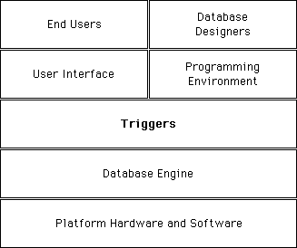

Un **trigger** es un método asociado a una tabla. Es una propiedad de una tabla. Usted no llama a los triggers; los triggers son llamados automáticamente por el motor de 4D cada vez que manipula registros de la tabla (adición, eliminación, modificación, y carga). Puede escribir triggers muy simples, y luego volverlos más sofisticados.

Los triggers pueden evitar operaciones “ilegales” en los registros de su base. Son una herramienta muy poderosa que permite controlar las operaciones en tablas, como también evitar perdidas de datos accidentales. Por ejemplo, en un sistema de facturación, puede evitar que un usuario cree una factura sin especificar el cliente al que debe facturarse.


<!-- INCLUDE triggers.vs-events.Desc -->


## Activar y crear un trigger

Por defecto, cuando crea una tabla en el entorno Diseño, la tabla no tiene trigger.

Para utilizar un trigger para una tabla, necesita:

- Activar el trigger e indicar a 4D cuando llamarlo.
- Escribir el código para el trigger.


Activar un trigger que no está escrito o escribir un trigger sin activarlo no afecta las operaciones efectuadas en una tabla.


1. Para activar un trigger, seleccione las opciones **Triggers** para la tabla en la ventana de propiedades de la tabla::


2. Para crear un trigger para una tabla, utilice la ventana de propiedades de la tabla, haga clic en el botón **Editar** o presione **Alt** (Windows)/**Opción** (macOS) y doble clic en la tabla en la ventana de estructura. 


## Descripción de los triggers

### Al guardar un registro existente

Si se selecciona esta opción, el trigger se llamará cada vez que se modifique un registro de la tabla. Esto sucede cuando:

- se modifica un registro en la entrada de datos (entorno Diseño, comando [`MODIFY RECORD`](../commands/modify-record) o el comando SQL `UPDATE`).
- se guarda un registro existente utilizando [`SAVE RECORD`](../commands/save-record).
- se llama un comando que guarda registros existentes (por ejemplo, [`ARRAY TO SELECTION`](../commands/array-to-selection), [`APPLY TO SELECTION`](../commands/apply-to-selection), etc.).
- se utiliza función ORDA que guarda la entidad.

:::note

Por razones de optimización, el trigger no se llama cuando el registro es guardado por el usuario o vía el comando [`SAVE RECORD`](../commands/save-record) si ningún campo de la tabla ha sido modificado en el registro. Si quiere "forzar" el llamado del trigger en este caso, simplemente puede asignar un campo:

```4d
[thetable]thefield:=[thetable]thefield
```

:::

### Al borrar un registro 

Si selecciona esta opción, el trigger se llamará cada vez que se borre un registro de la tabla. Esto sucede cuando:

- Cuando se borra un registro (entorno Diseño o llamando a los comandos [`DELETE RECORD`](../commands/delete-record), [`DELETE SELECTION`](../commands/delete-selection) o al comando SQL `DELETE`).
- Cuando se efectúan operaciones que provocan la eliminación de un registro relacionado por intermedio de las opciones de control de eliminación de una relación
- Cuando se utiliza una función ORDA que elimina la entidad.

:::note

El comando [`TRUNCATE TABLE`](../commands/trucate-table) no llama al trigger.

:::

### Al guardar un nuevo registro    

Si esta opción se selecciona, el trigger se llamará cada vez que un registro se cree en la tabla, es decir en las siguientes circunstancias:

- Cuando se añade un registro en la entrada de datos (entorno Diseño, comando [`ADD RECORD`](../commands/add-record) o comando SQL `INSERT`).
- Cuando se crea y guarda un registro con [`CREATE RECORD`](../commands/create-record) y [`SAVE RECORD`](../commands/save-record). Note que el trigger se llama en el momento en que llama [`SAVE RECORD`](../commands/save-record), no cuando se crea.
- Cuando se importan registros (entorno Diseño o utilizando un comando de importación).
- Cuando se llaman otros comandos que crean y/o guardan nuevos registros (por ejemplo, [`ARRAY TO SELECTION`](../commands/array-to-selection), [`SAVE RELATED ONE`](../commands/save-related-one), etc.).
- Cuando se utiliza funciones ORDA como [`ds.dataclass.new()`](../API/DataClassClass.md#new) y [`entity.save()`](../API/EntityClass.md#save).


## Eventos de base

Un trigger puede ser llamado por uno de los cuatro eventos de base descritos anteriormente. En el trigger, puede detectar qué evento está ocurriendo llamando la función [`Trigger event`](../commands/trigger-event). Esta función devuelve un valor numérico que indica el evento de base.

Generalmente, se escribe un trigger con una estructura de tipo [`Case of`](../Concepts/flow-control.md#case-ofelseend-case) sobre el resultado devuelto por [`Trigger event`](../commands/trigger-event). 


```4d
  //Trigger for [anyTable]
#DECLARE -> $result : Integer
$result:=0 // Asume que la petición será aceptada
 Case of
    :(Trigger event=On Saving New Record Event)
  // Realizar las acciones apropiadas para guardar el nuevo registro creado
    :(Trigger event=On Saving Existing Record Event)
  // Realizar las acciones apropiadas para guardar un registro existente
    :(Trigger event=On Deleting Record Event)
  // Realizar las acciones apropiadas para borrar un registro
 End case
 ```


## Los triggers son funciones  

Un trigger tiene dos propósitos:

- Efectuar acciones sobre el registro justo antes de que se guarde o borre, o justo después de ser cargado.
- Aceptar o rechazar una operación de base de datos.


### Efectuar las acciones  

Cada vez que se guarda un registro (añadido o modificado) a una tabla [Documentos], usted quiere “marcar” el registro con los marcadores de creación y modificación. Puede escribir el siguiente trigger:

```4d
  // Trigger for table [Documents]
 Case of
    :(Trigger event=On Saving New Record Event)
       [Documents]CreationStamp:=myTimeStamp
       [Documents]ModificationStamp:=myTimeStamp
    :(Trigger event=On Saving Existing Record Event)
       [Documents]ModificationStamp:=myTimeStamp
 End case
```

:::note

La función *myTimeStamp* utilizada en este ejemplo es un pequeño método de proyecto que devuelve el número de segundos transcurridos desde una fecha elegida arbitrariamente.

:::

Una vez este trigger ha sido escrito y activado, no importa de que manera añada o modifique un registro en la tabla de la tabla [Documents] (entrada de datos, importación, método de proyecto, ORDA function), los campos [Documents]CreationStamp y [Documents]ModificationStamp serán asignados automáticamente por el trigger antes de que el registro se escriba en el disco.


### Aceptar o rechazar la operación de una base  

Para aceptar o rechazar una operación de la base, el trigger debe devolver un **código de error de trigger** en el resultado de la función.


#### ExEjemplo  mple

Tomemos el caso de una tabla [Empleados]. Durante la entrada de datos, usted controla el campo [Empleados]Numero_Seguridad_Social. Por ejemplo, cuando el usuario hace clic en el botón de validación, usted verifica el campo utilizando el método objeto del botón:


```4d
  // Método objeto bAccept
 If(Good SS number([Empleados]Numero_Seguridad_Social))
    ACCEPT
 Else
    BEEP
    ALERT("Introduzca un número de seguridad social y haga clic de nuevo en OK.")
 End if
```

Si el valor del campo es correcto, acepta la entrada de datos; si el valor del campo no es correcto, muestra una alerta y permanece en entrada de datos.

Si también crea registros para la tabla [Empleados] por programación, el siguiente código sería válido pero violaría la regla expresada en el método objeto creado anteriormente:

```4d
  // Extracción de un método proyecto
  // ...
 CREATE RECORD([Empleados])
 [Empleados]Name:="DOE"
 SAVE RECORD([Empleados]) // <-- ¡Violación de la regla! El número de seguridad social no ha sido asignado
  // ...
```

Utilizando un trigger para la tabla [Empleados], puede implementar la regla [Empleados]Numero_Seguridad_Social en todos los niveles de la base. El trigger se vería así:

```4d
  // Trigger for [Empleados]
 #DECLARE -> $result : Integer
 var $dbEvent : Integer
 $result:=0
 $dbEvent:=Trigger event
 Case of
    :(($dbEvent=On Saving New Record Event)|($dbEvent=On Saving Existing Record Event))
       If(Not(Good SS number([Empleados]Numero_Seguridad_Social)))
          $0:=-15050
       Else
  // ...
       End if
  // ...
 End case
```

Una vez este trigger está escrito y activado, la línea `SAVE RECORD([Empleados])` del método proyecto generará un error base -15050, y el registro NO se guardará.

De la misma forma, si un plug-in 4D intenta guardar un registro en [Empleados] con un número de seguridad social incorrecto, el trigger generará el mismo error y el registro no se guardará.

El trigger garantiza que nadie (usuario, desarrollador, plug-in...) pueda violar la regla del número de seguridad social (bien sea deliberada o accidentalmente).

Note que incluso si no tiene un trigger para una tabla, la base puede devolver errores base cuando se trata de guardar o borrar un registro. Por ejemplo, si intenta guardar un registro con un valor duplicado en un campo indexado único, se devuelve el error -9998.

Los triggers devuelven nuevos tipos de errores en 4D:

- 4D administra los errores “normales”: índice único, control de datos relacionales, etc.
- Utilizando triggers, puede crear códigos de errores propios al contenido de su aplicación.

**Importante**: puede devolver el código de error de su elección. Sin embargo, NO utilice códigos de errores ya utilizados por el motor de 4D. Recomendamos utilizar códigos de error entre -32 000 y -15 000. Nos reservamos los errores superiores a -15 000 para el motor de 4D.

A nivel del proceso, usted administra los errores trigger de la misma manera que los errores de motor de base de datos:

- Puede permitir a 4D mostrar la caja de diálogo estándar de error, luego se interrumpe el método.
- Puede utilizar un [método de gestión de errores](../Concepts/error-handling.md) y recuperar el error de la manera apropiada.


:::note Notas

- Durante la entrada de datos, si un error trigger es devuelto mientras intenta validar o borrar un registro, el error se trata como un error de índice único. La caja de diálogo de error se muestra, y permanece en la entrada de datos. Incluso si utiliza una base en el entorno Diseño (no en el entorno Aplicación), usted se beneficia del uso de triggers.
- Cuando se genera un error por un trigger para un registro en el marco de un comando que actúa sobre una selección de registros ([`DELETE SELECTION`](../commands/delete-selection), [`APPLY TO SELECTION`](../commands/apply-to-selection), [`ARRAY TO SELECTION`](../commands/array-to-selection)...), el registro no es procesado pero se registra automáticamente en el Locke[`LockedSet`](../Develop/processes.md#elements-of-a-process). El comando continúa su ejecución hasta el final y no se detecta ningún error. No se llama al método de manejo de errores, si lo hay. Para saber si se han generado errores en este contexto, debe probar `LockedSet` justo después de la llamada al comando. Además, en el trigger, debe almacenar códigos de error, en una colección por ejemplo y manejarlos después.

:::


Incluso si un trigger no devuelve un error ($result=0), esto no significa que una operación de la base se efectuará correctamente, puede ocurrir una violación de índice único. Si la operación es la actualización de un registro, el registro puede estar bloqueado, se puede producir un error de entrada/salida puede ocurrir, etc. Estas verificaciones son efectuadas después de la ejecución del trigger. Sin embargo, desde el punto de vista del nivel superior del proceso en ejecución, los errores devueltos por el motor de la base de datos o por un trigger son de la misma naturaleza, un error trigger es un error del motor de la base de datos.


## Triggers y la arquitectura 4D   

Los triggers funcionan al nivel del motor de la base de datos. Este punto se resume en el siguiente diagrama:



Los triggers se ejecutan en el equipo donde está el motor de la base de datos. Esto es evidente en el caso de 4D en local. En 4D Server, los triggers se ejecutan en el equipo servidor (en el proceso activo) y no en el equipo cliente. 

Cuando se llama un trigger, se ejecuta dentro del contexto del proceso que intenta la operación. Este proceso, invoca la ejecución del trigger y se llama **proceso llamante**.**

Los elementos incluidos en este contexto difieren si la base se ejecuta con 4D en modo local o con 4D Server:

- Con 4D en modo local, el trigger funciona con las selecciones actuales, registros actuales, estados de lectura/escritura de las tablas, operaciones de bloqueos de registros, etc., del proceso llamante.
- Con 4D Server, sólo el contexto de base de datos del proceso cliente llamante se conserva (bloqueo de registros, estados transaccionales).
4D Server igualmente garantiza que el registro actual de la tabla del trigger esté correctamente posicionado.
Los otros elementos contextuales (selecciones actuales por ejemplo) son las del proceso del trigger.

Tenga cuidado cuando utilice otros objetos de la base y del lenguaje del entorno 4D, porque un trigger podría ejecutarse en una maquina diferente de la del proceso que lo llama ¡Este es el caso con 4D Server!

- **Variables proceso**: cada trigger tiene su propia tabla de variables proceso. Un trigger no tiene acceso a las variables proceso del proceso llamante.
- **Variables locales**: puede utilizar las variables locales en un trigger. Su alcance es la ejecución del trigger; se crean/eliminan en cada ejecución.
- **Semáforos**: un trigger puede probar o fijar semáforos globales y locales (en el equipo donde se ejecuta). Sin embargo, un trigger debe ejecutar rápidamente, de manera que debe ser muy cuidadoso cuando pruebe o defina semáforos dentro de triggers.
- **Conjuntos y selecciones temporales**: si utiliza un conjunto o una selección temporal en un trigger, trabaja en el equipo donde los triggers se ejecutan.
- **Interfaz del usuario**: NO utilice elementos de la interfaz del usuario en un trigger (alertas, mensajes o cajas de diálogo). De la misma forma, debe limitar todo seguimiento de triggers en la [ventana del **Depurador**](../Debugging/debugger.md). Recuerde que en Cliente/Servidor, los triggers se ejecutan en el equipo 4D Server. Un mensaje de alerta en el equipo servidor no ayuda al usuario en un equipo cliente. Deje al proceso llamante administrar la interfaz del usuario.

Tenga en cuenta que si utiliza el sistema de contraseñas de 4D, puede ejecutar el comando [`Current user`](../commands/current-user) en el trigger con el fin, por ejemplo, de guardar el nombre del usuario en el origen de la llamada del trigger en una tabla con historial, incluso en modo cliente-servidor.


## Triggers y transacciones

Las [transacciones](./transactions.md) deben administrarse en el nivel del proceso llamante. No deben administrarse a nivel del trigger. Si durante la ejecución del trigger, tiene que añadir, modificar o borrar varios registros, primero debe utilizar el comando [`In transaction`](../commands/in-transaction) desde el trigger para probar si el proceso llamante está en transacción actualmente. Si no es el caso, el trigger podría encontrarse con un registro bloqueado. Por lo tanto, si el proceso llamante no está en transacción, no comienzan las operaciones en los registros y devuelve un error en $0 para indicar al proceso llamante que la operación de la base de datos debe ejecutarse en una transacción. Por otra parte, si encuentra registros bloqueados, el proceso llamante no podrá deshacer las acciones del trigger.

:::note

Con el fin de optimizar el funcionamiento combinado de los triggers y transacciones, 4D no llama triggers después de la ejecución de [`VALIDATE TRANSACTION`](../commands/validate-transaction). Esto evita que los triggers se ejecuten dos veces.

:::

## Triggers en cascada  

Dada la siguiente estructura de ejemplo:


Nota: las tablas han sido contraídas; tienen más campos de los que se muestran.

Supongamos que la base de datos “autoriza” la eliminación de una factura. Podemos examinar cómo sería tratada tal operación a nivel del trigger (porque también podría realizar eliminaciones a nivel del proceso).

Para conservar la integridad relacional de los datos, la eliminación de una factura requiere las siguientes acciones de parte del trigger de [Facturas]:

- Disminuir el campo Ventas de la tabla [Clientes], en la cantidad de la factura.
- Borrar todos los registros de [Linea_Factura] relacionados con la factura.
- Esto también implica que el trigger de [Linea_Factura] disminuya el campo Cantidad vendida de los registros [Productos] relacionados con la línea de factura a eliminar.
- Borrar todos los registros de [Pagos] relacionados con la factura borrada.

Primero, el trigger de [Facturas] debe efectuar estas acciones sólo si el proceso llamante está en transacción, de manera que sea posible deshacer en caso de encontrar un registro bloqueado.

Segundo, el trigger de [Linea_Factura] está en **cascada** con el trigger de [Facturas]. El trigger [Linea_Factura] se ejecuta dentro de la ejecución del trigger [Facturas], porque la eliminación de los elementos de la lista es consecutiva a una llamada a `DELETE SELECTION` desde el trigger de [Facturas].

Imagine que todas las tablas en este ejemplo tienen triggers activados para todos los eventos de la base de datos. La cascada de triggers será:

- El trigger de [Facturas] se llama porque el proceso llamante borra una factura
   - El trigger de [Clientes] se llama porque el trigger de [Facturas] trigger actualiza el campo Ventas_Brutas
   - El trigger de [Linea_Factura] se llama porque el trigger [Facturas] borra una línea(repetida)
      - El trigger de [Productos] se llama porque el trigger de [Linea_Factura] actualiza el campo Cantidad_Vendida
   - El trigger de [Pagos] se llama porque el trigger de [Facturas] borra un pago(repetido)

En esta cascada, el trigger de [Facturas] se ejecuta en el nivel 1, los triggers de [Clientes], [Linea_Factura], y [Pagos] en el nivel 2 y el trigger de [Productos] en el nivel 3.

Desde dentro de los triggers, puede utilizar el comando [`Trigger level`](../commands/trigger-level) para detectar el nivel en el cual se ejecuta un trigger. Además, puede utilizar el comando [`TRIGGER PROPERTIES`](../commands/trigger-properties) para obtener información sobre los otros niveles.

Por ejemplo, si borra un registro de [Productos] a nivel del proceso, el trigger de [Productos] se ejecutará en el nivel 1, no en el nivel 3.

Con [`Trigger level`](../commands/trigger-level) y [`TRIGGER PROPERTIES`](../commands/trigger-properties), puede identificar la causa de una acción. En nuestro ejemplo, una factura se borra al nivel del proceso. Si borramos un registro de [Clientes] a nivel del proceso, el trigger de [Clientes] debe intentar borrar todas las facturas relacionadas con ese cliente. Esto significa que el trigger [Facturas] será llamado como se llamó anteriormente, pero por otra razón. Desde el trigger de [Facturas], puede detectar si se ejecuta en el nivel 1 ó 2. Si se ejecutó en el nivel 2, puede verificar si fue porque se borro el registro de [Clientes]. Si este es el caso, no tiene que preocuparse en actualizar el campo Ventas_Brutas.


