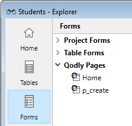
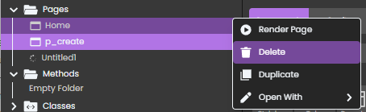

El Explorador es una ventana del entorno Diseño que le permite acceder cómodamente a tablas, formularios, métodos, comandos 4D integrados, constantes y plug-ins. También proporciona información sobre estos elementos. Puede visualizar el Explorador en cualquier momento eligiendo una de las páginas del submenú **Diseño > Explorador** o haciendo clic en el botón **Explorador** de la barra de herramientas.

:::note

Para una descripción completa del Explorador, consulte el [capítulo Explorador en doc.4d.com](https://doc.4d.com/4Dv21/4D/21/Explorer.200-7676561.en.html).

:::

## Página Formularios

La página Formularios contiene tres listas: **Formularios proyecto**, **Formularios tabla** y **Páginas Qodly**.

### Páginas Qodly

Esta sección le permite ver la lista de páginas Qodly definidas en su proyecto. También puede añadir o abrir páginas.

Las páginas listadas en la sección Páginas Qodly se almacenan en la [**subcarpeta FormularioWeb**](../Project/architecture.md#webforms) de la carpeta Fuentes del proyecto.

:::note

Las páginas Qodly no son visibles en la página **Inicio** del Explorador.

:::

### Requisitos

Las páginas Qodly se crean y editan en [Qodly Studio](https://developer.4d.com/qodly/4DQodlyPro/qodlyStudioInterface), una herramienta de desarrollo basada en web. El acceso a Qodly Studio desde 4D requiere algunas [configuraciones específicas](https://developer.4d.com/qodly/4DQodlyPro/gettingStarted#requirements), que usted [puede establecer en un clic](https://developer.4d.com/qodly/4DQodlyPro/gettingStarted#one-click-configuration).

### Añadir o abrir una página Qodly

Puede añadir o abrir páginas Qodly directamente desde el Explorador 4D. Si se cumplen los [requisitos](#requirements), la página se abre en el [editor de páginas de Qodly Studio](https://developer.4d.com/qodly/4DQodlyPro/pageLoaders/pageLoaderOverview).

Para añadir una página:

- Seleccione **Nueva página Qodly...** en el menú contextual,  
  

- o haga clic en el icono **+** o seleccione **Nueva página de Qodly...** en la parte inferior del Explorador. 
  

Introduzca el nombre de la página y haga clic en **OK** para abrir la página en Qodly Studio:

Para abrir una página:

- haga doble clic en el nombre de una página Qodly, o
- haga clic derecho en un nombre de página Qodly y seleccione **Editar...** en el menú contextual.

### Renombrar o eliminar una página Qodly

Renombrar o borrar una página Qodly sólo puede hacerse en el [Editor de páginas de Qodly Studio](https://developer.4d.com/qodly/4DQodlyPro/pageLoaders/pageLoaderOverview).

Haz clic en el ícono del lápiz para renombrar la página: 

Haga clic en el botón de opciones y seleccione **Borrar** para borrar una página: 

Aparece una caja de diálogo de confirmación.

