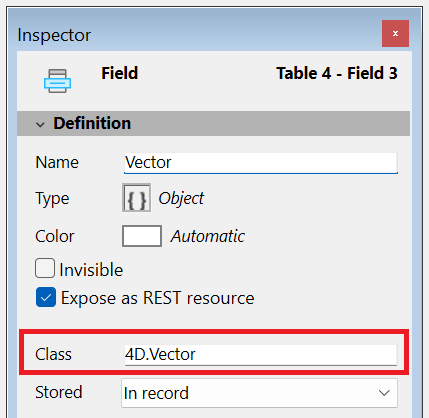

Para otras propiedades de campos, consulte [doc.4d.com](https://doc.4d.com/4Dv21/4D/21/Field-properties.300-7676763.en.html).

## Class

Esta propiedad está disponible para campos de tipo **Objeto** (en los proyectos 4D únicamente). Permite definir un **campo de tipo clase de objeto**, mejorando la compleción de código, la verificación de sintaxis y la validación en tiempo de ejecución al escribir código que incluya campos objeto.

Puede introducir cualquier nombre de clase válido en esta propiedad, incluyendo:

- Clases usuario (por ejemplo, `cs.MyClass`)
- Clases 4D integradas (por ejemplo, `4D.File`, `4D.Folder`)
- las clases [exposed](../Extensions/develop-components.md#sharing-of-classes) definidas por componentes (por ejemplo, `cs.MyComponent.MyClass`)

Si introduce un nombre de clase inválido, se activa una advertencia y se rechaza la entrada.

:::note

Las **Clases no transferibles** como las [clases del modelo de datos ORDA](../ORDA/ordaClasses.md), [gestores de archivos](../API/FileHandleClass.md), [servidor web](../API/WebServerClass.md)... no pueden asociarse a campos objeto.

:::

En su código, al asignar un valor a un campo de tipo clase de objeto, 4D verifica que pertenece a la clase declarada. Si no es así o si el objeto no tiene clase, se produce un error. El acceso a atributos desconocidos también provocará errores de sintaxis.

Para recuperar el nombre de la clase asociada en tiempo de ejecución, utilice la propiedad [`classID`](../API/DataClassClass.md#attributename), por ejemplo `ds.MyTable.MyField.classID`.

### Ver también

- [Articulo de blog: tipificación más estricta de objetos basada en clases](https://blog.4d.com/stricter-class-based-typing-for-objects/)

