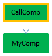

El código 4D compilado puede ejecutarse en **procesos apropiativos**. Gracias a esta característica, sus aplicaciones compiladas 4D pueden aprovechar al máximo las computadoras multinúcleo para que su ejecución sea más rápida y puedan soportar más usuarios conectados.

## ¿Qué es un proceso apropiativo?

Cuando se ejecuta en modo _apropiativo_, un proceso se dedica a una CPU. La gestión de procesos se delega entonces en el sistema, que puede asignar cada CPU por separado en una máquina multinúcleo.

Cuando se ejecuta en modo _cooperativo_, todos los procesos son gestionados por el hilo padre de la aplicación y comparten la misma CPU, incluso en una máquina multinúcleo.

Como resultado, en modo apropiativo, se mejora el rendimiento general de la aplicación, especialmente en máquinas de múltiples núcleos, ya que varios procesos (hilos) pueden ejecutarse realmente de forma simultánea. Sin embargo, las ganancias reales dependen de las operaciones que se ejecuten. A cambio, dado que cada hilo es independiente de los demás en modo apropiativo y no es administrado directamente por la aplicación, existen restricciones específicas aplicadas al código que se desea que cumpla con el uso apropiativo. Además, la ejecución apropiativa sólo está disponible en determinados contextos específicos.

## Disponibilidad del modo apropiativo

El uso del modo apropiativo está soportado en los siguientes contextos de ejecución:

| Contexto          | Ejecución apropiativa                                               |
| ----------------- | ------------------------------------------------------------------- |
| 4D Server         | sí                                                                  |
| 4D remoto         | sí, con [ServerNet o QUIC](../settings/client-server#network-layer) |
| 4D monopuesto     | sí                                                                  |
| Modo compilado    | sí                                                                  |
| Modo interpretado | no                                                                  |

Si el contexto de ejecución admite el modo apropiativo y si el método es "hilo seguro", un nuevo proceso de 4D lanzado utilizando los comandos `New process` o `CALL WORKER`, o el elemento de menú "Ejecutar método", se ejecutará en un hilo apropiativo.

En caso contrario, si se llama a `New process` o `CALL WORKER` desde un contexto de ejecución no soportado (es decir, desde el modo interpretado), el proceso es siempre cooperativo.

## Hilo seguro vs. hilo inseguro

El código 4D se puede ejecutar en hilo apropiativo sólo cuando se cumplen algunas condiciones específicas. Cada parte del código ejecutado (comandos, métodos, variables, funciones, etc.) debe ser compatible con el uso apropiativo. Los elementos que se pueden ejecutar en hilos apropiativos se llaman hilos seguros y los elementos que no se pueden ejecutar en hilos apropiativos se llaman hilos inseguros.

:::note

Dado que un hilo se maneja de forma independiente a partir del método del proceso padre, toda la cadena de llamada no debe incluir ningún código inseguro para los hilos; de lo contrario, la ejecución apropiativa no será posible. Este punto se discute [en este párrafo](#when-is-a-process-started-preemptivamente).

:::

La propiedad "seguridad de hilo" de cada elemento depende del elemento en sí:

- Comandos 4D: hilo seguro es una propiedad interna. En el [Manual de Referencia del Lenguaje 4D](https://doc.4d.com/4Dv20/4D/20.1/4D-Language-Reference.100-6479538.en.html), los comandos hilo seguro se identifican por el icono . También puede utilizar el comando [`Nombre del comando`](https://doc.4d.com/4dv20/help/command/en/page538.html) para saber si un comando es hilo seguro. Gran parte de los comandos 4D pueden ejecutarse en modo apropiativo.
- Métodos de proyecto: las condiciones para seguridad de hilo se listan en [este párrafo](#writing-a-thread-safe-method).

Básicamente, el código que se ejecuta en hilos apropiativos no puede llamar a las partes con las interacciones externas, tal como el código plug-in o las variables interproceso. Los accesos a los datos, sin embargo, son permitidos desde el servidor de datos 4D que soporta la ejecución apropiativa.

## Declarar un método apropiativo

Por defecto, 4D ejecuta todos los métodos proyecto de su aplicación en modo cooperativo. Si desea beneficiarse de la función de modo apropiativo, el primer paso consiste en declarar explícitamente todos los métodos que desee que se inicien en modo apropiativo siempre que sea posible, es decir, los métodos que considere que pueden ejecutarse en un proceso apropiativo. El compilador [verificará que estos métodos sean realmente hilo seguro](#writing-a-thread-safe-method) durante el tiempo de compilación. También puede desactivar el modo apropiativo para algunos métodos, si es necesario.

Tenga en cuenta que declarar un método "capable" de uso apropiativo lo hace elegible para la ejecución apropiativa, pero no garantiza que realmente se ejecute en modo apropiativo en tiempo de ejecución. Iniciar un proceso en modo apropiativo resulta de una [evaluación realizada por 4D](#when-is-a-process-started-preemptively) con respecto a las propiedades de todos los métodos en la cadena de llamadas del proceso.

Para declarar su método como elegible para su uso en modo apropiativo, debe utilizar la opción de declaración "Modo de ejecución" en el diálogo Propiedades del Método:


Se ofrecen las siguientes opciones:

- **Puede ser ejecutado en procesos apropiativos**: al marcar esta opción, usted declara que el método puede ser ejecutado en un proceso apropiativo y por lo tanto debe ser ejecutado en modo apropiativo siempre que sea posible. La propiedad "preemptive" del método toma el valor "capable".

  Cuando esta opción está seleccionada, el compilador de 4D verificará que el método es realmente capaz y devolverá errores si este no es el caso, por ejemplo, si llama directa o indirectamente a comandos o métodos que no pueden ser ejecutados en modo apropiativo (la cadena de llamadas completa es analizada pero los errores sólo son reportados al primer nivel). A continuación, puede editar el método para que sea hilo seguro, o seleccionar otra opción.

  Si la elegibilidad del método apropiativo es aprobada, éste se etiquetará internamente como "thread-safe" y se ejecutará en modo apropiativo siempre que se cumplan las condiciones requeridas. Esta propiedad define la elegibilidad del modo apropiativo, pero no garantiza que el método se ejecute realmente en modo apropiativo, ya que este modo de ejecución requiere un [contexto específico] (#cuando-se-inicia-un-proceso-de-forma apropiativa).

- **No puede ser ejecutado en procesos apropiativos**: marcando esta opción, declara que el método nunca debe ser ejecutado en modo apropiativo, y por lo tanto debe ser ejecutado siempre en modo cooperativo, como en versiones anteriores de 4D. La propiedad "preemptive" del método toma el valor "incapable".

  Cuando esta opción está marcada, el compilador de 4D no verificará la capacidad del método para ejecutarse de forma apropiativa; se etiquetará automáticamente como "thread-unsafe" internamente (incluso si es teóricamente compatible). Cuando se llama en ejecución, este método "contaminará" todos los otros métodos en el mismo hilo, forzando así que este hilo se ejecute en modo cooperativo, incluso si los otros métodos son hilo-seguro.

- **Indiferente**(por defecto): al marcar esta opción, se declara que no se quiere manejar la propiedad del modo apropiativo para el método. La propiedad "preemptive" del método se establece como "indifferent".

  Cuando esta opción está seleccionada, el compilador de 4D evaluará la compatibilidad del método con el modo apropiativo y lo etiquetará internamente como "thread-safe" o "thread-unsafe". No se devuelve ningún error relacionado con la ejecución apropiativa. Si el método se evalúa como "thread-safe", en la ejecución no impedirá el uso del modo apropiativo si se llama en un contexto apropiativo. Por el contrario, si el método se evalúa como "thread-unsafe", en ejecución impedirá la ejecución del modo apropiativo cuando sea llamado.

Tenga en cuenta que con esta opción, sea cual sea la evaluación de su compatibilidad con el modo apropiativo, el método siempre se ejecutará en modo cooperativo cuando sea llamado directamente por 4D como primer método padre (por ejemplo a través del comando `New process`). Si se marca como "thread-safe" internamente, sólo se tiene en cuenta cuando se llama desde otros métodos dentro de una cadena de llamadas.

:::note Caso particular

Si el método también tiene la propiedad [**Compartido por componentes y base de datos local**](../Project/code-overview.md#shared-by-components-and-host-database), definiendo la opción **Indiferente** etiquetará automáticamente el método como hilo-inseguro. Si quiere que un método de componente compartido sea hilo seguro, debe configurarlo explícitamente como **Puede ejecutarse en procesos apropiativos**.

:::

## ¿Cuándo se inicia un proceso de manera apropiativa?

:::info Recordatorio

La ejecución en modo apropiativo solo está disponible en modo compilado.

:::

En modo compilado, cuando se inicia un proceso creado por los comandos `New process` o `CALL WORKER`, 4D lee la propiedad apropiativa del método del proceso (también llamado método _padre_) y ejecuta el proceso en modo apropiativo o cooperativo, dependiendo de esta propiedad:

- Si el método del proceso es hilo seguro (validado durante la compilación), el proceso se ejecuta en un hilo apropiativo.
- Si el método del proceso no es hilo seguro, el proceso se ejecuta en un hilo cooperativo.
- Si la propiedad apropiativa del método de proceso fue definida "indifferent", por compatibilidad el proceso se ejecuta en un hilo cooperativo (incluso si el método es realmente capaz de utilizar apropiativo). Tenga en cuenta, sin embargo, que esta funcionalidad de compatibilidad sólo se aplica cuando el método se utiliza como método de proceso: un método declarado "indifferent" pero etiquetado internamente como "thread-safe" por el compilador puede ser llamado de forma apropiativa por otro método (ver más adelante).

La propiedad real hilo seguro depende de la cadena de llamada. Si un método con la propiedad declarada como "capable" llama a un método hilo no seguro en cualquiera de sus subniveles, se devolverá un error de compilación: si un único método en toda la cadena de llamadas es hilo no seguro, "contaminará" a todos los demás métodos y la ejecución apropiativa será rechazada por el compilador. Un hilo apropiativo sólo se puede crear cuando toda la cadena es hilo seguro y el método de proceso ha sido declarado "Se puede ejecutar en proceso apropiativo".
Por otro lado, el mismo método hilo seguro puede ejecutarse en un hilo apropiativo cuando está en una cadena de llamada, y en un hilo cooperativo cuando está en otra cadena de llamada.

Por ejemplo, considere los siguientes métodos proyecto:

```4d
  //Método proyecto MyDialog
  //Contiene llamadas a interfaces: será internamente hilo no seguro
 $win:=Open form window("tools";Palette form window)
 DIALOG("tools")
```

```4d
  //Método proyecto MyComp
  //Contiene computación simple: será internamente hilo seguro
 #DECLARE($value : Integer) -> $result : Integer
 $result:=$value*2
```

```4d
  //Método proyecto CallDial
 var $vName : Texto
 MyDialog
```

```4d
  //Método proyecto CallComp
 var $vAge : Integer
 MyComp($vAge)
```

La ejecución de un método en modo apropiativo dependerá de su propiedad "ejecución" y de la cadena de llamadas. La siguiente tabla ilustra estas diversas situaciones:


| Declaración y cadena de llamadas      | Compilación | Seguridad de hilo resultante           | Ejecución                 | Comentario                                                                                                                                                                                                                                                                                                                                                                                                                                                                                                             |
| ------------------------------------- | ----------- | -------------------------------------- | ------------------------- | ---------------------------------------------------------------------------------------------------------------------------------------------------------------------------------------------------------------------------------------------------------------------------------------------------------------------------------------------------------------------------------------------------------------------------------------------------------------------------------------------------------------------- |
|  | OK          |   | Apropiativo               | CallComp es el método padre, declarado "capaz" de uso apropiativo; ya que MyComp es internamente hilo seguro, CallComp es hilo seguro y el proceso es apropiativo                                                                                                                                                                                                                                                                                                                                                      |
|  | Error       |   | La ejecución es imposible | CallDial es el método padre, declarado "capaz"; MyDialog es "indiferente". Sin embargo, ya que MyDialog está internamente hilo inseguro, contamina la cadena de llamadas. La compilación falla debido a un conflicto entre la declaración deCallDial y su capacidad real. La solución es o bien modificar MyDialog para que sea hilo seguro, de modo que la ejecución es apropiativa, o cambiar la declaración de propiedad de CallDial para correrlo como cooperativo |
|  | OK          |   | Cooperativo               | Como CallDial se declara "incapaz" de uso apropiativo, la compilación es internamente hilo inseguro, la ejecución siempre será cooperativa, cualquiera que sea el estado de MyDialog                                                                                                                                                                                                                                                                                                                                   |
|  | OK          |   | Cooperativo               | Como CallComp es el método padre con la propiedad "indiferente", luego el proceso es cooperativo incluso si toda la cadena es hilo seguro.                                                                                                                                                                                                                                                                                                                                                             |
|  | OK          |  | Cooperativo               | Como CallDial es el método padre (la propiedad era "indiferente"), entonces el proceso es cooperativo y la compilación exitosa                                                                                                                                                                                                                                                                                                                                                                      |

### Cómo buscar el modo de ejecución actual

4D permite identificar el modo de ejecución de los procesos en modo compilado:

- El comando [`PROCESS PROPERTIES`](https://doc.4d.com/4dv20/help/command/en/page336.html) permite averiguar si un proceso se ejecuta en modo apropiativo o cooperativo.
- El Explorador de ejecución y la [ventana de administración de 4D Server](../ServerWindow/processes.md#process-type) muestran iconos específicos para los procesos apropiativos.

## Escribir un método hilo seguro

Para ser hilo seguro, un método debe respetar las siguientes reglas:

- Debe tener la propiedad "Puede ejecutarse en procesos apropiativos" o "Indiferente"
- No debe llamar a un comando o función 4D que no sea hilo seguro.
- No debe llamar a otro método proyecto o función que no sea hilo seguro
- No debe llamar a un plug-in que no sea hilo seguro.
- No debe utilizar ninguna variable interproceso(1)
- No debe llamar a objetos de interfaz(2) (sin embargo, hay excepciones, ver más abajo).

(1) Para intercambiar datos entre procesos apropiativos (y entre todos los procesos), puede pasar [colecciones compartidas u objetos compartidos](../Concepts/shared.md) como parámetros a los procesos, y/o utilizar el catálogo [`Storage`](https://doc.4d.com/4dv20/help/command/en/page1525.html).
Los [procesos Worker](processes.md#worker-processes) también permiten intercambiar mensajes entre cualquier proceso, incluidos los procesos apropiativos.

(2) El comando [`CALL FORM`](https://doc.4d.com/4dv20/help/command/en/page1391.html) ofrece una solución elegante para llamar a objetos de interfaz desde un proceso en espera.

:::note Notas

- En el caso de un método "Compartido por componentes y bases de datos locales", debe seleccionarse la propiedad "Puede ejecutarse en procesos apropiativos".
- Todas las declaraciones SQL son hilo seguro. El código SQL insertado en los bloques `Begin SQL`/`End SQL` debe cumplir las siguientes condiciones:
  - Debe aplicarse a 4D Server o a la base de datos local de 4D (ODBC o bases de datos remotas vía `SQL LOGIN` no son hilo seguro. Sin embargo, las bases de datos locales usadas con `USE DATABASE` son hilo seguro).
  * Todo trigger llamado por sentencias SQL debe ser hilo seguro (ver [Triggers](#triggers) a continuación).

:::

Los métodos con la propiedad "Se puede ejecutar en procesos apropiativos" serán comprobados por 4D durante la compilación. Se emite un error de compilación cada vez que el compilador encuentra algo que impide que sea hilo seguro:


:::info

Es posible [desactivar localmente la verificación de la seguridad de los hilos](#).

:::

Si está activado, el [archivo de símbolos](../Project/compiler.md/#complete-list-of-methods), también contiene el estado de seguridad de los hilos para cada método.

### Interfaz de usuario

Dado que se trata de accesos "externos", las llamadas a objetos de la interfaz de usuario como formularios, así como al depurador, no están permitidas en hilos apropiativos.

Los únicos accesos posibles a la interfaz de usuario desde un hilo apropiativo son:

- [Diálogo de error estándar](../Debugging/basics). El diálogo se muestra en el proceso de modo usuario (en 4D) o en el proceso de interfaz de usuario del servidor (4D Server). El botón **Rastrear** está desactivado.
- Indicadores de progreso estándar
- Diálogos `ALERT`, `Request` y `CONFIRM`. El diálogo se muestra en el proceso de modo usuario (en 4D) o en el proceso de interfaz de usuario del servidor (4D Server). Tenga en cuenta que si 4D Server se ha lanzado como un servicio en Windows sin permitir la interacción del usuario, los diálogos no se mostrarán.

### Triggers

When a method uses a command that can call a [trigger](https://doc.4d.com/4Dv20R6/4D/20-R6/Triggers.300-6958353.en.html), the 4D compiler evaluates the thread safety of the trigger in order to check the thread safety of the method:

```4d
 SAVE RECORD([Table_1]) //activar en Table_1, si existe, debe ser hilo seguro
```

Aquí está la lista de comandos que se verifican en tiempo de compilación para la seguridad de hilos de trigger:

`SAVE RECORD`, `SAVE RELATED ONE`, `DELETE RECORD`, `DELETE SELECTION`, `ARRAY TO SELECTION`, `JSON TO SELECTION`, `APPLY TO SELECTION`, `IMPORT DATA`, `IMPORT DIF`, `IMPORT ODBC`, `IMPORT SYLK`, `IMPORT TEXT`.

Si la tabla se pasa dinámicamente, a veces el compilador no puede averiguar qué trigger debe evaluar. Estos son algunos ejemplos de estas situaciones:

```4d
 DEFAULT TABLE([Table_1])
 SAVE RECORD
 SAVE RECORD($ptrOnTable->)
 SAVE RECORD(Table(myMethodThatReturnsATableNumber())->)
```

En este caso, se evalúan todos los triggers. Si se detecta un comando que no sea hilo seguro en al menos un trigger, se rechaza todo el grupo y el método se declara hilo no seguro.

:::note

En [aplicaciones client/servidor](../Desktop/clientServer.md), los triggers pueden ser ejecutados en modo cooperativo, incluso si su código es hilo seguro. Esto ocurre cuando se activa un trigger desde un proceso remoto: en este caso, el trigger se ejecuta en el ["proceso gemelo" del proceso cliente](https://doc.4d.com/4Dv20R6/4D/20-R6/4D-Server-and-the-4D-Language.300-7182872.en.html#68966) en la máquina del servidor. Dado que este proceso se utiliza para todas las llamadas del cliente, siempre se ejecuta en modo cooperativo.

:::

### Métodos de gestión de errores

[Metodos-captura-error](../Concepts/error-handling.md) instalados por el comando `ON ERR CALL` deben ser hilo seguro si es probable que sean llamados desde un proceso apropiativo. Para manejar este caso, el compilador verifica la propiedad hilo seguro de los métodos proyecto de captura de errores pasados al comando `ON ERR CALL` durante la compilación y devuelve errores apropiados si no cumplen con la ejecución apropiativa.

Tenga en cuenta que esta comprobación solo es posible cuando el nombre del método se pasa como una constante y no se calcula, como se muestra a continuación:

```4d
 ON ERR CALL("myErrMethod1") //será verificado por el compilador
 ON ERR CALL("myErrMethod "+String($vNum)) //no será verificado por el compilador
```

Además, si un método de proyecto captador de errores no puede ser llamado en tiempo de ejecución (después de un problema de seguridad de hilo, o por cualquier razón como "método no encontrado"), se genera el error -10532 "No se puede llamar al método de gestión de errores 'methodName'".

### Compatibilidad de punteros

Un proceso puede desreferenciar un puntero para acceder al valor de la variable de otro proceso solo si ambos procesos están cooperando; en caso contrario, 4D lanzará un error. En un proceso apropiativo, si algún código 4D intenta hacer referencia a un puntero a una variable interproceso, 4D lanzará un error.

Ejemplo con los siguientes métodos:

Method1:

```4d
 myVar:=42
 $pid:=New process("Method2";0;"process name";->myVar)
```

Method2:

```4d
 $value:=$1->
```

Si el proceso que ejecuta el Method1 o el proceso que ejecuta el Method2 es apropiativo, entonces la expresión `$value:=$1->` lanzará un error de ejecución.

### Referencia de documento refDoc

El uso de parámetros de tipo DocRef (referencia de documento abierto, utilizada o devuelta por `Open document`, `Create document`, `Append document`, `CLOSE DOCUMENT`, `RECEIVE PACKET`, `SEND PACKET`) está limitado a los siguientes contextos:

- Cuando se llama desde un proceso en espera, una referencia `DocRef` solo es utilizable desde ese proceso en espera.
- Cuando se llama desde un proceso cooperativo, una referencia `DocRef` es utilizable desde cualquier otro proceso cooperativo.

## Desactivar localmente la verificación hilo de seguridad

En algunos casos, puede que prefiera que la verificación "thread-safety" de los comandos no se aplique a algunas partes del código, como por ejemplo, cuando tiene comandos no hilo seguro que sabe que nunca se van a llamar.

Para hacer esto, debe rodear el código a excluir del comando hilo seguro utilizando las directivas específicas `%T-` y `%T+ como comentarios. El comentario `//%T-`desactiva la verificación hilo seguro y el comentario`//%T+\` la reactiva:

```4d
  // %T- para deshabilitar la verificación hilo seguro
  
  // Coloque el código que contiene los comandos que se excluirán de la verificacion hilo seguro
 $w:=Open window(10;10;100;100) //por ejemplo
  
  // %T+ para reactivar nuevamente la verificación hilo seguro para el resto del método
```

Por supuesto, el desarrollador 4D es responsable de que el modo apropiativo del código sea compatible con las directivas de activación y de reactivación. Se generarán errores de tiempo de ejecución si se ejecuta código hilo no seguro en un hilo apropiativo.
