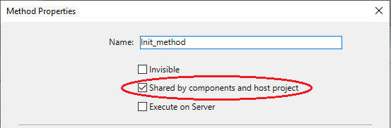
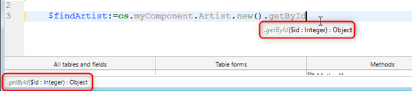

Un componente 4D es un conjunto de funciones, métodos y formularios 4D que representan una o varias funcionalidades que pueden ser [instaladas y utilizadas en aplicaciones 4D](Concepts/components.md). Por ejemplo, puede desarrollar un componente 4D de correo electrónico que gestione todos los aspectos del envío, la recepción y el almacenamiento de correos electrónicos en aplicaciones 4D.

Puede desarrollar componentes 4D para sus propias necesidades y mantenerlos en privado. También puede [compartir sus componentes con la comunidad 4D](https://github.com/topics/4d-component).

## Definiciones

- **Base proyecto**: proyecto 4D utilizado para desarrollar el componente. El proyecto matriz es una base estándar sin atributos específicos. Un proyecto matricial forma un único componente.
- **Proyecto local**: proyecto aplicación en la que se instala y utiliza un componente.
- **Componente**: proyecto matriz que puede compilarse y [crearse](Desktop/building.md#build-component), [instalarse en la aplicación principal](../Project/components.md#basics) y cuyo contenido se utiliza en la aplicación principal.

## Básicos

La creación e instalación de los componentes 4D se realiza directamente desde 4D:

- Para utilizar un componente, sólo tiene que [instalarlo en su aplicación](../Project/components.md#basics).
- Un proyecto puede ser a la vez matriz y local, es decir, que un proyecto matriz puede utilizar a su vez uno o varios componentes. Sin embargo, un componente no puede utilizar subcomponentes por sí mismo.
- Un componente puede llamar a la mayoría de los elementos de 4D: clases, funciones, métodos proyecto, formularios proyecto, barras de menú, listas de selección, etc. No puede llamar a los métodos base ni a los triggers.
- No es posible utilizar el datastore, las tablas estándar o los archivos de datos en los componentes 4D. Sin embargo, un componente puede crear y/o utilizar tablas, campos y archivos de datos utilizando mecanismos de bases externas. Se trata de bases 4D independientes con las que se trabaja utilizando comandos SQL.
- Un proyecto local que se ejecuta en modo interpretado puede utilizar componentes interpretados o compilados. Un proyecto local que se ejecuta en modo compilado no puede utilizar componentes interpretados. En este caso, sólo se pueden utilizar componentes compilados.

## Alcance de los comandos del lenguaje

A excepción de los [comandos no utilizables](#unusable-commands), un componente puede utilizar cualquier comando del lenguaje 4D.

Cuando los comandos son llamados desde un componente, se ejecutan en el contexto del componente, excepto por el comando [`EXECUTE METHOD`](https://doc.4d.com/4dv20/help/command/en/page1007.html) o el comando [`EXECUTE FORMULA`](https://doc.4d.com/4dv20/help/command/en/page63.html) que utilizan el contexto del método especificado por el comando. También hay que tener en cuenta que los comandos de lectura del tema "Usuarios y grupos" se pueden utilizar desde un componente, pero leerán los usuarios y grupos del proyecto local (un componente no tiene sus propios usuarios y grupos).

Los comandos [`SET DATABASE PARAMETER`](https://doc.4d.com/4dv20/help/command/en/page642.html) y [`Get database parameter`](https://doc.4d.com/4dv20/help/command/en/page643.html) son una excepción: su alcance es global para la aplicación. Cuando estos comandos se llaman desde un componente, se aplican al proyecto de la aplicación local.

Además, se han especificado medidas específicas para los comandos `Structure file` y `Get 4D folder` cuando se utilizan en el marco de los componentes.

El comando [`COMPONENT LIST`](https://doc.4d.com/4dv20/help/command/en/page1001.html) puede utilizarse para obtener la lista de componentes que son cargados por el proyecto local.

### Comandos no utilizables

Los siguientes comandos no son compatibles para su uso dentro de un componente porque modifican el archivo de estructura - que está abierto en sólo lectura. Su ejecución en un componente genera el error -10511, "El comando CommandName no puede ser llamado desde un componente":

- `ON EVENT CALL`
- `Method called on event`
- `SET PICTURE TO LIBRARY`
- `REMOVE PICTURE FROM LIBRARY`
- `SAVE LIST`
- `ARRAY TO LIST`
- `EDIT FORM`
- `CREATE USER FORM`
- `DELETE USER FORM`
- `CHANGE PASSWORD`
- `EDIT ACCESS`
- `Set group properties`
- `Set user properties`
- `DELETE USER`
- `CHANGE LICENSES`
- `BLOB TO USERS`
- `SET PLUGIN ACCESS`

**Notas:**

- El comando `Current form table` devuelve `Nil` cuando se llama en el contexto de un formulario proyecto. Por consiguiente, no puede utilizarse en un componente.
- Comandos del lenguaje de definición de datos SQL (`CREATE TABLE`, `DROP TABLE`, etc.) no se puede utilizar en el proyecto del componente. Sin embargo, se soportan con bases de datos externas (ver el comando SQL `CREATE DATABASE`).

## Compartir métodos proyecto

Todos los métodos proyecto de un proyecto matricial son por definición incluidos en el componente (el proyecto es el componente), lo que significa que pueden ser llamados y ejecutados dentro del componente.

Por otro lado, por defecto estos métodos proyecto no serán visibles, y no podrán ser llamados por el proyecto local. En el proyecto matriz, debe designar explícitamente los métodos que desea compartir con el proyecto local y sus componentes marcando la casilla **Compartido por los componentes y el proyecto local** en la caja de diálogo de las propiedades del método:



Los métodos proyecto compartidos se pueden llamar en el código del proyecto local (pero no se pueden modificar en el editor de código del proyecto local). Estos métodos son los **puntos de entrada** del componente.

Por el contrario, por razones de seguridad, por defecto un componente no puede ejecutar métodos proyecto que pertenezcan al proyecto local. En algunos casos, puede ser necesario permitir que un componente acceda a los métodos proyecto de su proyecto local. Para ello, debe designar explícitamente qué métodos proyecto del proyecto local quiere hacer accesibles a los componentes (en las propiedades del método, marque la casilla **Compartido por componentes y proyecto local**).


Una vez que los métodos proyecto de los proyectos locales están disponibles para los componentes, puede ejecutar un método local desde dentro de un componente utilizando [`EXECUTE FORMULA`](https://doc. d.com/4dv20/help/command/en/page63.html) o [`EXECUTE METHOD`](https://doc.4d.com/4dv20/help/command/en/page1007.html). Por ejemplo:

```4d
// Método local
component_method("host_method_name")
```

```4d
// component_method
#DECLARE ($param : Text)
EXECUTE METHOD($param)
```

> Una base local interpretada que contenga componentes interpretados puede ser compilada o verificada sintácticamente si no llama a métodos del componente interpretado. De lo contrario, aparecerá una caja de diálogo de advertencia cuando intente iniciar la compilación o una comprobación de sintaxis y no será posible realizar la operación.\
> Tenga en cuenta que un método interpretado puede llamar a un método compilado, pero no a la inversa, excepto mediante el uso de los comandos `EXECUTE METHOD` y `EXECUTE FORMULA`.

## Compartir clases

Por defecto, las clases de los componentes no pueden ser llamadas desde el editor de código 4D del proyecto local. Si desea exponer la clase del componente al proyecto principal y a los componentes que se están cargando, debe **declarar un espacio de nombres de componente**. Además, puede controlar cómo se sugieren las clases de los componentes en el Editor de código local.

### Declaración del namespace

Para permitir que las clases de su componente se expongan en los proyectos locales y sus componentes cargados, introduzca un valor en la opción [**namespace del componente en la class store** en la página General](../settings/general.md#component-namespace-in-the-class-store) de las Propiedades del proyecto matriz. Por defecto, el área está vacía: las clases de componentes no están disponibles fuera del contexto de los componentes.


:::note

Un _namespace_ garantiza que no surja ningún conflicto cuando un proyecto local utilice diferentes componentes que tienen clases o funciones con nombres idénticos. Un namespace del componente debe ser compatible con [reglas de denominación de las propiedades](../Concepts/identifiers.md#object-properties).

:::

Al introducir un valor, se declara que las clases de los componentes estarán disponibles en el [almacén de clases de usuario (**cs**)](../Concepts/classes.md#cs) del proyecto principal, así como sus componentes cargados, a través del espacio de nombres `cs.<value>`. Por ejemplo, si introduce "eGeometry" como namespace del componente, asumiendo que ha creado una clase `Rectangle` que contiene una función `getArea()`, una vez que su proyecto se instala como componente, el desarrollador del proyecto local puede escribir:

```4d
//en el proyecto principal o en uno de sus componentes
var $rect: cs.eGeometry.Rectangle
$rect:=cs.eGeometry.Rectangle.new(10;20)
$area:=$rect.getArea()
```

:::info

El namespace de un componente [compilado](#protection-of-components-compilation) se añade entre paréntesis después del nombre del componente en la [página Métodos Componente](../Concepts/components.md#using-components) de los proyectos locales:


:::

Por supuesto, se recomienda utilizar un nombre distintivo para evitar cualquier conflicto. Si en el proyecto ya existe una clase usuario con el mismo nombre que un namespace de componente, se tiene en cuenta la clase usuario y se ignoran las clases del componente.

Las clases ORDA de un componente no están disponibles en el proyecto local. Por ejemplo, si hay una dataclass llamada Employees en su componente, no podrá utilizar una clase "cs.Mycomponent.Employee" en el proyecto local.

### Clases ocultas

Como en todo proyecto, puede crear clases y funciones ocultas en el componente anteponiendo a los nombres un guión bajo ("_"). Cuando se define un [namespace de componente](#declaring-the-component-namespace), las clases y funciones ocultas del componente no aparecerán como sugerencias al utilizar completar el código.

Sin embargo, hay que tener en cuenta que pueden seguir utilizándose si se conocen sus nombres. Por ejemplo, la siguiente sintaxis es válida incluso si la clase `_Rectangle` está oculta:

```4d
$rect:=cs.eGeometry._Rectangle.new(10;20)
```

> Las funciones no ocultas al interior de una clase oculta aparecen como sugerencias cuando se utiliza completar código con una clase que [hereda](../Concepts/classes.md#inheritance) de ella. Por ejemplo, si un componente tiene una clase `Teacher` que hereda una clase `_Person`, la finalización del código para `Teacher` sugiere funciones no ocultas de `_Person`.

## Completar el código de los componentes compilados

Para facilitar el uso de su componente a los desarrolladores, puede activar la opción [**Generar archivo de sintaxis para la finalización de código al compilar** en la página General](../settings/general.md#component-namespace-in-the-class-store) de la configuración del proyecto matriz.

Durante la fase de compilación se crea automáticamente un archivo de sintaxis (en formato JSON) con la sintaxis de las clases, funciones y [métodos expuestos] del componente (#sharing-of-project-methods), y se coloca en la carpeta `\Resources\en.lproj` del proyecto del componente. 4D utiliza el contenido de ese archivo de sintaxis para generar ayuda contextual en el editor de código, como la finalización del código y la sintaxis de las funciones:




Si no ingresa un [namespace](#declaring-the-component-namespace), los recursos de las clases y de los métodos exposed no se generan incluso si la opción de archivo de sintaxis está marcada.

## Paso de variables

Las variables locales, proceso e interproceso no se comparten entre los componentes y los proyectos locales. La única forma de modificar las variables del componente desde el proyecto local y viceversa es utilizando punteros.

Ejemplo utilizando un array:

```4d
//En el proyecto local: ARRAY INTEGER( MyArray;10)
     AMethod(-> MyArray)

//En el componente, el método proyecto AMethod contiene:
     APPEND TO ARRAY($1->;2)
```

Ejemplos utilizando variables:

```4d
C_TEXT(myvariable)
component_method1(->myvariable)
```

```4d
C_POINTER($p)
$p:=component_method2(...)
```

Sin un puntero, un componente puede seguir accediendo al valor de una variable de la base local (pero no a la propia variable) y viceversa:

```4d
//En la base local
C_TEXT($input_t)
$input_t:="DoSomething"
component_method($input_t)
// component_method obtiene "DoSomething" en $1 (pero no la variable $input_t)
```

Cuando se utilizan punteros para que los componentes y el proyecto local se comuniquen, hay que tener en cuenta las siguientes particularidades:

- El comando `Get pointer` no devolverá un puntero a una variable del proyecto local si se llama desde un componente y viceversa.

- La arquitectura de componentes permite la coexistencia, dentro del mismo proyecto interpretado, de componentes interpretados y compilados (a la inversa, en un proyecto compilado sólo pueden utilizarse componentes compilados). Para utilizar punteros en este caso, debe respetar el siguiente principio: el intérprete puede desanclar un puntero construido en modo compilado; sin embargo, en modo compilado, no puede desanclar un puntero construido en modo interpretado.
  Ilustremos este principio con el siguiente ejemplo: dados dos componentes, C (compilado) e I (interpretado), instalados en el mismo proyecto local.

- Si el componente C define la variable `myCvar`, el componente I puede acceder al valor de esta variable utilizando el puntero `->myCvar`.

- Si el componente C define la variable `myIvar`, el componente C no puede acceder a esta variable utilizando el puntero `->myIvar`. Esta sintaxis provoca un error de ejecución.

- La comparación de punteros utilizando el comando `RESOLVE POINTER` no se recomienda con los componentes, ya que el principio de partición de variables permite la coexistencia de variables con el mismo nombre pero con contenidos radicalmente diferentes en un componente y en el proyecto local (u otro componente). El tipo de la variable puede incluso ser diferente en ambos contextos. Si los punteros `myptr1` y `myptr2` apuntan cada uno a una variable, la siguiente comparación producirá un resultado incorrecto:

```4d
     RESOLVE POINTER(myptr1;vVarName1;vtablenum1;vfieldnum1)
     RESOLVE POINTER(myptr2;vVarName2;vtablenum2;vfieldnum2)
     If(vVarName1=vVarName2)
      //Esta prueba devuelve True aunque las variables sean diferentes
```

En este caso, es necesario utilizar la comparación de punteros:

```4d
     If(myptr1=myptr2) //Esta prueba devuelve False
```

## Gestión de errores

Un [método de gestión de errores](Concepts/error-handling.md) instalado por el comando `ON ERR CALL` sólo se aplica a la aplicación en ejecución. En el caso de un error generado por un componente, no se llama al método de gestión de errores `ON ERR CALL` del proyecto local, y viceversa.

## Acceso a las tablas del proyecto local

Aunque los componentes no pueden utilizar tablas, los punteros pueden permitir que los proyectos locales y los componentes se comuniquen entre sí. Por ejemplo, este es un método que podría ser llamado desde un componente:

```4d
// llamar a un método componente
methCreateRec(->[PEOPLE];->[PEOPLE]Name;"Julie Andrews")
```

Dentro del componente, el código del método `methCreateRec`:

```4d
C_POINTER($1) //Puntero a una tabla del proyecto local
C_POINTER($2) //Puntero a un campo del proyecto local
C_TEXT($3) // Valor a insertar

$tablepointer:=$1
$fieldpointer:=$2
CREATE RECORD($tablepointer->)

$fieldpointer->:=$3
SAVE RECORD($tablepointer-
```

> En el contexto de un componente, 4D asume que una referencia a un formulario tabla es una referencia al formulario tabla local (ya que los componentes no pueden tener tablas.)

## Uso de tablas y campos

Un componente no puede utilizar las tablas y campos definidos en la estructura 4D del proyecto matriz. Sin embargo, puede crear y utilizar bases externas, y luego utilizar sus tablas y campos según sus necesidades. Puede crear y gestionar bases externas utilizando SQL. Sin embargo, puede crear y utilizar bases externas, y luego utilizar sus tablas y campos según sus necesidades. Utilizar una base externa significa designar temporalmente esta base como base actual, es decir, como la base de destino para las consultas SQL ejecutadas por 4D. Las bases externas se crean con el comando SQL `CREATE DATABASE`.

### Ejemplo

El siguiente código se incluye en un componente y realiza tres acciones básicas con una base de datos externa:

- creación de la base de datos externa si aún no existe,
- añade datos a la base de datos externa,
- lectura de datos desde la base de datos externa.

Creación de la base de datos externa:

```4d
<>MyDatabase:=Get 4D folder+"\MyDB" // (Windows) almacena los datos en un directorio autorizado
 Begin SQL
        CREATE DATABASE IF NOT EXISTS DATAFILE :[MyDatabase];
        USE DATABASE DATAFILE :[MyDatabase];
        CREATE TABLE IF NOT EXISTS KEEPIT
        (
        ID INT32 PRIMARY KEY,
        kind VARCHAR,
        name VARCHAR,
        code TEXT,
        sort_order INT32
        );

        CREATE UNIQUE INDEX id_index ON KEEPIT (ID);

        USE DATABASE SQL_INTERNAL;

 End SQL
```

Escritura en la base de datos externa:

```4d
 $Ptr_1:=$2 // retrieves data from the host project through pointers
 $Ptr_2:=$3
 $Ptr_3:=$4
 $Ptr_4:=$5
 $Ptr_5:=$6
 Begin SQL

        USE DATABASE DATAFILE :[<>MyDatabase];

        INSERT INTO KEEPIT
        (ID, kind, name, code, sort_order)
        VALUES
        (:[$Ptr_1], :[$Ptr_2], :[$Ptr_3], :[$Ptr_4], :[$Ptr_5]);

        USE DATABASE SQL_INTERNAL;


 End SQL
```

Lectura en una base de datos externa:

```4d
 $Ptr_1:=$2 // accede a los datos del proyecto local a través de punteros
 $Ptr_2:=$3
 $Ptr_3:=$4
 $Ptr_4:=$5
 $Ptr_5:=$6

 Begin SQL

    USE DATABASE DATAFILE :[<>MyDatabase];

    SELECT ALL ID, kind, name, code, sort_order
    FROM KEEPIT
    INTO :$Ptr_1, :$Ptr_2, :$Ptr_3, :$Ptr_4, :$Ptr_5;

    USE DATABASE SQL_INTERNAL;

 End SQL
```

## Utilización de formularios

- Sólo los "formularios de proyecto" (formularios que no están asociados a ninguna tabla específica) pueden utilizarse en un componente. Sólo los "formularios de proyecto" (formularios que no están asociados a ninguna tabla específica) pueden utilizarse en un componente.
- Un componente puede llamar a formularios tabla del proyecto local. Tenga en cuenta que en este caso es necesario utilizar punteros en lugar de nombres de tablas entre paréntesis [] para especificar los formularios en el código del componente.

> Si un componente utiliza el comando `ADD RECORD`, se mostrará el formulario de entrada actual del proyecto local, en el contexto del proyecto local. Por consiguiente, si el formulario incluye variables, el componente no tendrá acceso a ellas.

- Puede [publicar formularios de componentes como subformularios](../FormEditor/properties_FormProperties.md#published-as-subform) en los proyectos locales. Esto significa que puede, más concretamente, desarrollar componentes que ofrezcan objetos gráficos. Por ejemplo, los Widgets que ofrece 4D se basan en el uso de subformularios en los componentes.

> En el contexto de un componente, cualquier formulario de proyecto referenciado debe pertenecer al componente. Por ejemplo, dentro de un componente, hacer referencia a un formulario proyecto local utilizando `DIALOG` u `Open form window` arrojará un error.

## Utilización de recursos

Los componentes pueden utilizar recursos situados en la carpeta Resources del componente.

Los mecanismos automáticos son operacionales: los archivos XLIFF encontrados en la carpeta Resources de un componente serán cargados por este componente.

En un proyecto local que contiene uno o más componentes, cada componente, así como los proyectos locales, tiene su propia "cadena de recursos." Los recursos están divididos entre las diferentes proyectos: no es posible acceder a los recursos del componente A desde el componente B o desde el proyecto local.

## Ejecución del código de inicialización

Un componente puede ejecutar automáticamente código 4D al abrir o cerrar la base local, por ejemplo para cargar y/o guardar las preferencias o los estados usuario relacionados con el funcionamiento de la base local.

La ejecución del código de inicialización o cierre se realiza mediante el método base `On Host Database Event`.

> Por razones de seguridad, debe autorizar explícitamente la ejecución del método base `On Host Database Event` en la base local para poder llamarlo. Para ello, debe marcar la opción [**Ejecutar el método "On Host Database Event" de los componentes**](../settings/security.md#options) en la página Seguridad de la Configuración.

## Protección de los componentes: compilación

Por defecto, todo el código de un proyecto matriz instalado como componente es potencialmente visible desde el proyecto local. En particular:

- Los métodos proyecto compartido se encuentran en la Página Métodos del Explorador y pueden ser llamados en los métodos del proyecto local. Su contenido puede ser seleccionado y copiado en el área de vista previa del Explorador. También se pueden ver en el depurador. Sin embargo, no es posible abrirlos en el Editor de código ni modificarlos.
- Los otros métodos proyecto del proyecto matriz no aparecen en el Explorador, pero también pueden verse en el depurador del proyecto local.
- Las clases y funciones no ocultas pueden verse en el depurador [si se declara un namespace](#declaring-the-component-namespace).

Para proteger eficazmente el código de un componente, basta con [compilar y generar](Desktop/building.md#build-component) el proyecto utilizado como matriz y proporcionarlo en forma de archivo .4dz. Cuando se instala un proyecto matricial compilado como un componente:

- Los métodos, clases y funciones del proyecto compartido pueden ser llamados desde los métodos proyecto locales y también se muestran en la página de métodos del Explorador. Sin embargo, su contenido no aparecerá en el área de vista previa ni en el depurador.
- Los otros métodos proyecto del proyecto matriz nunca aparecerán.

## Compartir componentes

Lo animamos a que apoye a la comunidad de desarrolladores 4D compartiendo sus componentes, preferiblemente en la plataforma [GitHub](https://github.com/topics/4d-component). Recomendamos que utilice el tema **`4d-component`** para ser referenciado correctamente.
