4D ofrece un completo editor de formularios que le permite modificar su formulario hasta conseguir el efecto que desea. Con el editor de formularios puede crear y eliminar objetos formulario, manipularlos directamente y definir las propiedades de los mismos.

## Interface

La interfaz del editor de formularios muestra cada formulario JSON en su propia ventana, que tiene una barra de herramientas y otra de objetos. Puede tener varios formularios abiertos al mismo tiempo.

### Opciones de visualización

Puede mostrar u ocultar varios elementos de la interfaz en la página actual del formulario:

- **Inherited Form**: Inherited form objects (if there is an [inherited form](forms.md#inherited-forms)).
- **Page 0**: Objects from [page 0](forms.md#form-pages). Esta opción permite distinguir entre los objetos de la página actual del formulario y los de la página 0.
- **Paper**: Borders of the printing page, which are shown as gray lines. This element can only be displayed by default in ["for printing" type](properties_FormProperties.md#form-type) forms.
- **Rulers**: Rulers of the Form editor’s window.
- **Markers**: Output control lines and associated markers that show the limits of the form’s different areas. This element can only be displayed by default in [list forms](properties_FormProperties.md#form-type).
- **Marker Labels**: Marker labels, available only when the output control lines are displayed. This element can only be displayed by default in [list forms](properties_FormProperties.md#form-type).
- **Limits**: Form’s limits. Cuando se selecciona esta opción, el formulario se muestra en el editor de formularios tal y como aparece en el modo Aplicación. De esta manera puede ajustar su formulario sin tener que cambiar al modo Aplicación para ver el resultado.

> The [**Size Based on**](properties_FormSize.md#size-based-on), [**Hor margin**](properties_FormSize.md#hor-margin) and [**Vert margin**](properties_FormSize.md#vert-margin) settings of the form properties affect the form’s limits. Cuando se utilizan estos parámetros, los límites se basan en los objetos del formulario. Cuando se modifica el tamaño de un objeto que se encuentra junto al límite del formulario, el rectángulo de delimitación se modifica para reflejar ese cambio.

#### Visualización por defecto

Cuando se abre un formulario en el editor, los elementos de la interfaz se muestran u ocultan por defecto, según:

- the **New form default display** options set in the Preferences - unchecked options cannot be displayed by default.
- the current [form type](properties_FormProperties.md#form-type):
  - Los marcadores y las etiquetas de los marcadores siempre se muestran por defecto en los formularios de listas
  - Papel aparece por defecto en los formularios "a imprimir".

#### Mostrar/Ocultar elementos

You can display or hide elements at any moment in the Form editor’s current window by selecting **Display** from the **Form** menu or the Form editor's context menu:


### Reglas

Las reglas laterales e inferiores le ayudan a posicionar los objetos en el formulario. They can be [displayed or hidden](#display-options).

Select **Ruler definition...** from the **Form** menu to change measurement units so that the form displays inches, centimeters, or pixels.

### Toolbar (Barra de herramientas)

La barra de herramientas del editor de formularios ofrece un conjunto de herramientas para manipular y modificar el formulario. Cada ventana tiene su propia barra de herramientas.

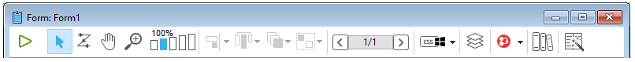

La barra de herramientas contiene los siguientes elementos:

| Icono                                            | Nombre                                               | Descripción                                                                                                                                                                                                                                                                                                                                                                                                               |
| ------------------------------------------------ | ---------------------------------------------------- | ------------------------------------------------------------------------------------------------------------------------------------------------------------------------------------------------------------------------------------------------------------------------------------------------------------------------------------------------------------------------------------------------------------------------- |
|          | Ejecutar el formulario                               | Se utiliza para probar la ejecución del formulario. Al presionar este botón, 4D abre una nueva ventana y muestra el formulario en su contexto (lista de registros para un formulario lista y página de registro actual para un formulario detallado). El formulario se ejecuta en el proceso principal.                                                |
|        | [Selection tool](#selecting-objects)                 | Allows selecting, moving and resizing form objects.<p>**Note**: When an object of the Text or Group Box type is selected, pressing the **Enter** key lets you switch to editing mode.</p>                                                                                                                                                                                 |
|           | [Entry order](#data-entry-order)                     | Pasa al modo "Orden de entrada", donde es posible ver y cambiar el orden de entrada actual del formulario. Tenga en cuenta que las marcas permiten ver el orden de entrada actual, sin dejar de trabajar en el formulario.                                                                                                                                                                |
|           | [Moving](#moving-objects)                            | Pasa al modo " Desplazamiento ", en el que es posible llegar rápidamente a cualquier parte del formulario utilizando la función de arrastrar y soltar en la ventana. El cursor toma la forma de una mano. Este modo de navegación es especialmente útil cuando se hace zoom en el formulario.                                                                             |
|             | [Zoom](#zoom)                                        | Permite modificar la escala de visualización del formulario (100% por defecto). Puede pasar al modo "Zoom" haciendo clic en la lupa o pulsando directamente en la barra correspondiente a la escala deseada. Esta función se detalla en la sección anterior.                                                                                           |
|        | [Alignment](#aligning-objects)                       | Este botón está asociado a un menú que permite alinear los objetos en el formulario. It is enabled (or not) depending on the objects selected.<p>Available only with CSS Preview None</p>                                                                                                                                                                              |
|     | [Distribution](#distributing-objects)                | Este botón está asociado a un menú que permite repartir los objetos en el formulario. It is enabled (or not) depending on the objects selected.<p>Available only with CSS Preview None</p>                                                                                                                                                                             |
|            | [Level](#layering-objects)                           | Este botón está asociado a un menú que permite cambiar el nivel de los objetos en el formulario. Se activa (o no) en función de los objetos seleccionados.                                                                                                                                                                                                             |
|            | [Group/Ungroup](#grouping-objects)                   | Este botón está asociado a un menú que permite agrupar y desagrupar la selección de objetos del formulario. Se activa (o no) en función de los objetos seleccionados.                                                                                                                                                                                                  |
|    | [Display and page management](forms.html#form-pages) | Esta área permite pasar de una página de formulario a otra y añadir páginas. Para navegar entre las páginas del formulario, haga clic en los botones de flecha o en el área central y elija la página que desea visualizar en el menú que aparece. Si pulsa el botón flecha derecha mientras se muestra la última página del formulario, 4D le permite añadir una página. |
|   | [CSS Preview](#css-preview)                          | Este botón se utiliza para seleccionar el modo CSS a utilizar.                                                                                                                                                                                                                                                                                                                                            |
|            | [Managing views](#views)                             | Este botón muestra u oculta la paleta de vistas. Esta función se detalla en la sección Utilizar las vistas de objeto.                                                                                                                                                                                                                                                                     |
|         | [Displaying shields](#shields)                       | Cada clic en este botón provoca la visualización sucesiva de todos los tipos de escudos de formulario. El botón también está vinculado a un menú que permite seleccionar directamente el tipo de escudo a mostrar.                                                                                                                                                                        |
|          | [Preconfigured object library](objectLibrary.html)   | Este botón muestra la librería de objetos preconfigurada que ofrece numerosos objetos con ciertas propiedades que han sido predefinidas.                                                                                                                                                                                                                                                                  |
|  | [List Box Builder](#list-box-builder)                | Este botón crea nuevos list box de tipo selección de entidades.                                                                                                                                                                                                                                                                                                                                           |
|     | [Insert fields](#insert-fields)                      | Este botón inserta en el formulario todos los campos (excepto los de tipo objeto y blob) de la tabla del formulario, junto con sus etiquetas y respetando las normas de la interfaz.                                                                                                                                                                                                   |

### Barra de objetos

La barra de objetos contiene todos los objetos activos e inactivos que se pueden utilizar en los formularios 4D. Algunos objetos se agrupan por temas. Cada tema incluye varias alternativas entre las que puede elegir. Cuando la barra de objetos tiene el foco, puede seleccionar los botones utilizando las teclas del teclado. La siguiente tabla describe los grupos de objetos disponibles y su tecla de acceso directo asociada.

| Botón                                      | Agrupar                                                                                                                                                                                                                                                   | Llave |
| ------------------------------------------ | --------------------------------------------------------------------------------------------------------------------------------------------------------------------------------------------------------------------------------------------------------- | :---: |
|       | [Text](FormObjects/text.md) / [Group Box](FormObjects/groupBox.md)                                                                                                                                                                                        |   T   |
| 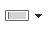     | [Input](FormObjects/input_overview.md)                                                                                                                                                                                                                    |   F   |
| 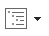   | [Hierarchical List](FormObjects/list_overview.md) / [List Box](FormObjects/listbox_overview.md)                                                                                                                                                           |   L   |
|      | [Combo Box](FormObjects/comboBox_overview.md) / [Drop-down List](FormObjects/dropdownList_Overview.md) / [Picture Pop-up Menu](FormObjects/picturePopupMenu_overview.md)                                                                                  |   P   |
|     | [Button](FormObjects/button_overview.md) / [Picture Button](FormObjects/pictureButton_overview.md) / [Button Grid](FormObjects/buttonGrid_overview.md)                                                                                                    |   B   |
|      | [Radio Button](FormObjects/radio_overview.md)                                                                                                                                                                                                             |   R   |
|   | [Check Box](FormObjects/checkbox_overview.md)                                                                                                                                                                                                             |   C   |
| 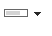 | [Progress Indicator](FormObjects/progressIndicator.md) / [Ruler](FormObjects/ruler.md) / [Stepper](FormObjects/stepper.md) / [Spinner](FormObjects/spinner.md)                                                                                            |   I   |
|  | [Rectangle](FormObjects/shapes_overview.md#rectangle) / [Line](FormObjects/shapes_overview.md#line) / [Oval](FormObjects/shapes_overview.md#oval)                                                                                                         |   S   |
|   | [Splitter](FormObjects/splitters.md) / [Tab Control](FormObjects/tabControl.md)                                                                                                                                                                           |   D   |
|     | [Plug-in Area](FormObjects/pluginArea_overview.md) / [Subform](FormObjects/subform_overview.md) / [Web Area](FormObjects/webArea_overview.md) / [4D Write Pro](FormObjects/writeProArea_overview.md) / [4D View Pro](FormObjects/viewProArea_overview.md) |   X   |

Para dibujar un tipo de objeto, seleccione el botón correspondiente y luego trace el objeto en el formulario. Después de crear un objeto, puede modificar su tipo utilizando la lista de propiedades. Hold down the **Shift** key as you draw to constrain the object to a regular shape. Las líneas se limitan a horizontales, 45° o verticales, los rectángulos se limitan a cuadrados y los óvalos se limitan a círculos.

La variante actual del tema es el objeto que se insertará en el formulario. Al hacer clic en la parte derecha de un botón, se accede al menú de variantes:


Puede presionar dos veces el botón para que permanezca seleccionado incluso después de haber trazado un objeto en el formulario (selección continua). Esta función facilita la creación de varios objetos sucesivos del mismo tipo. Para cancelar una selección continua, haga clic en otro objeto o herramienta.

### Lista de propiedades

Tanto los formularios como los objetos de formulario tienen propiedades que controlan el acceso al formulario, la apariencia del mismo y el comportamiento del formulario cuando se utiliza. Las propiedades del formulario incluyen, por ejemplo, el nombre del formulario, su barra de menú y su tamaño. Las propiedades de los objetos incluyen, por ejemplo, su nombre, sus dimensiones, su color de fondo y su fuente.

Puede visualizar y modificar las propiedades de los objetos y formularios utilizando la lista de propiedades. Muestra las propiedades del formulario o de los objetos en función de lo que se seleccione en la ventana del editor.

To display/hide the Property List, choose **Property List** from the **Form** menu or from the context menu of the Form editor. También puede mostrarlo haciendo doble clic en una área vacía del formulario.

#### Atajos

Puede utilizar los siguientes atajos en la Lista de propiedades:

- **Arrow key**s ↑ ↓: Used to go from one cell to another.
- **Arrow keys** ← →: Used to expand/collapse themes or enter edit mode.
- **PgUp** and **PgDn**: Used to scroll the Property List contents.
- **Home** and **End**: Used to scroll the Property List so that the first or last cell is displayed.
- **Ctrl+click** (Windows) or **Command+click** (macOS) on an event: Used to select/deselect every event in the list, according to the initial state of the event on which you clicked.
- **Ctrl+click** (Windows) or **Command+click** (macOS) on a theme label: Used to Collapse/Expand every theme in the list.
- **Ctrl+click** (Windows) or **Command+click** (macOS) on a property value displayed in **bold**: Resets the property to its default.

## Manipulación de objetos formulario

### Añadir objetos

Puede añadir objetos en los formularios de varias maneras:

- By drawing the object directly in the form after selecting its type in the object bar (see [Using the object bar](#using-the-object-bar))
- Arrastrando y soltando el objeto desde la barra de objetos
- By drag-and-drop or copy-paste operations on an object selected from the preconfigured [object library](objectLibrary.md),
- Arrastrando y soltando un objeto desde otro formulario,
- Arrastrando y soltando un objeto desde el Explorador (campos) o desde otros editores del modo Diseño (listas, imágenes, etc.)

Una vez insertado el objeto en el formulario, puede modificar sus características utilizando el editor de formularios.

Puede trabajar con dos tipos de objetos en sus formularios:

- **Static objects** (lines, frames, background pictures, etc.): These objects are generally used for setting the appearance of the form and its labels as well as for the graphic interface. Están disponibles en la barra de objetos del editor de formularios. You can also set their graphic attributes (size, color, font, etc.) and their resizing properties using the Property List. Los objetos estáticos no tienen variables asociadas como los objetos activos. Sin embargo, se pueden insertar objetos dinámicos en objetos estáticos.

- **Active objects**: These objects perform tasks or functions in the interface and can take many forms: fields, buttons, scrollable lists, etc. Cada objeto activo está asociado a un campo o a una variable.

### Seleccionar los objetos

Antes de poder realizar cualquier operación en un objeto (como cambiar el ancho de la línea o la fuente), debe seleccionar el objeto que desea modificar.

Para seleccionar un objeto utilizando la barra de herramientas:

1. Click the Arrow tool  in the toolbar.<p></p>

<p>Cuando se mueve el puntero en el área del formulario, se convierte en un puntero estándar con forma de flecha</p>.

2. Haga clic en el objeto que desea seleccionar. Resizing handles identify the selected object.<p>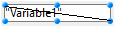</p>

Para seleccionar un objeto utilizando la Lista de propiedades:

1. Seleccione el nombre del objeto en la lista desplegable de objetos situada en la parte superior de la lista de propiedades. Con estos dos métodos, puede seleccionar un objeto que esté oculto por otros objetos o que se encuentre fuera del área visible de la ventana actual.
   To deselect an object, click outside the object’s boundary or **Shift+click** the object.

> \> It is also possible to select objects by double-clicking them in the result window of ""Find in design" operation.

### Selección de múltiples objetos

Es posible que desee realizar la misma operación en más de un objeto de un formulario, por ejemplo, para mover los objetos, alinearlos o cambiar su apariencia. 4D le permite seleccionar varios objetos al mismo tiempo. Hay varias formas de seleccionar varios objetos:

- Choose **Select All** from the Edit menu to select all the objects.
- Right-click on the object and choose the **Select Similar Objects** command in the context menu.
- Hold down the **Shift** key and click the objects you want to select.
- Comience en una ubicación fuera del grupo de objetos que desea seleccionar y arrastre un marco (a veces llamado rectángulo de selección) alrededor de los objetos. Al soltar el botón del ratón, si alguna parte de un objeto se encuentra dentro o toca los límites del rectángulo de selección, ese objeto queda seleccionado.
- Hold down the **Alt** key (Windows) or the **Option** key (macOS) and draw a marquee. Se selecciona todo objeto que esté completamente encerrado por el marco.

La imagen siguiente muestra el dibujo de un rectángulo para seleccionar dos objetos:

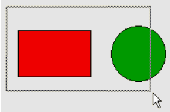

To deselect an object that is part of a set of selected objects, hold down the **Shift** key and click the object. Los demás objetos permanecen seleccionados. Para deseleccionar todos los objetos seleccionados, haga clic fuera de los límites de todos los objetos.

### Duplicar los objetos

Puede duplicar todo objeto de formulario, incluidos los objetos activos. Las copias de los objetos activos conservan todas las propiedades del objeto original, incluidos el nombre, el tipo, la acción estándar, el formato de visualización y el método objeto.

Puede duplicar un objeto directamente con la herramienta Duplicar de la paleta Herramientas o utilizar la caja de diálogo Duplicar varios para duplicar un objeto más de una vez. Además, a través de esta caja de diálogo, se puede definir la distancia entre dos copias.

Para duplicar uno o más objetos:

1. Seleccione el objeto u objetos que desea duplicar.
2. Choose **Duplicate** from the **Edit** menu. 4D crea una copia de cada objeto seleccionado y coloca la copia delante y justo al lado del original.
3. Mueva la copia (o las copias) a la ubicación deseada.
   Si vuelve a elegir el elemento de menú Duplicar, 4D crea otra copia de cada objeto y la mueve exactamente a la misma distancia y dirección de la primera copia. Si necesita distribuir copias del objeto a lo largo de una línea, debe utilizar el siguiente procedimiento. Duplique el objeto original, mueva la copia a otro lugar del formulario y luego duplique la copia. La segunda copia se coloca automáticamente en la misma posición que la primera copia tenía en relación con el objeto original. Las copias posteriores también se sitúan en la misma relación con sus originales. La siguiente figura explica el funcionamiento de la ubicación relativa de las copias:


#### Duplicar muchos

The "Duplicate Many" dialog box appears when you select one or more object(s) and choose the **Duplicate Many...** command from the **Object** menu.


- En el área superior, introduzca el número de columnas y líneas de objetos que desea obtener. Por ejemplo, si desea tres columnas y dos líneas de objetos, introduzca 3 en el área Columna(s) y 2 en el área Línea(s). Si desea tres nuevas copias horizontales de un objeto, introduzca 4 en el área Columna(s) y deje el valor por defecto, 1, en el área Línea(s).

- Para las líneas y columnas, defina el desplazamiento que desea aplicar a cada copia. El valor debe expresarse en puntos. It will be applied to each copy, or copies, in relation to the original object. For example, if you want to leave a vertical offset of 20 points between each object and the height of the source object is 50 points, enter 70 in the column’s “Offset” area.

- If you wish to create a matrix of variables, select the **Number Variables** option and select the direction in which the variables are to be numbered, either by line(s) or by column(s).
  Esta opción sólo se activa cuando el objeto seleccionado es una variable. For more information on this option, refer to **Duplicating on a matrix** in the _Design Reference_.

### Mover objetos

Puede mover todo gráfico u objeto activo del formulario, incluidos los campos y los objetos creados con una plantilla. Al mover un objeto, tiene las siguientes opciones:

- Mover el objeto arrastrándolo,
- Mover el objeto un píxel a la vez utilizando las teclas de flecha,
- Mover el objeto por pasos utilizando las teclas de flecha (pasos de 20 píxeles por defecto),

Al comenzar a arrastrar el objeto seleccionado, sus controles desaparecen. 4D muestra marcadores que indican la ubicación de los límites del objeto en las reglas para que pueda colocar el objeto exactamente donde lo quiere. Tenga cuidado de no arrastrar un mango. Al arrastrar un mango se cambia el tamaño del objeto. You can press the **Shift** key to carry out the move with a constraint.

When the [Magnetic Grid](#using-the-magnetic-grid) is on, objects are moved in stages indicating noticeable locations.

Para mover un objeto un píxel por píxel:

- Seleccione el objeto u objetos y utilice las teclas de flecha del teclado para mover el objeto. Cada vez que se presiona una tecla flecha, el objeto se mueve un píxel en la dirección de la flecha.

Mover un objeto por pasos:

- Select the object or objects you want to move  and hold down the **Shift** key and use the arrow keys to move the object by steps. Por defecto, los pasos son de 20 píxeles cada vez. Puede cambiar este valor en la página Formularios de las Preferencias.

### Agrupar objetos

4D le permite agrupar objetos para que pueda seleccionar, mover y modificar el grupo como un solo objeto. Los objetos agrupados conservan su posición en relación con los demás. Lo normal es agrupar un campo y su etiqueta, un botón invisible y su icono, etc.

Cuando se redimensiona un grupo, todos los objetos del grupo se redimensionan proporcionalmente (excepto las áreas de texto, que se redimensionan por pasos según el tamaño de sus fuentes).

Puede desagrupar un grupo de objetos para tratarlos de nuevo como objetos individuales.

Un objeto activo que ha sido agrupado debe ser desagrupado antes de poder acceder a sus propiedades o métodos. However, it is possible to select an object belonging to a group without degrouping the set: to do this, **Ctrl+click** (Windows) or **Command+click** (macOS) on the object (the group must be selected beforehand).

La agrupación sólo afecta a los objetos en el editor de formularios. Cuando se ejecuta el formulario, todos los objetos agrupados actúan como si estuvieran desagrupados.

> It is not possible to group objects belonging to different views and only those objects belonging to the current view can be grouped (see [Views](#views) ).

Para agrupar los objetos:

1. Seleccione los objetos que desea agrupar.
2. Choose **Group** from the Object menu. OR
   Click the Group button  in the toolbar of the Form editor:<p></p>
   4D marks the boundary of the newly grouped objects with handles. No hay marcas que delimiten ninguno de los objetos individuales del grupo. Ahora, al modificar el objeto agrupado, se modifican todos los objetos que componen el grupo.

Para desagrupar un grupo de objetos:

1. Seleccione el grupo de objetos que desea desagrupar.
2. Choose **Ungroup** from the **Object** menu.<p>OR</p><p>Click the **Ungroup** button (variant of the **Group** button) in the toolbar of the Form editor.</p><p>If **Ungroup** is dimmed, this means that the selected object is already separated into its simplest form.</p>4D marks the boundaries of the individual objects with handles.

### Alinear objetos

Puede alinear los objetos entre sí o mediante una rejilla invisible en el formulario.

- Cuando se alinea un objeto con otro, se puede alinear con la parte superior, inferior, lateral o con el centro horizontal o vertical del otro objeto. Puede alinear directamente una selección de objetos utilizando las herramientas de alineación o aplicar ajustes de alineación más avanzados utilizando el Asistente de Alineación. Esta última opción permite, por ejemplo, definir el objeto que se utilizará como referencia de posición y previsualizar la alineación en el formulario antes de aplicarla.
- Cuando se utiliza la rejilla invisible, cada objeto puede alinearse manualmente con otros basándose en posiciones "perceptibles" que se representan con líneas de puntos que aparecen cuando el objeto que se mueve se acerca a otros objetos.

#### Utilizar las herramientas de alineación directa

Las herramientas de alineación de la barra de herramientas y del submenú Alinear del menú Objeto permiten alinear rápidamente los objetos seleccionados.

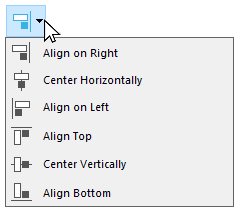

Cuando 4D alinea los objetos, deja un objeto seleccionado en su lugar y alinea el resto de los objetos a ese. Este objeto es el "ancla." Utiliza el objeto que está más lejos en la dirección de la alineación como ancla y alinea los otros objetos a ese objeto. Por ejemplo, si quiere realizar una alineación a la derecha en un conjunto de objetos, el objeto más a la derecha se utilizará como ancla.
La figura siguiente muestra objetos sin alineación, "alineados a la izquierda", "alineados horizontalmente por centros" y "alineados a la derecha":


#### Utilizar el asistente de alineación

El Asistente de Alineación permite realizar cualquier tipo de alineación y/o distribución de objetos.


To display this dialog box, select the objects you want to align then choose the **Alignment** command from the **Align** submenu in the **Object** menu or from the context menu of the editor.

- In the “Left/Right Alignment” and/or “Top/Bottom Alignment” areas, click the icon that corresponds to the alignment you want to perform.<p>The example area displays the results of your selection.</p>

- To perform an alignment that uses the standard anchor scheme, click **Preview** or **Apply**. En este caso, 4D utiliza el objeto que está más lejos en la dirección de la alineación como ancla y alinea los otros objetos a ese objeto. Por ejemplo, si quiere realizar una alineación a la derecha en un conjunto de objetos, el objeto más a la derecha se utilizará como ancla. OR:<p>To align objects to a specific object, select the **Align on** option and select the object to which you want the other objects to be aligned from the object list. In this case, the position of the reference object will not be altered.</p>

You can preview the results of the alignment by clicking the **Preview** button. Los objetos se alinean entonces en el editor de formularios, pero como la caja de diálogo permanece en el primer plano, aún puede cancelar o aplicar la alineación.

> Esta caja de diálogo le permite alinear y distribuir objetos en una sola operación. For more information on how to distribute objects, refer to [Distributing objects](#distributing-objects).

#### Utilizar la rejilla magnética

El editor de formularios dispone de una rejilla magnética virtual que puede ayudarle a colocar y alinear objetos en un formulario. La alineación magnética de los objetos se basa en su posición con respecto a los demás. La rejilla magnética sólo puede utilizarse cuando hay al menos dos objetos en el formulario.

Esto funciona de la siguiente manera: cuando mueve un objeto en el formulario, 4D indica las posibles ubicaciones de este objeto basándose en alineaciones notables con otros objetos formulario. Una alineación evidente se establece cada vez que:

- Horizontalmente, los bordes o centros de dos objetos coinciden,
- Verticalmente, los bordes de dos objetos coinciden.

Cuando esto ocurre, 4D coloca el objeto en el lugar y muestra una línea roja que indica la alineación notable que se ha tenido en cuenta:


En cuanto a la distribución de los objetos, 4D ofrece una distancia basada en los estándares de interfaz. Al igual que en el caso de la alineación magnética, las líneas rojas indican las diferencias notables una vez alcanzadas.

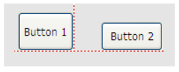

Este funcionamiento se aplica a todos los tipos de objetos de los formularios. The Magnetic Grid can be enabled or disabled at any time using the **Magnetic Grid** command in the **Form** menu or in the editor context menu. It is also possible to set the activation of this feature by default on the **Preferences** > **Forms** page (**Activate auto alignment by default** option). You can manually activate or deactivate the magnetic grid when an object is selected by pressing the **Ctrl** (Windows) or **Control** (macOS) key .

> La rejilla magnética también influye en el redimensionamiento manual de los objetos.

### Distribuir los objetos

Puede repartir los objetos de manera que queden dispuestos con el mismo espacio entre ellos. Para ello, puede distribuir los objetos utilizando las herramientas de distribución de la paleta Herramientas o el Asistente de alineación. Este último le permite alinear y distribuir objetos en una sola operación.

> When the [Magnetic Grid](#using-the-magnetic-grid) is on, a visual guide is also provided for distribution when an object is moved manually.

Para repartir los objetos con igual espacio:

1. Seleccione tres o más objetos y haga clic en la herramienta Distribuir correspondiente.

2. In the toolbar, click on the distribution tool that corresponds to the distribution you want to apply.<p></p> OR<p>Select a distribution menu command from the **Align** submenu in the **Object** menu or from the context menu of the editor.</p>4D distributes the objects accordingly. Los objetos se distribuyen utilizando la distancia a sus centros y se utiliza como referencia la mayor distancia entre dos objetos consecutivos.

Para distribuir objetos utilizando la caja de diálogo Alinear y Distribuir:

1. Seleccione los objetos que desea distribuir.

2. Choose the **Alignment** command from the **Align** submenu in the **Object** menu or from the context menu of the editor. The following dialog box appears:

3. In the Left/Right Alignment and/or Top/Bottom Alignment areas, click the standard distribution icon:  <p>(Standard horizontal distribution icon)</p>The example area displays the results of your selection.

4. To perform a distribution that uses the standard scheme, click **Preview** or _Apply_.<p>In this case 4D will perform a standard distribution, so that the objects are set out with an equal amount of space between them.</p>OR:<p>To execute a specific distribution, select the **Distribute** option (for example if you want to distribute the objects based on the distance to their right side). Esta opción actúa como un interruptor. If the Distribute check box is selected, the icons located below it perform a different function:</p>

- Horizontally, the icons correspond to the following distributions: evenly with respect to left sides, centers (hor.) and right sides of the selected objects.
- Vertically, the icons correspond to the following distributions: evenly with respect to top edges, centers (vert.) and bottom edges of the selected objects.

You can preview the actual result of your settings by clicking on the **Preview** button: the operation is carried out in the Form editor but the dialog box stays in the foreground. You can then **Cancel** or **Apply** the modifications.

> Esta caja de diálogo permite combinar la alineación y la distribución de objetos. For more information about alignment, refer to [Aligning objects](#aligning-objects).

### Gestionar los planos de los objetos

A veces tendrá que reorganizar los objetos que obstruyen la vista de otros objetos del formulario. Por ejemplo, puede tener un gráfico que desee que aparezca detrás de los campos en un formulario. 4D provides four menu items, **Move to Back**, **Move to Front**, **Up One Level** and **Down One Level** that let you “layer” objects on the form. Estas capas también determinan el orden de entrada por defecto (ver Modificación del orden de entrada de datos). La figura siguiente muestra objetos delante y detrás de otros objetos:


Para mover un objeto a otro plano, selecciónelo y elija:

- One of the **Move to Back**, **Move to Front**, **Up One Level** and **Down One Level** commands of the Object menu,
- One of the commands in the **Level>** submenu in the context menu of the editor,
- Uno de los comandos asociados al botón de gestión de los planos de la barra de herramientas.


> When several objects are superimposed, the **Ctrl+Shift+click** / **Command+Shift+click** shortcut can be used to select each object successively by going down a layer with each click.

Al ordenar los diferentes niveles, 4D siempre va del fondo al primer plano. Como resultado, el nivel anterior desplaza la selección de objetos de un plano hacia el fondo del formulario. El siguiente nivel mueve la selección un plano hacia el primer plano del formulario.

### Orden de entrada de los datos

The data entry order is the order in which fields, subforms, and other active objects are selected as you hit the **Tab** or the **Carriage return** key in an input form. It is possible to move through the form in the opposite direction (reverse data entry order) by pressing the **Shift+Tab** or **Shift+Carriage** return keys.

> You can change the entry order at runtime using the `FORM SET ENTRY ORDER` and `FORM GET ENTRY ORDER` commands.

Todos los objetos que soportan la propiedad enfocable se incluyen por defecto en el orden de entrada de datos.

Setting the entry order for a JSON form is done with the [`entryOrder`](properties_JSONref.md) property.

Si no especifica un orden de entrada personalizado, 4D utiliza por defecto el plano de los objetos para determinar el orden de entrada en el sentido "fondo hacia primer plano." El orden de entrada estándar corresponde, por tanto, al orden de creación de los objetos en el formulario.

En algunos formularios, se necesita definir un orden de entrada de datos personalizado. A continuación, por ejemplo, se han añadido campos adicionales relacionados con la dirección después de la creación del formulario. El orden de entrada estándar resultante se vuelve ilógico y obliga al usuario a introducir la información de forma extraña:

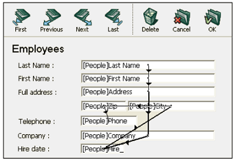

En casos como éste, un orden de entrada de datos personalizado le permite introducir la información en un orden más lógico:


#### Visualizar y modificar el orden de entrada de datos

Puede ver el orden de entrada actual utilizando marcas "Orden de entrada" o utilizando el modo "Orden de entrada". Sin embargo, sólo puede modificar el orden de entrada utilizando el modo "Orden de entrada".

Este párrafo describe la visualización y la modificación del orden de entrada en modo "Orden de entrada". For more information about viewing the entry order using shields, refer to [Using shields](#using-shields).

Para ver o cambiar el orden de entrada:

1. Choose **Entry Order** from the **Form** menu or click on the Entry Order button in the toolbar of the window:<p></p>

   El puntero se convierte en un puntero de orden de entrada y 4D dibuja una línea en el formulario mostrando el orden en que selecciona los objetos durante la entrada de datos. Ver y cambiar el orden de entrada de datos son las únicas acciones que puede realizar hasta que haga clic en cualquier herramienta de la paleta Herramientas.

2. To change the data entry order, position the pointer on an object in the form and, while holding down the mouse button, drag the pointer to the object you want next in the data entry order.<p></p>4D will adjust the entry order accordingly.

3. Repita el paso 2 tantas veces como sea necesario para establecer el orden de entrada de datos que desee.

4. When you are satisfied with the data entry order, click any unselected tool in the toolbar or choose **Entry Order** from the **Form** menu. 4D vuelve al modo de funcionamiento normal del editor de formularios.

> Sólo se muestra el orden de entrada de la página actual del formulario. If the form contains enterable objects on page 0 or coming from an inherited form, the default entry order is as follows: Objects from page 0 of the inherited form > Objects from page 1 of the inherited form > Objects from page 0 of the open form > Objects from the current page of the open form.

#### Utilizar un grupo de entrada

Cuando se cambia el orden de entrada, se puede seleccionar un grupo de objetos en el formulario para que el orden de entrada estándar se aplique a los objetos del grupo. Esto le permite definir fácilmente el orden de entrada para los formularios en los que los campos están separados en grupos o columnas.

Para crear un grupo de entrada:

1. Choose **Entry Order** from the _Form_ menu or click the  button in the toolbar.
2. Dibuje un rectángulo de selección alrededor de los objetos que desee agrupar para la entrada de datos.

Al soltar el botón del ratón, los objetos encerrados o tocados por el rectángulo siguen el orden de entrada por defecto. El orden de entrada de los otros objetos restantes se ajusta según sea necesario.

#### Excluir un objeto del orden de entrada

Por defecto, todos los objetos que soportan la propiedad enfocable se incluyen en el orden de entrada. Para excluir un objeto del orden de entrada:

1. Seleccione el modo de orden de entrada, y luego

2. **shift-click** on the object

3. **right-click** on the object and select **Remove from entry order** option from the context menu

## Vista previa del CSS

El editor de formularios le permite ver sus formularios con o sin valores CSS aplicados.

When [style sheets](createStylesheet.md) have been defined, forms (including inherited forms and subforms) are opened in the CSS Preview mode for your operating system by default.

### Seleccionando el modo de vista previa CSS

La barra de herramientas del editor de formularios ofrece un botón CSS para ver los objetos con estilo:


Seleccione uno de los siguientes modos de vista previa en el menú:

| Icono barra de herramientas             | Modo de vista previa CSS | Descripción                                                                                                                                                                  |
| --------------------------------------- | ------------------------ | ---------------------------------------------------------------------------------------------------------------------------------------------------------------------------- |
|   | Ninguno                  | No se aplican valores CSS en el formulario y no se muestran valores o iconos CSS en la lista de propiedades.                                                 |
|  | Windows                  | Los valores CSS para la plataforma Windows se aplican en el formulario. Los valores e iconos CSS que se muestran en la lista de propiedades. |
|  | macOS                    | Los valores CSS para la plataforma macOS se aplican en el formulario. Los valores e iconos CSS que se muestran en la lista de propiedades.   |

> Si se define un tamaño de fuente demasiado grande para un objeto en una hoja de estilo o JSON, el objeto se renderizará automáticamente para acomodar la fuente, sin embargo el tamaño del objeto no se modificará.

The CSS preview mode reflects the priority order applied to style sheets vs JSON attributes as defined in the [JSON vs Style Sheet](stylesheets.html#json-vs-style-sheet) section.

Una vez seleccionado el modo de vista previa CSS, los objetos se muestran automáticamente con los estilos definidos en una hoja de estilo (si la hay).

> Al copiar o duplicar objetos, sólo se copian las referencias CSS (si las hay) y los valores JSON.

### Soporte CSS en la Lista de Propiedades

En el modo Vista Previa CSS, si el valor de un atributo ha sido definido en una hoja de estilo, el nombre del atributo aparecerá con un icono CSS junto a él en la Lista de Propiedades. Por ejemplo, los valores de los atributos definidos en esta hoja de estilo:

```4d
.myButton {
font-family: comic sans;
font-size: 14;
stroke: #800080;
}
```

se muestran con un icono CSS en la lista de propiedades:


An attribute value defined in a style sheet can be overridden in the JSON form description (except if the CSS includes the `!important` declaration, see below). In this case, the Property List displays the JSON form value in **bold**. You can reset the value to its style sheet definition with the **Ctrl + click** (Windows) or **Command + click** (macOs) shortcuts.

> If an attribute has been defined with the `!important` declaration for a group, an object within a group, or any object within a selection of multiple objects, that attribute value is locked and cannot be changed in the Property List.

#### Lista de propiedades de iconos CSS

| Icono                                         | Descripción                                                                                                                                                                     |
| --------------------------------------------- | ------------------------------------------------------------------------------------------------------------------------------------------------------------------------------- |
|       | Indica que un valor de atributo ha sido definido en una hoja de estilo                                                                                                          |
|  | Indicates that an attribute value has been defined in a style sheet with the `!important` declaration                                                                           |
|  | Se muestra cuando un valor de atributo definido en una hoja de estilo para al menos un elemento de un grupo o una selección de varios objetos es diferente de los demás objetos |

## Creación de list box

You can create new entity selection list boxes quickly with the **List box builder**. El nuevo list box puede ser utilizado inmediatamente o puede ser editado a través del Editor de formularios.

El generador de list box le permite crear y llenar los list box de tipo selección de entidades en unas pocas y sencillas operaciones.

### Utilización del generador de list box

1. En la barra de herramientas del Editor de formularios, haga clic en el icono del generador de list box:

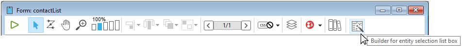

Se muestra el generador de list box:


2. Select a table from the **Table** dropdown list:


3. Select the fields for the list box in the **Fields** area:


Por defecto, se seleccionan todos los campos. You can select or deselect fields individually or use **Ctrl+click** (Windows) or **Cmd+click** (macOS) to select or deselect them all at once.

Puede cambiar el orden de los campos arrastrándolos y soltándolos.

4. La expresión para llenar las líneas del list box a partir de la selección de la entidad se llena previamente:


Esta expresión puede modificarse si es necesario.

5. Clicking on the **Copy** button will copy the expression for loading all records into memory:


6. Click the the **Build widget** button to create the list box.


El list box final:

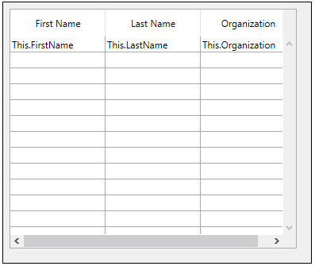

## Insertar campos

The **Insert fields** button inserts all fields (except object and blob type fields) of the form table in the form, along with their labels and with respect to interface standards. Este asistente es un atajo para diseñar formularios de entrada básicos o formularios listados.

The **Insert fields** button is only available with table forms.

El diseño del formulario resultante depende del tipo de formulario:

- **Detail form**: clicking on the **Insert fields** button generates a form with a page design:

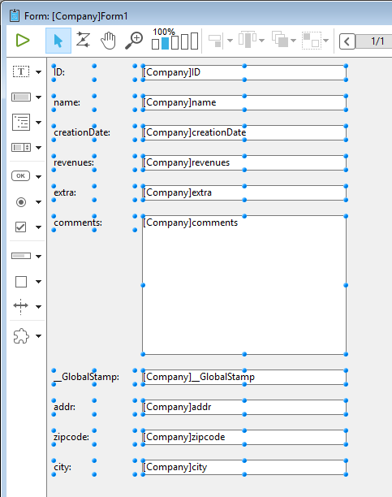

- **List form**: clicking on the **Insert fields** button generates a list form design with fields organized on a single line and area markers:


## Marcas

El editor de formularios 4D utiliza marcas para facilitar la visualización de las propiedades de los objetos. Puede encontrarlos en la barra de herramientas del formulario:


This function works as follows: Each shield is associated with a property (for example, **Views**, which means the object “is in the current view”). Al activar una marca, 4D muestra un pequeño icono (marca) en la parte superior izquierda de cada objeto del formulario donde se aplica la propiedad.


### Utilizar marcas

To activate a shield, click the _Shield_ icon from the toolbar until the desired shield is selected. También puede hacer clic en la parte derecha del botón y seleccionar el tipo de marca que desea mostrar directamente en el menú asociado:

If you don't want to display shields, select **No Shields** in the selection menu.

> La <a href="#antes-del-comienzo">vista actual</a> no se puede ocultar.

### Descripciones de marcas

A continuación se describe cada tipo de escudo:

| Icono                                           | Nombre                          | Se muestra...                                                                                                                                                          |
| ----------------------------------------------- | ------------------------------- | ---------------------------------------------------------------------------------------------------------------------------------------------------------------------------------------------------------------------- |
|    | Método objeto                   | Para los objetos con un método objeto asociado                                                                                                                                                                         |
|  | Acción estándar                 | Para los objetos con una acción estándar asociada                                                                                                                                                                      |
|        | Redimensionamiento              | Para los objetos con al menos una propiedad de redimensionamiento, indica la combinación de propiedades actuales                                                                                                       |
|      | Orden de entrada                | En el caso de los objetos editables, indica el número de orden de entrada                                                                                                                                              |
|      | Vista actual                    | Para todos los objetos de la vista actual                                                                                                                                                                              |
|       | [Style Sheet](stylesheets.html) | Para objetos con uno o más valores de atributos reemplazados por una hoja de estilo.                                                                                                                   |
|          | Filtro                          | Para los objetos introducibles con un filtro de entrada asociado                                                                                                                                                       |
|         | Mensaje de ayuda                | Para los objetos con un mensaje de ayuda asociado                                                                                                                                                                      |
|       | Localizado                      | Para los objetos cuya etiqueta proviene de una referencia (etiqueta que empieza por ":"). La referencia puede ser de tipo recurso (STR#) o XLIFF |
|       | Sin marcas                      | No aparecen marcas                                                                                                                                                                                                     |

## Vistas

El editor de formularios de 4D le permite crear formularios complejos distribuyendo los objetos formulario entre distintas vistas que pueden ocultarse o mostrarse según sea necesario.

Por ejemplo, puede distribuir los objetos según su tipo (campos, variables, objetos estáticos, etc.). Todo tipo de objeto formulario, incluidos los subformularios y las áreas de plug-in, puede incluirse en las vistas.

No hay límite en el número de vistas por formulario. Puedes crear tantas vistas diferentes como necesite. Además, cada vista puede mostrarse, ocultarse y/o bloquearse.

La gestión de las vistas se realiza a través de la paleta de vistas.

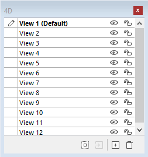

### Acceder a la paleta de vistas

Hay tres formas de acceder a la paleta de vistas:

- **Toolbar**: Click on the Views icon in the Form Editor toolbar. (Este icono aparece en gris cuando al menos un objeto pertenece a una vista distinta de la vista por defecto.)

|                  Sólo vista por defecto                 |                 Con vistas adicionales                |
| :-----------------------------------------------------: | :---------------------------------------------------: |
|  |  |

- **Context menu** (form or object): Right-click anywhere in the Form Editor or an object, and select **Current View**


The current view is indicated with a check mark (_e.g._, "Work Address" in the image above)

- **Form menu**: Click on the **Form** menu and select **View List**

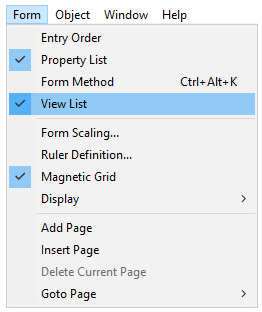

### Antes de comenzar

Aquí hay algunas cosas importantes que hay que saber antes de empezar a trabajar con vistas:

- **Context of use**: Views are a purely graphic tool which can only be used in the Form Editor; you cannot access views programmatically or in the Application environment.

- **Views and pages**: Objects of the same view can belong to different form pages; only objects of the current page (and of page 0 if it is visible) can be displayed, regardless of the view configuration.

- **Views and levels**: Views are independent of object levels; there is no display hierarchy among different views.

- **Views and groups**: Only objects belonging to the current view can be grouped.

- **Current and Default** views: The Default view is the first view of a form and cannot be deleted; the Current view is the view that is being edited and the name is displayed in bold text.

### Gestión de vistas

#### Crear vistas

Todo objeto creado en un formulario se coloca en la primera vista ("Vista 1") del formulario. The first view is **always** the default view, indicated by (Default) after the name. The view's name can be changed (see [Renaming views](#renaming-views)), however it remains the default view.


Hay dos maneras de añadir vistas adicionales:

- Click on the **Add a new view** button at the bottom of the View palette:


- Right-click on an existing view and select **Insert view**:


No hay límite en el número de vistas.

#### Renombrar vistas

Por defecto las vistas se nombran como "Vista" + el número de la vista, sin embargo puede cambiar estos nombres para mejorar la legibilidad y adaptarse mejor a sus necesidades.

Para cambiar el nombre de una vista, puede utilizar:

- Hacer doble clic directamente en el nombre de la vista (la vista seleccionada en este caso). El nombre se convierte entonces en editable:


- Haga clic derecho en el nombre de la vista. El nombre se convierte entonces en editable:


#### Reordenar las vistas

Puede cambiar el orden de visualización de las vistas haciendo arrastrar y soltar dentro de la paleta de vistas.

Tenga en cuenta que la vista por defecto no cambia:


#### Eliminar vistas

Para cambiar el nombre de una vista, puede utilizar:

- Click on the **Delete the selected view** button at the bottom of the View palette:


- Right-click on the view name, and select **Delete View**:


> La <a href="#antes-del-comienzo">vista actual</a> no se puede bloquear.

### Utilización de las vistas

Una vez creadas las vistas, puede utilizar la paleta de vistas para:

- Añadir un objeto a las vistas,
- Mover los objetos de una vista a otra,
- Seleccionar todos los objetos de la misma vista con un solo clic,
- Mostrar u ocultar objetos para cada vista,
- Bloquear los objetos de una vista.

#### Añadir los objetos a las vistas

Un objeto sólo puede pertenecer a una única vista.

To create an object in another view, simply select the view in the View palette (prior to creating the object) by clicking its name (an Edit icon is displayed for the [Current view](#before-you-begin) and the name appears in bold text):

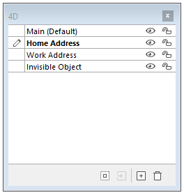

#### Mover objetos entre vistas

También es posible mover uno o más objetos de una vista a otra. En el formulario, seleccione el o los objetos cuya vista desea modificar. La lista de vistas indica, utilizando un símbolo, la vista a la que pertenece la selección:


> La selección puede contener varios objetos pertenecientes a diferentes vistas.

Simply select the destination view, right-click, and select **Move to**:

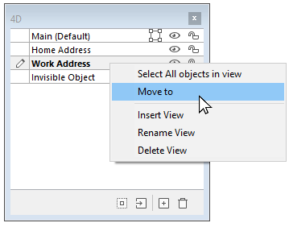

O

Select the destination view of the selection and click **Move to** button at the bottom of the View palette:


La selección se coloca entonces en la nueva vista:


También puede mover un objeto a otra vista a través del menú contextual del objeto. Right-click on the object, select **Move to view**, and select a view from the list of available views:


> The [Current view](#before-you-begin) is shown in bold text.

#### Seleccionar todos los objetos de una vista

Puede seleccionar todos los objetos que pertenecen a la misma vista en la página actual del formulario. Esta función es útil para aplicar cambios globales a un conjunto de objetos.

To do this, right-click on the view in which you wish to select all the objects, click on **Select All**:


También puede utilizar el botón situado en la parte inferior de la paleta de vistas:

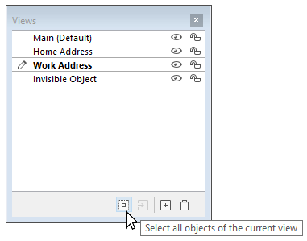

#### Mostrar u ocultar los objetos de una vista

Puede mostrar u ocultar objetos pertenecientes a una vista en cualquier momento en la página actual del formulario. De este modo, podrá centrarse en determinados objetos al editar el formulario, por ejemplo.

By default, all views are shown, as indicated by the _Show/Hide_ icon:


To hide a view, click the _Show/Hide_ icon. Entonces se atenúa y los objetos de la vista correspondiente dejan de mostrarse en el formulario:


> The [Current view](#before-you-begin) cannot be hidden.

To show a view that is hidden, simply select it or click on the _Show/Hide_ icon for that view.

#### Bloquear los objetos de una vista

Puede bloquear los objetos de una vista. Esto impide que se seleccionen, modifiquen o eliminen del formulario. Once locked, an object cannot be selected by a click, a rectangle, or the **Select Similar Objects** command of the context menu. Esta función es útil para evitar errores de manipulación.

By default, all views are unlocked, as indicated by the _Lock/Unlock_ icon next to each view:


To lock the objects of a view, click the _Lock/Unlock_ icon. El candado está cerrado, lo que significa que la vista está bloqueada:


> The [Current view](#before-you-begin) cannot be locked.

To unlock a view that is locked, simply select it or click on the _Lock/Unlock_ icon for that view.

## Zoom

Puede hacer zoom en el formulario actual. Pase al modo "Zoom" haciendo clic en el icono de la lupa o haciendo clic directamente en la barra de porcentaje deseada (50%, 100%, 200%, 400% y 800%):


- Al hacer clic en la lupa, el cursor se convierte en una lupa. A continuación, puede hacer clic en el formulario para aumentar la visualización o mantener presionada la tecla Mayús y hacer clic para reducir el porcentaje de visualización.
- Al hacer clic en una barra de porcentaje, la visualización se modifica inmediatamente.

En el modo Zoom, todas las funciones del editor de formularios siguen estando disponibles(\*).

(\*) Por razones técnicas, no es posible seleccionar los elementos del list box (encabezados, columnas, pies de página) cuando el editor de formularios está en modo Zoom.
