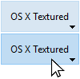
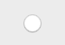

Un botón es un objeto activo al que se le puede asignar una acción (*por ejemplo*, una tarea de base de datos o una función de interfaz) para que la realice cuando un usuario haga clic en él.


Los botones pueden cumplir diversas funciones, según su estilo y la acción que se les asigne. Por ejemplo, los botones pueden guiar al usuario a través de un cuestionario o formulario para que lo llene, o para que tome decisiones. Dependiendo de sus propiedades, un botón puede estar diseñado para ser presionado una sola vez y ejecutar un comando, mientras que otros pueden requerir que el usuario haga clic más de una vez para recibir el resultado deseado.

## Gestión de botones

Las acciones asignadas a los botones pueden provenir de [acciones estándar](properties_Action.md#standard-action) o de métodos de objetos personalizados. Algunos ejemplos de acciones típicas son permitir al usuario aceptar, cancelar o eliminar registros, copiar o pegar datos, pasar de una página a otra en un formulario de varias páginas, abrir, eliminar o añadir registros en un subformulario, manejar los atributos de las fuentes en las áreas de texto, etc.

Los botones con acciones estándar se atenúan cuando es apropiado durante la ejecución del formulario. Por ejemplo, si se muestra el primer registro de una tabla, un botón con la acción estándar `firstRecord` aparecería atenuado.

Si desea que un botón realice una acción que no está disponible como acción estándar, deje el campo de acción estándar vacío y escriba un método de objeto para especificar la acción del botón. Para más información sobre los métodos de objetos y cómo crearlos y asociarlos, ver [Uso de los métodos objeto](https://doc.4d.com/4Dv17R5/4D/17-R5/Using-object-methods.300-4163733.en.html).
Normalmente, se activaría el evento `On Clicked` y el método se ejecutaría sólo cuando se presiona el botón. Puede asociar un método a cualquier botón.

La [variable](properties_Object.md#variable-or-expression) asociada a un botón se define automáticamente a **0** cuando el formulario se ejecuta por primera vez en modo Diseño o Aplicación. Cuando el usuario hace clic en un botón, su variable se define como **1**.

> A un botón se le puede asignar tanto una acción estándar como un método. En este caso, si el botón no está desactivado por la acción estándar, el método se ejecuta antes de la acción estándar.

## Estilos de botón

Los estilos de botón controlan la apariencia general de un botón, así como sus propiedades disponibles. Es posible aplicar diferentes estilos predefinidos a los botones o asociarles menús emergentes. Se puede obtener un gran número de variaciones combinando estas propiedades/comportamientos.

Con la excepción de las [propiedades-disponibles](#supported-properties), muchos objetos botón son *estructuralmente* idénticos. La diferencia está en el tratamiento de sus variables asociadas.

4D ofrece botones en los siguientes estilos predefinidos:

### Clásico

El estilo de botón Clásico es un botón sistema estándar (*es decir,*, un rectángulo con una etiqueta descriptiva) que ejecuta el código cuando el usuario hace clic en él.


Por defecto, el estilo Clásico tiene un fondo gris claro con una etiqueta en el centro. Cuando el cursor pasa por encima del estilo de botón Clásico, el borde y el color de fondo cambian para demostrar que tiene el foco. Además de iniciar la ejecución del código, el estilo del botón Clásico imita un botón mecánico cambiando rápidamente el color de fondo al ser presionado.

#### Ejemplo JSON:

```4d

	"myButton": {
		"type": "button",//define el tipo del objeto
		"style":"regular", //define el estilo del botón
		"defaultButton":"true"//define el botón como la opción predeterminada
		"text": "OK",//texto a aparecer en el botón
		"action": "Cancelar", //Acción a ejecutar
		"left": 60,///Posición izquierda en el formulario 
		"top": 160, ///Posición superior en el formulario 
	  	"width": 100, //ancho del botón
		"width": 20 //alto del botón
}
```

Sólo los estilos Clásico y Plano ofrecen la propiedad [Botón por defecto](properties_Appearance.md#default-button).

### Plano

El estilo de botón Plano es un botón sistema estándar (\*es decir, \*, un rectángulo con una etiqueta descriptiva) que ejecuta código cuando un usuario hace clic en él.


Por defecto, el estilo Plano tiene un fondo blanco con una etiqueta en el centro, esquinas redondeadas y una apariencia minimalista. El estilo gráfico del botón Flat es especialmente útil para los formularios a imprimir.

#### Ejemplo JSON:

```4d

	"myButton": {
                "type": "button",	
                "style":"flat",	
                "defaultButton":"true"	
                "text": "OK",	
                "action": "Cancel", 
                "left": 60,			
                "top": 160,			
                "width": 100,	
                "height": 20	
                }
```

Sólo los estilos Clásico y Plano ofrecen la propiedad [Botón por defecto](properties_Appearance.md#default-button).

### Toolbar (Barra de herramientas)

El estilo de botón de la barra de herramientas está destinado principalmente a integrarse en una barra de herramientas. Incluye la opción de añadir un menú emergente (indicado por un triángulo invertido) que generalmente se utiliza para mostrar opciones adicionales para que el usuario las seleccione.

Por defecto, el estilo Barra de herramientas tiene un fondo transparente con una etiqueta en el centro. La apariencia del botón puede ser diferente cuando el cursor pasa por encima de él dependiendo del sistema operativo:

- *Windows* - el botón se resalta cuando utiliza la propiedad "Con menú emergente", se muestra un triángulo a la derecha y en el centro del botón.


- *macOS* - el resalte del botón nunca aparece. Cuando utiliza la propiedad "Con menú emergente", aparece un triángulo a la derecha y en la parte inferior del botón.

#### Ejemplo JSON:

```4d
	"myButton": {
                "type": "button",	
                "style":"toolbar",	
                "text": "OK",		
                "popupPlacement":"separated"	
                "action": "Cancel", 	
                "left": 60,				
                "top": 160,				
                "width": 100,			
                "height": 20		
                }
```

### Bevel

El estilo de botón Bisel combina la apariencia del estilo [Clásico](#regular) (*es decir*, un rectángulo con una etiqueta descriptiva) con la opción de propiedad del menú emergente del estilo [Barra de herramientas](#toolbar).

Por defecto, el estilo Bevel tiene un fondo gris claro con una etiqueta en el centro. La apariencia del botón puede ser diferente cuando el cursor pasa por encima de él dependiendo del sistema operativo:

- *Windows* - el botón está resaltado. Cuando utiliza la propiedad "Con menú emergente", aparece un triángulo a la derecha y en el centro del botón.


- *macOS* - el resalte del botón nunca aparece. Cuando utiliza la propiedad "Con menú emergente", aparece un triángulo a la derecha y en la parte inferior del botón.

#### Ejemplo JSON:

```4d
	"myButton": {
                "type": "button",
                "style":"bevel",	
                "text": "OK",		
                "popupPlacement":"linked"	
                "action": "Cancel", 
                "left": 60,		
                "top": 160,		
                "width": 100,	
                "height": 20	
                }
```

### Bevel redondeado

El estilo de botón Bevel redondeado es casi idéntico al estilo [Bevel](#bevel), excepto que, dependiendo del sistema operativo, las esquinas del botón pueden ser redondeadas. Al igual que el estilo Bevel, el estilo Bevel Redondeado combina la apariencia del estilo [Clásico](#regular) con la opción de propiedad del menú emergente del estilo [Barra de herramientas](#toolbar).

Por defecto, el estilo Bevel Redondeado tiene un fondo gris claro con una etiqueta en el centro. La apariencia del botón puede ser diferente cuando el cursor pasa por encima de él dependiendo del sistema operativo:

- *Windows* - el botón es idéntico al estilo Bevel. Cuando utiliza la propiedad "Con menú emergente", aparece un triángulo a la derecha y en el centro del botón.


- *macOS* - las esquinas del botón están redondeadas. Cuando utiliza la propiedad "Con menú emergente", aparece un triángulo a la derecha y en la parte inferior del botón.

#### Ejemplo JSON:

```4d
	"myButton": {
                "type": "button",
                "style":"roundedBevel",	
                "text": "OK",	
                "popupPlacement":"none"	/
                "action": "Cancel", 
                "left": 60,			
                "top": 160,	
                "width": 100,	
                "height": 20	
                }
```

### OS X Gradient

El estilo del botón OS X Gradient es casi idéntico al estilo [Bevel](#bevel). Al igual que el estilo Bevel, el estilo OS X Gradient combina la apariencia del estilo [Clásico](#regular) y del estilo [Barra de herramientas](#toolbar).

Por defecto, el estilo OS X Gradient tiene un fondo gris claro con una etiqueta en el centro. La apariencia del botón puede ser diferente cuando el cursor pasa por encima de él dependiendo del sistema operativo:

- *Windows* - el botón es idéntico al estilo Bevel. Cuando utiliza la propiedad "Con menú emergente", aparece un triángulo a la derecha del botón.


- *macOS* - el botón se muestra como un botón de dos tonos. Cuando utiliza la propiedad "Con menú emergente", aparece un triángulo a la derecha y en la parte inferior del botón.

#### Ejemplo JSON:

```4d
	"myButton": {
                "type": "button",	
                "style":"gradientBevel",
                "text": "OK",	
                "popupPlacement":"linked"
                "action": "Cancel", 	
                "left": 60,		
                "top": 160,	
                "width": 100,	
                "height": 20	
                }
```

### OS X Texturizado

El estilo de botón OS X Textured es casi idéntico al estilo [Bevel](#bevel) pero con un tamaño menor (el tamaño máximo es el de un botón de sistema estándar de macOS). Al igual que el estilo Bevel, el estilo OS X Textured combina la apariencia del estilo [Clásico](#regular) y del estilo [Barra de herramientas](#toolbar).

Por defecto, el estilo OS X Textured aparece como:

- *Windows* - un botón sistema estándar con un fondo gris claro con una etiqueta en el centro. Tiene la particularidad de ser transparente en Vista.



- *macOS* - - un botón sistema estándar que muestra un cambio de color de gris claro a gris oscuro. Su altura está predefinida: no es posible ampliarla o reducirla.

#### Ejemplo JSON:

```4d
	"myButton": {
                "type": "button",	
                "style":"texturedBevel",	
                "text": "OK",	
                "popupPlacement":"separated"	
                "action": "Cancel", 
                "left": 60,			
                "top": 160,		
                "width": 100,	
                "height": 20	
                }
```

### Office XP

El estilo de botón Office XP combina la apariencia del estilo [Clásico](#regular) y del estilo [Barra de herramientas](#toolbar).

Los colores (resaltado y fondo) de un botón con el estilo Office XP se basan en los colores del sistema. La apariencia del botón puede ser diferente cuando el cursor pasa por encima de él dependiendo del sistema operativo:

- *Windows* - su fondo sólo aparece cuando el ratón pasa por encima.


- *macOS* - su fondo se muestra siempre.

#### Ejemplo JSON:

```4d
	"myButton": {
                "type": "button",	
                "style":"office",
                "text": "OK",
                "popupPlacement":"none"	
                "action": "Cancel", 
                "left": 60,		
                "top": 160,	
                "width": 100,
                "height": 20	
                }
```

### Ayuda

El estilo del botón Ayuda puede utilizarse para mostrar un botón de ayuda estándar del sistema. Por defecto, el estilo Ayuda se muestra como un signo de interrogación dentro de un círculo.


#### Ejemplo JSON:

```4d
	"myButton": {
                "type": "button",
                "style":"help",		
                "text": "OK",	
                "dropping": "custom", 
                "left": 60,	
                "top": 160,		
                "width": 100,	
                "height": 20	
                }
```

> El estilo Ayuda no admite las propiedades básicas [Número de estados](properties_TextAndPicture.md#number-of-states), [Ruta de acceso a la imagen](properties_TextAndPicture.md#picture-pathname) y [Posición Título/Imagen](properties_TextAndPicture.md#titlepicture-position).

### Círculo

El estilo de botón Círculo aparece como un botón sistema circular. Este estilo de botón está diseñado para macOS.



En Windows, es idéntico al estilo "Ninguno" (no se tiene en cuenta el círculo del fondo).

#### Ejemplo JSON:

```
	"myButton": {
                "type": "button",	
                "style":"circular",	
                "text": "OK",	
                "dropping": "custom", 
                "left": 60,	
                "top": 160,		
                "width": 100,
                "height": 20	
                }
```

### Personalizado

El estilo de botón Personalizado acepta una imagen de fondo personalizada y permite gestionar parámetros adicionales como el margen y el desplazamiento del icono.


#### Ejemplo JSON:

```code
	"myButton": {
                "type": "button",	
                "style":"custom",	
                "text": "",	
                "customBackgroundPicture": "/RESOURCES/bkgnd.png",
                "icon": "/RESOURCES/custom.png",  
                "textPlacement": "center",
                "left": 60,	
                "top": 160,		
                "width": 100,	
                "height": 20
                }
```

## Propiedades soportadas

Todos los botones comparten el mismo conjunto de propiedades básicas:

[Negrita](properties_Text.md#bold) - [Estilo de línea de borde](properties_BackgroundAndBorder.md#border-line-style) - [Fondo](properties_CoordinatesAndSizing.md#bottom) - [Estilo de botón](properties_TextAndPicture.md#button-style) - [Clase](properties_Object.md#css-class) - [Soltable](properties_Action.md#droppable) - [Enfocable](properties_Entry.md#focusable) - [Fuente](properties_Text.md#font) - [Color de fuente](properties_Text.md#font-color) - [Tamaño de fuente](properties_Text.md#font-size) - [Altura](properties_CoordinatesAndSizing.md#height) - [Consejo de ayuda](properties_Help.md#help-tip) - [Alineación horizontal](properties_Text.md#horizontal-alignment) - [Tamaño horizontal](properties_ResizingOptions.md#horizontal-sizing) - [Cursiva](properties_Text.md#italic) - [Título de abrazos de imagen](properties_TextAndPicture.md#image-hugs-title)(1) - [Izquierda](properties_CoordinatesAndSizing.md#left) - [No renderizado](properties_Display.md#not-rendered) - [Número de estados](properties_TextAndPicture.md#number-of-states)(1) - [Nombre del objeto](properties_Object.md#object-name) - [Nombre de la ruta de la imagen](properties_TextAndPicture.md#picture-pathname)(1) - [Derecha](properties_CoordinatesAndSizing.md#right) - [Acceso directo](properties_Entry.md#shortcut) - [Acción estándar](properties_Action.md#standard-action) - [Título](properties_Object.md#title) - [Posición del título/imagen](properties_TextAndPicture.md#titlepicture-position)(1) - [Superior](properties_CoordinatesAndSizing.md#top) - [Tipo](properties_Object.md#tipo) - [Subrayado](properties_Text.md#underline) - [Variable o expresión](properties_Object.md#variable-or-expression) - [Tamaño vertical](properties_ResizingOptions.md#vertical-sizing) - [Visibilidad](properties_Display.md#visibility) - [Ancho](properties_CoordinatesAndSizing.md#width) - [Con menú emergente](properties_TextAndPicture.md#with-pop-up-menu)(2)

> (1) No soportado por el estilo [Help](#help).<br/>
> (2) No soportado por los estilos [Help](#help), [Flat](#flat) y [Regular](#regular).

Existen propiedades específicas adicionales, dependiendo del [estilo-de-botón](#button-styles):

- Personalizado: [Ruta de fondo](properties_TextAndPicture.md#background-pathname) - [Margen horizontal](properties_TextAndPicture.md#horizontalmargin) - [Desplazamiento del ícono](properties_TextAndPicture.md#icon-offset) - [Margen vertical](properties_TextAndPicture.md#verticalmargin)
- Plano, Regular: [Botón por defecto](properties_Appearance.md#default-button)
