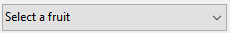

Las listas desplegables son objetos de formulario que permiten al usuario seleccionar de una lista. Los elementos mostrados en la lista desplegable se gestionan mediante un objeto, array, una lista de selección o una acción estándar.

En macOS, las listas desplegables también se denominan a veces "menú emergente". Ambos nombres se refieren a los mismos objetos. Como muestra el siguiente ejemplo, el aspecto de estos objetos puede variar ligeramente según la plataforma:


## Tipos de listas desplegables

You can create different types of drop-down lists with different features. To define a type, select the appropriate **Expression Type** and **Data Type** values in the Property list, or use their JSON equivalent.

| Type                                        | Funcionalidades                                                | Tipo de expresión | Tipos de datos                       | Definición JSON                                                                                                                                               |
| ------------------------------------------- | -------------------------------------------------------------- | ----------------- | ------------------------------------ | ------------------------------------------------------------------------------------------------------------------------------------------------------------- |
| Object                                      | Built upon a collection                                        | Object            | Numeric, Text, Date o Time           | `dataSourceTypeHint: object` + `numberFormat: <format>` or `textFormat: <format>` or `dateFormat: <format>` or `timeFormat: <format>` |
| Array                                       | Basado en un array                                             | Array             | Numeric, Text, Date o Time           | `dataSourceTypeHint: arrayNumber` or `arrayText` or `arrayDate` or `arrayTime`                                                                                |
| Lista de selección guardada como valor      | Built upon a choice list (standard)                            | Lista             | Valor del elemento seleccionado      | `dataSourceTypeHint: text` + `saveAs: value`                                                                                                                  |
| Lista de selección guardada como referencia | Built upon a choice list. La posición del elemento es guardada | Lista             | Referencia del elemento seleccionado | `dataSourceTypeHint: integer` + `saveAs: reference`                                                                                                           |
| Lista de selección jerárquica               | Puede mostrar contenido jerárquico                             | Lista             | List reference                       | `dataSourceTypeHint: integer`                                                                                                                                 |
| Acción estándar                             | Creado automáticamente por la acción                           | *any*             | *toda referencia de lista excepto*   | any definition + `action: <action>` (+ `focusable: false` for actions applying to other areas)                                                          |

## Gestión de listas desplegables

### Utilizar un objeto

> Esta funcionalidad sólo está disponible en proyectos 4D.

Un [objeto](Concepts/dt_object.md) encapsulando una [colección](Concepts/dt_collection) puede utilizarse como fuente de datos de una lista desplegable. El objeto debe contener las siguientes propiedades:

| Propiedad      | Type                 | Descripción                                                                                                                                                                                                                                                                      |
| -------------- | -------------------- | -------------------------------------------------------------------------------------------------------------------------------------------------------------------------------------------------------------------------------------------------------------------------------- |
| `values`       | Collection           | Obligatorio - Colección de valores escalares. Todos los valores deben ser del mismo tipo. Tipos soportados:<li>cadenas</li><li>numbers</li><li>dates</li><li>horas</li>Si está vacío o no está definido, la lista desplegable está vacía |
| `index`        | number               | Index of the currently selected item (value between 0 and `collection.length-1`). If you set -1, `currentValue` is displayed as a placeholder string                                                                                                                             |
| `currentValue` | igual que Collection | Currently selected item (used as placeholder value if set by code)                                                                                                                                                                                                               |

Si el objeto contiene otras propiedades, se ignoran.

Para inicializar el objeto asociado a la lista desplegable, puede:

* Enter a list of default values in the object properties by selecting `\&#060;Static List&#062;` in the [Data Source](properties_DataSource.md) theme of the Property List. Los valores por defecto se cargan en un objeto automáticamente.

* Ejecutar código que crea el objeto y sus propiedades. For example, if "myList" is the [variable](properties_Object.md#variable-or-expression) associated to the drop-down list, you can write in the [On Load](Events/onLoad.md) form event:

```4d
// Form.myDrop is the datasource of the form object

Form.myDrop:=New object
Form.myDrop.values:=New collection("apples"; "nuts"; "pears"; "oranges"; "carrots")
Form.myDrop.index:=-1  //currentValue is a placeholder
Form.myDrop.currentValue:="Select a fruit" 
```

La lista desplegable se muestra con la cadena del marcador de posición:



Después de que el usuario seleccione un valor:


```4d
Form.myDrop.values // ["apples","nuts","pears","oranges","carrots"]
Form.myDrop.currentValue //"oranges"
Form.myDrop.index //3
```

### Utilizar un array

Un [array](Concepts/arrays.md) es una lista de valores en memoria a la que se hace referencia por el nombre del array. Una lista desplegable puede mostrar un array como una lista de valores cuando se hace clic en ella.

Para inicializar el array asociado a la lista desplegable, puede:

* Enter a list of default values in the object properties by selecting `\&#060;Static List&#062;` in the [Data Source](properties_DataSource.md) theme of the Property List. Los valores por defecto se cargan en un array automáticamente. Puede referirse al array utilizando el nombre de la variable asociada al objeto.

* Antes de mostrar el objeto, ejecute el código que asigna valores a los elementos del array. Por ejemplo:

```4d
  ARRAY TEXT(aCities;6) 
  aCities{1}:="Philadelphia" 
  aCities{2}:="Pittsburg" 
  aCities{3}:="Grand Blanc" 
  aCities{4}:="Bad Axe" 
  aCities{5}:="Frostbite Falls" 
  aCities{6}:="Green Bay" 
```

En este caso, el nombre de la [variable](properties_Object.md#variable-or-expression) asociada al objeto en el formulario debe ser `aCities`. Este código podría colocarse en el método formulario y ejecutarse cuando se ejecute el evento formulario `On Load`.

* Antes de que se muestre el objeto, cargue los valores de una lista en el array utilizando el comando [LIST TO ARRAY](https://doc.4d.com/4dv19/help/command/en/page288.html). Por ejemplo:

```4d
   LIST TO ARRAY("Cities";aCities)
```

En este caso también, el nombre de la [variable](properties_Object.md#variable-or-expression) asociada al objeto en el formulario debe ser `aCities`. Este código puede ejecutarse en lugar de las sentencias de asignación mostradas anteriormente.

Si necesita guardar la elección del usuario en un campo, deberá utilizar una sentencia de asignación que se ejecute después de aceptar el registro. El código podría ser así:

```4d
  Case of
    :(Form event=On Load)
       LIST TO ARRAY("Cities";aCities)
       If(Record number([People])<0) `nuevo registro
          aCities:=3 `mostrar un valor por defecto
       Else `registro existente, mostrar valor almacenado
          aCities:=Find in array(aCities;City)
       End if
    :(Form event=On Clicked) `el usuario modifica la selección
       City:=aCities{aCities} `el campo obtiene un nuevo valor
    :(Form event=On Validate)
       City:=aCities{aCities}
    :(Form event=On Unload)
       CLEAR VARIABLE(aCities)
 End case
```

Debe seleccionar cada evento que pruebe en sus sentencia Case. Los arrays siempre contienen un número finito de elementos. La lista de elementos es dinámica y puede ser modificada por un método. Los elementos de un array pueden modificarse, ordenarse y añadirse.

### Utilizar una lista de selección

If you want to use a drop-down list to manage the values of an input area (listed field or variable), 4D lets you reference the field or variable directly as the drop-down list's [data source](properties_Object.md#variable-or-expression). Esto facilita la gestión de los campos/variables listados.

For example, in the case of a "Color" field that can only contain the values "White", "Blue", "Green" or "Red", it is possible to create a list containing these values and associate it with a drop-down list that references the 4D "Color" field. 4D se encarga entonces de gestionar automáticamente la entrada y la visualización del valor actual en el formulario.
> Si utiliza una lista jerárquica, sólo se muestra el primer nivel y se puede seleccionar. If you use a hierarchical list, only the first level is displayed and can be selected.

To associate a drop-down list with a field or variable, enter the name of the field or variable directly as the [Variable or Expression](properties_Object.md#variable-or-expression) field of the drop-down list in the Property List.
> It is not possible to use this feature with an object or an array drop-down list. If you enter a field name in the "Variable or Expression" area, then you must use a choice list.

When the form is executed, 4D automatically manages the drop-down list during input or display: when a user chooses a value, it is saved in the field; this field value is shown in the drop-down list when the form is displayed:


#### Valor del elemento seleccionado o Referencia del elemento seleccionado

When you have associated a drop-down list with a choice list and with a field or a variable, you can set the [**Data Type**](properties_DataSource.md#data-type) property to **Selected item value** or **Selected item reference**. Esta opción permite optimizar el tamaño de los datos guardados.

### Uso de una lista de selección jerárquica

A hierarchical drop-down list has a sublist associated with each item in the list. Este es un ejemplo de lista desplegable jerárquica:


> En los formularios, las listas desplegables jerárquicas están limitadas a dos niveles.

You can assign the hierarchical choice list to the drop-down list object using the [Choice List](properties_DataSource.md#choice-list) field of the Property List.

You manage hierarchical drop-down lists using the **Hierarchical Lists** commands of the 4D Language. All commands that support the `(*; "name")` syntax can be used with hierarchical  drop-down lists, e.g. [`List item parent`](https://doc.4d.com/4dv19/help/command/en/page633.html).

### Utilizar una acción estándar

You can build automatically a drop-down list using a [standard action](properties_Action.md#standard-action). Esta funcionalidad es soportada en los siguientes contextos:

* Uso de la acción estándar `gotoPage`. In this case, 4D will automatically display the [page of the form](FormEditor/forms.md#form-pages) that corresponds to the number of the item that is selected. For example, if the user selects the 3rd item, 4D will display the third page of the current form (if it exists). At runtime, by default the drop-down list displays the page numbers (1, 2...).

* Use of a standard action that displays a sublist of items, for example `backgroundColor`. Esta funcionalidad requiere que:
  * a styled text area ([4D Write Pro area](writeProArea_overview.md) or [input](input_overview.md) with [multistyle](properties_Text.md#multi-style) property) is present in the form as the standard action target.
  * the [focusable](properties_Entry.md#focusable) property is not set to the drop-down list. At runtime the drop-down list will display an automatic list of values, e.g. background colors. You can override this automatic list by assigning in addition a choice list in which each item has been assigned a custom standard action.

> Esta funcionalidad no puede utilizarse con una lista desplegable jerárquica.

## Propiedades soportadas

[Alpha Format](properties_Display.md#alpha-format) - [Bold](properties_Text.md#bold) - [Bottom](properties_CoordinatesAndSizing.md#bottom) - [Button Style](properties_TextAndPicture.md#button-style) - [Choice List](properties_DataSource.md#choice-list) - [Class](properties_Object.md#css-class) - [Data Type (expression type)](properties_DataSource.md#data-type-expression-type) - [Data Type (list)](properties_DataSource.md#data-type-list) - [Date Format](properties_Display.md#date-format) - [Expression Type](properties_Object.md#expression-type) - [Focusable](properties_Entry.md#focusable) - [Font](properties_Text.md#font) - [Font Color](properties_Text.md#font-color) - [Font Size](properties_Text.md#font-size) - [Height](properties_CoordinatesAndSizing.md#height) - [Help Tip](properties_Help.md#help-tip) - [Horizontal Sizing](properties_ResizingOptions.md#horizontal-sizing) - [Italic](properties_Text.md#italic) - [Left](properties_CoordinatesAndSizing.md#left) - [Not rendered](properties_Display.md#not-rendered) - [Object Name](properties_Object.md#object-name) - [Right](properties_CoordinatesAndSizing.md#right) - [Standard action](properties_Action.md#standard-action) - [Save value](properties_Object.md#save-value) - [Time Format](properties_Display.md#time-format) - [Top](properties_CoordinatesAndSizing.md#top) - [Type](properties_Object.md#type) - [Underline](properties_Text.md#underline) - [Variable or Expression](properties_Object.md#variable-or-expression) - [Vertical Sizing](properties_ResizingOptions.md#vertical-sizing) - [Visibility](properties_Display.md#visibility) - [Width](properties_CoordinatesAndSizing.md#width)  
