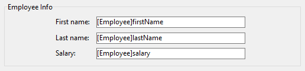

Un área de grupo es un objeto estático que permite ensamblar visualmente varios objetos de formulario:


> El nombre de un área de grupo es un texto estático; puede utilizar una referencia "localizable" como con cualquier etiqueta de 4D (ver [Utilizar las referencias en los textos estáticos](https://doc.4d.com/4Dv17R5/4D/17-R5/Using-references-in-static-text.300-4163725.en.html) y la sección *Arquitectura XLIFF* en el manual Diseño de 4D.


#### Ejemplo JSON:

```
    "myGroup": {
        "type": "groupBox", 
        "title": "Employee Info"
        "left": 60,
        "top": 160,
        "width": 100,
        "height": 20
        }
```

#### Propiedades soportadas
[Inferior](properties_CoordinatesAndSizing.md#bottom) - [CSS Class](properties_Object.md#css-class) - [Fuente](properties_Text.md#font) - [Color de la fuente](properties_Text.md#font-color) - [Tamaño de la fuente](properties_Text.md#font-size) - [Altura](properties_CoordinatesAndSizing.md#height) - [Alineamiento horizontal](properties_Text.md#horizontal-alignment) - [Dim. horizontal](properties_ResizingOptions.md#horizontal-sizing) - [Itálica](properties_Text.md#italic) - [Izquierda](properties_CoordinatesAndSizing.md#left) - [Nombre del objeto](properties_Object.md#object-name) - [Derecha](properties_CoordinatesAndSizing.md#right) - [Título](properties_Object.md#title) - [Arriba](properties_CoordinatesAndSizing.md#top) - [Tipo](properties_Object.md#type) - [Subrayado](properties_Text.md#underline) - [Dim. vertical](properties_ResizingOptions.md#vertical-sizing) - [Visibilidad](properties_Display.md#visibility) - [Ancho](properties_CoordinatesAndSizing.md#width) 