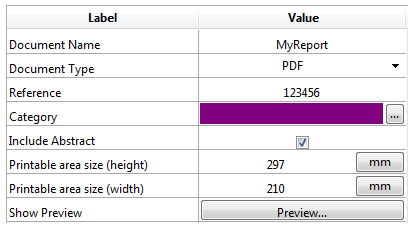
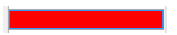
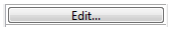

Un list box está formado por uno o varios objetos columna que tienen propiedades específicas. Puede seleccionar una columna de list box en el editor de formularios haciendo clic en ella cuando el objeto list box está seleccionado:


Puede definir propiedades estándar (texto, color de fondo, etc.) para cada columna del list box; estas propiedades tienen prioridad sobre las del objeto list box.

> Puede definir el [tipo de expresión](properties_Object.md#expression-type) para las columnas de list box de tipo array (cadena, texto, número, fecha, hora, imagen, booleano u objeto).

## Propiedades específicas de columna {#column-specific-properties}

[Formato Alfa](properties_Display.md#alpha-format) - [Color de fondo alternativo](properties_BackgroundAndBorder.md#alternate-background-color) - [Altura de línea automática](properties_CoordinatesAndSizing.md#automatic-row-height) - [Color de fondo](properties_BackgroundAndBorder.md#background-color--fill-color) - [Expresión de color de fondo](properties_BackgroundAndBorder.md#background-color-expression) - [Negrita](properties_Text.md#bold) - [Lista de selección](properties_DataSource.md#choice-list) - [Clase](properties_Object.md#css-class) - [Menú contexto](properties_Entry.md#context-menu) - [Tipo de datos (selección y columna de list box colección)](properties_DataSource.md#data-type-list) - [Formato Fecha](properties_Display.md#date-format) - [Valores por defecto](properties_DataSource.md#default-list-of-values) - [Tipo de visualización](properties_Display.md#display-type) - [Editable](properties_Entry.md#enterable) - [Filtro de entrada](properties_Entry.md#entry-filter) - [Lista excluída](properties_RangeOfValues.md#excluded-list) - [Expresión](properties_DataSource.md#expression) - [Tipo de expresión (array list box column)](properties_Object.md#expression-type) - [Fuente](properties_Text.md#font) - [Color de fuente](properties_Text.md#font-color) - [Alineación Horizontal](properties_Text.md#horizontal-alignment) - [Relleno Horizontal](properties_CoordinatesAndSizing.md#horizontal-padding) - [Itálica](properties_Text.md#italic) - [Invisible](properties_Display.md#visibility) - [Ancho máximo](properties_CoordinatesAndSizing.md#maximum-width) - [Método](properties_Action.md#method) - [Ancho mínimo](properties_CoordinatesAndSizing.md#minimum-width) - [Multiestilo](properties_Text.md#multi-style) - [Formato número](properties_Display.md#number-format) - [Nombre de objeto](properties_Object.md#object-name) - [Formato Imagen](properties_Display.md#picture-format) - [Redimensionable](properties_ResizingOptions.md#resizable) - [Lista requerida](properties_RangeOfValues.md#required-list) - [Array de color de fondo de línea](properties_BackgroundAndBorder.md#row-background-color-array) - [Array de color de fuente de línea](properties_Text.md#row-font-color-) - [Array de estilo de línea](properties_Text.md#row-style-array) - [Guardar como](properties_DataSource.md#save-as) - [Expresión de estilo](properties_Text.md#style-expression) - [Texto cuando False/Texto cuando True](properties_Display.md#text-when-falsetext-when-true) - [Formato Hora](properties_Display.md#time-format) - [Truncar con elipsis](properties_Display.md#truncate-with-ellipsis) - [Subrayar](properties_Text.md#underline) - [Variable o Expresión](properties_Object.md#variable-or-expression) - Alineación
Vertical - [Relleno vertical](properties_CoordinatesAndSizing.md#vertical-padding) - [Ancho](properties_CoordinatesAndSizing.md#width) - [Ajuste de palabras](properties_Display.md#wordwrap)

## Eventos de formulario soportados {#supported-form-events}

| Evento formulario    | Propiedades adicionales devueltas (ver [Evento formulario](../commands/form-event) para las propiedades principales)                                                                                                                                                                                  | Comentarios                                                                                                                                                                                 |
| -------------------- | ------------------------------------------------------------------------------------------------------------------------------------------------------------------------------------------------------------------------------------------------------------------------------------------------------------------------ | ------------------------------------------------------------------------------------------------------------------------------------------------------------------------------------------- |
| On After Edit        | <ul><li>[columna](./listbox-object.md#additional-properties)</li><li>[nombreColumna](./listbox-object.md#additional-properties)</li><li>[línea](./listbox-object.md#additional-properties)</li></ul>                                                                                                                     |                                                                                                                                                                                             |
| On After Keystroke   | <ul><li>[columna](./listbox-object.md#additional-properties)</li><li>[nombreColumna](./listbox-object.md#additional-properties)</li><li>[línea](./listbox-object.md#additional-properties)</li></ul>                                                                                                                     |                                                                                                                                                                                             |
| On After Sort        | <ul><li>[columna](./listbox-object.md#additional-properties)</li><li>[nombreColumna](./listbox-object.md#additional-properties)</li><li>[headerName](./listbox-object.md#additional-properties)</li></ul>                                                                                                                | \*Las fórmulas compuestas no se pueden ordenar. <br/>(por ejemplo, This.firstName + This.lastName)_ |
| On Alternative Click | <ul><li>[columna](./listbox-object.md#additional-properties)</li><li>[nombreColumna](./listbox-object.md#additional-properties)</li><li>[línea](./listbox-object.md#additional-properties)</li></ul>                                                                                                                     | *List box array únicamente*                                                                                                                                                                 |
| On Before Data Entry | <ul><li>[columna](./listbox-object.md#additional-properties)</li><li>[nombreColumna](./listbox-object.md#additional-properties)</li><li>[línea](./listbox-object.md#additional-properties)</li></ul>                                                                                                                     |                                                                                                                                                                                             |
| On Before Keystroke  | <ul><li>[columna](./listbox-object.md#additional-properties)</li><li>[nombreColumna](./listbox-object.md#additional-properties)</li><li>[línea](./listbox-object.md#additional-properties)</li></ul>                                                                                                                     |                                                                                                                                                                                             |
| On Begin Drag Over   | <ul><li>[columna](./listbox-object.md#additional-properties)</li><li>[nombreColumna](./listbox-object.md#additional-properties)</li><li>[línea](./listbox-object.md#additional-properties)</li></ul>                                                                                                                     |                                                                                                                                                                                             |
| On Clicked           | <ul><li>[columna](./listbox-object.md#additional-properties)</li><li>[nombreColumna](./listbox-object.md#additional-properties)</li><li>[línea](./listbox-object.md#additional-properties)</li></ul>                                                                                                                     |                                                                                                                                                                                             |
| On Column Moved      | <ul><li>[nombreColumna](./listbox-object.md#additional-properties)</li><li>[nuevaPosicion](./listbox-object.md#additional-properties)</li><li>[antiguaPosicion](./listbox-object.md#additional-properties)</li></ul>                                                                                                     |                                                                                                                                                                                             |
| On Column Resize     | <ul><li>[columna](./listbox-object.md#additional-properties)</li><li>[columnName](./listbox-object.md#additional-properties)</li><li>[nuevoTamaño](./listbox-object.md#additional-properties)</li><li>[tamañoantiguo](./listbox-object.md#additional-properties)</li></ul>                                               |                                                                                                                                                                                             |
| On Data Change       | <ul><li>[columna](./listbox-object.md#additional-properties)</li><li>[nombreColumna](./listbox-object.md#additional-properties)</li><li>[línea](./listbox-object.md#additional-properties)</li></ul>                                                                                                                     |                                                                                                                                                                                             |
| On Double Clicked    | <ul><li>[columna](./listbox-object.md#additional-properties)</li><li>[nombreColumna](./listbox-object.md#additional-properties)</li><li>[línea](./listbox-object.md#additional-properties)</li></ul>                                                                                                                     |                                                                                                                                                                                             |
| On Drag Over         | <ul><li>[area](./listbox-object.md#additional-properties)</li><li>[areaName](./listbox-object.md#additional-properties)</li><li>[columna](./listbox-object.md#additional-properties)</li><li>[columnName](./listbox-object.md#additional-properties)</li><li>[fila](./listbox-object.md#additional-properties)</li></ul> |                                                                                                                                                                                             |
| On Drop              | <ul><li>[columna](./listbox-object.md#additional-properties)</li><li>[nombreColumna](./listbox-object.md#additional-properties)</li><li>[línea](./listbox-object.md#additional-properties)</li></ul>                                                                                                                     |                                                                                                                                                                                             |
| On Footer Click      | <ul><li>[columna](./listbox-object.md#additional-properties)</li><li>[nombreColumna](./listbox-object.md#additional-properties)</li><li>[footerName](./listbox-object.md#additional-properties)</li></ul>                                                                                                                | *List box arrays, selección actual y selección temporal únicamente*                                                                                                                         |
| On Getting Focus     | <ul><li>[columna](./listbox-object.md#additional-properties)</li><li>[nombreColumna](./listbox-object.md#additional-properties)</li><li>[línea](./listbox-object.md#additional-properties)</li></ul>                                                                                                                     | *Propiedades adicionales devueltas sólo al editar una celda*                                                                                                                                |
| On Header Click      | <ul><li>[columna](./listbox-object.md#additional-properties)</li><li>[nombreColumna](./listbox-object.md#additional-properties)</li><li>[headerName](./listbox-object.md#additional-properties)</li></ul>                                                                                                                |                                                                                                                                                                                             |
| On Load              |                                                                                                                                                                                                                                                                                                                          |                                                                                                                                                                                             |
| On Losing Focus      | <ul><li>[columna](./listbox-object.md#additional-properties)</li><li>[nombreColumna](./listbox-object.md#additional-properties)</li><li>[línea](./listbox-object.md#additional-properties)</li></ul>                                                                                                                     | *Propiedades adicionales devueltas sólo cuando la modificación de una celda se completa*                                                                                                    |
| On Row Moved         | <ul><li>[newPosition](./listbox-object.md#additional-properties)</li><li>[oldPosition](./listbox-object.md#additional-properties)</li></ul>                                                                                                                                                                              | *List box array únicamente*                                                                                                                                                                 |
| On Unload            |                                                                                                                                                                                                                                                                                                                          |                                                                                                                                                                                             |
| On Validate          |                                                                                                                                                                                                                                                                                                                          |                                                                                                                                                                                             |

## Arrays de objetos en columnas

Las columnas de list box pueden manejar arrays de objetos. Como los arrays de objetos pueden contener diferentes tipos de datos, esta nueva y poderosa funcionalidad permite mezclar diferentes tipos de entrada en las líneas de una misma columna, y mostrar también varios widgets. Por ejemplo, puede insertar una entrada de texto en la primera línea, una casilla de selección en la segunda y una lista desplegable en la tercera. Los arrays de objetos también dan acceso a nuevos tipos de widgets, como botones o selectores de color.

El siguiente list box fue diseñado utilizando un array de objetos:



### Configurar una columna array de objetos

Para asignar un array de objetos a una columna list box, basta con definir el nombre del array de objetos en la lista de propiedades (campo "Nombre de variable"), o utilizando el comando [LISTBOX INSERT COLUMN](../commands/listbox-insert-column), como para toda columna basada en arrays. En la lista de propiedades, ahora puede seleccionar Objeto como "Tipo de expresión" para la columna:


Las propiedades estándar relacionadas con las coordenadas, el tamaño y el estilo están disponibles para las columnas de tipo objeto. Puede definirlos utilizando la lista de Propiedades, o programando el estilo, el color de fuente, el color de fondo y la visibilidad para cada línea de una columna objeto del list box. Estos tipos de columnas también se pueden ocultar.

Sin embargo, el tema Fuente de datos no está disponible para las columnas objeto del list box. De hecho, el contenido de cada celda de la columna se basa en los atributos presentes en el elemento correspondiente del array de objetos. Cada elemento de array puede definir:

el tipo de valor (obligatorio): texto, color, evento, etc.
el valor en sí (opcional): utilizado para la entrada/salida.
la visualización del contenido de la celda (opcional): botón, lista, etc.
ajustes adicionales (opcional): dependen del tipo de valor
Para definir estas propiedades, debe establecer los atributos apropiados en el objeto (los atributos disponibles se enumeran a continuación). Por ejemplo, puede escribir "¡Hola Mundo!" en una columna objeto utilizando este sencillo código:

```4d
ARRAY OBJECT(obColumn;0) //array de columnas
 var $ob : Object //primer elemento
 OB SET($ob; "valueType"; "text") //define el tipo de valor (obligatorio)
 OB SET($ob; "value"; "Hello World!") //define el valor
 APPEND TO ARRAY(obColumn;$ob)  
```


> El formato de visualización y los filtros de entrada no pueden definirse para una columna de objetos. Dependen automáticamente del tipo de valor.

#### valueType y visualización de datos

Cuando una columna de list box está asociada a un array de objetos, la forma en que se muestra, introduce o edita una celda se basa en el atributo valueType del elemento del array. Los valores valueType soportados son:

- "text": para un valor de texto
- "real": para un valor numérico que puede incluir separadores como un `\<espacio>`, `<.>`, o `<,>`
- "integer": para un valor entero
- "boolean": para un valor True/False
- "color": para definir un color de fondo
- "event": para mostrar un botón con una etiqueta.

4D utiliza widgets por defecto en función del valor "valueType" (es decir, un "text" se muestra como un widget de entrada de texto, un "boolean" como una casilla de selección), pero también están disponibles visualizaciones alternativas a través de opciones (*por ejemplo*, un real también se puede representar como un menú desplegable). La siguiente tabla muestra la visualización por defecto, así como las alternativas para cada tipo de valor:

| valueType | Widget por defecto                                                     | Widget(s) alternativo(s)                                                                                       |
| --------- | ---------------------------------------------------------------------- | ---------------------------------------------------------------------------------------------------------------------------------------------------- |
| text      | entrada de texto                                                       | menú desplegable (lista obligatoria) o combo box (lista de selección)                                          |
| real      | entrada de texto controlada (números y separadores) | menú desplegable (lista obligatoria) o combo box (lista de selección)                                          |
| integer   | entrada de texto controlada (números únicamente)    | menú desplegable (lista obligatoria) o combo box (lista de opciones) o casilla de verificación de tres estados |
| boolean   | casilla de selección                                                   | menú desplegable (lista requerida)                                                                                                |
| color     | color de fondo                                                         | text                                                                                                                                                 |
| evento    | botón con etiqueta                                                     |                                                                                                                                                      |
|           |                                                                        | Todos los widgets pueden tener un botón adicional de alternancia de unidades o un botón de elipsis asociado a la celda.              |

Usted define la visualización de la celda y las opciones utilizando atributos específicos en cada objeto (ver abajo).

#### Formatos de visualización y filtros de entrada

No se pueden definir formatos de visualización ni filtros de entrada para las columnas objeto de los list box. Se definen automáticamente en función del tipo de valor. Estos están listados en la siguiente tabla:

| Tipo de valor | Formato por defecto                                                                                  | Control de entrada                          |
| ------------- | ---------------------------------------------------------------------------------------------------- | ------------------------------------------- |
| text          | lo mismo que se define en el objeto                                                                  | cualquiera (sin control) |
| real          | lo mismo que se define en el objeto (utilizando el separador decimal del sistema) | "0-9" y "." y "-"           |
|               |                                                                                                      | "0-9" y "." si min>=0       |
| integer       | lo mismo que se define en el objeto                                                                  | "0-9" y "-"                                 |
|               |                                                                                                      | "0-9" si min>=0                             |
| Boolean       | casilla de selección                                                                                 | N/A                                         |
| color         | N/A                                                                                                  | N/A                                         |
| evento        | N/A                                                                                                  | N/A                                         |

### Atributos

Cada elemento del array de objetos es un objeto que puede contener uno o más atributos que definirán el contenido de la celda y la visualización de los datos (ver el ejemplo anterior).

El único atributo obligatorio es "valueType" y sus valores soportados son "text", "real", "integer", "boolean", "color" y "event". La siguiente tabla lista todos los atributos soportados en los arrays de objetos de los list box, en función del valor "valueType" (cualquier otro atributo se ignora). A continuación se detallan los formatos de visualización y se ofrecen ejemplos.

|                       | valueType                                               | text | real | integer | boolean | color | evento |
| --------------------- | ------------------------------------------------------- | ---- | ---- | ------- | ------- | ----- | ------ |
| *Atributos*           | *Description*                                           |      |      |         |         |       |        |
| value                 | valor de la celda (entrada o salida) | x    | x    | x       |         |       |        |
| min                   | valor mínimo                                            |      | x    | x       |         |       |        |
| max                   | valor máximo                                            |      | x    | x       |         |       |        |
| behavior              | Valor "tres Estados"                                    |      |      | x       |         |       |        |
| requiredList          | lista desplegable definida en objeto                    | x    | x    | x       |         |       |        |
| choiceList            | combo box definido en objeto                            | x    | x    | x       |         |       |        |
| requiredListReference | RefList 4D, depende del valor de "saveAs"               | x    | x    | x       |         |       |        |
| requiredListName      | Nombre de la lista 4D, depende del valor "saveAs"       | x    | x    | x       |         |       |        |
| saveAs                | "reference" o "value"                                   | x    | x    | x       |         |       |        |
| choiceListReference   | RefList 4D, muestra un combo box                        | x    | x    | x       |         |       |        |
| choiceListName        | Nombre de la lista 4D, mostrar combo box                | x    | x    | x       |         |       |        |
| unitList              | array de X elementos                                    | x    | x    | x       |         |       |        |
| unitReference         | índice del elemento seleccionado                        | x    | x    | x       |         |       |        |
| unitsListReference    | Ver lista de unidades 4D                                | x    | x    | x       |         |       |        |
| unitsListName         | 4D lista nombre de la unidad                            | x    | x    | x       |         |       |        |
| alternateButton       | añadir un botón alternativo                             | x    | x    | x       | x       | x     |        |

#### value

Los valores de las celdas se almacenan en el atributo "value". Este atributo se utiliza tanto para la entrada como para la salida. También puede utilizarse para definir valores por defecto cuando se utilizan listas (ver a continuación).

```4d
 ARRAY OBJECT(obColumn;0) //array de columnas
 var $ob1;$ob2;$ob3 : Object
 var $entry:="Hello world!"
 OB SET($ob1; "valueType"; "text")
 OB SET($ob1; "value";$entry) // si el usuario introduce un nuevo valor, $entry contendrá el valor editado

 OB SET($ob2; "valueType"; "real")
 OB SET($ob2;"value";2/3)

 OB SET($ob3; "valueType"; "boolean")
 OB SET($ob3; "value";True)

 APPEND TO ARRAY(obColumn;$ob1)
 APPEND TO ARRAY(obColumn;$ob2)
 APPEND TO ARRAY(obColumn;$ob3)
```


> Los valores null se soportan y dan como resultado una celda vacía.

#### min y max

Cuando el "valueType" es "real" o "integer", el objeto también acepta atributos min y max con valores apropiados (los valores deben ser del mismo tipo que el valueType).

Estos atributos pueden utilizarse para controlar el rango de valores de entrada. Cuando se valida una celda (cuando pierde el foco), si el valor de entrada es menor que el valor mínimo o mayor que el valor máximo, entonces se rechaza. En este caso, se mantiene el valor anterior y un consejo muestra una explicación.

```4d
 var $ob3 : Object
 var $entry3:=2015
 OB SET($ob3;"valueType";"integer")
 OB SET($ob3;"value";$entry3)
 OB SET($ob3;"min";2000)
 OB SET($ob3;"max";3000)
```


#### behavior

El atributo behavior ofrece variaciones a la representación estándar de los valores. En 4D v15, se ofrece una única variación:

| Atributo | Valor(es) disponible(s) | valueType(s) | Descripción                                                                                                                                                                                                                                                              |
| -------- | ------------------------------------------------------------- | ------------------------------- | ------------------------------------------------------------------------------------------------------------------------------------------------------------------------------------------------------------------------------------------------------------------------ |
| behavior | threeStates                                                   | integer                         | Representa un valor numérico como una casilla de verificación de tres estados.<br/> 2=semi seleccionada, 1=seleccionada, 0=no seleccionada, -1=invisible, -2= deseleccionada desactivada, -3= seleccionada desactivada, -4=semi seleccionada desactivada |

```4d
 var $ob3; $ob4 : Object
 OB SET($ob3;"valueType";"integer")
 OB SET($ob3;"value";-3)
 OB SET($ob4;"valueType";"integer")
 OB SET($ob4;"value";-3)
 OB SET($ob4;"behavior";"threeStates")
```


#### requiredList y choiceList

Cuando un atributo "choiceList" o "requiredList" está presente dentro del objeto, la entrada de texto se sustituye por una lista desplegable o un combo box, dependiendo del atributo:

- Si el atributo es "choiceList", la celda se muestra como un combo box. Esto significa que el usuario puede seleccionar o escribir un valor.
- Si el atributo es "requiredList", la celda se muestra como una lista desplegable y el usuario sólo puede seleccionar uno de los valores de la lista.

En ambos casos, se puede utilizar un atributo "valor" para preseleccionar un valor en el widget.

> Los valores del widget se definen a través de un array. Si quiere asociar el widget a una lista 4D existente, debe utilizar los atributos "requiredListReference", "requiredListName", "choiceListReference" o "choiceListName".

Ejemplos:

- Quiere mostrar una lista desplegable con sólo dos opciones: "Open" o "Closed". "Closed" debe estar preseleccionado:

```4d
	ARRAY TEXT($RequiredList;0)
	APPEND TO ARRAY($RequiredList;"Open")
	APPEND TO ARRAY($RequiredList;"Closed")
	var $ob : Object
	OB SET($ob;"valueType";"text")
	OB SET($ob;"value";"Closed")
	OB SET ARRAY($ob;"requiredList";$RequiredList)
```


- Quiere aceptar todo valor entero, pero mostrar un combo box para sugerir los valores más comunes:

```4d
	ARRAY LONGINT($ChoiceList;0)
	APPEND TO ARRAY($ChoiceList;5)
	APPEND TO ARRAY($ChoiceList;10)
	APPEND TO ARRAY($ChoiceList;20)
	APPEND TO ARRAY($ChoiceList;50)
	APPEND TO ARRAY($ChoiceList;100)
	var $ob : Object
	OB SET($ob;"valueType";"integer")
	OB SET($ob;"value";10) //10 como valor por defecto
	OB SET ARRAY($ob;"choiceList";$ChoiceList)
```


#### requiredListName y requiredListReference

Los atributos "requiredListName" y "requiredListReference" permiten utilizar, en una celda de list box, una lista definida en 4D, ya sea en modo Diseño (en el editor de Listas de la Caja de Herramientas) o por programación (utilizando el comando New list). La celda se mostrará entonces como una lista desplegable. Esto significa que el usuario sólo puede seleccionar uno de los valores proporcionados en la lista.

Utilice "requiredListName" o "requiredListReference" en función del origen de la lista: si la lista procede de la caja de herramientas, pase un nombre; en caso contrario, si la lista se ha definido por programación, pase una referencia. En ambos casos, se puede utilizar un atributo "valor" para preseleccionar un valor en el widget.

> - Si desea definir estos valores a través de un simple array, debe utilizar el atributo "requiredList".
> - Si la lista contiene elementos de texto que representan valores reales, el separador decimal debe ser un punto ("."), independientemente de la configuración local, por ejemplo "17.6" "1234.456".

Ejemplos:

- Desea mostrar una lista desplegable basada en una lista de "colores" definida en la caja de herramientas (que contiene los valores "azul", "amarillo" y "verde"), guardarla como valor y mostrar "azul" por defecto:


```4d
	var $ob : Object
	OB SET($ob;"valueType";"text")
	OB SET($ob;"saveAs";"value")
	OB SET($ob;"value";"blue")
	OB SET($ob;"requiredListName";"colors")
```


- Quiere mostrar una lista desplegable basada en una lista definida por programación y guardarla como referencia:

```4d
	<>List:=New list
	APPEND TO LIST(<>List;"Paris";1)
	APPEND TO LIST(<>List;"London";2)
	APPEND TO LIST(<>List;"Berlin";3)
	APPEND TO LIST(<>List;"Madrid";4)
	var $ob : Object
	OB SET($ob;"valueType";"integer")
	OB SET($ob;"saveAs";"reference")
	OB SET($ob;"value";2) //muestra London por defecto
	OB SET($ob;"requiredListReference";<>List)
```


#### choiceListName y choiceListReference

Los atributos "choiceListName" and "choiceListReference" permiten utilizar, en una celda de list box, una lista definida en 4D, ya sea en modo Diseño (en el editor de Listas de la Caja de Herramientas) o por programación (utilizando el comando New list). La celda se muestra entonces como un combo box, lo que significa que el usuario puede seleccionar o escribir un valor.

Utilice "choiceListName" o "choiceListReference" en función del origen de la lista: si la lista procede de la caja de herramientas, pase un nombre; en caso contrario, si la lista se ha definido por programación, pase una referencia. En ambos casos, se puede utilizar un atributo "valor" para preseleccionar un valor en el widget.

> - Si desea definir estos valores a través de un simple array, debe utilizar el atributo "choiceList".
> - Si la lista contiene elementos de texto que representan valores reales, el separador decimal debe ser un punto ("."), independientemente de la configuración local, por ejemplo "17.6" "1234.456".

Ejemplo:

Ejemplo:


```4d
 var $ob : Object
 OB SET($ob;"valueType";"text")

 OB SET($ob;"value";"blue")
 OB SET($ob;"choiceListName";"colors")
```


#### unitsList, unitsListName, unitsListReference y unitReference

Puede utilizar atributos específicos para añadir unidades asociadas a los valores de las celdas (\*por ejemplo, \*: "10 cm", "20 píxeles", etc.). Para definir la lista de unidades, puede utilizar uno de los siguientes atributos:

- "unitsList": un array que contiene los elementos x utilizados para definir las unidades disponibles (por ejemplo: "cm", "pulgadas", "km", "millas", etc.). Utilice este atributo para definir las unidades dentro del objeto.
- "unitsListReference": una referencia a una lista 4D que contiene las unidades disponibles. Utilice este atributo para definir unidades con una lista 4D creada con el comando [`New list`](../commands/new-list).
- "unitsListName": un nombre de una lista 4D basada en el diseño que contiene unidades disponibles. Utilice este atributo para definir las unidades con una lista 4D creada en la caja de herramientas.

Independientemente de la forma en que se defina la lista de unidades, puede asociarse con el siguiente atributo:

- "unitReference": un único valor que contiene el índice (de 1 a x) del elemento seleccionado en la lista de valores "unitList", "unitsListReference" o "unitsListName".

Independientemente de la forma en que se defina la lista de unidades, puede asociarse con el siguiente atributo:

Ejemplo:

Queremos definir una entrada numérica seguida de dos posibles unidades: " líneas " o " píxeles ". El valor actual es "2" + "líneas". Utilizamos valores definidos directamente en el objeto (atributo "unitsList"):

```4d
ARRAY TEXT($_units;0)
APPEND TO ARRAY($_units;"lines")
APPEND TO ARRAY($_units;"pixels")
var $ob : Object
OB SET($ob;"valueType";"integer")
OB SET($ob;"value";2) // 2 "units"
OB SET($ob;"unitReference";1) //"lines"
OB SET ARRAY($ob;"unitsList";$_units)
```


#### alternateButton

Si desea añadir un botón de elipsis [...] a una celda, basta con pasar el "alternateButton" con el valor True en el objeto. El botón se mostrará en la celda automáticamente.

Cuando este botón es presionado por un usuario, se generará un evento `On Alternate Click`, y usted podrá manejarlo como quiera (vea el párrafo "Manejo de eventos" para más información).

Ejemplo:

```4d
var $ob1 : Object
var $entry:="Hello world!"
OB SET($ob;"valueType";"text")
OB SET($ob;"alternateButton";True)
OB SET($ob;"value";$entry)
```


#### valueType color

El atributo valueType de valor "color" permite mostrar un color o un texto.

- Si el valor es un número, se dibuja un rectángulo de color dentro de la celda. Ejemplo:

  ```4d
  var $ob4 : Object
  OB SET($ob4;"valueType";"color")
  OB SET($ob4;"value";0x00FF0000)
  ```



- Si el valor es un texto, entonces se muestra el texto (*por ejemplo*: "valor"; "Automatic").

#### event valueType

El "event" valueType muestra un botón que genera un evento `On Clicked` al ser presionado. No se puede pasar ni devolver ningún dato o valor.

Opcionalmente, se puede pasar un atributo "label".

Ejemplo:

```4d
var $ob : Object
OB SET($ob;"valueType";"event")
OB SET($ob;"label";"Edit...")
```



### Gestión de eventos

Se pueden manejar varios eventos mientras se utiliza un array list box de objetos:

- **On Data Change**: un evento `On Data Change` se dispara cuando se ha modificado algún valor:
  - en un área de entrada de texto
  - en una lista desplegable
  - en un área combo box
  - en un botón de unidad (cambiar del valor x al valor x+1)
  - en una casilla de selección (cambia entre marcado/desmarcado)
- **On Clicked**: cuando el usuario haga clic en un botón instalado con el "event" atributo *valueType*, se generará un evento `On Clicked`. Este evento es gestionado por el programador.
- **On Alternative Click**: cuando el usuario haga clic en un botón de elipsis (atributo "alternateButton"), se generará un evento `On Alternative Click`. Este evento es gestionado por el programador.

