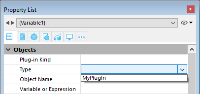

Un área de plug-in es un área en el formulario que está completamente controlada por un plug-in. La capacidad de integrar plug-ins en los formularios le ofrece posibilidades ilimitadas a la hora de crear aplicaciones personalizadas. Un plug-in puede realizar una tarea sencilla, como mostrar un reloj digital en un formulario, o una tarea compleja, como ofrecer funciones completas de procesamiento de textos, hojas de cálculo o gráficos.

When opening an application, 4D creates an internal list of the plug-ins [installed in your application](#installing-plug-ins). Once you have inserted a Plug-in Area in a form, you can assign a plug-in to the area directly in the **Type** list in the Property List:

> Ciertos plug-ins, como 4D Internet Commands, no pueden utilizarse en formularios o ventanas externas. Cuando un plug-in no puede ser utilizado en un formulario, no aparece en la lista de plug-ins de la Lista de Propiedades.

Si dibuja un área de plug-in demasiado pequeña, 4D la mostrará como un botón cuyo título es el nombre de la variable asociada al área. Durante la ejecución, el usuario puede hacer clic en este botón para abrir una ventana específica que muestre el plug-in.

## Propiedades avanzadas

If advanced options are provided by the author of the plug-in, a **Plug-in** theme containing an [**Advanced Properties**](properties_Plugins.md) button may be enabled in the Property list. En este caso, puede hacer clic en este botón para definir estas opciones, normalmente a través de una caja de diálogo personalizada.

## Instalar un plug-in

Para añadir un plug-in en tu entorno 4D, primero tiene que salir de 4D. Los plug-ins se cargan al iniciar 4D. For more information about the installation of plug-ins, refer to [Installing plugins or components](https://doc.4d.com/4Dv17R6/4D/17-R6/Installing-plugins-or-components.300-4354866.en.html).

## Crear plug-ins

Si está interesado en diseñar sus propios plug-ins, puede recibir amplia información sobre cómo escribir e implementar plug-ins. 4D provides a [complete kit (on github)](https://github.com/4d/4D-Plugin-SDK) to help you write custom plug-ins.

## Propiedades soportadas

[Border Line Style](properties_BackgroundAndBorder.md#border-line-style) - [Bottom](properties_CoordinatesAndSizing.md#bottom) - [Advanced Properties](properties_Plugins.md) - [Class](properties_Object.md#css-class) - [Draggable](properties_Action.md#draggable-and-droppable) - [Droppable](properties_Action.md#draggable-and-droppable) - [Expression Type](properties_Object.md#expression-type) - [Focusable](properties_Entry.md#focusable) - [Height](properties_CoordinatesAndSizing.md#height) - [Horizontal Sizing](properties_ResizingOptions.md#horizontal-sizing) - [Left](properties_CoordinatesAndSizing.md#left) - [Method](properties_Action.md#method) - [Object Name](properties_Object.md#object-name) - [Plug-in Kind](properties_Object.md#plug-in-kind) - [Right](properties_CoordinatesAndSizing.md#right) - [Top](properties_CoordinatesAndSizing.md#top) - [Type](properties_Object.md#type) - [Variable or Expression](properties_Object.md#variable-or-expression) - [Vertical Sizing](properties_ResizingOptions.md#vertical-sizing) - [Visibilty](properties_Display.md#visibility) - [Width](properties_CoordinatesAndSizing.md#width)
