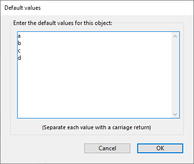

## Inserción automática

Cuando se selecciona esta opción, si un usuario introduce un valor que no se encuentra en la lista asociada al objeto, este valor se añade automáticamente a la lista almacenada en memoria.

Cuando la opción **inserción automática** no está definida (por defecto), el valor introducido se almacena en el objeto formulario pero no en la lista en memoria.

Esta propiedad es soportada por:

- objetos formulario [Combo box](comboBox_overview.md) y [columna list box](listbox_overview.md#list-box-columns) asociadoa a una lista de selección.
- objetos de formulario [Combo box](comboBox_overview.md) cuya lista asociada se llena mediante su array o fuente de datos de objetos.

Por ejemplo, dada una lista de selección que contiene "Francia, Alemania, Italia" que está asociada a un combo box "Países": si la propiedad **inserción automática** está activada y un usuario introduce "España", entonces el valor "España" se añade automáticamente a la lista en memoria:

> Si la lista de selección se creó a partir de una lista definida en el modo Diseño, la lista original no se modifica.

#### Gramática JSON

| Nombre             | Tipos de datos | Valores posibles |
| ------------------ | -------------- | ---------------- |
| automaticInsertion | boolean        | true, false      |

#### Objetos soportados

[Combo Box](comboBox_overview.md) - [Columna List Box](listbox_overview.md#list-box-columns)

---

## Lista de selección

Asocia una lista de selección a un objeto. Puede ser un nombre de lista de elección (una referencia de lista) o una colección de valores por defecto.

También se pueden asociar listas de selección a objetos utilizando los comandos [OBJECT SET LIST BY NAME](https://doc.4d.com/4dv19/help/command/en/page237.html) o [OBJECT SET LIST BY REFERENCE](https://doc.4d.com/4dv19/help/command/en/page1266.html).

#### Gramática JSON

| Nombre     | Tipos de datos   | Valores posibles                                                                 |
| ---------- | ---------------- | -------------------------------------------------------------------------------- |
| choiceList | list, collection | Una lista de valores posibles                                                    |
| lista      | list, collection | Una lista de valores posibles (listas jerárquicas únicamente) |

#### Objetos soportados

[Drop-down List](dropdownList_Overview.md) - [Combo Box](comboBox_overview.md) - [Hierarchical List](list_overview.md#overview) - [List Box Column](listbox_overview.md#list-box-columns)

---

## Lista de selección (lista estática)

Lista de valores estáticos a utilizar como etiquetas para el objeto de control de pestañas.

#### Gramática JSON

| Nombre | Tipos de datos   | Valores posibles                                        |
| ------ | ---------------- | ------------------------------------------------------- |
| labels | list, collection | Una lista de valores para llenar el control de pestañas |

#### Objetos soportados

[Control de pestañas](tabControl.md)

---

## Elemento actual

`List box colección o entity selection`

Especifica una variable o expresión a la que se asignará el elemento/entidad de la colección seleccionado por el usuario. Debe utilizar una variable objeto o una expresión asignable que acepte objetos. Si el usuario no selecciona nada o si ha utilizado una colección de valores escalares, se asigna el valor Null.

> Esta propiedad es de "sólo lectura", se actualiza automáticamente según las acciones del usuario en el list box. No se puede editar su valor para modificar el estado de selección del list box.

#### Gramática JSON

| Nombre            | Tipos de datos | Valores posibles     |
| ----------------- | -------------- | -------------------- |
| currentItemSource | string         | Expresión del objeto |

#### Objetos soportados

[List Box](listbox_overview.md#overview)

---

## Posición elemento actual

`List box colección o entity selection`

Indica una variable o expresión a la que se le asignará un entero largo que indica la posición del elemento/entidad de colección seleccionado por el usuario.

- si no se selecciona ningún elemento/entidad, la variable o expresión recibe cero,
- si se selecciona un solo elemento/entidad, la variable o expresión recibe su ubicación,
- si se seleccionan varios elementos/entidades, la variable o expresión recibe la posición del elemento/entidad que se seleccionó de última.

> Esta propiedad es de "sólo lectura", se actualiza automáticamente según las acciones del usuario en el list box. No se puede editar su valor para modificar el estado de selección del list box.

#### Gramática JSON

| Nombre                    | Tipos de datos | Valores posibles   |
| ------------------------- | -------------- | ------------------ |
| currentItemPositionSource | string         | Expresión numérica |

#### Objetos soportados

[List Box](listbox_overview.md)

---

## Tipo de datos (tipo de expresión)

Define el tipo de datos para la expresión mostrada. Esta propiedad se utiliza con:

- [Columnas del List box](listbox_overview.md#list-box-columns) de los tipos de selección y colección.
- [Listas desplegables](dropdownList_Overview.md) asociadas a objetos o arrays.

Ver también la sección [**Tipo de Expresión**](properties_Object.md#expression-type).

#### Gramática JSON

| Nombre             | Tipos de datos | Valores posibles                                                                                                                                                                                                                            |
| ------------------ | -------------- | ------------------------------------------------------------------------------------------------------------------------------------------------------------------------------------------------------------------------------------------- |
| dataSourceTypeHint | string         | <li>**columnas list box:** "boolean", "number", "picture", "text", date", "time". *Sólo array/list box selección*: "integer", "object"</li><li>**listas desplegables:** "object", "arrayText", "arrayDate", "arrayTime", "arrayNumber"</li> |

#### Objetos soportados

[Listas desplegables](dropdownList_Overview.md) asociadas a objetos o arrays - [Columna List Box](listbox_overview.md#list-box-columns)

---

## Tipo de datos (lista)

Define el tipo de datos a guardar en el campo o variable asociado a la [lista desplegable](dropdownList_Overview.md). Esta propiedad se utiliza con:

- Listas desplegables [asociadas a una lista de opciones](dropdownList_Overview.md#using-a-choice-list).
- Listas desplegables [asociadas a una lista de selección jerárquica](dropdownList_Overview.md#using-a-hierarchical-choice-list).

Hay tres opciones disponibles:

- **Referencia de lista**: declara que la lista desplegable es jerárquica. Significa que la lista desplegable puede mostrar hasta dos niveles jerárquicos y su contenido puede gestionarse mediante los comandos del lenguaje 4D del tema **Listas jerárquicas**.
- **Valor del elemento seleccionado** (por defecto): la lista desplegable no es jerárquica y el valor del elemento elegido en la lista por el usuario se guarda directamente. Por ejemplo, si el usuario elige el valor "Azul", este valor se guarda en el campo.
- **Referencia del elemento seleccionado**: la lista desplegable no es jerárquica y la referencia del elemento de la lista de selección se guarda en el objeto. Esta referencia es el valor numérico asociado a cada elemento, ya sea a través del parámetro _itemRef_ de los comandos [`APPEND TO LIST`](https://doc.4d.com/4dv19/help/command/en/page376.html) o [`SET LIST ITEM`](https://doc.4d.com/4dv19/help/command/en/page385.html), o en el editor de listas. Esta opción permite optimizar el uso de la memoria: almacenar valores numéricos en los campos ocupa menos espacio que almacenar cadenas. También facilita la traducción de aplicaciones: basta con crear varias listas en distintos idiomas pero con las mismas referencias de elementos y, a continuación, cargar la lista en función del idioma de la aplicación.

La utilización de la opción **Referencia del elemento seleccionado** requiere el cumplimiento de los siguientes principios:

- Para poder almacenar la referencia, el campo o fuente de datos variable debe ser de tipo Número (independientemente del tipo de valor que aparezca en la lista). La propiedad [expresión ](properties_Object.md#expression-type) se define automáticamente.
- Las referencias válidas y únicas deben estar asociadas a los elementos de la lista.
- La lista desplegable debe estar asociada a un campo o a una variable.

#### Gramática JSON

| Nombre | Tipos de datos | Valores posibles     |
| ------ | -------------- | -------------------- |
| saveAs | string         | "value", "reference" |

> Definir sólo `"dataSourceTypeHint" : "integer"` con un `"type": "dropdown"` objeto de formulario declarará una lista desplegable jerárquica.

#### Objetos soportados

[Listas desplegables](dropdownList_Overview.md) asociadas a listas

---

## Valores por defecto (lista de)

Lista de valores que se utilizarán como valores por defecto para la columna del list box (sólo de tipo array). Lista de valores que se utilizarán como valores por defecto para la columna del list box (sólo de tipo array). Utilizando el lenguaje, se puede gestionar el objeto haciendo referencia a este array.

> No confunda esta propiedad con la propiedad "[valor por defecto](properties_RangeOfValues.md#default-list-of-values)" que permite definir un valor de campo en los nuevos registros.

Debe introducir una lista de valores. En el editor de formularios, un diálogo específico permite introducir valores separados por retornos de carro:

> También puede definir una [lista de selección](properties_DataSource.md#choice-list) con la columna list box. Sin embargo, se utilizará una lista de selección como lista de valores seleccionables para cada línea de columna, mientras que la lista por defecto rellena todas las líneas de columna.

#### Gramática JSON

| Nombre | Tipos de datos | Valores posibles                                                                                                   |
| ------ | -------------- | ------------------------------------------------------------------------------------------------------------------ |
| values | collection     | Una colección de valores por defecto (cadenas), por ejemplo: "a", "b", "c", "d" |

#### Objetos soportados

[Columna List Box (sólo tipo array)](listbox_overview.md#list-box-columns)

---

## Expression

This description is specific to [selection](listbox_overview.md#selection-list-boxes) and [collection](listbox_overview.md#collection-or-entity-selection-list-boxes) type list box columns. Ver también la sección **[Variable o Expresión](properties_Object.md#variable-or-expression)**.

Una expresión 4D que se asociará a una columna. Puede introducir:

- Una **variable simple** (en este caso, debe ser declarada explícitamente para la compilación). Se puede utilizar cualquier tipo de variable excepto BLOBs y arrays. El valor de la variable se calculará generalmente en el evento `On Display Detail`.

- Un **campo** que utiliza la sintaxis estándar [Tabla]Campo (solo [list box tipo selección](listbox_overview.md#selection-list-boxes)), por ejemplo: `[Employees]LastName`. Se pueden utilizar los siguientes tipos de campos:
  - String
  - Numeric
  - Fecha
  - Hora
  - Picture
  - Boolean\
    Puede utilizar campos de la tabla maestra o de otras tablas.

- Una **expresión 4D** (expresión simple, fórmula o método 4D). La expresión debe devolver un valor. La expresión debe devolver un valor. El resultado de la expresión se mostrará automáticamente cuando cambie al modo Aplicación. La expresión se evaluará para cada registro de la selección (actual o temporal) de la tabla maestra (para list boxes de tipo selección), cada elemento de la colección (para list boxes de tipo colección) o cada entidad de la selección (para list boxes selección de entidades). Si está vacía, la columna no mostrará ningún resultado.
  Se soportan los siguientes tipos de expresiones:
  - String
  - Numeric
  - Fecha
  - Picture
  - Boolean

Para los list boxes colección/entity selection, Null o tipos no soportados se muestran como cadenas vacías.\
Cuando utilice colecciones o selecciones de entidades, normalmente declarará la propiedad del elemento o el atributo de entidad asociado a una columna dentro de una expresión que contenga [This](https://doc.4d.com/4Dv17R6/4D/17-R6/This.301-4310806.en.html).\
Cuando utilice colecciones o selecciones de entidades, normalmente declarará la propiedad del elemento o el atributo de entidad asociado a una columna dentro de una expresión que contenga [This](https://doc.4d.com/4Dv17R6/4D/17-R6/This.301-4310806.en.html). `This` es un comando 4D dedicado que devuelve una referencia al elemento actualmente procesado. Por ejemplo, puede utilizar `This.\<propertyPath>` donde `\<propertyPath>` es la ruta de una propiedad en la colección o una ruta de atributo de entidad para acceder al valor actual de cada elemento/entidad.
Si utiliza una colección de valores escalares, 4D creará un objeto para cada elemento de la colección con una única propiedad (llamada "valor"), llenada con el valor del elemento. En este caso, utilizará `This.value` como expresión.

Si se utiliza una expresión no asignable  (por ejemplo, `[Person]FirstName+" "+[Person]LastName`), la columna nunca se podrá introducir aunque la propiedad [Editable](properties_Entry.md#enterable) esté activada.

Si se utiliza un campo, una variable o una expresión asignable (_por ejemplo Person.lastName_), la columna puede ser editable o no dependiendo de la propiedad [Editable](properties_Entry.md#enterable).

#### Gramática JSON

| Nombre     | Tipos de datos | Valores posibles                                                                                      |
| ---------- | -------------- | ----------------------------------------------------------------------------------------------------- |
| dataSource | string         | Una variable 4D, un nombre de campo o una expresión del lenguaje compleja arbitraria. |

#### Objetos soportados

[Columna de list box](listbox_overview.md#list-box-columns)

---

## Tabla principal

`Current selection list boxes`

Especifica la tabla cuya selección actual se utilizará. Esta tabla y su selección actual constituirán la referencia de los campos asociados a las columnas del list box (referencias de campo o expresiones que contienen campos). Aunque algunas columnas contengan campos de otras tablas, el número de líneas mostradas será definido por la tabla maestra.

Se pueden utilizar todas las tablas de la base de datos, independientemente de si el formulario está relacionado con una tabla (formulario tabla) o no (formulario proyecto).

#### Gramática JSON

| Nombre | Tipos de datos | Valores posibles |
| ------ | -------------- | ---------------- |
| tabla  | number         | Número de tabla  |

#### Objetos soportados

[List Box](listbox_overview.md#overview)

---

## Guardar como

Esta propiedad está disponible en las siguientes condiciones:

- una [lista de selección](#choice-list) está asociada al objeto
- para [entradas](input_overview.md) y [columnas list box](listbox_overview.md#columnas-de-list-box), también se define una [lista requerida](properties_RangeOfValues.md#lista-requerida) para el objeto (ambas opciones deben usar normalmente la misma lista), de modo que solo se puedan ingresar valores de la lista por parte del usuario.

Esta propiedad especifica, en el contexto de un campo o variable asociado a una lista de valores, el tipo de contenido a guardar:

- **Guardar como valor** (opción por defecto): el valor del elemento elegido en la lista por el usuario se guarda directamente. Por ejemplo, si el usuario elige el valor "Azul", este valor se guarda en el campo.
- **Guardar como referencia**: la referencia del elemento de la lista de opciones se guarda en el objeto. Esta referencia es el valor numérico asociado a cada elemento, ya sea a través del parámetro _itemRef_ de los comandos [`APPEND TO LIST`](https://doc.4d.com/4dv19/help/command/en/page376.html) o [`SET LIST ITEM`](https://doc.4d.com/4dv19/help/command/en/page385.html), o en el editor de listas.

Esta opción permite optimizar el uso de la memoria: almacenar valores numéricos en los campos ocupa menos espacio que almacenar cadenas. También facilita la traducción de aplicaciones: basta con crear varias listas en distintos idiomas pero con las mismas referencias de elementos y, a continuación, cargar la lista en función del idioma de la aplicación.

El uso de esta propiedad requiere el cumplimiento de los siguientes principios:

- Para poder almacenar la referencia, el campo o fuente de datos variable debe ser de tipo Número (independientemente del tipo de valor que aparezca en la lista). La propiedad [expresión ](properties_Object.md#expression-type) se define automáticamente.
- Las referencias válidas y únicas deben estar asociadas a los elementos de la lista.

#### Gramática JSON

| Nombre | Tipos de datos | Valores posibles     |
| ------ | -------------- | -------------------- |
| saveAs | string         | "value", "reference" |

#### Objetos soportados

[Área de entrada](input_overview.md) - [Columna List Box](listbox_overview.md#list-box-columns)

---

## Elementos seleccionados

`List box colección o entity selection`

Especifica una variable o expresión a la que se asignarán los elementos o entidades seleccionados por el usuario.

- para un list box colección, debe utilizar una variable colección o una expresión asignable que acepte colecciones,
- para un list box selección de entidades, se crea un objeto de selección de entidades. Debe utilizar una variable objeto o una expresión asignable que acepte objetos.

> Esta propiedad es de "sólo lectura", se actualiza automáticamente según las acciones del usuario en el list box. No se puede editar su valor para modificar el estado de selección del list box.

#### Gramática JSON

| Nombre              | Tipos de datos | Valores posibles                          |
| ------------------- | -------------- | ----------------------------------------- |
| selectedItemsSource | string         | Colección asignable o expresión de objeto |

#### Objetos soportados

[List Box](listbox_overview.md#overview)

---

## Nombre de selección

`List boxes de tipo selección nombrada`

Especifica la selección con nombre que se utilizará. Debe introducir el nombre de una selección nombrada válida. Puede ser una selección nombrada proceso o interproceso. El contenido del list box se basará en esta selección. La selección elegida debe existir y ser válida en el momento en que se muestre el list box; de lo contrario, el list box se mostrará en blanco.

> Las selecciones con nombre son listas ordenadas de registros. Se utilizan para mantener en memoria el orden y el registro actual de una selección. Para más información, consulte la sección **Selecciones temporales** del manual _Lenguaje 4D_.

#### Gramática JSON

| Nombre         | Tipos de datos | Valores posibles       |
| -------------- | -------------- | ---------------------- |
| namedSelection | string         | Nombre de la selección |

#### Objetos soportados

[List Box](listbox_overview.md#overview)
