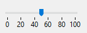

La regla es un objeto de interfaz estándar que se utiliza para definir u obtener valores mediante un cursor que se mueve a lo largo de sus graduaciones.

Puede asignar su [variable o expresión asociada](properties_Object.md#expression-type) a un área editable (campo o variable) para almacenar o modificar el valor actual del objeto.

Para más información, consulte [Uso de indicadores](progressIndicator.md#using-indicators) en la página "Indicador de progreso".

### Propiedades soportadas

[Negrita](properties_Text.md#bold) - [Estilo de línea de borde](properties_BackgroundAndBorder.md#border-line-style) -[Inferior](properties_CoordinatesAndSizing.md#bottom) - [Clase](properties_Object.md#css-class) - [Mostrar graduación](properties_Scale.md#display-graduation) - [Editable](properties_Entry.md#enterable) - [Ejecutar método objeto](properties_Action.md#execute-object-method) - [Tipo de expresión](properties_Object.md#expression-type) - [Altura](properties_CoordinatesAndSizing.md#height) - [Paso de graduación](properties_Scale.md#graduation-step) -[Mensaje de ayuda](properties_Help.md#help-tip) - [Dimensionamiento horizontal](properties_ResizingOptions.md#horizontal-sizing) - [Ubicación de la etiqueta](properties_Scale.md#label-location) - [Izquierda](properties_CoordinatesAndSizing.md#left) - [Máximo](properties_Scale.md#maximum) - [Mínimo](properties_Scale.md#minimum) - [Formato de número](properties_Display.md#number-format) - [Nombre del objeto](properties_Object.md#object-name) - [Derecha](properties_CoordinatesAndSizing.md#right) - [Paso](properties_Scale.md#step) - [Superior](properties_CoordinatesAndSizing.md#top) - [Tipo](properties_Object.md#type) - [Variable o expresión](properties_Object.md#variable-or-expression) - [Dimensionamiento vertical](properties_ResizingOptions.md#vertical-sizing) - [Visibilidad](properties_Display.md#visibility) - [Ancho](properties_CoordinatesAndSizing.md#width)

### Eventos soportados

[On Begin Drag Over](../Events/onBeginDragOver.md) - [On Clicked](../Events/onClicked.md) - [On Data Change](../Events/onDataChange.md) - [On Double Clicked](../Events/onDoubleClicked.md) - [On Drag Over](../Events/onDragOver.md) - [On Drop](../Events/onDrop.md) - [On Getting focus](../Events/onGettingFocus.md) - [On Header](../Events/onHeader.md) - [On Load](../Events/onLoad.md) - [On Losing focus](../Events/onLosingFocus.md) - [On Mouse Enter](../Events/onMouseEnter.md) - [On Mouse Leave](../Events/onMouseLeave.md) - [On Mouse Move](../Events/onMouseMove.md) - [On Printing Break](../Events/onPrintingBreak.md) - [On Printing Detail](../Events/onPrintingDetail.md) - [On Printing Footer](../Events/onPrintingFooter.md) - [On Unload](../Events/onUnload.md) - [On Validate](../Events/onValidate.md)

## Ver también

- [indicadores de progreso](progressIndicator.md)
- [steppers](stepper.md)