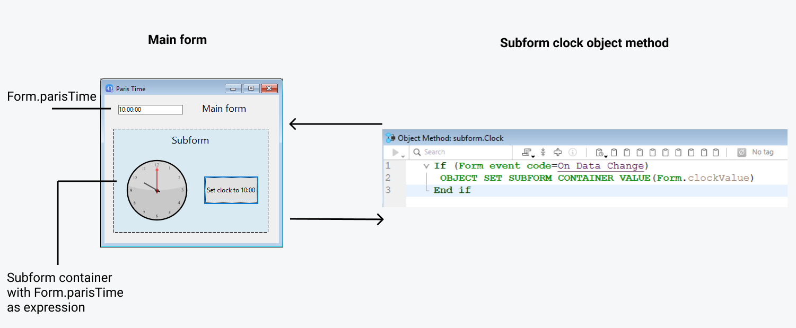
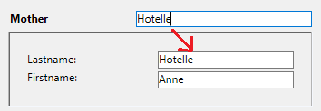

Un subformulario es un formulario incluido en otro formulario.

## Terminología

Con el fin de definir claramente los conceptos implementados con los subformularios, aquí hay algunas definiciones para ciertos términos utilizados:

- **Subformulario**: un formulario destinado a ser incluido en otro formulario, llamado a su vez formulario padre.
- **Formulario padre**: un formulario que contiene uno o más subformularios.
- **Contenedor de subformulario**: un objeto incluido en el formulario padre, que muestra una instancia del subformulario.
- **Instancia de subformulario**: la representación de un subformulario en un formulario padre. Este concepto es importante porque es posible mostrar varias instancias del mismo subformulario en un formulario padre.
- **Formulario listado**: instancia de subformulario mostrada como una lista.
- **Formulario detallado**: formulario de entrada tipo página asociado a un subformulario tipo lista al que se accede haciendo doble clic en la lista.

## Sub-formularios en lista

Un subformulario lista le permite introducir, ver y modificar datos en otras tablas. Normalmente se utilizan subformularios lista en bases de datos en las que se han establecido relaciones Uno a Muchos. Un subformulario lista en un formulario de una tabla Uno relacionada le permite ver, introducir y modificar datos en una tabla Muchos relacionada. Puede tener varios subformularios procedentes de diferentes tablas en el mismo formulario. Sin embargo, no es posible colocar dos subformularios que pertenecen a la misma tabla en la misma página de un formulario.

Por ejemplo, una base de datos del gestor de contactos puede utilizar un subformulario lista para mostrar todos los números de teléfono de un contacto. Aunque los números de teléfono aparecen en la pantalla Contactos, la información se almacena realmente en una tabla relacionada. Utilizando una relación de Uno a Muchos, este diseño de base de datos facilita el almacenamiento de un número ilimitado de números de teléfono por contacto. Con las relaciones automáticas, se puede soportar la entrada de datos directamente en la tabla Muchos relacionada sin programar.

Aunque los subformularios lista suelen estar asociados a muchas tablas, una instancia de subformulario puede mostrar los registros de cualquier otra tabla de la base de datos.

También puede permitir que el usuario introduzca datos en el formulario lista.
Dependiendo de la configuración del subformulario, el usuario puede mostrar el formulario detallado haciendo doble clic en un subregistro o utilizando los comandos para añadir y editar subregistros.

> 4D ofrece tres acciones estándar para satisfacer las necesidades básicas de gestión de los subregistros: `Edit Subrecord`, `Delete Subrecord` y `Add Subrecord`. Cuando el formulario incluye varias instancias de subformulario, la acción se aplicará al subformulario que tenga el foco.

## Sub-formularios en página

Los subformularios en modo página pueden mostrar los datos del subregistro actual o todo valor pertinente en función del contexto (variables, imágenes, etc.). Una de las principales ventajas de utilizar subformularios página es que pueden incluir funcionalidades avanzadas y pueden interactuar directamente con el formulario padre (widgets). Los subformularios en página también tienen sus propiedades y eventos específicos; puede gestionarlos completamente por programación.

El subformulario en página utiliza el formulario de entrada indicado por la propiedad [Formulario detallado](properties_Subform.md#detail-form). A diferencia de un subformulario en modo lista, el formulario utilizado puede proceder de la misma tabla que el formulario padre. También es posible utilizar un formulario proyecto. Cuando se ejecuta, un subformulario en modo página tiene las mismas características de visualización estándar que un formulario de entrada.

> Los widgets 4D son objetos compuestos predefinidos basados en subformularios página. Se describen detalladamente en un manual aparte, [4D Widgets](https://doc.4d.com/4Dv19/4D/19/4D-Widgets.100-5462909.en.html).

### Utilización de la variable o expresión asociada

Puede vincular [una variable o una expresión](properties_Object.md#variable-or-expression) a un objeto contenedor de subformulario. Esto es muy útil para sincronizar valores del formulario padre y su(s) subformulario(s).

By default, 4D creates a variable or expression of [object type](properties_Object.md#expression-type) for a subform container, which allows you to share values in the context of the subform using the `Form` command ([see below](#using-the-subform-bound-object)). However, you can use a variable or expression of any scalar type (time, integer, etc.) especially if you only need to share a single value:

- Define a bound variable or expression of a scalar type and call the `OBJECT Get subform container value` and `OBJECT SET SUBFORM CONTAINER VALUE` commands to exchange values when [On Bound Variable Change](../Events/onBoundVariableChange.md) or [On Data Change](../Events/onDataChange.md) form events occur. Esta solución se recomienda para sincronizar un solo valor.
- Defina una variable o expresión vinculada del tipo **objecto** y utilice el comando `Form` para acceder a sus propiedades desde el subformulario. Esta solución se recomienda para sincronizar varios valores.

### Sincronizando formulario padre y subformulario (valor único)

Vincular la misma variable o expresión al contenedor del subformulario y a otros objetos del formulario principal permite vincular los contextos del formulario principal y del subformulario para dar los toques finales a interfaces sofisticadas. Imagine un subformulario que contiene un reloj que muestra una hora estática, insertado en un formulario padre que contiene un [área de entrada](input_overview.md):


En el formulario padre, ambos objetos (área de entrada y contenedor subformulario) **tienen el mismo valor que _Variable o Expresión_**. Puede ser una variable (por ejemplo, `parisTime`), o una expresión (por ejemplo, `Form.parisTime`).

:::info

Para mostrar una hora estática, debe utilizar el [tipo de datos](properties_DataSource.md#data-type-expression-type) apropiado para la [variable o la expresión](properties_Object.md#variable-or-expression):

- Si utiliza una variable (por ejemplo, `parisTime`), debe ser del tipo `texto` o `tiempo`.
- Si utiliza una expresión (por ejemplo, `Form.myValue`), debe contener un valor `texto`.

El valor del texto debe tener el formato "hh:mm:ss".

:::

En el subformulario, el objeto reloj se gestiona a través de la propiedad `Form.clockValue`.

#### Actualizando el contenido de un subformulario

Caso 1: se modifica el valor de la variable o expresión del formulario padre y esta modificación debe pasarse al subformulario.

`parisTime` o `Form.parisTime` cambia a "12:15:00" en el formulario padre, bien porque el usuario lo ha introducido, bien porque se ha actualizado dinámicamente (a través de la sentencia `String(Current time)` por ejemplo). Esto activa el evento [On Bound Variable Change](../Events/onBoundVariableChange.md) en el método formulario del subformulario.

Se ejecuta el siguiente código:

```4d
// Subform form method
If (Form event code=On Bound Variable Change) //bound variable or expression was modified in the parent form
	Form.clockValue:=OBJECT Get subform container value //synchonize the local value
End if
```

Actualiza el valor de `Form.clockValue` en el subformulario:


Se genera el evento formulario [On Bound Variable Change](../Events/onBoundVariableChange.md):

- en cuanto se asigna un valor a la variable/expresión del formulario padre, incluso si se reasigna el mismo valor
- si el subformulario pertenece a la página formulario actual o a la página 0.

Note that, as in the above example, it is preferable to use the `OBJECT Get subform container value` command which returns the value of the expression in the subform container rather than the expression itself because it is possible to insert several subforms in the same parent form (for example, a window displaying different time zones contains several clocks).

La modificación de la variable o expresión asociada desencadena eventos de formulario que permiten sincronizar los valores del formulario padre y del subformulario:

- Utilice el evento de formulario [On Bound Variable Change](../Events/onBoundVariableChange.md) para indicar al subformulario (método de formulario del subformulario) que la variable o expresión fue modificada en el formulario padre.
- Utilice el evento de formulario [On Data Change](../Events/onDataChange.md) para indicar al contenedor del subformulario que el valor de la variable o expresión fue modificado en el subformulario.

#### Actualizar el contenido de un formulario padre

Caso 2: se modifica el contenido del subformulario y esta modificación debe pasar al formulario padre.

Dentro del subformulario, el botón cambia el valor de la expresión `Form.clockValue` de tipo Text asociada al objeto reloj. Esto activa el evento de formulario [On Data Change](../Events/onDataChange.md) dentro del objeto reloj (este evento debe estar seleccionado para el objeto), que actualiza el valor `Form.parisTime` en el formulario principal.

Se ejecuta el siguiente código:

```4d
// subform clock object method
If (Form event code=On Data Change) //whatever the way the value is changed
	OBJECT SET SUBFORM CONTAINER VALUE(Form.clockValue) //Push the value to the container
End if
```



Cada vez que cambia el valor de `Form.clockValue` en el subformulario, también se actualiza `parisTime` o `Form.parisTime` en el contenedor del subformulario.

> Si el valor de la variable o expresión se establece en varias ubicaciones, 4D utiliza el valor que se cargó en último lugar. Aplica el siguiente orden de carga: 1-Métodos objeto del subformulario, 2-Método formulario del subformulario, 3-Métodos objeto del formulario padre, 4-Método formulario del formulario padre

### Sincronizando formulario padre y subformulario (múltiples valores)

Por defecto, 4D vincula una variable o expresión de [tipo de objeto](properties_Object.md#expression-type) a cada subformulario. El contenido de este objeto puede leerse y/o modificarse desde el formulario padre y desde el subformulario, lo que permite compartir múltiples valores en un contexto local.

Cuando se asocia al contenedor del subformulario, este objeto es devuelto por el comando `Form` directamente en el subformulario. Dado que los objetos se pasan siempre por referencia, si el usuario modifica el valor de una propiedad en el subformulario, se guardará automáticamente en el propio objeto y, por tanto, estará disponible para el formulario padre. Por otro lado, si una propiedad del objeto es modificada por el usuario en el formulario padre o por programación, se actualizará automáticamente en el subformulario. No es necesaria ninguna gestión de eventos.

Por ejemplo, en un subformulario, las entradas están vinculadas a las propiedades del objeto `Form` (del formulario del subformulario):


En el formulario padre, se muestra el subfomulario dos veces. Cada contenedor de subformulario está asociado a una expresión que es una propiedad del objeto `Form` (del formulario padre):


El botón sólo crea las propiedades `mother` y `father` en el objeto `Form` del padre:

```4d
//Método objeto botón añadir valores
Form.mother:=New object("lastname"; "Hotel"; "firstname"; "Anne")
Form.father:=New object("lastname"; "Golf"; "firstname"; "Félix")
```

Cuando ejecuta el formulario y presiona el botón, ve que todos los valores se muestran correctamente:


Si modifica un valor en el formulario padre o en el subformulario, se actualiza automáticamente en el otro formulario porque se utiliza el mismo objeto:




### Uso de punteros (compatibilidad)

En versiones anteriores a 4D v19 R5, la sincronización entre formularios padre y subformularios se gestionaba a través de **punteros**. Por ejemplo, para actualizar un objeto subformulario, podría llamar al siguiente código:

```4d
// Subform form method
If (Form event code=On Bound Variable Change) 
	ptr:=OBJECT Get pointer(Object subform container) 
	clockValue:=ptr-> 
End if
```

**Este principio aún se soporta por compatibilidad, pero ahora es obsoleto, ya que no permite vincular expresiones a subformularios.** Ya no debería utilizarse en sus desarrollos. In any cases, we recommend to use the [`Form` command](#synchronizing-parent-form-and-subform-multiple-values) or the [`OBJECT Get subform container value` and `OBJECT SET SUBFORM CONTAINER VALUE` commands](#synchronizing-parent-form-and-subform-single-value) to synchronize form and subform values.

### Programación entre formularios avanzada

La comunicación entre el formulario padre y las instancias del subformulario puede requerir ir más allá del intercambio de valores a través de la variable asociada. De hecho, es posible que desee actualizar las variables de los subformularios en función de las acciones realizadas en el formulario principal y viceversa. Si utilizamos el ejemplo anterior del subformulario de tipo "reloj dinámico", es posible que queramos definir una o varias horas de alarma para cada reloj.

4D ha implementado los siguientes mecanismos para satisfacer estas necesidades:

- Llamada de un objeto contenedor desde el subformulario utilizando el comando `CALL SUBFORM CONTAINER`
- Ejecución de un método en el contexto del subformulario mediante el comando `EXECUTE METHOD IN SUBFORM`

> El comando `GOTO OBJECT` busca el objeto de destino en el formulario padre aunque se ejecute desde un subformulario.

#### Comando CALL SUBFORM CONTAINER

El comando `CALL SUBFORM CONTAINER` permite que una instancia de subformulario envíe un [evento](../Events/overview.md) al objeto contenedor del subformulario, que puede procesarlo en el contexto del formulario padre. El evento se recibe en el método del objeto contenedor. Puede estar en el origen de todo evento detectado por el subformulario (clic, arrastrar y soltar, etc.).

El código del evento no tiene restricciones (por ejemplo, 20000 o -100). Puede utilizar un código que corresponda a un evento existente (por ejemplo, 3 para `On Validate`), o utilizar un código personalizado. En el primer caso, sólo puede utilizar los eventos que haya marcado en la lista de propiedades para los contenedores de subformulario. En el segundo caso, el código no debe corresponder a ningún evento de formulario existente. Se recomienda utilizar un valor negativo para asegurarse de que este código no será utilizado por 4D en futuras versiones.

Para más información, consulte la descripción del comando `CALL SUBFORM CONTAINER`.

#### Comando EXECUTE METHOD IN SUBFORM

El comando `EXECUTE METHOD IN SUBFORM` permite que un formulario o uno de sus objetos solicite la ejecución de un método en el contexto de la instancia del subformulario, lo que le da acceso a las variables, objetos, etc. del subformulario. Este método también puede recibir parámetros.

Este mecanismo se ilustra en el siguiente diagrama:


Para más información, consulte la descripción del comando `EXECUTE METHOD IN SUBFORM`.

## Propiedades soportadas

[Border Line Style](properties_BackgroundAndBorder.md#border-line-style) - [Bottom](properties_CoordinatesAndSizing.md#bottom) - [Class](properties_Object.md#css-class) - [Detail Form](properties_Subform.md#detail-form) - [Double click on empty row](properties_Subform.md#double-click-on-empty-row) - [Double click on row](properties_Subform.md#double-click-on-row) - [Enterable in list](properties_Subform.md#enterable-in-list) - [Expression Type](properties_Object.md#expression-type) - [Focusable](properties_Entry.md#focusable) - [Height](properties_CoordinatesAndSizing.md#height) -
[Hide focus rectangle](properties_Appearance.md#hide-focus-rectangle) -
[Horizontal Scroll Bar](properties_Appearance.md#horizontal-scroll-bar) - [Horizontal Sizing](properties_ResizingOptions.md#horizontal-sizing) - [Left](properties_CoordinatesAndSizing.md#left) - [List Form](properties_Subform.md#list-form) - [Method](properties_Action.md#method) - [Object Name](properties_Object.md#object-name) - [Print Frame](properties_Print.md#print-frame) - [Right](properties_CoordinatesAndSizing.md#right) - [Selection mode](properties_Subform.md#selection-mode) - [Source](properties_Subform.md#source) - [Top](properties_CoordinatesAndSizing.md#top) - [Type](properties_Object.md#type) - [Variable or Expression](properties_Object.md#variable-or-expression) - [Vertical Scroll Bar](properties_Appearance.md#vertical-scroll-bar) - [Vertical Sizing](properties_ResizingOptions.md#vertical-sizing) - [Visibility](properties_Display.md#visibility) - [Width](properties_CoordinatesAndSizing.md#width)
