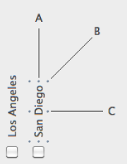

Un objeto texto permite mostrar contenido escrito estático (_por ejemplo_, instrucciones, títulos, etiquetas, etc.) en un formulario. Estas áreas de texto estáticas pueden convertirse en dinámicas cuando incluyen referencias dinámicas. Para más información, consulte [Uso de referencias en textos estáticos](https://doc.4d.com/4Dv17R5/4D/17-R5/Using-references-in-static-text.300-4163725.en.html).

#### Ejemplo JSON:

```4d
	"myText": {
                "type": "text",
                "text": "Hello World!",
                "textAlign": "center",
                "left": 60,			
                "top": 160,	
                "width": 100,
                "height": 20,
                "stroke": "#ff0000"		//color del texto
                "fontWeight": "bold"
                }
```

## Rotación

4D le permite rotar las áreas de texto en sus formularios utilizando la propiedad [Orientación](properties_Text.md#orientation).


> La rotación del texto puede definirse para un proceso utilizando el comando de lenguaje `OBJECT SET TEXT ORIENTATION`.

Una vez que un texto está rotado, puede seguir cambiando su tamaño o posición, así como todas sus propiedades. Tenga en cuenta que las propiedades de alto y ancho del área de texto no dependen de su orientación:



- Si el objeto se redimensiona en la dirección A, se modifica su [ancho](properties_CoordinatesAndSizing.md#width);
- Si el objeto se redimensiona en la dirección C, se modifica su [alto](properties_CoordinatesAndSizing.md#height);
- Si el objeto se redimensiona en la dirección B, se modifican tanto su [ancho](properties_CoordinatesAndSizing.md#width) como su [alto](properties_CoordinatesAndSizing.md#height).

## Propiedades soportadas

<details><summary>Historia</summary>

| Lanzamiento | Modificaciones                           |
| ----------- | ---------------------------------------- |
| 19 R7       | Soporte de la propiedad Radio de esquina |

</details>

[Bold](properties_Text.md#bold) - [Border Line Style](properties_BackgroundAndBorder.md#border-line-style) - [Bottom](properties_CoordinatesAndSizing.md#bottom) - [Class](properties_Object.md#css-class) - [Corner radius](properties_CoordinatesAndSizing.md#corner-radius) - [Fill Color](properties_BackgroundAndBorder.md#background-color--fill-color) - [Font](properties_Text.md#font) - [Font Color](properties_Text.md#font-color) - [Font Size](properties_Text.md#font-size) - [Height](properties_CoordinatesAndSizing.md#height) - [Horizontal Alignment](properties_Text.md#horizontal-alignment) - [Horizontal Sizing](properties_ResizingOptions.md#horizontal-sizing) - [Italic](properties_Text.md#italic) - [Left](properties_CoordinatesAndSizing.md#left) - [Object Name](properties_Object.md#object-name) - [Orientation](properties_Text.md#orientation) - [Right](properties_CoordinatesAndSizing.md#right) - [Title](properties_Object.md#title) - [Top](properties_CoordinatesAndSizing.md#top) - [Type](properties_Object.md#type) - [Underline](properties_Text.md#underline) - [Vertical Sizing](properties_ResizingOptions.md#vertical-sizing) - [Visibility](properties_Display.md#visibility) - [Width](properties_CoordinatesAndSizing.md#width)
