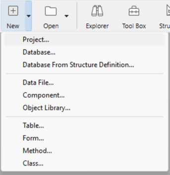
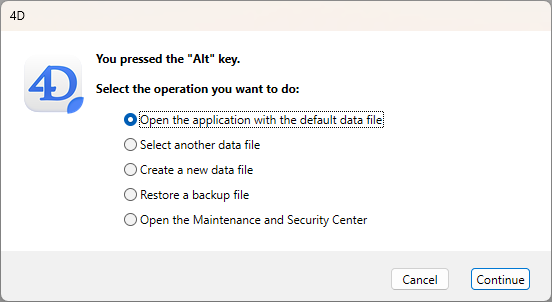
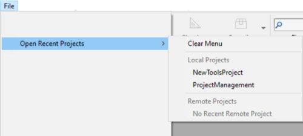

## Crear un proyecto

Se pueden crear nuevos proyectos de aplicaciones 4D desde **4D** o **4D Server**. En cualquier caso, los archivos del proyecto se almacenan en la máquina local.

Para crear un nuevo proyecto:

1. Lance 4D o 4D Server.
2. Haga una de las siguientes cosas:
   - Selecciona **Nuevo > Proyecto...** en el menú **Archivo**: 
   - (4D only) Select **Project...** from the **New** toolbar button:
    
     A standard **Save** dialog appears so you can choose the name and location of the 4D project's main folder.

:::note

The **Database...** and **Database From Structure Definition...** items are only available if you have selected the [**Enable binary database creation** option](../Preferences/general.md#enable-binary-database-creation) in your Preferences (disabled by default).

:::

3. Introduzca el nombre de su carpeta de proyecto y haga clic en **Guardar**. Este nombre se utilizará:

   - como nombre de la carpeta del proyecto,
   - como nombre del archivo .4DProject en el primer nivel de la [carpeta "Project"](../Project/architecture.md#project-folder).

Puedes elegir cualquier nombre permitido por su sistema operativo. Sin embargo, si su proyecto está destinado a funcionar en otros sistemas o a ser guardado a través de una herramienta de control de fuente, debe tener en cuenta sus recomendaciones de denominación específicas.

Al validar el diálogo **Guardar**, 4D cierra el proyecto actual (si lo hay), crea una carpeta de proyecto en la ubicación indicada y coloca en ella todos los archivos necesarios para el proyecto. Para más información, consulte [Arquitectura de un proyecto 4D](Project/architecture.md).

A continuación, puede empezar a desarrollar su proyecto.

## Abrir un proyecto

Para abrir un proyecto existente desde 4D:

1. Haga una de las siguientes cosas:

   - Seleccione **Abrir/Proyecto local...** desde el menú **Archivo** o del botón**Abrir** de la barra de herramientas.
   - Seleccione **Abrir un proyecto de aplicación local** en el diálogo del Asistente de Bienvenida

Aparece la caja de diálogo estándar de apertura de archivos.

2. Seleccione el archivo `.4dproject` del proyecto (situado dentro de la carpeta ["Project" del proyecto](../Project/architecture.md#project-folder)) y haga clic en **Abrir**.

   Por defecto, el proyecto se abre con su archivo de datos actual. Se sugieren otros tipos de archivos:

   - *Archivos de proyectos empaquetados*: extensión `.4dz` - proyectos de despliegue
   - *Archivos de acceso directo*: extensión `.4DLink` - almacenan los parámetros adicionales necesarios para abrir proyectos o aplicaciones (direcciones, identificadores, etc.)
   - *Archivos binarios*: extensión `.4db` o `.4dc` - formatos de base de datos 4D heredados

:::note

También puede iniciar proyectos 4D sin interfaz gracias a la [CLI (Interfaz de línea de comandos)](../Admin/cli.md) de 4D.

:::

### Opciones

Además de las opciones sistema estándar, la caja de diálogo *Abrir* de 4D ofrece dos menús con opciones específicas disponibles utilizando el botón **Abrir** y el menú **Archivo de datos**.

- **Abrir** - modo de apertura del proyecto:
  - **Interpretado** o **Compilado**: estas opciones están disponibles cuando el proyecto seleccionado contiene [código interpretado y compilado](Concepts/interpreted.md).
  - **[Centro de seguridad y de mantenimiento](MSC/overview.md)**: apertura en modo seguro que permite el acceso a los proyectos dañados para realizar las reparaciones necesarias.

- **Archivo de datos** - especifica el archivo de datos a utilizar con el proyecto. Por defecto, está seleccionada la opción **Archivo de datos actual**. This menu includes two additional options since 4D allows you to use the same project with different data files. Data and structure files must however correspond. In order to preserve data integrity, 4D does not allow a data file to be opened if it has not been created by the current project file. The program automatically assigns internal link numbers (UUID) to the data and project files when they are created or when the project is converted. These numbers are verified when the data file is opened.

  - **Choose another data file**: Opens the project with an existing data file other than the current one. When you select this option and then click on **Open**, the standard Open data file dialog box appears so that you can designate a data file.
  - **Create a new data file**: Creates a blank data file for the project. When you select this option and then click on **Open**, the standard Save data file dialog box appears.

  Once you have changed the current data file, 4D opens it by default subsequently.  
  If you move or rename the data file, you will need to locate it again. It is possible to change the data file using a keyboard shortcut on startup. You can view the current data file at any time on the [Information page of the MSC](../MSC/information.md#data).

### Startup Maintenance Dialog

If you need to interrupt the startup sequence, for example if the project isn't launching properly or if you want to switch to a different data file, hold down the **Alt** (Windows) or **Option** (macOS) key during database startup to display the startup maintenance dialog box:

The following maintenance options are available:

- **Open the application with the default data file**: continues the standard opening process.
- **Select another data file** / **Create a new data file**: allows you to change of data file (see above).
- **Restore a backup file**: opens standard Open file dialog box, so that you can select a backup file (.4bk) or a log backup file (.4bl) to [restore](../Backup/restore.md#manually-restoring-a-backup-standard-dialog).
- **Open the Maintenance and Security Center**: opens the project in [maintenance mode](../MSC/overview.md#display-in-maintenance-mode).

## Atajos de apertura de los proyectos

4D ofrece varias formas de abrir proyectos directamente y evitar el diálogo de apertura:

- via the **Open Recent Projects / {project name}** submenu of the **File** menu or **Open** toolbar button.  
  
- double-click or drag and drop a `.4DLink` file onto the 4D application (see below).
- by setting the **At startup** general preference to [**Open last used project**](../Preferences/general.md#at-startup).

:::note Notas

- En Windows, un proyecto de 4D Server se puede iniciar automáticamente al iniciar la sesión si está [registrado como servicio](../server/service.md).
- A [built 4D application](../Desktop/building.md) can be launched by a double-click on the application icon.

:::

## Sobre 4DLink Files

Los archivos con la extensión `.4DLink` son archivos XML que contienen parámetros destinados a automatizar y a simplificar la apertura de proyectos 4D locales o remotos.

Los archivos `.4DLink` pueden guardar la dirección de un proyecto 4D, así como sus identificadores de conexión y el modo de apertura, lo que permite ahorrar tiempo al abrir los proyectos.

4D genera automáticamente un archivo `.4DLink` cuando se abre un proyecto local por primera vez o cuando se conecta a un servidor por primera vez. El archivo se almacena en la carpeta de preferencias locales en la siguiente ubicación:

- Windows: C:\Users\UserName\AppData\Roaming\4D\Favorites vXX\
- macOS: Users/UserName/Library/Application Support/4D/Favorites vXX/

XX representa el número de versión de la aplicación. Por ejemplo, "Favoritos v19" para 4D v19.

Esa carpeta está dividida en dos subcarpetas:

- la carpeta **Local** contiene los archivos `.4DLink` que pueden utilizarse para abrir proyectos locales
- la carpeta **Remote** contiene los archivos `.4DLink` de proyectos remotos recientes

Los archivos `.4DLink` también pueden crearse con un editor XML.

4D ofrece un DTD que describe las llaves XML que pueden utilizarse para crear un archivo `.4DLink`. Este DTD se llama database_link.dtd y se encuentra en la subcarpeta `\Resources\DTD\` de la aplicación 4D.

