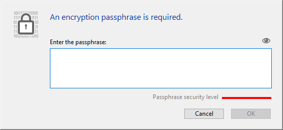

Puede utilizar esta página para cifrar o _descifrar_ (es decir, eliminar el cifrado) el archivo de datos, según el estado del atributo **Encriptable** definido para cada tabla de la base.

:::info

Para obtener información detallada sobre la encriptación de datos en 4D, consulte la sección [Encriptación de datos](https://doc.4d.com/4Dv20/4D/20/Encrypting-data.300-6263735.en.html) del manual de _Diseño_. También puede leer la entrada del blog [Una mirada más profunda al cifrado de datos en 4D](https://blog.4d.com/a-deeper-look-into-4d-data-encryption/).

:::

Se crea una nueva carpeta cada vez que se realiza una operación de cifrado/descifrado. Se denomina "Replaced Files (Encrypting) _yyyy-mm-dd hh-mm-ss_> o "Replaced Files (Decrypting) _yyyy-mm-dd hh-mm-ss_".

> El cifrado sólo está disponible en [modo mantenimiento](overview.md#display-in-maintenance-mode). Si intenta realizar esta operación en modo estándar, un diálogo de advertencia le informará de que la aplicación se cerrará y se reiniciará en modo de mantenimiento

**Warning:**

- Cifrar un archivo de datos es una operación de larga duración. Muestra un indicador de progreso (que puede ser interrumpido por el usuario). Tenga en cuenta también que una operación de encriptación de una aplicación incluye un paso de compactación.
- Cada operación de cifrado produce una copia del archivo de datos, lo que aumenta el tamaño de la carpeta de la aplicación. Es importante tener esto en cuenta (especialmente en macOS, donde las aplicaciones 4D aparecen como paquetes) para que el tamaño de la aplicación no aumente excesivamente. Mover o eliminar manualmente las copias del archivo original dentro del paquete puede ser útil para minimizar el tamaño del paquete.

## Cifrar datos por primera vez

Para cifrar los datos por primera vez con el CSM es necesario seguir los siguientes pasos:

1. En el editor de estructuras, marque el atributo **Encriptable** de cada tabla cuyos datos desee encriptar. Ver la sección "Propiedades de las tablas".
2. Abra la página de encriptación del CSM.
   Si abre la página sin defini ninguna tabla como **Encriptable**, se muestra el siguiente mensaje en la página:
   
   En caso contrario, se muestra el siguiente mensaje:
   

   Esto significa que el estado **Encriptable** de al menos una tabla ha sido modificado y el archivo de datos aún no ha sido encriptado.
   \*\*Nota: \*\*El mismo mensaje se muestra cuando el estado **Encriptable** se ha modificado en un archivo de datos ya encriptado o después de que el archivo de datos haya sido desencriptado (ver más abajo).

3. Haga clic en el botón imagen Cifrar.\
   \
   You will be prompted to enter a passphrase for your data file:
   
   The passphrase is used to generate the data encryption key. Una frase secreta es una versión más segura de una contraseña y puede contener un gran número de caracteres. Por ejemplo, puede introducir una frase de paso como "We all came out to Montreux" o "¡Mi primera gran frase de paso!".
   El indicador de nivel de seguridad puede ayudarle a evaluar la solidez de su frase de contraseña:
   
   (el verde intenso es el nivel más alto)
4. Introduzca para confirmar su frase secreta segura.

A continuación, se inicia el proceso de encriptación. Si el CSM se abrió en modo estándar, la aplicación se reabre en modo mantenimiento.

4D ofrece guardar la llave de encriptación (ver [Guardar la llave de encriptación](#saving-the-encryption-key) más abajo). Puedes hacerlo en este momento o más adelante. También puede abrir el archivo de historial de encriptación.

Si el proceso de encriptación es exitoso, la página de encriptación muestra los botones de operaciones de mantenimiento de encriptación.

**Atención:** durante la operación de encriptación, 4D crea un nuevo archivo de datos vacío y lo llena con los datos del archivo de datos original. Los registros correspondientes a las tablas "encriptadas" se encriptan y luego se copian, los demás registros sólo se copian (también se ejecuta una operación de compactación). Si la operación tiene éxito, el archivo de datos original se traslada a una carpeta de "Archivos reemplazados (encriptados)". Si tiene la intención de entregar un archivo de datos encriptado, asegúrese antes de mover/eliminar cualquier archivo de datos no encriptado de la carpeta de la aplicación.

## Operaciones de mantenimiento de la encriptación

Cuando una aplicación está encriptada (ver arriba), la página Encriptar ofrece varias operaciones de mantenimiento de la encriptación, correspondientes a los escenarios estándar.

### Suministrar la llave de encriptación de datos actual

Por razones de seguridad, todas las operaciones de mantenimiento del cifrado requieren necesitan la llave de cifrado de datos actual.

- Si la llave de encriptación de datos ya está cargada en el llavero 4D(1), ésta es reutilizada automáticamente por 4D.
- Si no se encuentra la llave de encriptación de datos, debe proporcionarla. Se muestra el siguiente diálogo:
  

En este paso, tiene dos opciones:

- introduzca la frase secreta actual(2) y haga clic en **OK**.
  O
- conecte un dispositivo como una llave USB y haga clic en el botón **Escanear dispositivos**.

(1) El llavero 4D almacena todas las llaves de cifrado de datos válidas introducidas durante la sesión de aplicación.\
(2) La frase de contraseña actual es la frase de contraseña utilizada para generar la clave de cifrado actual.

En todos los casos, si se proporciona información válida, 4D se reinicia en modo de mantenimiento (si no es ya el caso) y ejecuta la operación.

### Volver a cifrar los datos con la llave de cifrado actual

Esta operación es útil cuando se ha modificado el atributo **Encriptable** de una o varias tablas que contienen los datos. En este caso, para evitar incoherencias en el archivo de datos, 4D impide cualquier acceso de escritura a los registros de las tablas en la aplicación. Entonces es necesario volver a cifrar los datos para restablecer un estado de cifrado válido.

1. Haga clic en **Recibir los datos con la llave de cifrado actual**.
2. Introduzca la llave de encriptación de datos actual.

El archivo de datos se vuelve a cifrar correctamente con la llave actual y se muestra un mensaje de confirmación:

### Cambiar la frase secreta y volver a encriptar los datos

Esta operación es útil cuando se necesita cambiar la llave de datos de encriptación actual. Por ejemplo, es posible que tenga que hacerlo para cumplir con las normas de seguridad (como la exigencia de cambiar la frase secreta cada tres meses).

1. Haga clic en **Cambiar su frase de contraseña y volver a cifrar los datos**.
2. Introduzca la llave de encriptación de datos actual.
3. Ingrese la nueva frase de contraseña (para mayor seguridad, se le solicita ingresarla dos veces):
   
   El archivo de datos se cifra con la nueva llave y se muestra el mensaje de confirmación.
   

### Desencriptar todos los datos

Esta operación elimina toda la codificación del archivo de datos. Si ya no desea tener sus datos encriptados:

1. Haga clic en **Desencriptar todos los datos**.
2. Introduzca la llave de encriptación de datos actual ( ver Suministrar la llave de encriptación de datos actual).

El archivo de datos se descifra completamente y se muestra un mensaje de confirmación:

> Una vez descifrado el archivo de datos, el estado de cifrado de las tablas no coincide con sus atributos Encriptables. Para restablecer un estado coincidente, debe anular la selección de todos los atributos **Encriptable** al nivel de la estructura de la base.

## Guardar la llave de encriptación

4D le permite guardar la llave de encriptación de datos en un archivo dedicado. El nombre del archivo debe tener la extensión `.4DKeyChain`, por ejemplo "myKeys.4DKeyChain". El almacenamiento de este archivo en un dispositivo externo, como una llave USB, facilitará el uso de una aplicación cifrada, ya que el usuario sólo tendría que conectar el dispositivo para entregar la llave antes de abrir la aplicación para acceder a los datos cifrados.

Puede guardar la llave de encriptación cada vez que se proporcione una nueva frase secreta:

- cuando la aplicación es cifrada por primera vez
- cuando la aplicación se vuelve a encriptar con una nueva frase secreta.

Las llaves de encriptación sucesivas pueden ser almacenadas en el mismo dispositivo.

:::caution

Almacenar el archivo de llave de cifrado de datos en el primer nivel del dispositivo es obligatorio cuando utiliza la función  [de restauración automática y de integración de historiales](../Backup/settings.md#automatic-restore-and-log-integration). Cuando se activa la secuencia de restauración, 4D debe tener acceso al archivo de llave de cifrado, de lo contrario se produce un error.

:::

## Archivo de historial

Una vez finalizada una operación de encriptación, 4D genera un archivo en la carpeta Logs de la aplicación. Se crea en formato XML y se llama "_ApplicationName_Encrypt_Log_yyyy-mm-dd hh-mm-ss.xml_" o "_ApplicationName_Decrypt_Log_yyyy-mm-dd hh-mm-ss.xml_".

Cada vez que se genera un nuevo archivo de registro, aparece un botón para abrirlo en la página del CSM.

El archivo de historial lista todas las operaciones internas ejecutadas relacionadas con el proceso de cifrado/descifrado, así como los errores (si los hay).
