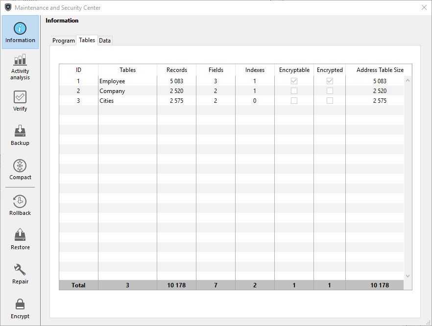
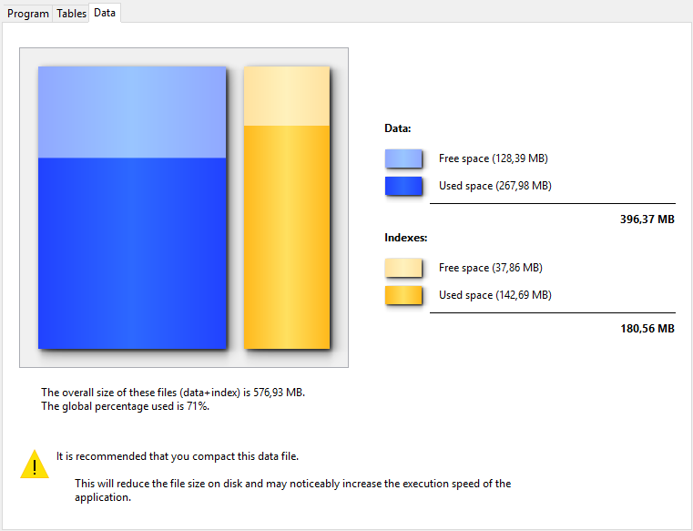

La página Información proporciona información sobre los entornos 4D y sistema, así como sobre los archivos de la base de datos y de la aplicación. Cada página puede visualizarse mediante los controles de pestañas en la parte superior de la ventana.

## Programa

This page indicates the name, version and location of the application as well as the active 4D folder (for more information about the active 4D folder, refer to the description of the `Get 4D folder` command in the _4D Language Reference_ manual).

La parte central de la ventana indica el nombre y la ubicación del proyecto y de los os archivos de datos, así como también el archivo de historial (si lo hay). La parte inferior de la ventana indica el nombre del titular de la licencia 4D, el tipo de licencia y el nombre del usuario 4D actual.

- **Display and selection of pathnames**: On the **Program** tab, pathnames are displayed in pop-up menus containing the folder sequence as found on the disk:\
  
  If you select a menu item (disk or folder), it is displayed in a new system window.
  The **Copy the path** command copies the complete pathname as text to the clipboard, using the separators of the current platform.

- **"Licenses" Folder**
  The **"Licenses" Folder** button displays the contents of the active Licenses folder in a new system window. Todos los archivos de licencia instalados en su entorno 4D están agrupados en esta carpeta, en su disco duro. Cuando se abren con un navegador web, estos archivos muestran información sobre las licencias que contienen y sus características.
  La ubicación de la carpeta "Licenses" puede variar en función de la versión de su sistema operativo. For more information about the location of this folder, refer to the `Get 4D folder` command.
  _**Note:** You can also access this folder from the “Update License” dialog box (available in the Help menu)._

## Tablas

Esta página ofrece una visión general de las tablas de su base:

> La información de esta página está disponible tanto en el modo estándar como en el de mantenimiento.

La página lista todas las tablas de la base (incluidas las tablas invisibles), así como sus características:

- **ID**: Internal number of the table.
- **Tables**: Name of the table. Los nombres de las tablas borradas se muestran entre paréntesis (si todavía están en la papelera).
- **Records**: Total number of records in the table. If a record is damaged or cannot be read, _Error_ is displayed instead of the number. En este caso, puede considerar el uso de las herramientas de verificación y de reparación.
- **Fields**: Number of fields in the table. Los campos invisibles se cuentan, sin embargo, los campos borrados no se cuentan.
- **Indexes**: Number of indexes of any kind in the table
- **Encryptable**: If checked, the **Encryptable** attribute is selected for the table at the structure level (see "Encryptable" paragraph in the Design Reference Manual).
- **Encrypted**: If checked, the records of the table are encrypted in the data file. _**Note**: Any inconstency between Encryptable and Encrypted options requires that you check the encryption status of the data file in the Encrypt page of the MSC._
- **Address Table Size**: Size of the address table for each table. La tabla de direcciones es una tabla interna que almacena un elemento por cada registro creado en la tabla. De hecho, vincula los registros a su dirección física. Por razones de rendimiento, no se redimensiona cuando se eliminan registros, por lo que su tamaño puede ser diferente del número de registros actual de la tabla. If this difference is significant, a data compacting operation with the "Compact address table" option checked can be executed to optimize the address table size (see [Compact](compact.md) page).
  _**Note:** Differences between address table size and record number can also result from an incident during the cache flush._

## Datos

The **Data** page provides information about the available and used storage space in the data file.

> No se puede acceder a esta página en modo mantenimiento

La información se ofrece en forma gráfica:

> Esta página no tiene en cuenta los datos que puedan estar almacenados fuera del archivo de datos (ver "Almacenamiento externo").

Los archivos demasiado fragmentados reducen el rendimiento del disco y, por tanto, de la base. If the occupation rate is too low, 4D will indicate this by a warning icon (which is displayed on the Information button and on the tab of the corresponding file type) and specify that compacting is necessary:

A warning icon is also displayed on the button of the [Compact](compact.md) page:

