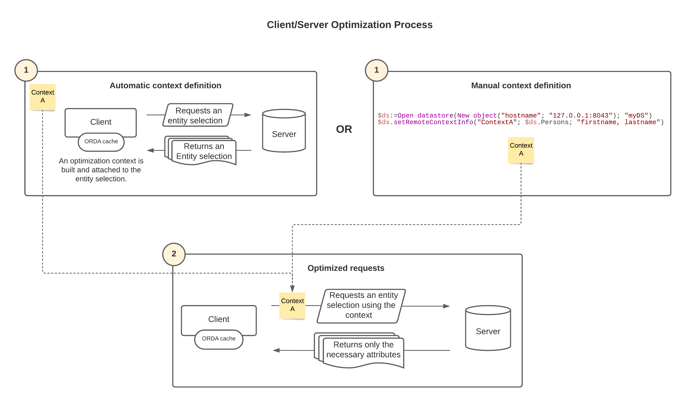

4D provides optimizations for ORDA requests that use entity selections or load entities in client/server architectures. Estas optimizaciones aceleran la ejecución de su aplicación 4D reduciendo drásticamente el volumen de información transmitida por la red. Incluyen:

- the **optimization context**
- the **ORDA cache**

## Supported architectures

ORDA client/server architectures that support the optimization are:

- Server datastores accessed by 4D remote desktop applications through [**`ds`**](../API/DataStoreClass.md#ds),
- [Remote datastores](remoteDatastores.md), accessed via [**`Open datastore`**](../API/DataStoreClass.md#open-datastore) (client REST requests).

## Optimization context

El contexto de optimización se basa en las siguientes implementaciones:

- Cuando un cliente solicita una selección de entidades al servidor, 4D "aprende" automáticamente qué atributos de la selección de entidades se utilizan realmente del lado del cliente durante la ejecución del código, y genera un "contexto de optimización" correspondiente. Este contexto se adjunta a la selección de la entidad y almacena los atributos utilizados. Se actualizará dinámicamente si se utilizan posteriormente otros atributos. Los siguientes métodos y funciones activan la fase de aprendizaje:
  - [`Create entity selection`](../API/EntitySelectionClass.md#create-entity-selection)
  - [`dataClass.fromCollection()`](../API/DataClassClass.md#fromcollection)
  - [`dataClass.all()`](../API/DataClassClass.md#all)
  - [`dataClass.get()`](../API/DataClassClass.md#get)
  - [`dataClass.query()`](../API/DataClassClass.md#query)
  - [`entitySelection.query()`](../API/EntitySelectionClass.md#query)

- Las solicitudes posteriores enviadas al servidor sobre la misma selección de entidades reutilizan automáticamente el contexto de optimización y sólo obtienen del servidor los atributos necesarios, lo que acelera el procesamiento. For example, in an [entity selection-based list box](#entity-selection-based-list-box), the learning phase takes place during the display of the first row. la visualización de las siguientes líneas está optimizada. Las siguientes funciones asocian automáticamente el contexto de optimización de la entity selection de origen a la entity selection devuelta:
  - [`entitySelection.and()`](../API/EntitySelectionClass.md#and)
  - [`entitySelection.minus()`](../API/EntitySelectionClass.md#minus)
  - [`entitySelection.or()`](../API/EntitySelectionClass.md#or)
  - [`entitySelection.orderBy()`](../API/EntitySelectionClass.md#orderBy)
  - [`entitySelection.slice()`](../API/EntitySelectionClass.md#slice)
  - [`entitySelection.drop()`](../API/EntitySelectionClass.md#drop)

- An existing optimization context can be passed as a property to another entity selection of the same dataclass, thus bypassing the learning phase and accelerating the application (see [Using the context property](#reusing-the-context-property) below).

- You can build optimization contexts manually using the [`dataStore.setRemoteContextInfo()`](../API/DataStoreClass.md#setremotecontextinfo) function (see [Preconfiguring contexts](#preconfiguring-contexts)).



:::note Compatibility Note

Contexts handled in connections established through [`Open datastore`](../API/DataStoreClass.md#open-datastore) can only be used between similar main versions of 4D. For example, a 4D 20.x remote application can only use contexts of a 4D Server 20.x datastore.

:::

### Ejemplo

Dado el siguiente código:

```4d
 $sel:=$ds.Employee.query("firstname = ab@")
 For each($e;$sel)
    $s:=$e.firstname+" "+$e.lastname+" works for "+$e.employer.name // $e.employer refiere a la tabla Company
 End for each
```

Thanks to the optimization, this request will only get data from used attributes (firstname, lastname, employer, employer.name) in _$sel_ from the second iteration of the loop.

### Reusing the `context` property

You can increase the benefits of the optimization by using the **context** property. Esta propiedad hace referencia a un contexto de optimización "aprendido" para una selección de entidades. Se puede pasar como parámetro a las funciones ORDA que devuelven nuevas selecciones de entidades, de forma que las selecciones de entidades soliciten directamente al servidor los atributos utilizados y sin pasar por la fase de aprendizaje.

> You can also create contexts using the [`.setRemoteContextInfo()`](../API/DataStoreClass.md#setremotecontextinfo) function.

All ORDA functions that handle entity selections support the <strong x-id="1">context</strong> property (for example <a href="../API/DataClassClass.md#query"><code>dataClass.query()</code></a> or <a href="../API/DataClassClass.md#all"><code>dataClass.all()</code></a>). All ORDA functions that handle entity selections support the **context** property (for example [`dataClass.query()`](../API/DataClassClass.md#query) or [`dataClass.all()`](../API/DataClassClass.md#all)). Tenga en cuenta, sin embargo, que un contexto se actualiza automáticamente cuando se utilizan nuevos atributos en otras partes del código. Reutilizar el mismo contexto en diferentes códigos podría sobrecargar el contexto y, por tanto, reducir su eficacia.

> A similar mechanism is implemented for entities that are loaded, so that only used attributes are requested (see the [`dataClass.get()`](../API/DataClassClass.md#get) function).

**Example with `dataClass.query()`:**

```4d
 var $sel1; $sel2; $sel3; $sel4; $querysettings; $querysettings2 : Object
 var $data : Collection
 $querysettings:=New object("context";"shortList")
 $querysettings2:=New object("context";"longList")
 
 $sel1:=ds.Employee.query("lastname = S@";$querysettings)
 $data:=extractData($sel1) // In extractData method an optimization is triggered   
 // and associated to context "shortList"
 
 $sel2:=ds.Employee.query("lastname = Sm@";$querysettings)
 $data:=extractData($sel2) // In extractData method the optimization associated   
 // to context "shortList" is applied
 
 $sel3:=ds.Employee.query("lastname = Smith";$querysettings2)
 $data:=extractDetailedData($sel3) // In extractDetailedData method an optimization  
 // is triggered and associated to context "longList"
 
 $sel4:=ds.Employee.query("lastname = Brown";$querysettings2)
 $data:=extractDetailedData($sel4) // In extractDetailedData method the optimization  
 // associated to context "longList" is applied
```

### List box basado en una selección de entidades

Entity selection optimization is automatically applied to entity selection-based list boxes in 4D client/server desktop applications, when displaying and scrolling a list box content: only the attributes displayed in the list box are requested from the server.

A specific "page mode" context is also provided when loading the current entity through the **Current item** property expression of the list box (see [Collection or entity selection type list boxes](FormObjects/listbox_overview.md#list-box-types)). Esta funcionalidad le permite no sobrecargar el contexto inicial del list box en este caso, especialmente si la "página" solicita atributos adicionales. Note that only the use of **Current item** expression will create/use the page context (access through `entitySelection\[index]` will alter the entity selection context).

Las solicitudes posteriores al servidor enviadas por las funciones de navegación de la entidad también admitirán esta optimización. Las siguientes funciones asocian automáticamente el contexto de optimización de la entidad fuente a la entidad devuelta:

- [`entity.next()`](../API/EntityClass.md#next)
- [`entity.first()`](../API/EntityClass.md#first)
- [`entity.last()`](../API/EntityClass.md#last)
- [`entity.previous()`](../API/EntityClass.md#previous)

Por ejemplo, el siguiente código carga la entidad seleccionada y permite navegar en la selección de entidades. Las entidades se cargan en un contexto separado y el contexto inicial del list box se deja intacto:

```4d
 $myEntity:=Form.currentElement //current item expression
  //... do something
 $myEntity:=$myEntity.next() //loads the next entity using the same context
```

### Preconfiguración de contextos

Debe definirse un contexto de optimización para cada funcionalidad o algoritmo de su aplicación, con el fin de obtener el mejor rendimiento. Por ejemplo, un contexto puede utilizarse para consultas sobre clientes, otro para consultas sobre productos, etc.

Si desea entregar aplicaciones finales con el máximo nivel de optimización, puede preconfigurar sus contextos y ahorrarse así fases de aprendizaje siguiendo estos pasos:

1. Diseñe sus algoritmos.
2. Ejecute su aplicación y deje que el mecanismo de aprendizaje automático complete los contextos de optimización.
3. Call the [`dataStore.getRemoteContextInfo()`](../API/DataStoreClass.md#getremotecontextinfo) or [`dataStore.getAllRemoteContexts()`](../API/DataStoreClass.md#getallremotecontexts) function to collect  contexts. You can use the [`entitySelection.getRemoteContextAttributes()`](../API/EntitySelectionClass.md#getremotecontextattributes) and [`entity.getRemoteContextAttributes()`](../API/EntityClass.md#getremotecontextattributes) functions to analyse how your algorithms use attributes.
4. In the final step, call the [`dataStore.setRemoteContextInfo()`](../API/DataStoreClass.md#setremotecontextinfo) function to build contexts at application startup and [use them](#reusing-the-context-property) in your algorithms.

## Caché ORDA

Por razones de optimización, los datos solicitados al servidor a través de ORDA se cargan en la caché remota de ORDA (que es diferente de la caché 4D). La caché ORDA está organizada por dataclass y vence después de 30 segundos.

Los datos contenidos en la caché se consideran caducados cuando se alcanza el tiempo de espera. Todo acceso a los datos caducados enviará una petición al servidor. Los datos caducados permanecen en la caché hasta que se necesite el espacio.

Por defecto, la caché ORDA es manejada de forma transparente por 4D. Sin embargo, puede controlar su contenido utilizando las siguientes funciones de la clase ORDA:

- [dataClass.setRemoteCacheSettings()](../API/DataClassClass.md#setremotecachesettings)
- [dataClass.getRemoteCache()](../API/DataClassClass.md#getremotecache)
- [dataClass.clearRemoteCache()](../API/DataClassClass.md#clearremotecache)
