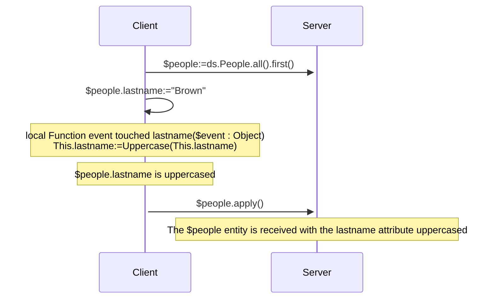
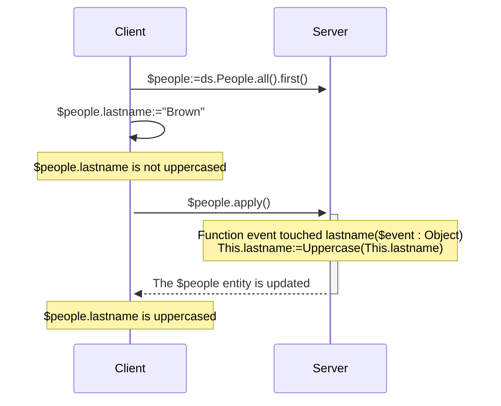
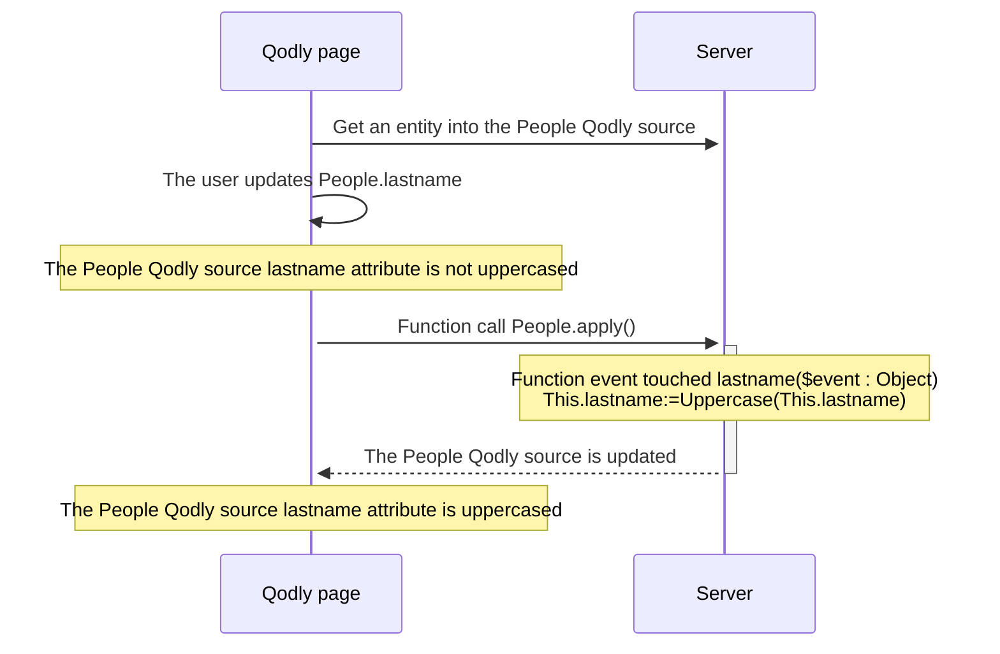

<details><summary>Historia</summary>

| Lanzamiento | Modificaciones                                                                                            |
| ----------- | --------------------------------------------------------------------------------------------------------- |
| 21          | Eventos añadidos: validateSave / saving / afterSave / validateDrop / dropping / afterDrop |
| 20 R10      | se ha añadido un evento touched                                                                           |

</details>

Los eventos de entidad son funciones que ORDA invoca automáticamente cada vez que las entidades y los atributos de entidad se manipulan (añaden, eliminan o modifican). Puede escribir eventos muy sencillos y luego hacerlos más sofisticados.

No se puede activar directamente la ejecución de la función de evento. Los eventos son llamados automáticamente por ORDA basándose en las acciones del usuario o en las operaciones realizadas mediante código sobre las entidades y sus atributos.

:::tip Entrada de blog relacionada

[ORDA - Manejar una lógica basada en eventos durante las acciones de persistencia de datos](https://blog.4d.com/orda-handle-an-event-driven-logic-during-database-operations)

:::

:::info Nota de compatibilidad

Los eventos de entidad ORDA en el almacen de datos equivalen a triggers en la base de datos 4D. Sin embargo, las acciones desencadenadas a nivel de la base de datos 4D utilizando los comandos del lenguaje clásico 4D o las acciones estándar no desencadenan eventos ORDA. Note also that, unlike triggers, ORDA entity events do not lock the entire underlying table of a dataclass while saving or dropping entities. Several events can run in parallel as long as they involve distinct entities (i.e. records).

:::

## Generalidades

### Nivel del evento

Una función de evento se define siempre en la [clase Entity](../ORDA/ordaClasses.md#entity-class).

Un evento puede definirse al nivel de la **entidad** y/o a nivel del **atributo** (incluye los [**atributos calculados**](../ORDA/ordaClasses.md#computed-attributes)). En el primer caso, se activará para cualquier atributo de la entidad; en el otro caso, sólo se activará para el atributo objetivo.

Para un mismo evento, puede definir diferentes funciones para diferentes atributos.

También puede definir el mismo evento tanto a nivel del atributo como de la entidad. El evento atributo se llama primero y luego el evento entidad.

### Ejecución en configuraciones remotas

Normalmente, los eventos ORDA se ejecutan en el servidor.

Sin embargo, en la configuración cliente/servidor, la función de evento `touched()` puede ejecutarse en el **servidor o en el cliente**, dependiendo del uso de la palabra clave [`local`](./ordaClasses.md#local-functions). Una implementación específica en el lado del cliente permite la activación del evento en el cliente.

:::note

Las funciones ORDA [`constructor()`](./ordaClasses.md#class-constructor) se ejecutan siempre en el cliente.

:::

Con otras configuraciones remotas (p. ej. [aplicaciones Qodly](https://developer.4d.com/qodly), [peticiones API REST](../REST/REST_requests.md), o peticiones a través de [`Open datastore`](../commands/open-datastore.md)), la función de evento `touched()` se ejecuta siempre **del lado del servidor**. Esto significa que tiene que asegurarse de que el servidor puede "ver" que se ha tocado un atributo para activar el evento (ver abajo).

### Tabla resumen

La siguiente tabla lista los eventos ORDA junto con sus reglas.

| Evento                          | Nivel    | Nombre de la función                                    |                     (C/S) Ejecutado en                     | Puede detener la acción devolviendo un error |
| :------------------------------ | :------- | :------------------------------------------------------ | :---------------------------------------------------------------------------: | -------------------------------------------- |
| Instanciación de entidades      | Entity   | [`constructor()`](./ordaClasses.md#class-constructor-1) |                                     client                                    | no                                           |
| Atributo tocado                 | Atributo | `event touched <attrName>()`                            | Depende de la palabra clave [`local`](../ORDA/ordaClasses.md#local-functions) | no                                           |
|                                 | Entity   | `event touched()`                                       | Depende de la palabra clave [`local`](../ORDA/ordaClasses.md#local-functions) | no                                           |
| Antes de guardar una entidad    | Atributo | `validateSave <attrName>()`                             |                                     server                                    | sí                                           |
|                                 | Entity   | `validateSave()`                                        |                                     server                                    | sí                                           |
| Al guardar una entidad          | Atributo | `saving <attrName>()`                                   |                                     server                                    | sí                                           |
|                                 | Entity   | `saving()`                                              |                                     server                                    | sí                                           |
| Después de guardar una entidad  | Entity   | `afterSave()`                                           |                                     server                                    | no                                           |
| Antes de eliminar una entidad   | Atributo | `validateDrop <attrName>()`                             |                                     server                                    | sí                                           |
|                                 | Entity   | `validateDrop()`                                        |                                     server                                    | sí                                           |
| Al soltar una entidad           | Atributo | `dropping <attrName>()`                                 |                                     server                                    | sí                                           |
|                                 | Entity   | `dropping()`                                            |                                     server                                    | sí                                           |
| Después de eliminar una entidad | Entity   | `afterDrop()`                                           |                                     server                                    | no                                           |

:::note

La función [`constructor()`](./ordaClasses.md#class-constructor-1) no es realmente una función de evento, pero siempre es llamada cuando una nueva entidad es instanciada.

:::

## Parámetro *event*

Las funciones de evento aceptan un único objeto *event* como parámetro. Cuando se llama a la función, el parámetro se llena con varias propiedades:

| Nombre de propiedad | Disponibilidad                                                                                                                 | Tipo                 | Descripción                                                                                                                  |   |
| :------------------ | :----------------------------------------------------------------------------------------------------------------------------- | :------------------- | :--------------------------------------------------------------------------------------------------------------------------- | - |
| "kind"              | siempre                                                                                                                        | String               | Nombre del evento: "touched", "validateSave", "saving", "afterSave", "validateDrop", "dropping", "afterDrop" |   |
| *attributeName*     | Sólo para eventos implementados a nivel de atributos ("validateSave", "saving", "validateDrop", "dropping") | String               | Nombre del atributo (por ejemplo, "nombre")                                                               |   |
| *dataClassName*     | siempre                                                                                                                        | String               | Nombre de la Dataclass (*ej.* "Company")                                                  |   |
| "savedAttributes"   | Sólo en [`afterSave()`](#function-event-aftersave)                                                                             | Colección de cadenas | Nombres de atributos guardados correctamente                                                                                 |   |
| "droppedAttributes" | Sólo en [`afterDrop()`](#function-event-afterdrop)                                                                             | Colección de cadenas | Nombres de atributos suprimidos correctamente                                                                                |   |
| "saveStatus"        | Sólo en [`afterSave()`](#function-event-aftersave)                                                                             | String               | "success" si el guardado fue exitoso, "failed" de lo contrario                                                               |   |
| "dropStatus"        | Sólo en [`afterDrop()`](#function-event-afterdrop)                                                                             | String               | "success" si la eliminación fue exitosa, "failed" de lo contrario                                                            |   |

## Objeto error

[Ciertas funciones de evento](#summary-table) pueden devolver un **objeto error** para plantear un error y detener la acción en ejecución.

Cuando ocurre un error en un evento, los otros eventos se detienen en el primer error planteado y la acción (guardar o soltar) también se detiene. Este error se envía antes de que otros posibles errores como [stamp has changed, entity locked](../API/EntityClass.md#save), etc.

### Propiedades del objeto error

| Propiedad          | Tipo    | Descripción                                                                                                                                                                                                                                                                                                                                                                                                                                                                                                                                                                                           | Definido por el desarrollador                |
| ------------------ | ------- | ----------------------------------------------------------------------------------------------------------------------------------------------------------------------------------------------------------------------------------------------------------------------------------------------------------------------------------------------------------------------------------------------------------------------------------------------------------------------------------------------------------------------------------------------------------------------------------------------------- | -------------------------------------------- |
| errCode            | Integer | Igual al comando [`Last errors`](../commands/last-errors.md)                                                                                                                                                                                                                                                                                                                                                                                                                                                                                                                                          | Sí                                           |
| message            | Text    | Igual al comando [`Last errors`](../commands/last-errors.md)                                                                                                                                                                                                                                                                                                                                                                                                                                                                                                                                          | Sí                                           |
| extraDescription   | Object  | Información libre a definir                                                                                                                                                                                                                                                                                                                                                                                                                                                                                                                                                                           | Sí                                           |
| seriousError       | Boolean | Utilizado sólo con eventos de validación (ver abajo). <li>`True`: crea un [error grave (imprevisible)](../Concepts/error-handling.md#predictable-vs-unpredictable-errors) y activa una excepción. Añade el estado `dk status serious validation error`</li><li>`False`: crea sólo un [error silencioso (previsible)](../Concepts/error-handling.md#predictable-vs-unpredictable-errors). Añade el estado `dk status validation failed`.</li> | Sí (por defecto es false) |
| componentSignature | Text    | Siempre "DBEV"                                                                                                                                                                                                                                                                                                                                                                                                                                                                                                                                                                                        | No                                           |

- Los [errores críticos](../Concepts/error-handling.md#predictable-vs-unpredictable-errors) están apilados en la colección de la propiedad `errors` del **objeto Result** devuelto por las funciones [`save()`](../API/EntityClass.md#save) o [`drop()`](../API/EntityClass.md#drop).
- En caso de un error provocado por un evento **validate**, la propiedad `seriousError` le permite elegir el nivel del error a generar:
  - Si es **true**: se arroja un error crítico y debe ser manejado por el [código de procesamiento de errores](../Concepts/error-handling.md#predictable-vs-unpredictable-errors), tal como un [try catch](../Concepts/error-handling.md#trycatchend-try). En el objeto resultante de la función llamante, `status` obtiene `dk status serious validation error` y `statusText` obtiene "Serious Validation Error". El error se genera al final del evento y llega al cliente solicitando la acción guardar/soltar (cliente REST por ejemplo).
  - Si es **false** (por defecto): se genera un [error silencioso (previsible)](../Concepts/error-handling.md#predictable-vs-unpredictable-errors). No dispara ninguna excepción y no se acumula en los errores devueltos por el comando [`Last errors`](../commands/last-errors.md). En el objeto resultante de la función llamante, `status` obtiene `dk status validation failed` y `statusText` obtiene "Mild Validation Error".
- En caso de un error provocado por un evento **guardar/soltar** cuando se retorna un objeto de error, el error siempre se plantea como un error crítico, sea cual sea el valor de la propiedad `seriousError`.

## Descripción de las funciones

### `Function event touched`

#### Sintaxis

```4d
{local} Function event touched($event : Object)
{local} Function event touched <attributeName>($event : Object)
// código
```

Este evento se activa cada vez que se modifica un valor en la entidad.

- Si define la función a nivel de entidad (primera sintaxis), se activa para modificaciones en cualquier atributo de la entidad.
- Si ha definido la función en el nivel de atributo (segunda sintaxis), se activa sólo para modificaciones en este atributo.

Este evento se activa tan pronto como el motor de 4D Server / 4D detecta una modificación del valor del atributo que puede deberse a las siguientes acciones:

- en **cliente/servidor con la [palabra clave `local`](../ORDA/ordaClasses.md#local-functions)** o en **4D monousuario**:
  - el usuario define un valor en un formulario 4D,
  - el código 4D realiza una asignación con el operador `:=`. El evento también se activa en caso de autoasignación (`$entity.attribute:=$entity.attribute`).
- en **cliente/servidor sin la palabra clave `local`**: algún código 4D que hace una asignación con el operador `:=` es [ejecutado en el servidor](../commands-legacy/execute-on-server.md).
- en **cliente/servidor sin la palabra clave `local`**, en una **[aplicación Qodly](https://developer.4d.com/qodly)** y **[datastore remoto](../commands/open-datastore.md)**: la entidad se recibe en el servidor 4D mientras se llama a una función ORDA (en la entidad o con la entidad como parámetro). Significa que puede que tenga que implementar una función *refresh* o *preview* en la aplicación remota que envía una petición ORDA al servidor y activa el evento.
- con el servidor REST: el valor es recibido en el servidor REST con una [petición REST](../REST/$method.md#methodupdate) (`$method=update`)

La función recibe un [objeto *event*](#event-parameter) como parámetro.

Si esta función [genera](../commands/throw) un error, no detendrá la acción en curso.

:::note

Este evento también se activa:

- cuando los atributos son asignados por el evento [`constructor()`](./ordaClasses.md#class-constructor-1),
- cuando los atributos son editados a través del [Explorador de datos](../Admin/dataExplorer.md).

:::

#### Ejemplo 1

Quiere en mayúsculas todos los atributos de texto de una entidad cuando se actualiza.

```4d
    //ProductsEntity class
Function event touched($event : Object)
	
	If (Value type(This[$event.attributeName])=Is text)
		This[$event.attributeName]:=Uppercase(This[$event.attributeName])
	End if 
```

#### Ejemplo 2

El evento "touched" es útil cuando no es posible escribir código de consulta indexada en [`Function query()`](./ordaClasses.md#function-query-attributename) para un [atributo calculado](./ordaClasses.md#computed-attributes).

Este es el caso, por ejemplo, cuando tu función [`query`](./ordaClasses.md#function-query-attributename) tiene que comparar el valor de diferentes atributos de la misma entidad entre sí. Debe usar fórmulas en la consulta ORDA devuelta, que activa consultas secuenciales.

Para entender plenamente este caso, examinemos los siguientes dos atributos calculados:

```4d
Function get onGoing() : Boolean
        return ((This.departureDate<=Current date) & (This.arrivalDate>=Current date))

Function get sameDay() : Boolean
        return (This.departureDate=This.arrivalDate)
```

Aunque son muy similares, estas funciones no pueden ser asociadas con consultas idénticas porque no comparan los mismos tipos de valores. La primera compara los atributos a un valor determinado, mientras que la segunda compara los atributos entre sí.

- Para el atributo *onGoing*, la función [`query`](./ordaClasses.md#function-query-attributename) es sencilla de escribir y utiliza atributos indexados:

```4d
Function query onGoing($event : Object) : Object
    var $operator : Text
    var $myQuery : Text
    var $onGoingValue : Boolean
    var $parameters : Collection
    $parameters:=New collection()

    $operator:=$event.operator
    Case of 
            : (($operator="=") | ($operator="==") | ($operator="==="))
                $onGoingValue:=Bool($event.value)
            : (($operator="!=") | ($operator="!=="))
                $onGoingValue:=Not(Bool($event.value))
            Else 
                return {query: ""; parameters: $parameters}
    End case 

    $myQuery:=($onGoingValue) ? "departureDate <= :1 AND arrivalDate >= :1" : "departureDate > :1 OR arrivalDate < :1"
        // la cadena de consulta ORDA utiliza atributos indexados, se indexará
    $parameters.push(Current date)
    return {query: $myQuery; parameters: $parameters}
```

- Para el atributo *sameDay*, la función [`query`](./ordaClasses.md#function-query-attributename) requiere una consulta ORDA basada en fórmulas y será secuencial:

```4d
Function query sameDay($event : Object) : Text
    var $operator : Text
    var $sameDayValue : Boolean

    $operator:=$event.operator
    Case of 
        : (($operator="=") | ($operator="==") | ($operator="==="))
            $sameDayValue:=Bool($event.value)
        : (($operator="!=") | ($operator="!=="))
            $sameDayValue:=Not(Bool($event.value))
        Else 
            return ""
        End case 

    return ($sameDayValue) ? "eval(This.departureDate = This.arrivalDate)" : "eval(This.departureDate != This.arrivalDate)"
        // la cadena de consulta ORDA utiliza una fórmula, no será indexada

```

- Usar un atributo *sameDay* **escalar** actualizado cuando otros atributos son "tocados" ahorrará tiempo:

```4d
    //BookingEntity class

Function event touched departureDate($event : Object) 

    This.sameDay:=(This.departureDate = This.arrivalDate) 
//
//
Function event touched arrivalDate($event : Object) 

    This.sameDay:=(This.departureDate = This.arrivalDate)

```

#### Ejemplo 3 (diagrama): cliente/servidor con la palabra clave `local`:



#### Ejemplo 4 (diagrama): cliente/servidor sin la palabra clave `local`



#### Ejemplo 5 (diagrama): Aplicación Qodly



### `Function event validateSave`

#### Sintaxis

```4d
Function event validateSave($event : Object)
Function event validateSave <attributeName>($event : Object)
// código
```

Este evento se activa cada vez que una entidad está a punto de ser guardada.

- si define la función a nivel de entidad (primera sintaxis), se llama para cualquier atributo de la entidad.
- si definió la función en el nivel de atributo (segunda sintaxis), sólo se llama para este atributo. Esta función **no** se ejecuta si el atributo no ha sido tocado en la entidad.

La función recibe un [objeto *event*](#event-parameter) como parámetro.

Este evento es activado por las siguientes funciones:

- [`entity.save()`](../API/EntityClass.md#save)
- [`dataClass.fromCollection()`](../API/DataClassClass.md#fromcollection)

This event is triggered **before** the entity is actually saved and lets you check data consistency so that you can stop the action if needed. Por ejemplo, puede comprobar en este evento que "fecha de salida" < "fecha de llegada".

Para detener la acción, el código de la función debe devolver un [objeto error](#error-object).

:::note

No se recomienda actualizar la entidad dentro de esta función (utilizando `This`).

:::

#### Ejemplo

En este ejemplo, no se permite guardar un producto con un margen inferior al 50%. En caso de que el atributo precio no sea válido, devuelve un objeto error y, por tanto, detiene la acción de guardar.

```4d
// ProductsEntity class
//
// validateSave event at attribute level
Function event validateSave margin($event : Object) : Object
	
var $result : Object
	
//The user can't create a product whose margin is < 50%
If (This.margin<50)
	$result:={errCode: 1; message: "The validation of this product failed"; \
	extraDescription: {info: "The margin of this product ("+String(This.margin)+") is lower than 50%"}; seriousError: False}
End if 
return $result

```

### `Function event saving`

#### Sintaxis

```4d
Function event saving($event : Object)
Function event saving <attributeName>($event : Object)
// código
```

Este evento se activa cada vez que se guarda una entidad.

- Si define la función a nivel de entidad (primera Sintaxis), se llama para cualquier atributo de la entidad. The function is executed even if no attribute has been touched in the entity (e.g. in case of sending data to an external app each time a save is done).
- Si definió la función en el nivel de atributo (segunda Sintaxis), solo se llama para este atributo. La función **no** se ejecuta si el atributo no ha sido tocado en la entidad.

La función recibe un [objeto *event*](#event-parameter) como parámetro.

Este evento es activado por las siguientes funciones:

- [`entity.save()`](../API/EntityClass.md#save)
- [`dataClass.fromCollection()`](../API/DataClassClass.md#fromcollection)

Este evento se activa **mientras** la entidad se guarda. If a [`validateSave()`](#function-event-validatesave) event function was defined, the `saving()` event function is called if no error was triggered by `validateSave()`. Por ejemplo, puede utilizar este evento para crear un documento en una cuenta de Google Drive.

:::note

La lógica de negocio debe generar errores que no puedan detectarse durante los eventos `validateSave()`, por ejemplo, un error de red

:::

Durante la acción de guardar, se pueden producir errores en el motor 4D (índice, sello ha cambiado, no hay suficiente espacio en el disco).

Para detener la acción, el código de la función debe devolver un [objeto error](#error-object).

#### Ejemplo

Cuando se guarda un archivo en el disco, por ejemplo, se capturan errores relacionados con el espacio de disco.

```4d
// ProductsEntity class
// saving event at attribute level
Function event saving userManualPath($event : Object) : Object
	
var $result : Object
var $userManualFile : 4D.File
var $fileCreated : Boolean
	
If (This.userManualPath#"")
	$userManualFile:=File(This.userManualPath)
				
	// The user manual document file is created on the disk
	// This may fail if no more space is available
	Try
        // The file content has been generated and stored in a map in Storage.docMap previously
	    $docInfo:=Storage.docMap.query("name = :1"; This.name).first()
        $userManualFile.setContent($docInfo.content)
	Catch
		// No more room on disk for example
		$result:={/
            errCode: 1; message: "Error during the save action for this product"; /
            extraDescription: {info: "There is no available space on disk to store the user manual"}/
        }
	End try
End if 
	
return $result

```

:::note

El contenido del archivo se genera fuera del evento `saving` porque puede llevar mucho tiempo.

:::

### `Function event afterSave`

#### Sintaxis

```4d
Función evento afterSave($event : Object)
// código
```

Este evento se activa justo después de guardar una entidad en el archivo de datos, cuando se ha modificado al menos un atributo. No se ejecuta si no se ha tocado ningún atributo en la entidad.

Este evento es útil después de guardar datos para propagar la acción de guardar fuera de la aplicación o para ejecutar tareas de administración. Por ejemplo, se puede utilizar para enviar un correo electrónico de confirmación después de guardar los datos. O, en caso de error al guardar los datos, puede hacer una cancelación para restaurar un estado consistente de los datos.

La función recibe un [objeto *event*](#event-parameter) como parámetro.

- To avoid infinite loops, calling a [`save()`](../API/EntityClass.md#save) on the current entity (through `This`) in this function is **not allowed**. Se producirá un error.
- Arrojar un [objeto error](#error-object) **no es soportado** por esta función.

#### Ejemplo

Si se produce un error en el evento de guardado anterior, el valor del atributo se restablece en consecuencia en el evento `afterSave`:

```4d
// ProductsEntity class
Function event afterSave($event : Object)
	
If (($event.status.success=False) && ($event.status.errors=Null))  
    // $event.status.errors is filled if the error comes from the validateSave event
		
	// The userManualPath attribute has not been properly saved
	// Its value is reset
	If ($event.savedAttributes.indexOf("userManualPath")=-1)
		This.userManualPath:=""
		This.status:="KO"
	End if 
		
End if 
```

### `Function event validateDrop`

#### Sintaxis

```4d
Function event validateDrop($event : Object)
Function event validateDrop <attributeName>($event : Object)
// código
```

Este evento se activa cada vez que una entidad está a punto de ser soltada.

- Si define la función a nivel de entidad (primera Sintaxis), se llama para cualquier atributo de la entidad.
- Si definió la función en el nivel de atributo (segunda Sintaxis), solo se llama para este atributo.

La función recibe un [objeto *event*](#event-parameter) como parámetro.

Este evento se activa con las siguientes funcionalidades:

- [`entity.drop()`](../API/EntityClass.md#drop)
- [`entitySelection.drop()`](../API/DataClassClass.md#fromcollection)
- [deletion control rules](https://doc.4d.com/4Dv20/4D/20.2/Relation-properties.300-6750290.en.html#107320) that can be defined at the database structure level.

This event is triggered **before** the entity is actually dropped, allowing you to check data consistency and if necessary, to stop the drop action.

Para detener la acción, el código de la función debe devolver un [objeto error](#error-object).

#### Ejemplo

En este ejemplo, no está permitido eliminar un producto que no esté etiquetado como "TO DELETE". In this case, you return an error object and thus, stop the drop action.

```4d
// Clase ProductsEntity

Function event validateDrop status($event : Object) : Object

var $result : Object

// Products must be marked as TO DELETE to be dropped
If (This.status#"TO DELETE")
    $result:={errCode: 1; message: "You can't drop this product"; \
    extraDescription: {info: "This product must be marked as To Delete"}; seriousError: False}
End if 

return $result
```

### `Function event dropping`

#### Sintaxis

```4d
Function event dropping($event : Object)
Function event dropping <attributeName>($event : Object)
// código
```

Este evento se activa cada vez que se elimina una entidad.

- Si define la función a nivel de entidad (primera Sintaxis), se llama para cualquier atributo de la entidad.
- Si definió la función en el nivel de atributo (segunda Sintaxis), solo se llama para este atributo.

La función recibe un [objeto *event*](#event-parameter) como parámetro.

Este evento se activa con las siguientes funcionalidades:

- [`entity.drop()`](../API/EntityClass.md#drop)
- [`entitySelection.drop()`](../API/DataClassClass.md#fromcollection)
- [deletion control rules](https://doc.4d.com/4Dv20/4D/20.2/Relation-properties.300-6750290.en.html#107320) that can be defined at the database structure level.

This event is triggered **while** the entity is actually dropped. If a [`validateDrop()`](#function-event-validatedrop) event function was defined, the `dropping()` event function is called if no error was triggered by `validateDrop()`.

:::note

La lógica de negocio debe generar errores que no puedan detectarse durante los eventos `validateDrop()`, por ejemplo, un error de red.

:::

Para detener la acción, el código de la función debe devolver un [objeto error](#error-object).

#### Ejemplo

Estes es un ejemplo del evento `dropping` a nivel de entidad:

```4d
// ProductsEntity class
Function event dropping($event : Object) : Object

var $result : Object
var $userManualFile : 4D.File

$userManualFile:=File(This.userManualPath)

    // When dropping a product, its user manual is also deleted on the disk
    // This action may fail
Try
    If ($userManualFile.exists)
        $userManualFile.delete()
    End if 
Catch
    // Dropping the user manual failed
    $result:={errCode: 1; message: "Drop failed"; extraDescription: {info: "The user manual can't be dropped"}}
End try

return $result
```

### `Function event afterDrop`

#### Sintaxis

```4d
Function event afterDrop($event : Object)
// código
```

Este evento se activa justo después de que una entidad es soltada.

This event is useful after dropping data to propagate the drop action outside the application or to execute administration tasks. Por ejemplo, se puede utilizar para enviar un correo electrónico de cancelación después de soltar los datos. Or, in case of error while dropping data, it can log an information for the administrator to check data consistency.

La función recibe un [objeto *event*](#event-parameter) como parámetro.

- To avoid infinite loops, calling a [`drop()`](../API/EntityClass.md#drop) on the current entity (through `This`) in this function is **not allowed**. Se producirá un error.
- Arrojar un [objeto error](#error-object) **no es soportado** por esta función.

:::note

La entidad eliminada es referenciada por `This` y aún existe en memoria.

:::

#### Ejemplo

Si la acción de soltar falló, el producto debe ser verificado manualmente:

```4d
Function event afterDrop($event : Object)

var $status : Object

If (($event.status.success=False) && ($event.status.errors=Null)) 
        //$event.status.errors is filled 
        //if the error comes from the validateDrop event
    This.status:="Check this product - Drop action failed"
    $status:=This.save()
End if 

```

