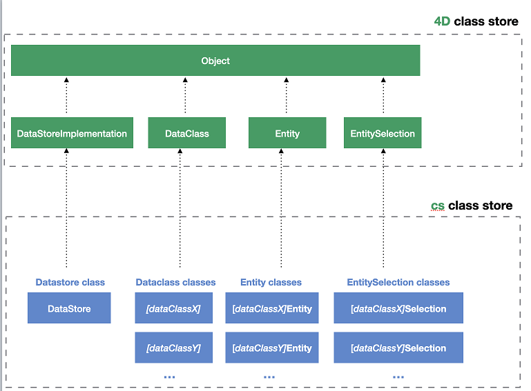

ORDA permite crear funciones de clase de alto nivel arriba del modelo de datos. Esto le permite escribir código orientado al negocio y "publicarlo" como una API. Los almacenes de datos, las clases de datos, las selecciones de entidades y las entidades están disponibles como objetos de clase que pueden contener funciones.

For example, you could create a `getNextWithHigherSalary()` function in the `EmployeeEntity` class to return employees with a salary higher than the selected one. Sería tan sencillo como llamar:

```4d
$nextHigh:=ds.Employee.get(1).getNextWithHigherSalary()
```

Los desarrolladores no sólo pueden utilizar estas funciones en almacenes de datos locales, sino también en arquitecturas cliente/servidor y remotas:

```4d
 //$cityManager es la referencia de un datastore remoto
Form.comp.city:=$cityManager.City.getCityName(Form.comp.zipcode)
```

Gracias a esta funcionalidad, toda la lógica de negocio de su aplicación 4D puede ser almacenada como una capa independiente para que pueda ser fácilmente mantenida y reutilizada con un alto nivel de seguridad:

- Puede "ocultar" la complejidad global de la estructura física subyacente y exponer únicamente funciones comprensibles y listas para usar.

- Si la estructura física evoluciona, basta con adaptar el código de las funciones y las aplicaciones cliente seguirán llamándolas de forma transparente.

- By default, all of your data model class functions (including [computed attribute functions](#computed-attributes-1)) and [alias attributes](#alias-attributes-1) are **not exposed** to remote applications and cannot be called from REST requests. You must explicitly declare each public function and alias with the [`exposed`](#exposed-vs-non-exposed-functions) keyword.


In addition, 4D [automatically pre-creates](#creating-classes) the classes for each available data model object.

## Arquitectura

ORDA provides **generic classes** exposed through the **`4D`** [class store](Concepts/classes.md#class-stores), as well as **user classes** (extending generic classes) exposed in the **`cs`** [class store](Concepts/classes.md#class-stores):



All ORDA data model classes are exposed as properties of the **`cs`** class store. Las clases ORDA siguientes están disponibles:

| Class                                       | Nombre del ejemplo                   | Instanciado por                                                                                                                                                                                                                                                                                                                                                                                                                                                                                                                                                                                                                                                                                                                                                                                                                                                        |
| ------------------------------------------- | ------------------------------------ | ---------------------------------------------------------------------------------------------------------------------------------------------------------------------------------------------------------------------------------------------------------------------------------------------------------------------------------------------------------------------------------------------------------------------------------------------------------------------------------------------------------------------------------------------------------------------------------------------------------------------------------------------------------------------------------------------------------------------------------------------------------------------------------------------------------------------------------------------------------------------- |
| cs.DataStore                | cs.DataStore         | [`ds`](API/DataStoreClass.md#ds) command                                                                                                                                                                                                                                                                                                                                                                                                                                                                                                                                                                                                                                                                                                                                                                                                                               |
| cs._DataClassName_          | cs.Employee          | [`dataStore.DataClassName`](API/DataStoreClass.md#dataclassname), `dataStore["DataClassName"]`                                                                                                                                                                                                                                                                                                                                                                                                                                                                                                                                                                                                                                                                                                                                                                         |
| cs._DataClassName_Entity    | cs.EmployeeEntity    | [`dataClass.get()`](API/DataClassClass.md#get), [`dataClass.new()`](API/DataClassClass.md#new), [`entitySelection.first()`](API/EntitySelectionClass.md#first), [`entitySelection.last()`](API/EntitySelectionClass.md#last), [`entity.previous()`](API/EntityClass.md#previous), [`entity.next()`](API/EntityClass.md#next), [`entity.first()`](API/EntityClass.md#first), [`entity.last()`](API/EntityClass.md#last), [`entity.clone()`](API/EntityClass.md#clone)                                                                                                                                                                                                                                                                                                                                                                                                   |
| cs._DataClassName_Selection | cs.EmployeeSelection | [`dataClass.query()`](API/DataClassClass.md#query), [`entitySelection.query()`](API/EntitySelectionClass.md#query), [`dataClass.all()`](API/DataClassClass.md#all), [`dataClass.fromCollection()`](API/DataClassClass.md#fromcollection), [`dataClass.newSelection()`](API/DataClassClass.md#newselection), [`entitySelection.drop()`](API/EntitySelectionClass.md#drop), [`entity.getSelection()`](API/EntityClass.md#getselection), [`entitySelection.and()`](API/EntitySelectionClass.md#and), [`entitySelection.minus()`](API/EntitySelectionClass.md#minus), [`entitySelection.or()`](API/EntitySelectionClass.md#or), [`entitySelection.orderBy()`](API/EntitySelectionClass.md#or), [`entitySelection.orderByFormula()`](API/EntitySelectionClass.md#orderbyformula), [`entitySelection.slice()`](API/EntitySelectionClass.md#slice), `Create entity selection` |

> ORDA user classes are stored as regular class files (.4dm) in the Classes subfolder of the project [(see below)](#class-files).

Además, las instancias de objeto de clases usuario de los modelos de datos ORDA se benefician de las propiedades y funciones de sus padres:

- a Datastore class object can call functions from the [ORDA Datastore generic class](API/DataStoreClass.md).
- a Dataclass class object can call functions from the [ORDA Dataclass generic class](API/DataClassClass.md).
- an Entity selection class object can call functions from the [ORDA Entity selection generic class](API/EntitySelectionClass.md).
- an Entity class object can call functions from the [ORDA Entity generic class](API/EntityClass.md).

## Descripción de la clase

<details><summary>Historia</summary>

| Lanzamiento | Modificaciones                                                                                                                                       |
| ----------- | ---------------------------------------------------------------------------------------------------------------------------------------------------- |
| 19 R4       | Atributos alias en la Entity Class                                                                                                                   |
| 19 R3       | Atributos calculados en la Entity Class                                                                                                              |
| 18 R5       | Las funciones de clase de modelo de datos no están expuestas a REST por defecto. New `exposed` and `local` keywords. |

</details>

### Clase DataStore

A 4D database exposes its own DataStore class in the `cs` class store.

- **Extends**: 4D.DataStoreImplementation
- **Class name**: cs.DataStore

You can create functions in the DataStore class that will be available through the `ds` object.

#### Ejemplo

```4d
// cs.DataStore class

Class extends DataStoreImplementation

Function getDesc
  $0:="Database exposing employees and their companies"
```

Esta función puede ser llamada:

```4d
$desc:=ds.getDesc() //"Database exposing..."
```

### Clase DataClass

Each table exposed with ORDA offers a DataClass class in the `cs` class store.

- **Extends**: 4D.DataClass
- **Class name**: cs._DataClassName_ (where _DataClassName_ is the table name)
- **Example name**: cs.Employee

#### Ejemplo

```4D
// cs.Company class


Class extends DataClass

// Returns companies whose revenue is over the average
// Returns an entity selection related to the Company DataClass

Function GetBestOnes()
	$sel:=This.query("revenues >= :1";This.all().average("revenues"));
	$0:=$sel
```

A continuación, puede obtener una selección de entidades de las "mejores" empresas ejecutando:

```4d
	var $best : cs.CompanySelection
	$best:=ds.Company.GetBestOnes()
```

:::info

[Computed attributes](#computed-attributes) are defined in the [Entity Class](#entity-class).

:::

#### Ejemplo con un datastore remoto

The following _City_ catalog is exposed in a remote datastore (partial view):


The `City Class` provides an API:

```4d
// cs.City class

Class extends DataClass

Function getCityName()
	var $1; $zipcode : Integer
	var $zip : 4D.Entity
	var $0 : Text

	$zipcode:=$1
	$zip:=ds.ZipCode.get($zipcode)
	$0:="" 

	If ($zip#Null)
		$0:=$zip.city.name
	End if
```

La aplicación cliente abre una sesión en el datastore remoto:

```4d
$cityManager:=Open datastore(New object("hostname";"127.0.0.1:8111");"CityManager")
```

A continuación, una aplicación cliente puede utilizar la API para obtener la ciudad correspondiente al código postal (por ejemplo) a partir de un formulario:

```4d
Form.comp.city:=$cityManager.City.getCityName(Form.comp.zipcode)

```

### Clase EntitySelection

Each table exposed with ORDA offers an EntitySelection class in the `cs` class store.

- **Extends**: 4D.EntitySelection
- **Class name**: _DataClassName_Selection (where _DataClassName_ is the table name)
- **Example name**: cs.EmployeeSelection

#### Ejemplo

```4d
// cs.EmployeeSelection class


Class extends EntitySelection

//Extract the employees with a salary greater than the average from this entity selection 

Function withSalaryGreaterThanAverage() : cs.EmployeeSelection
	return This.query("salary > :1";This.average("salary")).orderBy("salary")

```

A continuación, puede obtener los empleados con un salario superior a la media en cualquier selección de entidades mediante la ejecución:

```4d
$moreThanAvg:=ds.Company.all().employees.withSalaryGreaterThanAverage()
```

:::info

[Restricted entity selection filters](entities.md#restricting-entity-selections) are defined in the [Dataclass Class](#dataclass-class).

:::

### Entity Class

Each table exposed with ORDA offers an Entity class in the `cs` class store.

- **Extends**: 4D.Entity
- **Class name**: _DataClassName_Entity (where _DataClassName_ is the table name)
- **Example name**: cs.CityEntity

#### Atributos calculados

Entity classes allow you to define **computed attributes** using specific keywords:

- `Function get` _attributeName_
- `Function set` _attributeName_
- `Function query` _attributeName_
- `Function orderBy` _attributeName_

For information, please refer to the [Computed attributes](#computed-attributes-1) section.

#### Atributos de tipo alias

Entity classes allow you to define **alias attributes**, usually over related attributes, using the `Alias` keyword:

`Alias` _attributeName_ _targetPath_

For information, please refer to the [Alias attributes](#alias-attributes-1) section.

#### Ejemplo

```4d
// cs.CityEntity class

Class extends Entity

Function getPopulation() : Integer
    return This.zips.sum("population")


Function isBigCity(): Boolean
// The getPopulation() function is usable inside the class
	return This.getPopulation()>50000
```

Luego puede llamar este código:

```4d
var $cityManager; $city : Object

$cityManager:=Open datastore(New object("hostname";"127.0.0.1:8111");"CityManager")
$city:=$cityManager.City.getCity("Caguas")

If ($city.isBigCity())
	ALERT($city.name + " is a big city")
End if
```

### Reglas específicas

Al crear o editar clases de modelos de datos, debe prestar atención a las siguientes reglas:

- Since they are used to define automatic DataClass class names in the **cs** [class store](Concepts/classes.md#class-stores), 4D tables must be named in order to avoid any conflict in the **cs** namespace. En particular:
  - Do not give the same name to a 4D table and to a [user class name](Concepts/classes.md#class-names). En tal caso, el constructor de la clase usuario queda inutilizado (el compilador devuelve una advertencia).
  - No utilice un nombre reservado para una tabla 4D (por ejemplo, "DataClass").

- When defining a class, make sure the [`Class extends`](Concepts/classes.md#class-extends-classnameclass) statement exactly matches the parent class name (remember that they're case sensitive). For example, `Class extends EntitySelection` for an entity selection class.

- You cannot instantiate a data model class object with the `new()` keyword (an error is returned). You must use a regular method as listed in the [`Instantiated by` column of the ORDA class table](#architecture).

- You cannot override a native ORDA class function from the **`4D`** [class store](Concepts/classes.md#class-stores) with a data model user class function.

### Ejecución apropiativa

Cuando se compilan, las funciones de clase del modelo de datos se ejecutan:

- in **preemptive or cooperative processes** (depending on the calling process) in single-user applications,
- in **preemptive processes** in client/server applications (except if the [`local`](#local-functions) keyword is used, in which case it depends on the calling process like in single-user).

Si su proyecto está diseñado para ejecutarse en cliente/servidor, asegúrese de que el código de la función de clase del modelo de datos es hilo seguro. Si se llama un código thread-unsafe, se lanzará un error en tiempo de ejecución (no se lanzará ningún error al momento de la compilación ya que la ejecución cooperativa está soportada en las aplicaciones monopuesto).

## Atributos calculados

### Generalidades

Un atributo calculado es un atributo de clase de datos con un tipo de datos que enmascara un cálculo. [Standard 4D classes](Concepts/classes.md) implement the concept of computed properties with `get` (_getter_) and `set` (_setter_) [accessor functions](Concepts/classes.md#function-get-and-function-set). ORDA dataclass attributes benefit from this feature and extend it with two additional functions: `query` and `orderBy`.

At the very minimum, a computed attribute requires a `get` function that describes how its value will be calculated. When a _getter_ function is supplied for an attribute, 4D does not create the underlying storage space in the datastore but instead substitutes the function's code each time the attribute is accessed. Si no se accede al atributo, el código nunca se ejecuta.

A computed attribute can also implement a `set` function, which executes whenever a value is assigned to the attribute. The _setter_ function describes what to do with the assigned value, usually redirecting it to one or more storage attributes or in some cases other entities.

Just like storage attributes, computed attributes may be included in **queries**. Por defecto, cuando se utiliza un atributo calculado en una búsqueda ORDA, el atributo se calcula una vez por entidad examinada. En algunos casos esto es suficiente. However for better performance, especially in client/server, computed attributes can implement a `query` function that relies on actual dataclass attributes and benefits from their indexes.

Similarly, computed attributes can be included in **sorts**. Cuando se utiliza un atributo calculado en una ordenación ORDA, el atributo se calcula una vez por entidad examinada. Just like in queries, computed attributes can implement an `orderBy` function that substitutes other attributes during the sort, thus increasing performance.

### Cómo definir los atributos calculados

You create a computed attribute by defining a `get` accessor in the [**entity class**](#entity-class) of the dataclass. El atributo calculado estará disponible automáticamente en los atributos de la dataclass y en los atributos de la entidad.

Other computed attribute functions (`set`, `query`, and `orderBy`) can also be defined in the entity class. Son opcionales.

Within computed attribute functions, [`This`](Concepts/classes.md#this) designates the entity. Computed attributes can be used and handled as any dataclass attribute, i.e. they will be processed by [entity class](API/EntityClass.md) or [entity selection class](API/EntitySelectionClass.md) functions.

> ORDA computed attributes are not [**exposed**](#exposed-vs-non-exposed-functions) by default. You expose a computed attribute by adding the `exposed` keyword to the **get function** definition.

> **get and set functions** can have the [**local**](#local-functions) property to optimize client/server processing.

### `Function get <attributeName>`

#### Sintaxis

```4d
{local} {exposed} Function get <attributeName>({$event : Object}) -> $result : type
// code
```

The _getter_ function is mandatory to declare the _attributeName_ computed attribute. Whenever the _attributeName_ is accessed, 4D evaluates the `Function get` code and returns the _$result_ value.

> Un atributo calculado puede utilizar el valor de otro(s) atributo(s) calculado(s). Las llamadas recursivas generan errores.

The _getter_ function defines the data type of the computed attribute thanks to the _$result_ parameter. Se permiten los siguientes tipos resultantes:

- Scalar (text, boolean, date, time, number)
- Object
- Imagen
- BLOB
- Entity (por ejemplo, cs.EmployeeEntity)
- Entity selection (p.e. cs.EmployeeeSelection)

The _$event_ parameter contains the following properties:

| Propiedad     | Tipo    | Descripción                                                                                                  |
| ------------- | ------- | ------------------------------------------------------------------------------------------------------------ |
| attributeName | Text    | Nombre de atributo calculado                                                                                 |
| dataClassName | Text    | Nombre de la clase de datos                                                                                  |
| kind          | Text    | "get"                                                                                                        |
| result        | Variant | Opcional. Añada esta propiedad con valor Null si desea que un atributo escalar devuelva Null |

#### Ejemplos

- _fullName_ computed attribute:

```4d
Function get fullName($event : Object)-> $fullName : Text

  Case of 	
	: (This.firstName=Null) & (This.lastName=Null)
		$event.result:=Null //use result to return Null
	: (This.firstName=Null)
		$fullName:=This.lastName
	: (This.lastName=Null)
		$fullName:=This.firstName
	Else 
		$fullName:=This.firstName+" "+This.lastName
	End case 
```

- Un atributo calculado puede basarse en un atributo relativo a una entidad:

```4d
Function get bigBoss($event : Object)-> $result: cs.EmployeeEntity
	$result:=This.manager.manager
    
```

- Un atributo calculado puede basarse en un atributo relacionado con una entity selection:

```4d
Function get coWorkers($event : Object)-> $result: cs.EmployeeSelection
    If (This.manager.manager=Null)
        $result:=ds.Employee.newSelection()
    Else 
        $result:=This.manager.directReports.minus(this)
    End if
```

### `Function set <attributeName>`

#### Sintaxis

```4d

{local} Function set <attributeName>($value : type {; $event : Object})
// code
```

The _setter_ function executes whenever a value is assigned to the attribute. Esta función suele procesar los valores de entrada y el resultado se envía entre uno o varios atributos.

The _$value_ parameter receives the value assigned to the attribute.

The _$event_ parameter contains the following properties:

| Propiedad     | Tipo    | Descripción                              |
| ------------- | ------- | ---------------------------------------- |
| attributeName | Text    | Nombre de atributo calculado             |
| dataClassName | Text    | Nombre de la clase de datos              |
| kind          | Text    | "set"                                    |
| value         | Variant | Valor a tratar por el atributo calculado |

#### Ejemplo

```4d
Function set fullName($value : Text; $event : Object)
	var $p : Integer
    $p:=Position(" "; $value) 		
	This.firstname:=Substring($value; 1; $p-1)  // "" if $p<0
	This.lastname:=Substring($value; $p+1)
```

### `Function query <attributeName>`

#### Sintaxis

```4d
Function query <attributeName>($event : Object)
Function query <attributeName>($event : Object) -> $result : Text
Function query <attributeName>($event : Object) -> $result : Object
// code
```

Esta función soporta tres sintaxis:

- With the first syntax, you handle the whole query through the `$event.result` object property.
- With the second and third syntaxes, the function returns a value in _$result_:
  - If _$result_ is a Text, it must be a valid query string
  - If _$result_ is an Object, it must contain two properties:
  | Propiedad                          | Tipo       | Descripción                                                                                                                            |
  | ---------------------------------- | ---------- | -------------------------------------------------------------------------------------------------------------------------------------- |
  | $result.query      | Text       | Cadena de búsqueda válida con marcadores de posición (:1, :2, etc.) |
  | $result.parameters | Collection | valores para marcadores                                                                                                                |

The `query` function executes whenever a query using the computed attribute is launched. Resulta útil personalizar y optimizar las consultas basándose en los atributos indexados. When the `query` function is not implemented for a computed attribute, the search is always sequential (based upon the evaluation of all values using the `get <AttributeName>` function).

> The following features are not supported:
>
> - calling a `query` function on computed attributes of type Entity or Entity selection,
> - using the `order by` keyword in the resulting query string.

The _$event_ parameter contains the following properties:

| Propiedad     | Tipo    | Descripción                                                                                                                                                                                                                                                                                                                                                                                                                                                                                                                                                                                                                                                                                                                                                    |
| ------------- | ------- | -------------------------------------------------------------------------------------------------------------------------------------------------------------------------------------------------------------------------------------------------------------------------------------------------------------------------------------------------------------------------------------------------------------------------------------------------------------------------------------------------------------------------------------------------------------------------------------------------------------------------------------------------------------------------------------------------------------------------------------------------------------- |
| attributeName | Text    | Nombre de atributo calculado                                                                                                                                                                                                                                                                                                                                                                                                                                                                                                                                                                                                                                                                                                                                   |
| dataClassName | Text    | Nombre de la clase de datos                                                                                                                                                                                                                                                                                                                                                                                                                                                                                                                                                                                                                                                                                                                                    |
| kind          | Text    | "query"                                                                                                                                                                                                                                                                                                                                                                                                                                                                                                                                                                                                                                                                                                                                                        |
| value         | Variant | Valor a tratar por el atributo calculado                                                                                                                                                                                                                                                                                                                                                                                                                                                                                                                                                                                                                                                                                                                       |
| operator      | Text    | Query operator (see also the [`query` class function](API/DataClassClass.md#query)). Possible values:<li>== (equal to, @ is wildcard)</li><li>=== (equal to, @ is not wildcard)</li><li>!= (not equal to, @ is wildcard)</li><li>!== (not equal to, @ is not wildcard)</li><li>< (less than)</li><li><= (less than or equal to)</li><li>> (greater than)</li><li>>= (greater than or equal to)</li><li>IN (included in)</li><li>% (contains keyword)</li> |
| result        | Variant | Valor a tratar por el atributo calculado. Pass `Null` in this property if you want to let 4D execute the default query (always sequential for computed attributes).                                                                                                                                                                                                                                                                                                                                                                                                                                                                                                                                         |

> If the function returns a value in _$result_ and another value is assigned to the `$event.result` property, the priority is given to `$event.result`.

#### Ejemplos

- Query on the _fullName_ computed attribute.

```4d
Function query fullName($event : Object)->$result : Object

	var $fullname; $firstname; $lastname; $query : Text
	var $operator : Text
	var $p : Integer
	var $parameters : Collection

	$operator:=$event.operator
	$fullname:=$event.value

	$p:=Position(" "; $fullname) 
	If ($p>0)
		$firstname:=Substring($fullname; 1; $p-1)+"@"
		$lastname:=Substring($fullname; $p+1)+"@"
		$parameters:=New collection($firstname; $lastname) // two items collection
	Else 
		$fullname:=$fullname+"@"
		$parameters:=New collection($fullname) // single item collection
	End if 

	Case of 
	: ($operator="==") | ($operator="===")
		If ($p>0)
			$query:="(firstName = :1 and lastName = :2) or (firstName = :2 and lastName = :1)"
		Else 
			$query:="firstName = :1 or lastName = :1"
		End if 
	: ($operator="!=")
		If ($p>0)
			$query:="firstName != :1 and lastName != :2 and firstName != :2 and lastName != :1"
		Else 
			$query:="firstName != :1 and lastName != :1"
		End if 
	End case 

	$result:=New object("query"; $query; "parameters"; $parameters)
```

> Keep in mind that using placeholders in queries based upon user text input is recommended for security reasons (see [`query()` description](API/DataClassClass.md#query)).

Código de llamada, por ejemplo:

```4d
$emps:=ds.Employee.query("fullName = :1"; "Flora Pionsin")
```

- This function handles queries on the _age_ computed attribute and returns an object with parameters:

```4d
Function query age($event : Object)->$result : Object
	
	var $operator : Text
	var $age : Integer
	var $_ages : Collection
	
	$operator:=$event.operator
			
	$age:=Num($event.value)  // integer
	$d1:=Add to date(Current date; -$age-1; 0; 0)
	$d2:=Add to date($d1; 1; 0; 0)
	$parameters:=New collection($d1; $d2)
	
	Case of 
			
		: ($operator="==")
			$query:="birthday > :1 and birthday <= :2"  // after d1 and before or egal d2
			
		: ($operator="===") 

			$query:="birthday = :2"  // d2 = second calculated date (= birthday date)

		: ($operator=">=")
			$query:="birthday <= :2"
			
			//... other operators			
			
			
	End case 
	
	
	If (Undefined($event.result))
		$result:=New object
		$result.query:=$query
		$result.parameters:=$parameters
	End if

```

Código de llamada, por ejemplo:

```4d
// people aged between 20 and 21 years (-1 day)
$twenty:=people.query("age = 20")  // calls the "==" case

// people aged 20 years today
$twentyToday:=people.query("age === 20") // equivalent to people.query("age is 20") 

```

### `Function orderBy <attributeName>`

#### Sintaxis

```4d
Function orderBy <attributeName>($event : Object)
Function orderBy <attributeName>($event : Object)-> $result : Text

// code
```

The `orderBy` function executes whenever the computed attribute needs to be ordered. Permite ordenar el atributo calculado. For example, you can sort _fullName_ on first names then last names, or conversely.
When the `orderBy` function is not implemented for a computed attribute, the sort is always sequential (based upon the evaluation of all values using the `get <AttributeName>` function).

> Calling an `orderBy` function on computed attributes of type Entity class or Entity selection class **is not supported**.

The _$event_ parameter contains the following properties:

| Propiedad     | Tipo    | Descripción                                                                                                                           |
| ------------- | ------- | ------------------------------------------------------------------------------------------------------------------------------------- |
| attributeName | Text    | Nombre de atributo calculado                                                                                                          |
| dataClassName | Text    | Nombre de la clase de datos                                                                                                           |
| kind          | Text    | "orderBy"                                                                                                                             |
| value         | Variant | Valor a tratar por el atributo calculado                                                                                              |
| operator      | Text    | "desc" o "asc" (por defecto)                                                                                       |
| descending    | Boolean | `true` for descending order, `false` for ascending order                                                                              |
| result        | Variant | Valor a tratar por el atributo calculado. Pass `Null` if you want to let 4D execute the default sort. |

> You can use either the `operator` or the `descending` property. Es esencialmente una cuestión de estilo de programación (ver ejemplos).

You can return the `orderBy` string either in the `$event.result` object property or in the _$result_ function result. If the function returns a value in _$result_ and another value is assigned to the `$event.result` property, the priority is given to `$event.result`.

#### Ejemplo

Puede escribir código condicional:

```4d
Function orderBy fullName($event : Object)-> $result : Text
    If ($event.descending=True)
        $result:="firstName desc, lastName desc" 
    Else 
        $result:="firstName, lastName" 
    End if
```

También puede escribir un código compacto:

```4d
Function orderBy fullName($event : Object)-> $result : Text
	$result:="firstName "+$event.operator+", "lastName "+$event.operator

```

El código condicional es necesario en algunos casos:

```4d
Function orderBy age($event : Object)-> $result : Text

    If ($event.descending=True)
        $result:="birthday asc" 
    Else 
        $result:="birthday desc" 
    End if

```

## Atributos de tipo alias

### Generalidades

An **alias** attribute is built above another attribute of the data model, named **target** attribute. El atributo de destino puede pertenecer a una clase de datos relacionada (disponible a través de todo número de niveles de relación) o a la misma clase de datos. Un atributo alias no almacena ningún dato, sino la ruta a su atributo de destino. Puede definir tantos atributos de alias como desee en una clase de datos.

Los atributos del alias son particularmente útiles para manejar las relaciones N a N. Aportan más legibilidad y simplicidad en el código y en las consultas al permitir basarse en conceptos de negocio en lugar de en detalles de implementación.

### Cómo definir los atributos alias

You create an alias attribute in a dataclass by using the `Alias` keyword in the [**entity class**](#entity-class) of the dataclass.

### `Alias <attributeName> <targetPath>`

#### Sintaxis

```
{exposed} Alias <attributeName> <targetPath>
```

_attributeName_ must comply with [standard rules for property names](../Concepts/identifiers.md#object-properties).

_targetPath_ is an attribute path containing one or more levels, such as "employee.company.name". If the target attribute belongs to the same dataclass, _targetPath_ is the attribute name.

Un alias puede ser utilizado como parte de una ruta de otro alias.

A [computed attribute](#computed-attributes-1) can be used in an alias path, but only as the last level of the path, otherwise, an error is returned. Por ejemplo, si "fullName" es un atributo calculado, un alias con ruta "employee.fullName" es válido.

> ORDA alias attributes are **not exposed** by default. You must add the [`exposed`](#exposed-vs-non-exposed-functions) keyword before the `Alias` keyword if you want the alias to be available to remote requests.

### Uso de los atributos alias

Los atributos alias son de sólo lectura (excepto cuando se basan en un atributo escalar de la misma clase de datos, ver el último ejemplo a continuación). Pueden utilizarse en lugar de la ruta de su atributo de destino en funciones de clase como:

| Function                                       |
| ---------------------------------------------- |
| `dataClass.query()`, `entitySelection.query()` |
| `entity.toObject()`                            |
| `entitySelection.toCollection()`               |
| `entitySelection.extract()`                    |
| `entitySelection.orderBy()`                    |
| `entitySelection.orderByFormula()`             |
| `entitySelection.average()`                    |
| `entitySelection.count()`                      |
| `entitySelection.distinct()`                   |
| `entitySelection.sum()`                        |
| `entitySelection.min()`                        |
| `entitySelection.max()`                        |
| `entity.diff()`                                |
| `entity.touchedAttributes()`                   |

> Tenga en cuenta que los atributos alias se calculan en el servidor. En las configuraciones remotas, la actualización de los atributos alias en las entidades requiere que éstas se vuelvan a cargar desde el servidor.

### Propiedades del alias

Alias attribute [`kind`](../API/DataClassClass.md#attributename) is "alias".

An alias attribute inherits its data [`type`](../API/DataClassClass.md#attributename) property from the target attribute:

- if the target attribute [`kind`](../API/DataClassClass.md#attributename) is "storage", the alias data type is of the same type,
- if the target attribute [`kind`](../API/DataClassClass.md#attributename) is "relatedEntity" or "relatedEntities", the alias data type is of the `4D.Entity` or `4D.EntitySelection` type ("_classname_Entity" or "_classname_Selection").

Alias attributes based upon relations have a specific [`path`](../API/DataClassClass.md#attributename) property, containing the path of their target attributes. Alias attributes based upon attributes of the same dataclass have the same properties as their target attributes (and no `path` property).

### Ejemplos

Considerando el siguiente modelo:


En la clase de datos Teacher, un atributo alias devuelve todos los alumnos de un profesor:

```4d
// cs.TeacherEntity class

Class extends Entity

Alias students courses.student //relatedEntities 
```

En la clase Student, un atributo alias devuelve todos los profesores de un alumno:

```4d
// cs.StudentEntity class

Class extends Entity

Alias teachers courses.teacher //relatedEntities 
```

En la dataclass Course:

- un atributo alias devuelve otra etiqueta para el atributo "name"
- un atributo alias devuelve el nombre del profesor
- un atributo alias devuelve el nombre del estudiante

```4d
// cs.CourseEntity class

Class extends Entity

Exposed Alias courseName name //scalar 
Exposed Alias teacherName teacher.name //scalar value
Exposed Alias studentName student.name //scalar value

```

Luego puede ejecutar las siguientes consultas:

```4d
// Find course named "Archaeology"
ds. Course.query("courseName = :1";"Archaeology")

// Find courses given by the professor Smith
ds. Course.query("teacherName = :1";"Smith")

// Find courses where Student "Martin" assists
ds. Course.query("studentName = :1";"Martin")

// Find students who have M. Smith as teacher 
ds. Student.query("teachers.name = :1";"Smith")

// Find teachers who have M. Martin as Student
ds. Teacher.query("students.name = :1";"Martin")
// Note that this very simple query string processes a complex 
// query including a double join, as you can see in the queryPlan:   
// "Join on Table : Course  :  Teacher. ID = Course.teacherID,    
//  subquery:[ Join on Table : Student  :  Course.studentID = Student. ID,
//  subquery:[ Student.name === Martin]]"
```

You can also edit the value of the _courseName_ alias:

```4d
// Renombrar un curso utilizando su atributo alias
$arch:=ds.Course.query("courseName = :1"; "Archaeology")
$arch.courseName:="Archaeology II"
$arch.save() //courseName y name son "Archaeology II"
```

## Funciones expuestas y no expuestas

For security reasons, all of your data model class functions and alias attributes are **not exposed** (i.e., private) by default to remote requests.

Las peticiones remotas incluyen:

- Requests sent by remote 4D applications connected through `Open datastore`
- Peticiones REST

> Las peticiones cliente/servidor 4D estándar no se ven afectadas. Las funciones de clase del modelo de datos están siempre disponibles en esta arquitectura.

Una función que no está expuesta no está disponible en aplicaciones remotas y no se puede llamar a ninguna instancia de objeto desde una petición REST. Si una aplicación remota intenta acceder a una función no expuesta, se devuelve el error "-10729 - Método miembro desconocido".

To allow a data model class function to be called by a remote request, you must explicitly declare it using the `exposed` keyword. La sintaxis formal es:

```4d
// declare an exposed function
exposed Function <functionName>   
```

> The `exposed` keyword can only be used with Data model class functions. If used with a [regular user class](Concepts/classes.md) function, it is ignored and an error is returned by the compiler.

### Ejemplo

Desea que una función expuesta utilice una función privada de una clase dataclass:

```4d
Class extends DataClass

//Public function
exposed Function registerNewStudent($student : Object) -> $status : Object

var $entity : cs.StudentsEntity

$entity:=ds.Students.new()
$entity.fromObject($student)
$entity.school:=This.query("name=:1"; $student.schoolName).first()
$entity.serialNumber:=This.computeSerialNumber()
$status:=$entity.save()

//Not exposed (private) function
Function computeIDNumber()-> $id : Integer
//compute a new ID number
$id:=...

```

Cuando se llama al código:

```4d
var $remoteDS; $student; $status : Object
var $id : Integer

$remoteDS:=Open datastore(New object("hostname"; "127.0.0.1:8044"); "students")
$student:=New object("firstname"; "Mary"; "lastname"; "Smith"; "schoolName"; "Math school")

$status:=$remoteDS.Schools.registerNewStudent($student) // OK
$id:=$remoteDS.Schools.computeIDNumber() // Error "Unknown member method" 
```

## Funciones locales

By default in client/server architecture, ORDA data model functions are executed **on the server**. Suele ofrecer el mejor rendimiento, ya que sólo se envían por la red la petición de función y el resultado.

Sin embargo, puede ocurrir que una función sea totalmente ejecutable del lado del cliente (por ejemplo, cuando procesa los datos que ya están en la caché local). In this case, you can save requests to the server and thus, enhance the application performance by inserting the `local` keyword. La sintaxis formal es:

```4d
// declare a function to execute locally in client/server
local Function <functionName>   
```

Con esta palabra clave, la función se ejecutará siempre del lado del cliente.

> The `local` keyword can only be used with data model class functions. If used with a [regular user class](Concepts/classes.md) function, it is ignored and an error is returned by the compiler.

Tenga en cuenta que la función funcionará incluso si eventualmente requiere acceder al servidor (por ejemplo si la caché ORDA está vencida). Sin embargo, es muy recomendable asegurarse de que la función local no accede a los datos del servidor, ya que de lo contrario la ejecución local no podría aportar ninguna ventaja en cuanto al rendimiento. Una función local que genera numerosas peticiones al servidor es menos eficiente que una función ejecutada en el servidor que sólo devolvería los valores resultantes. Por ejemplo, considere la siguiente función en la entidad Schools:

```4d
// Get the youngest students  
// Inappropriate use of local keyword
local Function getYoungest
	var $0 : Object
    $0:=This.students.query("birthDate >= :1"; !2000-01-01!).orderBy("birthDate desc").slice(0; 5)
```

- **without** the `local` keyword, the result is given using a single request
- **with** the `local` keyword, 4 requests are necessary: one to get the Schools entity students, one for the `query()`, one for the `orderBy()`, and one for the `slice()`. In this example, using the `local` keyword is inappropriate.

### Ejemplos

#### Cálculo de la edad

Given an entity with a _birthDate_ attribute, we want to define an `age()` function that would be called in a list box. Esta función puede ejecutarse en el cliente, lo que evita lanzar una petición al servidor para cada línea del list box.

On the _StudentsEntity_ class:

```4d
Class extends Entity

local Function age() -> $age: Variant

If (This.birthDate#!00-00-00!)
    $age:=Year of(Current date)-Year of(This.birthDate)
Else 
    $age:=Null
End if
```

#### Verificación de los atributos

Queremos comprobar la consistencia de los atributos de una entidad cargada en el cliente y actualizada por el usuario antes de solicitar al servidor que los guarde.

On the _StudentsEntity_ class, the local `checkData()` function checks the Student's age:

```4d
Class extends Entity

local Function checkData() -> $status : Object

$status:=New object("success"; True)
Case of
    : (This.age()=Null)
        $status.success:=False
        $status.statusText:="The birthdate is missing" 

    :((This.age() <15) | (This.age()>30) )
        $status.success:=False
        $status.statusText:="The student must be between 15 and 30 - This one is "+String(This.age())
End case
```

Código de llamada:

```4d
var $status : Object

//Form.student es cargado con todos sus atributos y actualizado en un Formulario
$status:=Form.student.checkData()
If ($status.success)
    $status:=Form.student.save() // llamada al servidor
End if
```

## Soporte en IDE 4D

### Archivos de clase (class files)

An ORDA data model user class is defined by adding, at the [same location as regular class files](Concepts/classes.md#class-files) (_i.e._ in the `/Sources/Classes` folder of the project folder), a .4dm file with the name of the class. For example, an entity class for the `Utilities` dataclass will be defined through a `UtilitiesEntity.4dm` file.

### Crear las clases

4D crea previa y automáticamente las clases vacías en memoria para cada objeto del modelo de datos disponible.


> Por defecto, las clases ORDA vacías no se muestran en el Explorador. To show them you need to select **Show all data classes** from the Explorer's options menu:
> 

Las clases de usuarios ORDA tienen un icono diferente de las otras clases. Las clases vacías se atenúan:


Para crear un archivo de clase ORDA, basta con hacer doble clic en la clase predefinida correspondiente en el Explorador. 4D creates the class file and add the `extends` code. Por ejemplo, para una clase Entity:

```
Class extends Entity
```

Una vez definida una clase, su nombre ya no aparece atenuado en el Explorador.

### Editar las clases

To open a defined ORDA class in the 4D Code Editor, select or double-click on an ORDA class name and use **Edit...** from the contextual menu/options menu of the Explorer window:


For ORDA classes based upon the local datastore (`ds`), you can directly access the class code from the 4D Structure window:


### Editor de código

En el editor de código de 4D, las variables escritas como una clase ORDA se benefician automáticamente de las funcionalidades de autocompletado. Ejemplo con una variable de clase Entity:


