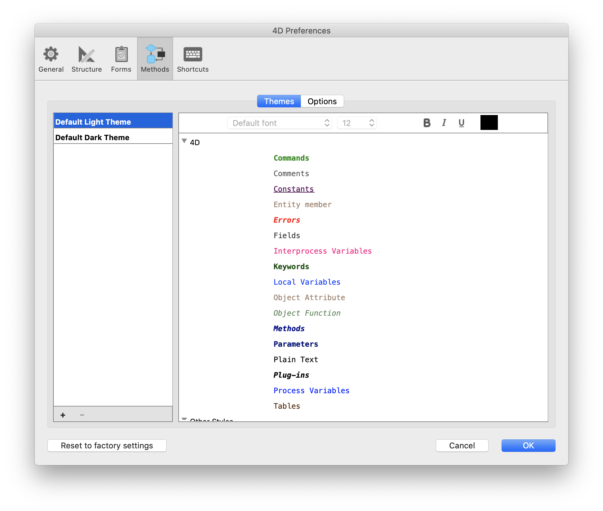
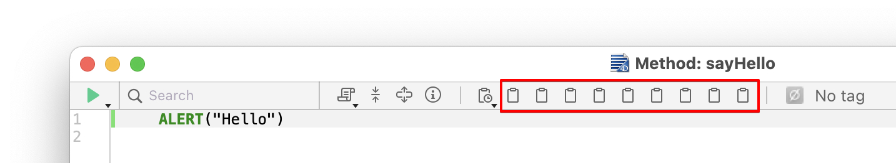
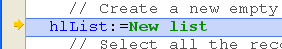

Esta página contiene parámetros que definen la interfaz del Editor de Código y su visualización por defecto, así como opciones relativas a su funcionamiento. Se divide en dos secciones a las que se accede mediante las pestañas Tema y Opciones.

## Temas

Esta página permite seleccionar, crear o configurar los temas del Editor de Código. Un tema define la fuente, el tamaño de la fuente, los colores y los estilos de los elementos mostrados del editor de código.

### Lista de temas

En esta lista, se selecciona el tema que se aplicará al editor de código. Se muestran todos los temas disponibles, incluidos los temas personalizados (si los hay). 4D ofrece dos temas por defecto:

- **Tema Light por defecto**
- **Tema oscuro por defecto**

> Los temas por defecto no pueden ser modificados ni eliminados.

A **myTheme** theme is automatically added if you already customized Code Editor styles in previous 4D releases.

### Creación de temas personalizados

Puede crear temas totalmente personalizables. To create a theme, select an existing theme and click on the **+** at the bottom of the theme list. You can also add customized themes by copying theme files in the `4D Editor Themes` folder (see below).

### Archivos de temas personalizados

Each custom theme is stored in a single JSON file named _themeName.json_ The JSON files for custom themes are stored in the `4D Editor Themes` folder located at the same level as the 4D [preferences file](overview.md#storage).

If key values are not defined in a custom theme, they default to the values from the _Default Light Theme_. If a JSON theme file is invalid, the _Default Light Theme_ is loaded and an error is generated.

> Cuando un archivo de tema es modificado por un editor externo, 4D debe ser reiniciado para tener en cuenta las modificaciones.

## Definir el tema

Definir un tema significa:

- definir una fuente y un tamaño de fuente para todo el editor de código,
- asignar los estilos y los colores específicos a cada elemento del lenguaje 4D (campos, tablas, variables, parámetros, SQL, etc.), a cada elemento del lenguaje SQL (palabras clave, funciones, etc.) y a los fondos de color.

La combinación de colores y de estilos diferentes es especialmente útil para el mantenimiento del código.

### Fuentes y tamaños de fuente

The **font** and **font size** menus allows you to select the font name and size used in the Code Editor entry area for all categories.

### Lenguaje 4D y lenguaje SQL

Puede definir diferentes estilos de fuente y colores de fuente (color de fuente o color de fondo) para cada tipo de elemento del lenguaje. Puede seleccionar los elementos que desea personalizar en la lista de categorías.

### Otros estilos

Estas opciones configuran los distintos colores utilizados en las interfaces del Editor de código y del depurador.

|                                                        | Descripción                                                                                                                                                                              |
| ------------------------------------------------------ | ---------------------------------------------------------------------------------------------------------------------------------------------------------------------------------------- |
| **Color de fondo**                                     | Color de fondo de la ventana del editor de código.                                                                                                                       |
| **Borde de la línea en ejecución en el depurador**     | Color of the border surrounding the line currently running in the debugger when the "Highlight line running" option is enabled in the [Options](#options) page.          |
| **Color de fondo de la línea del cursor**              | Color de fondo de la línea que contiene el cursor.                                                                                                                       |
| **Color de fondo de la línea en ejecución**            | Color de fondo de la línea que se está ejecutando en el depurador.                                                                                                       |
| **Resaltar las palabras encontradas**                  | Color de resaltado de las palabras encontradas en una búsqueda.                                                                                                          |
| **Destacar los paréntesis**                            | Highlight color of corresponding parentheses (used when pairs of parentheses are signaled by highlighting, see [Options](#options)).                  |
| **Resaltado de los bloques**                           | Highlight color for selected logical blocks when the "Highlight logical blocks" option is enabled in the [Options](#options).                                            |
| **Resaltar la misma variable o campo**                 | Highlight color for other occurrences of the same variable or field text when one of the "Highlighting variables and text" option is enabled in the [Options](#options). |
| **Resaltado de la línea en ejecución en el depurador** | Highlight color of the line currently running in the debugger when the "Highlight line running" option is enabled in the [Options](#options).                            |
| **Color de fondo de la selección**                     | Color de fondo de la selección.                                                                                                                                          |
| **Texto sugerido**                                     | Color del texto de autocompletar sugerido por el Editor de Código.                                                                                                       |

## Opciones

Esta página configura las opciones de visualización del Editor de Código.

### Opciones

#### Lenguaje de programación 4D (Utilizar los parámetros regionales del sistema)

Permite desactivar/activar los parámetros del código "internacional" para la aplicación 4D local.

- **unchecked** (default): English-US settings and the English programming language are used in 4D methods.
- **checked**: Regional settings are used in 4D methods.

> Si modifica esta opción, deberá reiniciar la aplicación 4D para que se tenga en cuenta el cambio.

#### Indentación

Cambia el valor de indentación del código 4D en el editor de código. El ancho debe especificarse en puntos (10 por defecto).

El código 4D es indentado automáticamente para revelar su estructura:

Modificar este valor por defecto puede ser útil si sus métodos contienen algoritmos complejos con muchos niveles de integración. Se puede utilizar una indentación más estrecha para limitar el desplazamiento horizontal.

#### Mostrar los números de línea

Le permite mostrar los números de línea por defecto en cada ventana del Editor de Código. También puede mostrar/ocultar los números de línea de la ventana actual directamente desde el Editor de código.

#### Mostrar las listas

Lets you choose whether or not to show the lists of objects (Commands, Tables and fields, etc.) by default when the Code Editor window is opened. También puede mostrar u ocultar cada lista directamente desde el Editor de código.

#### Mostrar los portapapeles

Le permite elegir si mostrar o no los múltiples portapapeles en el editor de código.

The corresponding [clipboard shorcuts](https://doc.4d.com/4Dv19R3/4D/19-R3/Writing-a-method.300-5612559.en.html#3977166) are still active when these clipboards are hidden.

#### Resaltado de los bloques lógicos

Cuando está seleccionada, todo el código perteneciente a un bloque lógico (If/End if por ejemplo) se resalta cuando el ratón se sitúa sobre el nodo expandido:

The highlight color can be set in the [Theme](#theme-definition) page.

#### Mostrar siempre las líneas de bloques

Permite ocultar permanentemente las líneas verticales de bloques. Las líneas de bloque están diseñadas para conectar visualmente los nodos. Por defecto, siempre se muestran (excepto cuando los iconos contraer/desplegar están ocultos, ver más abajo).

#### Ocultar los iconos contraer/expandir

Permite ocultar todos los iconos expandir/desplegar por defecto al mostrar el código. Cuando la opción está seleccionada, los iconos de nodo (así como las líneas de bloque locales, ver arriba), se muestran temporalmente cuando el ratón se sitúa sobre un nodo:

#### Insertar () y añadir } ) ] " cierres

Activa la inserción automática de () y de llaves de cierre mientras se escribe el código. Esta opción controla dos funcionalidades automáticas:

- **parentheses pair ()**: Added after a 4D command, keyword or project method inserted from a suggestion or completion list, if the inserted element requires one or more mandatory arguments. Por ejemplo, si escribe "C_OB" y presionaa Tab, 4D escribe "C_OBJECT()" y fija el punto de inserción dentro del ().

- **closing }, ), ], or "**: Character added when you type respectively an opening {, (, ], or ". Esta función permite insertar pares de símbolos coincidentes en el punto de inserción o alrededor de un texto seleccionado. Por ejemplo, si resalta una cadena de caracteres y escribe un simple caracter ", toda la cadena seleccionada quedará encerrada en "":

\

#### Correspondencia \[]\(){}

Define la señalización gráfica de las llaves correspondientes en el código. Esta señalización aparece siempre que se selecciona un corchete, un paréntesis o una llave.
Las siguientes opciones están disponibles:

- **None**: No signaling
- **Rectangle** (default): Braces surrounded by a black line\
  
- **Background Color**: Braces highlighted (the color is set in the [Theme](#theme-definition) page).
- **Bold**: Braces displayed in bold.

#### Resaltado de las variables y campos

Permite resaltar todas las ocurrencias de la misma variable o campo en una ventana de método abierta.

- **No**(default): No highlight
- **On cursor**: All occurrences are highlighted when the text is clicked
- **On selection**: All occurrences are highlighted when the text is selected

The highlight color can be set in the [Theme](#theme-definition) page.

#### Depurar (Resaltar la línea en ejecución)

Resalta la línea que se está ejecutando actualmente en el depurador, además del indicador de flecha amarilla.

Si deselecciona esta opción, sólo se mostrará la flecha amarilla.

### Sugerencias

Esta área le permite configurar los mecanismos de autocompletar en el Editor de código para adaptarlo a sus propios hábitos de trabajo.

|                                   | Descripción                                                                                                                                                                                                                                                                                                                                                                                                                                                                                                                                                                                                                                                                                                                                                                                                                                                                                                                                                                                                                                                                                         |
| --------------------------------- | --------------------------------------------------------------------------------------------------------------------------------------------------------------------------------------------------------------------------------------------------------------------------------------------------------------------------------------------------------------------------------------------------------------------------------------------------------------------------------------------------------------------------------------------------------------------------------------------------------------------------------------------------------------------------------------------------------------------------------------------------------------------------------------------------------------------------------------------------------------------------------------------------------------------------------------------------------------------------------------------------------------------------------------------------------------------------------------------------- |
| Apertura automática de la ventana | Triggers the automatic display of the suggestion window for:<ul><li>Constants</li><li>Variables (local and interprocess) and object attributes</li><li>Tables</li><li>Prototypes (_i.e._, class functions)</li></ul>
For example, when the "Variables (local or interprocess) and object attributes" option is checked, a list of suggestions appears when you type the $ character:

 You can disable this functioning for certain elements of the language by deselecting their corresponding option.                                                                                                                                                                                                                                                                                                                                                                                    |
| Validación de una sugerencia      | Sets the entry context that allows the Code Editor to validate automatically the current suggestion displayed in the autocomplete window.<ul><li>**Tab and delimiters** When this option is selected, you can validate the current selection with the Tab key or any delimiter that is relevant to the context. Por ejemplo, si introduce "ALE" y luego "(", 4D escribe automáticamente "ALERT(" en el editor. Here is the list of delimiters that are taken into account:  ( ; : = < [ {</li><li>**Tab only** When this option is selected, you can only use the Tab key to insert the current suggestion. This can be used more particularly to facilitate the entry of delimiter characters in element names, such as ${1}.**Note**: You can also double-click in the window or press the Carriage return key to validate a suggestion.</li></ul> |
