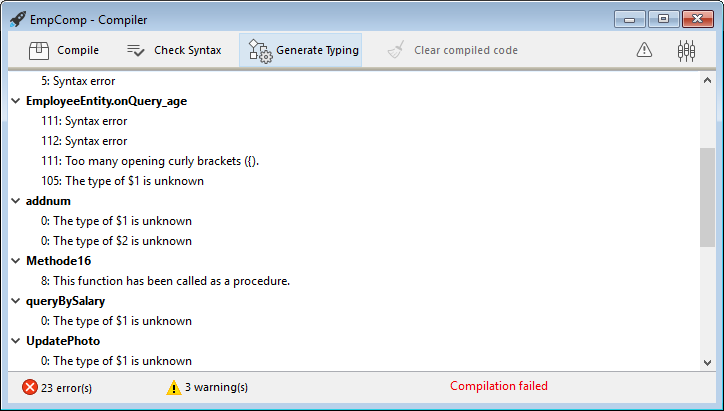

Puede compilar sus proyectos, es decir, traducir todos sus métodos a lenguaje máquina. La compilación de un proyecto permite verificar la coherencia del código y acelerar su ejecución, además de posibilitar ocultar el código en su totalidad. La compilación es un paso indispensable entre el desarrollo de proyectos con 4D y su despliegue como aplicaciones independientes.


## Compilar

La compilación se realiza desde su aplicación 4D y es totalmente automática.

> En macOS, la compilación requiere que instale `Xcode`. Consulte [esta sección](#silicon-compiler) para obtener más información sobre este requisito.

1. Abra la ventana de compilación seleccionando el comando **Compilador...** en el menú **Diseño** o el botón **Compilador** de la barra de herramientas.

    

    

> También puede lanzar directamente la compilación seleccionando el elemento de menú **Iniciar compilación** en el menú **Diseño**.

2. Haga clic en el botón **Compilar** para lanzar la compilación utilizando los [parámetros ded compilación](#compiler-settings) actuales.

Si no se detecta ningún error, se inicia la compilación y se muestra el mensaje "Compilación exitosa" en la parte inferior de la ventana cuando se completa la compilación:


Puede inmediatamente [ejecutar su aplicación en modo compilado](#run-compiled) y ver lo rápido que es.

Si se detectan errores, se detiene el proceso y se muestra el mensaje "Compilación fallida". El área de información de la ventana muestra los nombres de los métodos y los números de línea correspondientes en una lista jerárquica:



Haga doble clic en cada error detectado para abrir el método o la clase en cuestión directamente en el Editor de código 4D. La línea que contiene el error se resalta y el tipo de error se muestra en el área de sintaxis de la ventana.

Utilice los comandos **Error anterior** / **Error siguiente** del menú **Método** para navegar de un error a otro.

El número de errores encontrados durante las primeras compilaciones puede ser desalentador, pero no deje que esto lo desanime. Pronto descubrirá que a menudo proceden de la misma fuente, es decir, el incumplimiento de ciertas convenciones del proyecto. El compilador siempre ofrece un [diagnóstico preciso](#error-files) de los errores para ayudarle a corregirlos.

> La compilación requiere una licencia apropiada. Sin esta licencia, no es posible llevar a cabo una compilación (los botones están desactivados). Sin embargo, aún es posible comprobar la sintaxis y generar métodos de digitación.

## Ejecutar la compilación

Una vez compilado un proyecto, es posible pasar del [modo interpretado al modo compilado](Concepts/interpreted.md), y viceversa, en cualquier momento y sin tener que salir de la aplicación 4D (excepto cuando se ha eliminado el código interpretado). Para ello, utilice los comandos **Reiniciar en interpretado** y **Reiniciar en compilado** del menú **Ejecución**. La [caja de diálogo de apertura del proyecto](GettingStarted/creating.md#options) también ofrece elegir entre el modo interpretado o compilado para iniciar la base de datos.

Cuando pasa de un modo al otro, 4D cierra el modo actual y abre el nuevo. Esto equivale a salir y volver a abrir la aplicación. Cada vez que se cambia de un modo a otro, 4D ejecuta los dos métodos base siguientes (si se especifican) en este orden: `On Exit` -> `On Startup`.

Si modifica su proyecto en modo interpretado, debe recompilarlo para que sus modificaciones sean tenidas en cuenta en modo compilado.

## Características de la ventana del compilador

Además del botón [**Compilar**](#compile), la ventana del compilador ofrece otras funcionalidades útiles durante la fase de desarrollo del proyecto.

### Verificar la sintaxis

El botón **Verificar la sintaxis** lanza la ejecución de la fase de verificación de la sintaxis. Al final del proceso de verificación, los errores detectados se listan en el área de información. Puede hacer doble clic en una línea de error para mostrar el método correspondiente.

El control sintáctico también puede lanzarse directamente con el comando **Verificar sintaxis** asociado al botón de la barra de herramientas **Compilador**. Esta opción es la única disponible si no dispone de una licencia adecuada para permitir la compilación de aplicaciones.

### Declarar tipos

El botón **Declarar Tipos** crea o actualiza los métodos del compilador. Los métodos de compilación son los métodos proyecto que agrupan todas las declaraciones de tipos de las variables y de los arrays (proceso e interproceso), así como los parámetros de los métodos. Estos métodos, cuando existen, son utilizados directamente por el compilador durante la compilación del código, lo que da lugar a tiempos de compilación más rápidos.

El nombre de estos métodos debe comenzar por `Compiler_`. Puede definir el nombre por defecto de cada uno de los 5 métodos del compilador en [la ventana de los parámetros del compilador](#compiler-methods-for). Los métodos de compilación que son generados y mantenidos por 4D tienen automáticamente el atributo `Invisible`:


Sólo se generan los métodos de compilación necesarios (es decir, aquellos para los que ya existen elementos en el proyecto).

El área de información indica todo error encontrado durante la creación o actualización del método. Hacer doble clic en una línea de error provoca que el método y la línea en cuestión se muestren en el editor de código.


### Eliminar el código de compilación

El botón **Borrar el código compilado** borra el código compilado del proyecto. Al hacer clic en él, se borra todo el [código generado durante la compilación](#classic-compiler), se desactiva el comando **Reiniciar compilado** del menú **Ejecutar** y la opción "Proyecto compilado" no está disponible al inicio.


### Mostrar/Ocultar advertencias

Las advertencias son mensajes específicos generados por el compilador cuando verifica la sintaxis. Estos mensajes están destinados a llamar su atención sobre las declaraciones que podrían llevar a errores de ejecución. No impiden la compilación.

Dependiendo de las circunstancias y del estilo de programación utilizado, estas advertencias pueden ser más o menos relevantes. Puede activar o desactivar las advertencias haciendo clic en el botón **Mostrar/Ocultar las advertencias**:


Cuando esta opción está marcada, las advertencias (si las hay) se muestran en la ventana, después de los otros tipos de error. Aparecen en itálica:


Al hacer doble clic en un aviso se abre el método correspondiente.

#### Desactivar las advertencias durante la compilación

Puede desactivar selectivamente ciertas advertencias durante la compilación insertando el siguiente en el código de un método 4D:

```4d
  //%W-<warning number>
```

Sólo se pueden desactivar los avisos con números. Los números de advertencia se indican al final de cada mensaje en la lista de errores de compilación. Por ejemplo, para desactivar la siguiente advertencia:

*1: Puntero en una declaración de array (518.5)*

... sólo debe escribir el siguiente comentario en un método 4D, preferiblemente un método `COMPILER_xxx` (método compilado primero):

```4d
  //%W-518.5
```


## Parámetros del compilador

La página "Compilador" de la caja de diálogo de Propiedades le permite definir los parámetros relacionados con la compilación del proyecto. Puede abrir directamente esta página desde la [ventana del compilador](#compiler-window) haciendo clic en el botón **Parámetros del compilador**:


### Opciones de compilación

Esta área agrupa las opciones genéricas utilizadas durante el proceso de compilación.

#### Generar el archivo de símbolos

Used to generate the error file (see [error file](#symbol-file)) at the time of syntax checking. Used to generate the symbol file (see [symbol file](#symbol-file)).

#### Generar archivo de errores

Se utiliza para generar el archivo de errores (ver [archivo de errores](#symbol-file)) en el momento del control sintáctico. El archivo de error se crea en la [carpeta Logs](Project/architecture.md#logs) del proyecto con el nombre `ProjectName_errors.xml`.


#### Ruta de compilación

Permite definir el número de pases (análisis de código) que realiza el compilador y, por tanto, la duración de la compilación.

- **Definir los tipos de las variables**: pasa por todas las etapas que hacen posible la compilación.
- **Las variables proceso e interproceso se escriben**: el pase de definir los tipo de las variables proceso e interproceso no se lleva a cabo. Esta opción se puede utilizar cuando ya ha definido el tipo de todas sus variables proceso e interproceso por sí mismo o utilizando la función de generación automática de los métodos compilador.
- **Se definen todos los tipos de las variables**: el pase para definir el tipo de las variables locales, proceso e interproceso no se lleva a cabo. Utilice esta opción cuando esté seguro de que todas las variables proceso, interproceso y locales tengan su tipo definido claramente.

#### Objetivo de compilación

<details><summary>Histórico</summary>

| Versión | Modificaciones |
| ------- | -------------- |
| v19     | Añadidos       |

</details>

Este parámetro le permite seleccionar la familia de procesadores para la cual su proyecto 4D debe estar compilado de forma nativa. El compilador 4D puede generar código nativo para dos familias de procesadores:

- Los procesadores **Intel/AMD** (todas las máquinas),
- los procesadores **Apple Silicon**.

Se proponen dos opciones de objetivo. El resultado depende del procesador de la máquina en la que se ejecuta 4D.

| *Option*                                               | *en Windows Intel/AMD*                                                                   | *macOS Intel*                                                                                          | *macOS Silicon*                                                                                        |
| ------------------------------------------------------ | ---------------------------------------------------------------------------------------- | ------------------------------------------------------------------------------------------------------ | ------------------------------------------------------------------------------------------------------ |
| **Todos los procesadores (Intel/AMD y Apple Silicon)** | Código para Intel/AMD<br/>*No es posible producir código Apple Silicon en Windows* | Código para Apple Silicon + Código para Intel/AMD<br/>*Habrá dos códigos compilados disponibles* | Código para Apple Silicon + Código para Intel/AMD<br/>*Habrá dos códigos compilados disponibles* |
| **Mi procesador (procesador)**                         | Código para Intel/AMD                                                                    | Código para Intel/AMD                                                                                  | Código para Apple Silicon                                                                              |

> El objetivo de compilación Apple Silicon requiere que la aplicación **Clang** esté instalada en su máquina. Clang viene con la última versión de Xcode. Ver los [requisitos del compilador Silicon](#requirements) para más información.

### Declaración de tipos por defecto

Utilice este área para definir el tipo por defecto para los objetos de base de datos ambiguos.

- **Numérico**: se utiliza para forzar un tipo numérico de manera no ambigua, bien sea real o entero largo. Esto no anulará las directivas que haya establecido en su proyecto. Puede optimizar el funcionamiento de su base de datos eligiendo el tipo Longint.
- **Botón**: se utiliza para forzar el tecleo de un botón de manera no ambigua, ya sea Real o Entero largo. Esto no anulará las directivas que haya establecido en su proyecto. Este tipo se aplica a los botones y a las casillas de selección, a los botones imagen, a las rejillas de botones, a los botones radio, a los menús pop-up imagen y a las listas desplegables.

### Métodos Compilador para...

Esta área le permite renombrar los métodos del compilador que son generados automáticamente por el compilador cuando hace clic en [Declarar tipos](#generate-typing).

Up to 5 compiler methods may be generated; a compiler method is only generated if the project contains the following items:

- **Variables**: Groups together process variable declarations;
- **Interprocess Variables**: Groups together interprocess variable declarations;
- **Arrays**: Groups together process array declarations;
- **Interprocess Arrays**: Groups together interprocess array declarations;
- **Methods**: Groups together method parameter declarations (for instance, `C_LONGINT(mymethod;$1;$2)`).

You can rename each of these methods in the corresponding areas, but they will always be preceded by the label `Compiler_` (non-modifiable). The name of each method (prefix included) must be no longer than 31 characters. It must also be unique and comply with [4D rules for naming methods](Concepts/identifiers.md#project-methods).


## Herramientas de compilación

### Archivo Symbol

If you check the [**Generate the symbol file**](#generate-the-symbol-file) option in the compiler settings, a symbol file called `ProjectName_symbols.txt` is created in the [Logs folder](Project/architecture.md#logs) of the project during compilation. Está dividido en varias partes:

#### Lista de las variables proceso e interproceso

Estas dos listas contienen cuatro columnas:

- Names of process and interprocess variables and arrays used in your project. Estas variables están listadas en orden alfabético.
- Tipo de la variable. Types are set by compiler directive commands or are determined by the compiler based on the use of the variable. If the type of a variable cannot be determined, the column is empty.
- Número de dimensiones si la variable es un array.
- Reference to the context in which the compiler established the type of the variable. If the variable is used in several contexts, the context mentioned is the one used by the compiler to determine its type.
    - If the variable was found in a database method, the database method name is given, preceded by (M)*.
    - If the variable was found in a project method, the method is identified as it has been defined in 4D, preceded by (M).
    - If the variable was found in a trigger, the table name is given, preceded by (TM).
    - If the variable was found in a form method, the form name is given, preceded by the table name and (FM).
    - If the variable was found in an object method, the object method’s name is given, preceded by the form name, table name, and by (OM).
    - If the variable is an object in a form and does not appear in any project, form, object method, or trigger, the name of the form in which it appears is given, preceded by (F). At the end of each list, you can find the sizes of the process and interprocess variables in bytes.

> When compiling, the compiler cannot determine in which process a given process variable is used. Una variable proceso puede tener un valor diferente en cada proceso. Consequently, all process variables are systematically duplicated as each new process is launched: it is thus advisable to watch out for the amount of memory that they will take up. Also, keep in mind that the space for process variables is not related to the stack size for the process.

#### Lista de las variables locales

The list of local variables is sorted by database method, project method, trigger, form method, and object method, in the same order as in 4D.

Esta lista está dividida en tres columnas:

- la lista de las variables locales utilizadas en el método;
- tipo de la variable;
- número de dimensiones si la variable es un array.

#### Lista completa de los métodos

A complete list of your database and project methods is given at the end of the file with:

- su tipo (procedimiento o función que devuelve un valor)
- los tipos de datos de sus parámetros y del resultado devuelto
- el número de llamadas
- la propiedad Thread Safe o Thread Unsafe.

Esta información aparece así:

```
Procedure or Function <Method name>(parameter data types):
result data type, number of calls, Thread Safe or Thread Unsafe
```

### Archivo de errores

You can choose whether or not to generate an error file during compilation using the [**Generate error file**](#generate-error-file) option in the compiler settings. The error file is automatically named `projectName_errors.xml` and is placed in the [Logs folder](Project/architecture.md#logs) of the project.

Although the errors can be accessed directly via the [compiler window](#compile), it can be useful to have an error file that can be transmitted from one machine to another. The error file is generated in XML format in order to facilitate automatic parsing of its contents. También permite la creación de interfaces personalizadas de visualización de errores.

The length of the error file depends on the number of errors and warnings issued by the compiler.

La estructura del archivo de errores es la siguiente:

- At the top of the file is the list of errors and warnings, sorted by method and in their order of creation in 4D.
- In the ***General errors*** section, all the typing impossibilities and identity ambiguities are grouped together. Estos errores y advertencias se listan utilizando el siguiente formato:
    - el número de línea en el método (0 indica errores generales)
    - warning attribute indicating whether the detected anomaly is a warning (warning="true") or an error (warning="false")
    - diagnóstico que describe el error

If your project does not have any general errors, the file will not have a *General errors* section.

Un archivo de error puede contener tres tipos de mensajes:

- **Errors linked to a specific line**: these errors are displayed in context — the line in which they were found — with an explanation. The compiler reports this type of error when it encounters an expression in which it sees an inconsistency related to data type or syntax. In the compiler window, double–click on each error detected in order to open the method concerned directly in the 4D Code Editor, with the line containing the error highlighted.

- **General errors**: These are errors that make it impossible to compile the project. Hay dos casos en los que el compilador informa de un error general:
    - No se ha podido determinar el tipo de datos de una variable proceso.
    - Dos tipos diferentes de objetos tienen el mismo nombre.

General errors are so named because they cannot be linked to any specific method. In the first case, the compiler could not perform a specified typing anywhere in the project. In the second, it was unable to decide whether to associate a given name with one object rather than with another.

- **Avisos**: los avisos no son errores. They do not prevent the project from being compiled, but simply point out potential code errors. En la ventana del compilador, las advertencias aparecen en itálica. Double-click on each warning to open the method concerned directly in the 4D Code Editor, with the line containing the warning highlighted.


### Control de ejecución

The code generated by the 4D compiler automatically checks that every access to an array element or a character reference is done within the actual range of array elements or string characters. Los accesos fuera de rango provocarán errores durante la ejecución.

In some cases, you might prefer range checking not to apply to certain parts of the code that are considered to be reliable. More particularly, in the case of loops that are repeated a great number of times, and when running the compiled database on older machines, range checking can significantly slow down processing. If you are absolutely certain that the code concerned is reliable and cannot cause system errors, you can disable range checking locally.

To do this, you must surround the code to be excluded from range checking with the special comments `//%R-` and `//%R+`. The `//%R-` comment disables range checking and `//%R+` enables it again:

```4d
  // %R-   to disable range checking

 ... //Place the code to be excluded from range checking here

  // %R+   to enable range checking again for the rest
```

## Acerca de los compiladores

4D incluye dos compiladores:

- un compilador "clásico", utilizado para compilar código nativo para los procesadores Intel/AMD;
- a Silicon compiler, used to compile native code for Apple Silicon processors.

The classic compiler can be used on any platform, while the Silicon compiler can only be used on a Mac machine:

|             | Compilar para Windows | Compilación para Intel Mac | Compilación para Mac Silicon |
| ----------- |:---------------------:|:--------------------------:|:----------------------------:|
| En Windows  |       &#10003;        |          &#10003;          |           &#10007;           |
| Intel Mac   |       &#10003;        |          &#10003;          |           &#10003;           |
| Silicon Mac |       &#10003;        |          &#10003;          |           &#10003;           |


Ambos compiladores están integrados en 4D. The appropriate compiler is automatically selected depending on the [compilation target](#compilation-target) option.


### Compilador clásico

The classic compiler generates native compiled code for Intel/AMD processors on any machines. No requiere ninguna configuración específica.

Resulting compiled code is stored in the [DerivedData](architecture.md#deriveddata) folder of the project.


### Compilador Silicon

The Silicon compiler generates native compiled code for Apple Silicon processors, such as *Apple M1*.

Resulting compiled code is stored in the [Libraries](architecture.md#libraries) folder of the project.


#### Requisitos

- **Apple machine**: The Silicon compiler can only be run from an Apple machine.
- **4D Project architecture**: The Silicon compiler is only available for 4D developments using [project architecture](architecture.md).
- **Xcode or Developer Tools**: The Silicon compiler calls the **Clang** open-source macOS compiler to compile the project from C++ code at the [second step](#incremental-compiler) of compilation. **Xcode or Developer Tools**: The Silicon compiler calls the **Clang** open-source macOS compiler to compile the project from C++ code at the [second step](#incremental-compiler) of compilation.
    - **If you already have** Xcode or Developer Tools installed on your computer, you only need to make sure that its version is compliant with 4D requirements.
    - **If you do not have** any of these tools installed on your computer, you will need to download one of them from the Apple Developer web site.

> We recommend to install **Xcode**, which is quite simple to install. You can decide to install **Developer Tools** which is more compact, however its installation is a little more complex.

In any cases, the 4D Silicon compiler will warn you if your configuration does not comply with its requirements.


#### Compilador incremental

El compilador Silicon es incremental, lo que significa que:

- During the very first compilation, **all 4D methods** are compiled. Este paso podría tomar un cierto tiempo. Sin embargo, sólo ocurre una vez.
- During all subsequent compilations, only **new or modified methods** are processed, thus reducing drastically the compilation time. 