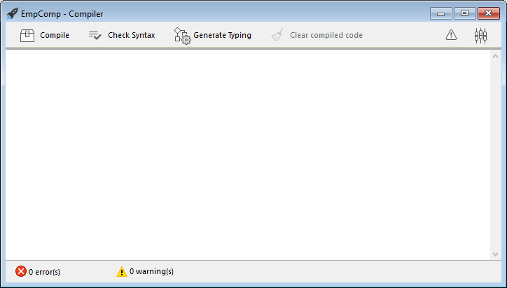

Puede compilar sus proyectos, es decir, traducir todos sus métodos a lenguaje máquina. La compilación de un proyecto permite verificar la coherencia del código y acelerar su ejecución, además de posibilitar ocultar el código en su totalidad. La compilación es un paso indispensable entre el desarrollo de proyectos con 4D y su despliegue como aplicaciones independientes.

## Compilar

La compilación se realiza desde su aplicación 4D y es totalmente automática.

> En macOS, la compilación requiere que instale `Xcode`. Consulte [esta sección](#silicon-compiler) para obtener más información sobre este requisito.

1. Abra la ventana de compilación seleccionando el comando **Compilador...** en el menú **Diseño** o el botón **Compilador** de la barra de herramientas.

   

   

> También puede lanzar directamente la compilación seleccionando el elemento de menú **Iniciar compilación** en el menú **Diseño**.

2. Haga clic en el botón **Compilar** para lanzar la compilación utilizando los [parámetros ded compilación](#compiler-settings) actuales.

Si no se detecta ningún error, se inicia la compilación y se muestra el mensaje "Compilación exitosa" en la parte inferior de la ventana cuando se completa la compilación:


Puede inmediatamente [ejecutar su aplicación en modo compilado](#run-compiled) y ver lo rápido que es.

Si se detectan errores, se detiene el proceso y se muestra el mensaje "Compilación fallida". El área de información de la ventana muestra los nombres de los métodos y los números de línea correspondientes en una lista jerárquica:


Haga doble clic en cada error detectado para abrir el método o la clase en cuestión directamente en el Editor de código 4D. La línea que contiene el error se resalta y el tipo de error se muestra en el área de sintaxis de la ventana.

Utilice los comandos **Error anterior** / **Error siguiente** del menú **Método** para navegar de un error a otro.

El número de errores encontrados durante las primeras compilaciones puede ser desalentador, pero no deje que esto lo desanime. Pronto descubrirá que a menudo proceden de la misma fuente, es decir, el incumplimiento de ciertas convenciones del proyecto. El compilador siempre ofrece un [diagnóstico preciso](#error-file) de los errores para ayudarle a corregirlos.

> La compilación requiere una licencia apropiada. Sin esta licencia, no es posible llevar a cabo una compilación (los botones están desactivados). Sin embargo, aún es posible comprobar la sintaxis y generar métodos de digitación.

## Ejecutar la compilación

Una vez compilado un proyecto, es posible pasar del [modo interpretado al modo compilado](Concepts/interpreted.md), y viceversa, en cualquier momento y sin tener que salir de la aplicación 4D (excepto cuando se ha eliminado el código interpretado). Para ello, utilice los comandos **Reiniciar en interpretado** y **Reiniciar en compilado** del menú **Ejecución**. La [caja de diálogo de apertura del proyecto](GettingStarted/creating.md#options) también ofrece elegir entre el modo interpretado o compilado para iniciar la base de datos.

Cuando pasa de un modo al otro, 4D cierra el modo actual y abre el nuevo. Esto equivale a salir y volver a abrir la aplicación. Cada vez que se cambia de un modo a otro, 4D ejecuta los dos métodos base siguientes (si se especifican) en este orden: `On Exit` -> `On Startup`.

Si modifica su proyecto en modo interpretado, debe recompilarlo para que sus modificaciones sean tenidas en cuenta en modo compilado.

## Características de la ventana del compilador

Además del [botón **Compilar**](#compile), la ventana Compilador ofrece otras funcionalidades útiles durante la fase de desarrollo del proyecto.

### Verificar la sintaxis

El botón **Verificar la sintaxis** lanza la ejecución de la fase de verificación de la sintaxis. Al final del proceso de verificación, los errores detectados se listan en el área de información. You can double–click on an error line in order to display the corresponding method or form object.

El control sintáctico también puede lanzarse directamente con el comando **Verificar sintaxis** asociado al botón de la barra de herramientas **Compilador**. Esta opción es la única disponible si no dispone de una licencia adecuada para permitir la compilación de aplicaciones.

### Declarar tipos

:::info Compatibilidad

This button is only displayed in converted projects if the **All variables are typed (Direct typing)** [compilation path option](#enabling-direct-typing) is not selected. For information about this button, please refer to the [documentation of previous 4D releases](../Project/compiler.md#generate-typing).

:::

### Eliminar el código de compilación

El botón **Borrar el código compilado** borra el código compilado del proyecto. Al hacer clic en él, se borra todo el [código generado durante la compilación](#classic-compiler), se desactiva el comando **Reiniciar compilado** del menú **Ejecutar** y la opción "Proyecto compilado" no está disponible al inicio.

### Mostrar/Ocultar advertencias

Puede alternar la visualización de [advertencias](#advertencias) en la ventana del compilador haciendo clic en el botón **Mostrar/Ocultar advertencias**:


Cuando esta opción está marcada, las advertencias (si las hay) se muestran en la ventana, después de los otros tipos de error. Aparecen en itálica:


Al hacer doble clic en un aviso se abre el método correspondiente.

## Parámetros del compilador

La pestaña "Compilador" de la caja de diálogo Propiedades le permite definir los parámetros relacionados con la compilación del proyecto. Puede abrir directamente esta página desde la [ventana del compilador](#compiler-window) haciendo clic en el botón **Parámetros del compilador**:


### Opciones de compilación

Esta área agrupa las opciones genéricas utilizadas durante el proceso de compilación.

#### Generar el archivo de símbolos

Used to generate the error file (see [error file](#symbol-file)) at the time of syntax checking. Used to generate the symbol file (see [symbol file](#symbol-file)).

#### Generar archivo de errores

Se utiliza para generar el archivo de errores (ver [archivo de errores](#error-file)) en el momento del control sintáctico. El archivo de error se crea en la [carpeta Logs](Project/architecture.md#logs) del proyecto con el nombre `ProjectName_errors.xml`.

#### Objetivo de compilación

<details><summary>Historia</summary>

| Lanzamiento | Modificaciones |
| ----------- | -------------- |
| 19          | Añadidos       |

</details>

Este parámetro le permite seleccionar la familia de procesadores para la cual su proyecto 4D debe estar compilado de forma nativa. El compilador 4D puede generar código nativo para dos familias de procesadores:

- Los procesadores **Intel/AMD** (todas las máquinas),
- los procesadores **Apple Silicon**.

Se proponen dos opciones de objetivo. El resultado depende del procesador de la máquina en la que se ejecuta 4D.

| _Opción_                                                                  | _en Windows Intel/AMD_                                                             | _macOS Intel_                                                                                    | _macOS Silicon_                                                                                  |
| ------------------------------------------------------------------------- | ---------------------------------------------------------------------------------- | ------------------------------------------------------------------------------------------------ | ------------------------------------------------------------------------------------------------ |
| **Todos los procesadores (Intel/AMD y Apple Silicon)** | Código para Intel/AMD<br/>_No es posible producir código Apple Silicon en Windows_ | Código para Apple Silicon + Código para Intel/AMD<br/>_Habrá dos códigos compilados disponibles_ | Código para Apple Silicon + Código para Intel/AMD<br/>_Habrá dos códigos compilados disponibles_ |
| **Mi procesador (procesador)**                         | Código para Intel/AMD                                                              | Código para Intel/AMD                                                                            | Código para Apple Silicon                                                                        |

> El objetivo de compilación Apple Silicon requiere que la aplicación **Clang** esté instalada en su máquina. Clang viene con la última versión de Xcode. Ver los [requisitos del compilador Silicon](#requirements) para más información.

### Opciones adicionales (Compatibilidad)

In projects converted from 4D versions prior to 20 R7, additional compilation options are available:

- **Ruta de compilación**
- **Declaración de tipos por defecto**
- **Métodos Compilador para...**

Estas opciones solo se mantienen por compatibilidad con código antiguo. For more information, please refer to the [documentation of previous 4D releases](../Project/compiler.md#compiler-settings).

En proyectos convertidos, se recomienda [habilitar el modo de escritura directa](#enabling-direct-typing) y escribir código de declaración conforme, por ejemplo:

- declarar explícitamente todas las variables [usando palabras clave `var`](../Concepts/variables.md#declaring-variables)
- declarar explícitamente todos los parámetros en prototipos de funciones (es decir, usando las palabras clave `Function` o `Class Constructor`) o con `#DECLARE` en métodos (ver [Declarando parámetros](../Concepts/parameters.md#declaring-parameters)).

#### Enabling direct typing

:::info

El modo de escritura directa es opcional sólo en proyectos convertidos. Se utiliza nativamente en proyectos creados con 4D 20 R7 y superiores.

:::

Select **All variables are typed (Direct typing)** option in the **Compilation Path** menu to enable the direct typing mode. When this option is selected, other compatibility options become useless and are no longer displayed.

Using this option is recommended since it provides flexibility and efficiency. The direct typing concept assumes that all elements are directly declared where they are defined in your code. Solo tiene que asegurarse de que todas sus variables son declaradas utilizando la [sintaxis 'var'](../Concepts/variables.md#declaring-variables) y que sus parámetros de método y función son declarados [en sus prototipos](../Concepts/parameters.md) (la función [Verificar sintaxis](#check-syntax) puede ayudarle a detectar declaraciones faltantes o no válidas).

## Advertencias

Las advertencias son mensajes específicos generados por el compilador cuando verifica la sintaxis. Estos mensajes están destinados a llamar su atención sobre las declaraciones que podrían llevar a errores de ejecución. No impiden la compilación.

Dependiendo de las circunstancias y del estilo de programación utilizado, las advertencias pueden ser más o menos relevantes. Puede activar o desactivar las advertencias, en el diálogo del compilador, y en los editores de código (editor de código 4D y VS Code), de forma global a través de la [pestaña advertencias](#pestaña-advertencias) o localmente usando [`//%W`](#desactivar-y-activar-las-advertencias-localmente).

### Pestaña Advertencias


Esta pestaña le permite definir qué advertencias deben mostrarse globalmente. De la lista de todas las advertencias posibles con sus tipos, su código y su etiqueta localizada, ordenadas por código de advertencia.

Para reducir la lista, puede buscar palabras por etiquetas de advertencia y códigos utilizandola caja de texto **Buscar en códigos y etiquetas** o el icono de la lupa de la izquierda.

Por defecto, todos los tipos de advertencia están marcados y activados.

Cuando se modifica el estado de visualización de una advertencia, la información se almacena en el archivo "warnings.json", situado en la carpeta Configuración del proyecto.

El botón **Restablecer parámetros de fábrica** define todas las casillas de verificación de estado de visualización de advertencias en los valores predeterminados y borra el archivo "warnings.json".

### Desactivar y activar advertencias localmente

Puede controlar las advertencias en partes específicas de su código utilizando comentarios especiales para desactivarlas o activarlas.

Para desactivar las advertencias, inserte los siguientes comentarios antes y después de la sección de código en la que desea desactivar las advertencias:

```4d
// Antes de la parte de código seleccionada utilice
  //%W-<warning number>

// Después de la parte de código seleccionada utilice
  //%W+<warning number>
```

Para volver a habilitar las advertencias en una sección de código, utilice los siguientes comentarios:

```4d
// Antes de la parte de código seleccionada utilice
  //%W+<warning number>

// Después de la parte de código seleccionada utilice
  //%W-<warning number>
```

Sólo las advertencias con números pueden ser desactivadas o activadas. Los números de advertencia se indican al final de cada mensaje en la lista de errores de compilación o en la lista que se encuentra en la pestaña de advertencias.
Por ejemplo, para desactivar la siguiente advertencia:

_1: Redefinición de la variable $a (550.10)_

... sólo necesita escribir los siguientes comentarios en su método 4D:

```4d
  var $a : Text
  $a:="hello world"
  
  //%W-550.10
  var $a : Text
  //%W+550.10
  
```

:::note

Los comentarios de advertencias especiales tienen prioridad sobre la configuración de la pantalla de advertencias definida en la pestaña de advertencias.

:::

## Herramientas de compilación

### Archivo Symbol

Si activa la opción [**Generar el archivo de símbolos**](#generate-the-symbol-file) en la configuración del compilador, se creará un archivo de símbolos llamado `ProjectName_symbols.txt` en la [carpeta Logs](Project/architecture.md#logs) del proyecto durante la compilación. Está dividido en varias partes:

#### Lista de las variables proceso e interproceso

Estas dos listas contienen cuatro columnas:

- Nombres de las variables y arrays proceso e interproceso utilizados en su proyecto. Estas variables están listadas en orden alfabético.
- Tipo de la variable. Los tipos se definen por medio de comandos de directivas de compilación o son determinados por el compilador en función del uso de la variable. Si no se puede determinar el tipo de una variable, la columna está vacía.
- Número de dimensiones si la variable es un array.
- Referencia al contexto en el que el compilador estableció el tipo de la variable. Si la variable se utiliza en varios contextos, el contexto mencionado es el que utiliza el compilador para determinar su tipo.
  - Si la variable se encuentra en un método base, se indica el nombre del método base, precedido por (M)\*.
  - Si la variable se encuentra en un método proyecto, el método se identifica como se ha definido en 4D, precedido de (M).
  - Si la variable se encuentra en un trigger, se indica el nombre de la tabla, precedido por (TM).
  - Si la variable se encontró en un método formulario, se da el nombre del formulario, precedido por el nombre de la tabla y (FM).
  - Si la variable se encontró en un método objeto, se da el nombre del método objeto, precedido por el nombre del formulario, el nombre de la tabla y por (OM).
  - Si la variable es un objeto de un formulario y no aparece en ningún método proyecto, formulario, objeto o trigger, se indica el nombre del formulario en el que aparece, precedido de (F).
    Al final de cada lista, puede encontrar los tamaños de las variables proceso e interproceso en bytes.

> Al compilar, el compilador no puede determinar en qué proceso se utiliza una determinada variable proceso. Una variable proceso puede tener un valor diferente en cada proceso. En consecuencia, todas las variables proceso se duplican sistemáticamente cuando se lanza cada nuevo proceso: por lo tanto, es aconsejable vigilar la cantidad de memoria que ocuparán. También hay que tener en cuenta que el espacio para las variables proceso no está relacionado con el tamaño de la pila del proceso.

#### Lista de las variables locales

La lista de variables locales está ordenada por método base, método proyecto, trigger, método formulario y método objeto, en el mismo orden que en 4D.

Esta lista está dividida en tres columnas:

- la lista de las variables locales utilizadas en el método;
- tipo de la variable;
- número de dimensiones si la variable es un array.

#### Lista completa de los métodos

Al final del archivo se ofrece una lista completa de sus métodos base y proyecto con:

- su tipo (procedimiento o función que devuelve un valor)
- los tipos de datos de sus parámetros y del resultado devuelto
- el número de llamadas
- la propiedad Thread Safe o Thread Unsafe.

Esta información aparece así:

```
Procedimiento o función <Method name>(tipos de datos de los parámetros):
tipo resultado, número de llamadas, Thread Safe o Thread Unsafe
```

### Archivo de errores

Puede elegir si desea o no generar un archivo de error durante la compilación utilizando la opción [**Generar archivo de error**](#generate-error-file) en los parámetros del compilador. El archivo de errores se llama automáticamente `projectName_errors.xml` y se coloca en la carpeta [Logs](Project/architecture.md#logs) del proyecto.

Aunque se puede acceder a los errores directamente a través de la [ventana de compilación](#compile), puede ser útil disponer de un archivo de errores que se pueda transmitir de una máquina a otra. El archivo de errores se genera en formato XML para facilitar el análisis automático de su contenido. También permite la creación de interfaces personalizadas de visualización de errores.

La longitud del archivo de errores depende del número de errores y advertencias emitidos por el compilador.

La estructura del archivo de errores es la siguiente:

- En la parte superior del archivo se encuentra la lista de errores y advertencias, ordenados por método y en su orden de creación en 4D.
- En la sección _**Errores generales**_ se agrupan todas las imposibilidades de digitación y las ambigüedades de identidad. Estos errores y advertencias se listan utilizando el siguiente formato:
  - el número de línea en el método (0 indica errores generales)
  - el atributo warning indica si la anomalía detectada es una advertencia (warning="true") o un error (warning="false")
  - diagnóstico que describe el error

Si su proyecto no tiene errores generales, el archivo no tendrá una sección _Errores generales_.

Un archivo de error puede contener tres tipos de mensajes:

- **Errores asociados a una línea específica**: estos errores se muestran en contexto -la línea en la que se encontraron y con una explicación. El compilador informa de este tipo de error cuando encuentra una expresión en la que ve una incoherencia relacionada con el tipo de datos o la sintaxis. En la ventana del compilador, haga doble clic en cada error detectado para abrir el método en cuestión directamente en el editor de código 4D, con la línea que contiene el error resaltada.

- **Errores generales**: son errores que imposibilitan la compilación del proyecto. Hay dos casos en los que el compilador informa de un error general:
  - No se ha podido determinar el tipo de datos de una variable proceso.
  - Dos tipos diferentes de objetos tienen el mismo nombre.

Los errores generales se denominan así porque no pueden vincularse a ningún método específico. En el primer caso, el compilador no pudo realizar una tipificación específica en ninguna parte del proyecto. En el segundo, no pudo decidir si asociar un nombre determinado con un objeto y no con otro.

- **Avisos**: los avisos no son errores. No impiden la compilación del proyecto, sino que simplemente señalan posibles errores de código. En la ventana del compilador, las advertencias aparecen en itálica. Haga doble clic en cada advertencia para abrir el método en cuestión directamente en el editor de código 4D, con la línea que contiene la advertencia resaltada.

### Control de ejecución

El código generado por el compilador de 4D comprueba automáticamente que cada acceso a un elemento del array o a una referencia de caracter se efectúe dentro del rango real de los elementos del array o de los caracteres de la cadena. Los accesos fuera de rango provocarán errores durante la ejecución.

En algunos casos, puede preferir que el control de rangos no se aplique a ciertas partes del código que se consideran fiables. En particular, en el caso de los bucles que se repiten un gran número de veces, y cuando se ejecuta la base compilada en máquinas antiguas, el control de rangos puede ralentizar considerablemente el procesamiento. Si está absolutamente seguro de que el código en cuestión es fiable y no puede causar errores en el sistema, puede desactivar la comprobación del rango localmente.

Para ello, debe rodear el código a excluir del control de rangos con los comentarios especiales `//%R-` y `//%R+`. El comentario `//%R-` desactiva el control de rangos y `//%R+` lo reactiva:

```4d
  // %R- para desactivar el control de rangos
 
 ... //Coloque aquí el código a excluir del control de rangos
 
// %R+ para volver a reactivar el control de rangos para el resto
```

## Acerca de los compiladores

4D incluye dos compiladores:

- un compilador "clásico", utilizado para compilar código nativo para los procesadores Intel/AMD;
- un compilador Silicon, utilizado para compilar código nativo para los procesadores Apple Silicon.

El compilador clásico puede utilizarse en cualquier plataforma, mientras que el compilador Silicon sólo puede utilizarse en una máquina Mac:

|             |    Compilar para Windows    |  Compilación para Intel Mac | Compilación para Mac Silicon |
| ----------- | :-------------------------: | :-------------------------: | :--------------------------: |
| En Windows  | &#10003 | &#10003 |  &#10007 |
| Intel Mac   | &#10003 | &#10003 |  &#10003 |
| Silicon Mac | &#10003 | &#10003 |  &#10003 |

Ambos compiladores están integrados en 4D. El compilador adecuado se selecciona automáticamente en función de la opción [objetivo de compilación](#compilation-target).

### Compilador clásico

El compilador clásico genera código compilado nativo para procesadores Intel/AMD en cualquier máquina. No requiere ninguna configuración específica.

El código compilado resultante se almacena en la carpeta [DerivedData](architecture.md#deriveddata) del proyecto.

### Compilador Silicon

El compilador Silicon genera código compilado nativo para los procesadores Apple Silicon, como _Apple M1_.

El código compilado resultante se almacena en la carpeta [Libraries](architecture.md#libraries) del proyecto.

#### Requisitos

- **Ordenador Apple**: el compilador Silicon sólo puede ejecutarse desde una máquina Apple.
- **Arquitectura proyecto de 4D**: el compilador Silicon sólo está disponible para los desarrollos 4D que utilizan la [arquitectura proyecto](architecture.md).
- **Herramientas Xcode o Developer**: el compilador Silicon llama al compilador de código abierto de macOS **Clang** para compilar el proyecto a partir de código C++ en el [segundo paso](#compilador-incremental) de la compilación. _clang_ requiere librerías Apple nativas, que son proporcionadas por el paquete **Xcode** o **Developer Tools**.
  - **Si ya tiene** Xcode o Developer Tools instalados en su ordenador, sólo tiene que asegurarse de que su versión cumple con los requisitos de 4D.
  - **Si no tiene** ninguna de estas herramientas instaladas en su ordenador, tendrá que descargar una de ellas desde el sitio web Apple Developer.

> Recomendamos instalar **Xcode**, que es bastante sencillo de instalar. Puede decidir instalar **Developer Tools** que es más compacto, sin embargo su instalación es un poco más compleja.

En todos los casos, el compilador Silicon de 4D le advertirá si su configuración no cumple con sus requisitos.

#### Compilación incremental

El compilador Silicon es incremental, lo que significa que:

- Durante la primera compilación, se compilan **todos los métodos 4D**. Este paso podría tomar un cierto tiempo. Sin embargo, sólo ocurre una vez.
- Durante todas las compilaciones posteriores, sólo se procesan los métodos **nuevos o modificados**, lo que reduce drásticamente el tiempo de compilación.
