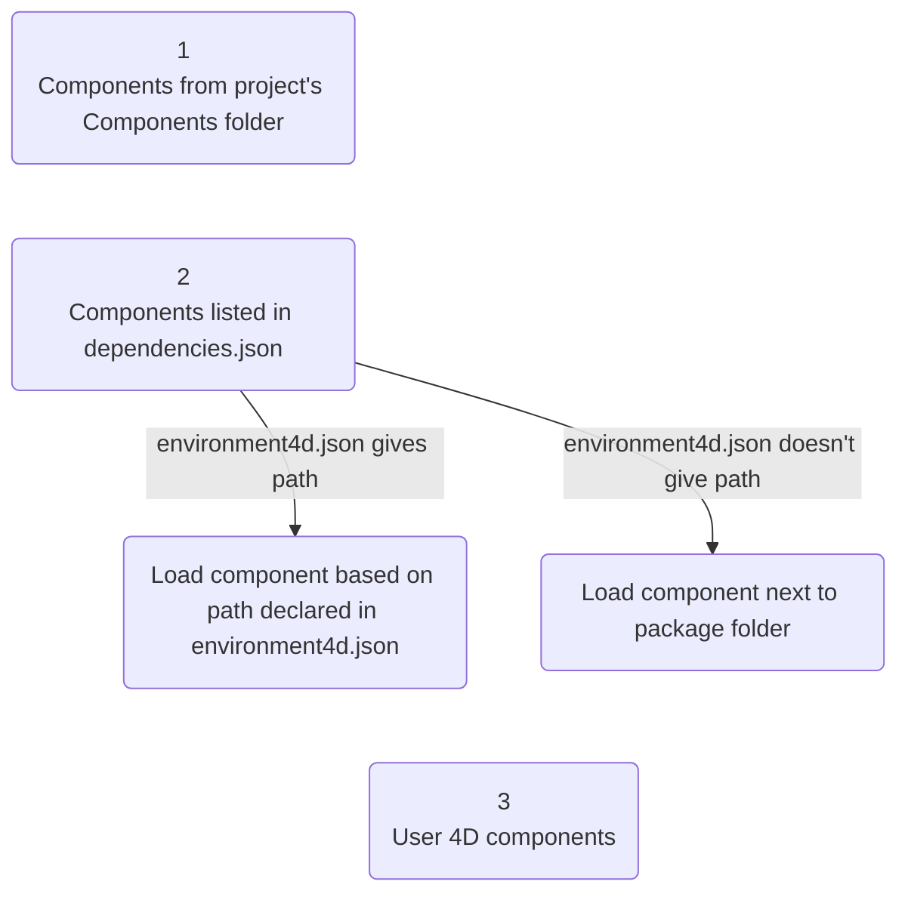
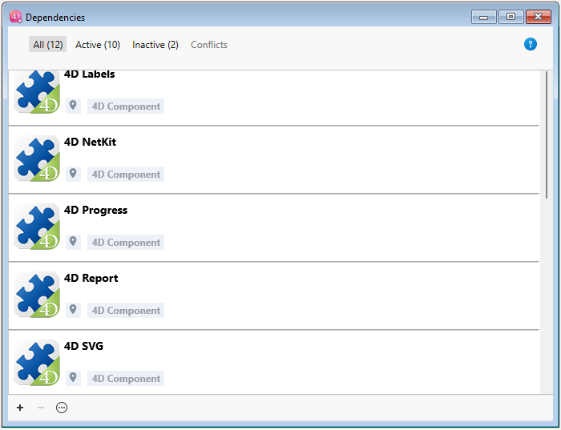
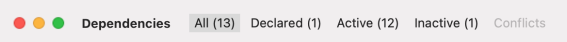
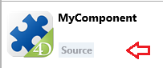
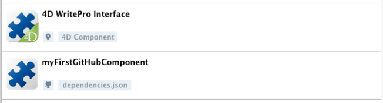
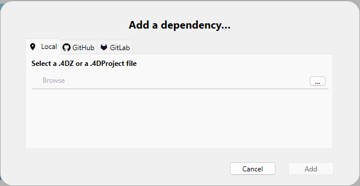
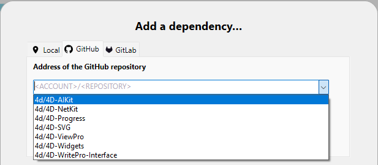
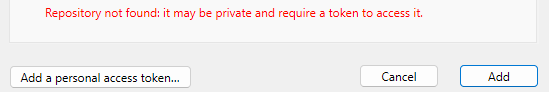
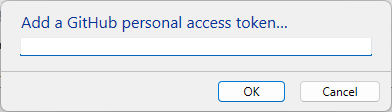
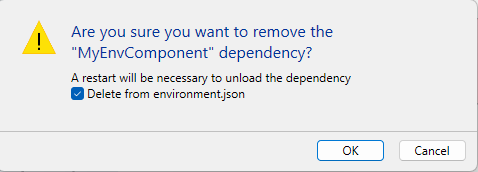

[La arquitectura de los proyectos](../Project/architecture.md) 4D es modular. Puede ofrecer funcionalidades adicionales a sus proyectos 4D instalando [**componentes**](Concepts/components.md) y [**plug-ins**](../Concepts/plug-ins.md). Los componentes están hechos de código 4D, mientras que los plug-ins pueden [construirse utilizando cualquier lenguaje](../Extensions/develop-plug-ins.md).

You can [develop](../Extensions/develop-components.md) and [build](../Desktop/building.md) your own 4D components, or download public components shared by the 4D community that [can be found for example on GitHub](https://github.com/topics/4d-component).

Una vez instalados en su entorno 4D, las extensiones se manejan como **dependencias** con propiedades específicas.

## Componentes interpretados y compilados

Los componentes pueden ser interpretados o [compilados](../Desktop/building.md).

- Un proyecto 4D que se ejecuta en modo interpretado puede utilizar componentes interpretados o compilados.
- Un proyecto 4D que se ejecuta en modo compilado no puede utilizar componentes interpretados. En este caso, sólo se pueden utilizar componentes compilados.

### Carpeta Package

La carpeta del paquete de un componente puede contener:

- para **componentes interpretados**: una [Carpeta Project](../Project/architecture.md) estándar. El nombre de la carpeta del paquete debe llevar el sufijo **.4dbase** si desea instalarlo en la carpeta [**Componentes** de su proyecto](architecture.md#components).
- para **componentes compilados**:
  - una carpeta "Contents" que contenga un archivo .4DZ, una carpeta *Resources*, un archivo *Info.plist* (arquitectura recomendada)
  - o directamente un archivo .4DZ con otras carpetas como *Resources*.

:::note

La arquitectura de carpetas "Contents" se recomienda para los componentes si desea [notarizar](../Desktop/building.md#about-notarization) sus aplicaciones en macOS.

:::

## Ubicación de los componentes

When developing in 4D, the component files can be transparently stored in your computer or located on an external GitHub or GitLab repository.

:::note

Esta sección describe cómo trabajar con componentes en los entornos **4D** y **4D Server**. En otros entornos, los componentes se gestionan de manera diferente:

- en [4D en modo remoto](../Desktop/clientServer.md), los componentes son cargados por el servidor y enviados a la aplicación remota.
- en las aplicaciones fusionadas, los componentes se [incluyen en el paso de compilación](../Desktop/building.md#plugins--components-page).

:::

### Generalidades

Para cargar un componente en su proyecto 4D, usted puede:

- copie los archivos de componentes en la carpeta [**Components** de su proyecto](architecture.md#components) (las carpetas de paquetes de componentes interpretados deben llevar el sufijo ".4dbase", ver arriba),
- o bien, declare el componente en el archivo **dependencies.json** de su proyecto; esto se hace automáticamente para los archivos locales cuando [**añade una dependencia utilizando la interfaz del gestor de dependencias**](#adding-a-github-dependency).

Los componentes declarados en el archivo **dependencies.json** pueden almacenarse en diferentes ubicaciones:

- al mismo nivel que la carpeta de paquetes de su proyecto 4D: esta es la ubicación predeterminada,
- en cualquier lugar de su máquina: la ruta del componente debe declararse en el archivo **environment4d.json**
- on a GitHub or [GitLab](https://blog.4d.com/integrate-4d-components-directly-from-gitlab) repository: the component path can be declared in the **dependencies.json** file or in the **environment4d.json** file, or in both files (a [local cache](#local-cache-for-dependencies) is then handled automatically).

Si se instala el mismo componente en distintos lugares, se aplica un [orden de prioridad](#priority).

### dependencies.json y environment4d.json

#### dependencies.json

El archivo **dependencies.json** hace referencia a todos los componentes requeridos en su proyecto 4D. Este archivo debe encontrarse en la carpeta **Sources** de la carpeta del proyecto 4D, por ejemplo.:

```
	/MyProjectRoot/Project/Sources/dependencies.json
```

Puede contener:

- nombres de componentes [almacenados localmente](#local-components) (ruta por defecto o ruta definida en un archivo **environment4d.json**),
- names of components [stored on GitHub or GitLab repositories](#components-stored-on-git-hosting-platforms) (their path can be defined in this file or in an **environment4d.json** file).

#### environment4d.json

El archivo **environment4d.json** es opcional. Permite definir **rutas personalizadas** para algunos o todos los componentes declarados en el archivo **dependencies.json**. Este archivo puede almacenarse en la carpeta del paquete del proyecto o en una de sus carpetas padre, en cualquier nivel (hasta la raíz).

Los principales beneficios de esta arquitectura son los siguientes:

- puede almacenar el archivo **environment4d.json** en una carpeta padre de sus proyectos y decidir no confirmarlo, permitiéndote tener su organización local de componentes.
- if you want to use the same GitHub or GitLab repository for several of your projects, you can reference it in the **environment4d.json** file and declare it in the **dependencies.json** file.

### Prioridad

Dado que los componentes pueden instalarse de distintas formas, se aplica un orden de prioridad cuando se hace referencia al mismo componente en varias ubicaciones:

**Máxima prioridad**

1. Componentes almacenados en la carpeta [**Components** del proyecto](architecture.md#components).
2. Componentes declarados en el archivo **dependencies.json** (la ruta declarada **environment4d.json** anula la ruta **dependencies.json** para configurar un entorno local).
3. Componentes 4D internos del usuario (por ejemplo, 4D NetKit, 4D SVG...)

**Prioridad más baja**


```mermaid
flowchart TB
    id1("1<br/>Components from project's Components folder")
	~~~
    id2("2<br/>Components listed in dependencies.json")
	~~~
    id2 -- environment4d.json gives path --> id4("Load component based on path declared in environment4d.json")
    ~~~
    id3("3<br/>User 4D components")
    id2 -- environment4d.json doesn't give path --> id5("Load component next to package folder")
    ~~~
    id3("3<br/>User 4D components")
```

Cuando un componente no puede cargarse debido a otra instancia del mismo componente situada en un nivel de prioridad superior, ambos obtienen un [estado] específico (#dependency-status): el componente no cargado recibe el estado *Overloaded*, mientras que el componente cargado tiene el estado *Overloading*.

### Componentes locales

Declara un componente local en el archivo [**dependencies.json**](#dependenciesjson) de la siguiente manera:

```json
{
    "dependencies": {
        "myComponent1" : {},
        "myComponent2" : {}
    }
}
```

... donde "myComponent1" y "myComponent2" son el nombre de los componentes a cargar.

De forma predeterminada, si "myComponent1" y "myComponent2" no están declarados en un archivo [**environment4d.json**](#environment4djson), 4D buscará la carpeta del paquete del componente (*es decir*, la carpeta raíz del proyecto del componente) al mismo nivel que la carpeta del paquete de su proyecto de 4D, por ejemplo:

```
	/MyProjectRoot/
	/MyProjectComponentRoot/
```

Gracias a esta arquitectura, puede simplemente copiar todos sus componentes al mismo nivel que sus proyectos y referenciarlos en sus archivos **dependencies.json**.

:::note

Si no desea utilizar la arquitectura **dependencies.json**, puede instalar componentes locales copiando sus archivos en la carpeta [**Components** de su proyecto](architecture.md#components).

:::

#### Personalizar rutas de componentes

Si la ruta de un componente declarado en el archivo **environment4d.json** no se encuentra cuando se inicia el proyecto, el componente no se carga y obtiene el estado *No encontrado* [status](dependency-status), incluso si existe una versión del componente junto a la carpeta de paquetes del proyecto.

Puede utilizar rutas **relativas** o **absolutas** (ver abajo).

Ejemplos:

```json
{
	"dependencies": {
		"myComponent1" : "MyComponent1",  
		"myComponent2" : "../MyComponent2",  
 		"myComponent3" : "file:///Users/jean/MyComponent3"  
    }
}
```

:::note

Si la ruta de un componente declarado en el archivo **environment4d.json** no se encuentra cuando se inicia el proyecto, el componente no se carga y obtiene el [estado](#dependency-status) *Not found*, incluso si existe una versión del componente junto a la carpeta de paquetes del proyecto.

:::

#### Rutas relativas frente a rutas absolutas

Las rutas se expresan en sintaxis POSIX como se describe en [este párrafo](../Concepts/paths#posix-syntax).

Las rutas relativas son relativas al archivo [`environment4d.json`](#environment4djson). Las rutas absolutas están vinculadas a la máquina del usuario.

Utilizar rutas relativas es **recomendable** en la mayoría de los casos, ya que ofrecen flexibilidad y portabilidad de la arquitectura de componentes, especialmente si el proyecto está alojado en una herramienta de control de código fuente. Las rutas absolutas sólo deben utilizarse para componentes específicos de una máquina y un usuario.

### Components stored on Git hosting platforms {#components-stored-on-git-hosting-platforms}

4D components available as **releases** on GitHub and GitLab platforms can be referenced and automatically loaded and updated in your 4D projects.

:::note

Regarding components stored on GitHub or GitLab, both [**dependencies.json**](#dependenciesjson) and [**environment4d.json**](#environment4djson) files support the same contents.

:::

To be able to directly reference and use a 4D component stored on GitHub or GitLab, you need to configure the component's repository.

#### Configuring a GitHub repository

1. Comprima los archivos componentes en formato ZIP.
2. Nombre este archivo con el mismo nombre que el repositorio GitHub. For example, for a "my-4D-Component" repository, the archive must be named "my-4D-Component.zip".

- Integre el archivo en una [versión GitHub](https://docs.github.com/en/repositories/releasing-projects-on-github/managing-releases-in-a-repository) del repositorio.

Estos pasos pueden automatizarse fácilmente, con código 4D o utilizando GitHub Actions, por ejemplo.

#### Configuring a GitLab repository

GitLab releases only store the name and URL of assets, they do not contain uploaded files. Debe ofrecer el archivo zip de su componente como enlace.

1. Upload the component's ZIP file somewhere, i.e. either on an external server, or [using GitLab Package Registry](#using-the-gitlab-package-registry) (generic package).
2. Create a [GitLab release](https://docs.gitlab.com/user/project/releases/) for your component, including the link to your component's file as release asset.

The asset name is typically an artifact link name (\<my-component\>.zip).

#### Using the GitLab Package Registry

The [GitLab Package Registry](https://docs.gitlab.com/user/packages/package_registry/) allows you to host your files in GitLab itself. Its main advantages include an authenticated access, stable and versioned urls, and the ability to associate binairies with release tags. To use the Package Registry:

1. Build your component file (for example: *MyComponent.zip*)
2. Upload it to the [generic packages repository](https://docs.gitlab.com/user/packages/generic_packages/) using a script (see [examples in the GitLab documentation](https://docs.gitlab.com/user/packages/generic_packages/#publish-a-single-file)).
3. **Deploy** \> **Package Registry** to see the result.
4. Utilice la URL del paquete como enlace a los activos de la versión.
5. Asócielo con la misma etiqueta Git.

#### Declarando rutas

You declare components stored on GitHub and GitLab in the [**dependencies.json** file](#dependenciesjson) in the following way:

```json title="dependencies.json"
{
	"dependencies": {
		"myGitHubComponent1": {
			"github" : "JohnSmith/myGitHubComponent1"
		},
		"myGitLabComponent": {
			"gitlab" : "JohnSmith/myGitLabComponent"
		},
		"myPrivateGitLabComponent": {
			"gitlab" : "JohnSmith/myPrivateGitLabComponent",
			"host" : "https://myprivate-gitlab.com"
		},
		"myGitHubComponent2": {}
	}
}
```

- (GitLab dependencies only) Use the "host" property to declare a private GitLab self-hosted instance. Using only the "gitlab" property indicates a GitLab repository hosted on https://gitlab.com.
- "myGitHubComponent1" is referenced and declared for the project, although "myGitHubComponent2" is only referenced. Necesita declararlo en el archivo [**environment4d.json**](#environment4djson):

```json title="environment4d.json"
{
	"dependencies": {
		"myGitHubComponent2": {
			"github" : "JohnSmith/myGitHubComponent2"
		}
	}
}
```

"myGitHubComponent2" puede ser utilizado por varios proyectos.

#### Etiquetas y versiones

When a release is created in GitHub or GitLab, it is associated to a **tag** and a **version**. El gestor de dependencias utiliza esta información para gestionar la disponibilidad automática de los componentes.

:::note

Si seleccionas la regla de dependencia [**Seguir la versión 4D**](#defining-a-github-dependency-version-range), necesita usar una [convención de nomenclatura específica para las etiquetas](#naming-conventions-for-4d-version-tags).

:::

- **Etiquetas** son textos que hacen referencia única a una versión. In the [**dependencies.json**](#dependenciesjson) and [**environment4d.json**](#environment4djson) files, you can indicate the release tag you want to use in your project. Por ejemplo:

```json title="dependencies.json"
{
	"dependencies": {
		"myFirstGitHubComponent": {
			"github": "JohnSmith/myFirstGitHubComponent",
			"tag": "beta2"
		}
	}
}
```

- Una versión también se identifica por una **versión**. The versioning system used is based on the [*Semantic Versioning*](https://regex101.com/r/Ly7O1x/3/) concept, which is the most commonly used. Cada número de versión se identifica de la siguiente manera: `majorNumber.minorNumber.pathNumber`. Del mismo modo que para las etiquetas, puede indicar la versión del componente que desea utilizar en su proyecto, como en este ejemplo:

```json title="dependencies.json"
{
	"dependencies": {
		"myFirstGitHubComponent": {
			"github": "JohnSmith/myFirstGitHubComponent",
			"version": "2.1.3"
		}
	}
}
```

Un rango se define mediante dos versiones semánticas, un mínimo y un máximo, con los operadores '\< | > | >= | <= | ='. El `*` se puede utilizar como un marcador de posición para todas las versiones. Los prefijos ~ y ^ definen versiones a partir de un número, y hasta respectivamente la siguiente versión mayor y menor.

Estos son algunos ejemplos:

- "latest" (GitHub only): the GitHub release with the "latest" badge (to be selected by the developer).
- "highest" (GitLab only): the GitLab release with the highest semantic value.
- "\*": la última versión lanzada.
- "1.\*": todas las versiones de la versión principal 1.
- "1.2.\*": todos los parches de la versión menor 1.2.
- ">=1.2.3": la última versión, a partir de la versión 1.2.3.
- ">1.2.3": la última versión, empezando por la versión inmediatamente posterior a la 1.2.3.
- "^1.2.3": la última versión 1, a partir de la versión 1.2.3 y estrictamente inferior a la versión 2.
- "~1.2.3": la última versión 1.2, a partir de la versión 1.2.3 y estrictamente inferior a la versión 1.3.
- "<=1.2.3": la última versión hasta la 1.2.3.
- "1.0.0 – 1.2.3" o ">=1.0.0 <=1.2.3": versión entre 1.0.0 y 1.2.3.
- "`<1.2.3 || >=2`": versión que no está entre 1.2.3 y 2.0.0.

Si no especifica una etiqueta o una versión, 4D recupera automáticamente la "última" versión.

The Dependency manager checks periodically if component updates are available on the Git hosting platform. Si hay una nueva versión disponible para un componente, se muestra un indicador de actualización para el componente en la lista de dependencias, [dependiendo de su configuración](#defining-a-dependency-version-range).

#### Convenciones de nomenclatura para las etiquetas de versión 4D

If you want to use the [**Follow 4D Version**](#defining-a-github-dependency-version-range) dependency rule, the tags for component releases must comply with specific conventions.

- **Versiones LTS**: modelo `x.y.p`, donde `x.y` corresponde a la versión principal de 4D a seguir y `p` (opcional) puede utilizarse para versiones correctivas o actualizaciones adicionales. Cuando un proyecto especifica que sigue la versión 4D para la versión LTS *x.y*, el Gestor de dependencias lo resolverá como "la última versión x.\*" si está disponible o "versión inferior a x". Si no existe tal versión, se notificará al usuario. Por ejemplo, "20.4" será resuelto por el gestor de dependencias como "la última versión del componente 20.\* o la versión inferior a 20".

- **Versiones R-Release**: modelo `xRy.p`, donde `x` y `y` corresponden a la versión principal de 4D R-release a seguir y `p` (opcional) puede usarse para versiones correctivas o las actualizaciones adicionales. Cuando un proyecto especifica que sigue la versión 4D para la versión *xRy*, el Gestor de dependencias lo resolverá a la "última versión por debajo de xR(y+1)" si está disponible. Si no existe tal versión, se notificará al usuario. Por ejemplo, "20R9" será resuelto por el gestor de dependencias como "la última versión del componente por debajo de 20R10".

:::note

El desarrollador del componente puede definir una versión mínima de 4D en el archivo [`info.plist`](../Extensions/develop-components.md#infoplist).

:::

#### Autenticación y tokens

Si quiere integrar un componente ubicado en un repositorio privado, necesita decirle a 4D que utilice un token de conexión para acceder a él.

- for GitHub: in your [GitHub token interface](https://github.com/settings/tokens), create a token with the recommended following properties:
  - type: **classic**
  - derechos de acceso: **repo**

- para GitLab: en su cuenta de GitLab, cree un token con las siguientes propiedades:
  - type: **Personal Access token**
  - alcances: **read_api** y **read_repository**

A continuación, deberá [suministrar su token de conexión](#providing-your-access-token) al gestor de dependencias.

#### Caché local para dependencias

Referenced GitHub and GitLab components are downloaded in a local cache folder then loaded in your environment. La carpeta de caché local se guarda en la siguiente ubicación:

- en macOS: `$HOME/Library/Caches/<app name>/Dependencies`
- en Windows: `C:\Users\<username>\AppData\Local\<app name>\Dependencies`

...donde `<app name>` puede ser "4D", "4D Server" o "tool4D".

### Resolución automática de las dependencias

When you add or update a component (whether [local](#local-components) or [from a Git hosting platform](#components-stored-on-git-hosting-platforms)), 4D automatically resolves and installs all dependencies required by that component. Esto incluye:

- **Dependencias primarias**: componentes que declara explícitamente en su archivo `dependencies.json`
- **Dependencias secundarias**: componentes requeridos por dependencias primarias u otras dependencias secundarias, que se resuelven e instalan automáticamente

El gestor de dependencias lee el archivo `dependencies.json` de cada componente e instala recursivamente todas las dependencias necesarias, respetando las especificaciones de versión siempre que sea posible. Esto elimina la necesidad de identificar y añadir manualmente las dependencias anidadas una por una.

- **Resolución de conflictos**: cuando varias dependencias requieren [versiones diferentes](#defining-a-dependency-version-range) del mismo componente, el gestor de dependencias intenta automáticamente resolver los conflictos encontrando una versión que satisfaga todos los rangos de versiones superpuestas. Si una dependencia primaria entra en conflicto con dependencias secundarias, la dependencia primaria tiene prioridad.

:::note

Los archivos `dependencies.json` se ignoran en los componentes cargados desde la carpeta [**Components**](architecture.md#components).

:::

### dependency-lock.json

Se crea un archivo `dependency-lock.json` en la carpeta [`userPreferences`](architecture.md#userpreferencesusername) de su proyecto.

Este archivo registra información como el estado de las dependencias, rutas, urls, errores de carga, así como otra información. Podría ser útil para la gestión de la carga de componentes o la resolución de problemas.

## Monitoreo de dependencias del proyecto {#monitoring-project-dependencies}

En un proyecto abierto, puede añadir, eliminar, actualizar y obtener información sobre las dependencias y su estado de carga actual en el panel **Dependencias**.

Para mostrar el panel Dependencias:

- con 4D, seleccione el ítem de menú **Diseño/Dependencias del Proyecto** (entorno de desarrollo),<br/>
  

- con 4D Server, seleccione el ítem de menú **Ventana/Dependencias del Proyecto**.<br/>
  

A continuación, se muestra el panel Dependencias. Las dependencias se ordenan por nombre en orden alfabético:



La interfaz del panel Dependencias le permite gestionar las dependencias (en 4D monousuario y 4D Server).

### Filtrado de dependencias

Por defecto, se listan todas las dependencias identificadas por el gestor de dependencias, sea cual sea su [estado](#dependency-status). Puede filtrar las dependencias mostradas según su estado seleccionando la pestaña correspondiente en la parte superior del panel Dependencias:



- **Todas**: todas las dependencias, incluidas las primarias (declaradas) y las secundarias (resueltas automáticamente) en forma de lista.
- **Declarado**: dependencias primarias que se declaran explícitamente en el archivo `dependencies.json`. Esta pestaña le ayuda a distinguir entre las dependencias que ha añadido directamente y las que se han [resuelto automáticamente](#automatic-dependency-resolution).
- **Activo**: dependencias que están cargadas y pueden ser utilizadas en el proyecto. Incluye dependencias *overloading*, las cuales son realmente cargadas. Las dependencias *Overloaded* se enumeran en el panel **Conflicts** junto con todas las dependencias en conflicto.
- **Inactivo**: dependencias que no están cargadas en el proyecto y no están disponibles. Hay muchas razones posibles para este estado: archivos que faltan, incompatibilidad de versiones...
- **Conflictos**: las dependencias que se cargan pero que sobrecargan al menos otra dependencia de un [nivel de prioridad](#priority) inferior. También se muestran las dependencias sobrecargadas para que pueda comprobar el origen del conflicto y tomar las medidas oportunas.

### Dependencias secundarias

El panel Dependencias muestra [**dependencias secundarias**](#automatic-dependency-resolution) con la `dependencia del componente` [origen](#dependency-origin):


Cuando pasa el cursor sobre una dependencia secundaria, una descripción muestra la dependencia padre que la requiere. Una dependencia secundaria no se puede [eliminar](#removing-a-dependency) directamente, hay que eliminar o editar la dependencia primaria que la requiere.

### Estado de dependencias

Las dependencias que requieren la atención del desarrollador se indican mediante una **etiqueta de estado** a la derecha de la línea y un color de fondo específico:


Las siguientes etiquetas de estado están disponibles:

- **Overloaded**: la dependencia no se carga porque está sobrecargada por otra dependencia con el mismo nombre en un [nivel de prioridad] superior(#prioridad).
- **Overloading**: la dependencia está cargada y está sobrecargando una o más dependencias con el mismo nombre en un [nivel de prioridad] inferior(#prioridad).
- **Not found**: la dependencia se declara en el archivo dependencies.json pero no se encuentra.
- **Inactive**: la dependencia no se carga porque no es compatible con el proyecto (por ejemplo, el componente no está compilado para la plataforma actual).
- **Duplicated**: la dependencia no se carga porque existe otra dependencia con el mismo nombre en la misma ubicación (y está cargada).
- **Disponible después del reinicio**: la referencia a dependencias acaba de ser añadida o actualizada [usando la interfaz](#monitoring-project-dependencies), se cargará una vez que la aplicación se reinicie.
- **Descargado después de reiniciar**: la referencia de dependencias acaba de ser removida [utilizando la interfaz](#removing-a-dependency), se descargará una vez que la aplicación se reinicie.
- **Update available \<version\>**: A new version of the dependency matching your [component version configuration](#defining-a-github-dependency-version-range) has been detected.
- **Refreshed after restart**: The [component version configuration](#defining-a-dependency-version-range) of the dependency has been modified, it will be adjusted at the next startup.
- **Recent update**: A new version of the dependency has been loaded at startup.

:::tip

When you click on the **Available after restart** label, a dialog box is displayed and allows you to restart immediately.

:::

Al pasar el ratón por encima de la línea de dependencia, se muestra un mensaje que ofrece información adicional sobre el estado:


### Origen de la dependencia

El panel Dependencias enumera todas las dependencias del proyecto, sea cual sea su origen, es decir, de dónde procedan. El origen de la dependencia lo suministra la etiqueta bajo su nombre:



Las siguientes opciones de origen son posibles:

| Etiqueta de origen             | Descripción                                                                                                                                    |
| ------------------------------ | ---------------------------------------------------------------------------------------------------------------------------------------------- |
| Integrado a 4D                 | Componente 4D integrado, almacenado en la carpeta `Components` de la aplicación 4D                                                             |
| Declarado en proyecto          | Componente declarado en el archivo [`dependencies.json`](#dependenciesjson)                                                                    |
| Declarado en el entorno        | Componente declarado en el archivo [`dependencies.json`](#dependenciesjson) y anulado en el archivo [`environment4d.json`](#environment4djson) |
| Carpeta Components             | Componente ubicado en la carpeta [`Components`](architecture.md#components)                                                                    |
| Dependencia de los componentes | Componente secundario ([requerido por otro componente](#automatic-dependency-resolution))                                   |

**Clic derecho** en una línea de dependencia y selecciona **Mostrar en el disco** para revelar la ubicación de una dependencia:


:::note

Este elemento no se muestra si la relación está inactiva porque no se encuentran sus archivos.

:::

El icono del componente y el logotipo de ubicación ofrecen información adicional:

- El logotipo del componente indica si es suministrado por 4D o por un desarrollador externo.
- Local components can be differentiated from GitHub and GitLab components by a small icon.



### Añadir una dependencia local

To add a local dependency, click on the **[+]** button in the footer area of the panel. Se muestra la siguiente caja de diálogo:



Asegúrese de que la pestaña **Local** está seleccionada y haga clic en el botón *...*\*\*. Aparece una caja de diálogo estándar Abrir archivo, que le permite seleccionar el componente que desea añadir. Puede seleccionar un [**.4DZ**](../Desktop/building.md#build-component) o un archivo [**.4DProject**](architecture.md#applicationname4dproject-file).

Si el elemento seleccionado es válido, su nombre y ubicación se muestran en la caja de diálogo.


Si el elemento seleccionado no es válido, se mostrará un mensaje de error.

Haga clic en **Añadir** para añadir la dependencia al proyecto.

- Si selecciona un componente situado junto a la carpeta del paquete del proyecto (ubicación predeterminada), se declara en el archivo [**dependencies.json**](#dependenciesjson).
- Si selecciona un componente que no se encuentra junto a la carpeta del paquete del proyecto, se declara en el archivo [**dependencies.json**](#dependenciesjson) y su ruta se declara en el archivo [**environment4d.json**](#environment4djson) (ver nota). El panel Dependencias le pregunta si desea guardar una [ruta relativa o absoluta](#relative-paths-vs-absolute-paths).

:::note

Si en este paso no se ha definido aún ningún archivo [**environment4d.json**](#environment4djson) para el proyecto, se creará automáticamente en la carpeta del paquete del proyecto (ubicación por defecto).

:::

La dependencia se añade a la [lista de dependencias inactivas](#dependency-status) con el estado **Disponible después de reiniciar**. Se cargará cuando se reinicie la aplicación.

### Adding a GitHub or GitLab dependency

Para añadir una [dependencia GitHub o GitLab](#components-stored-on-git-hosting-platforms):

1. Click on the **[+]** button in the footer area of the panel and select the tab corresponding to your platform: **GitHub** or **GitLab**.


:::note

By default, [components developed by 4D](../Extensions/overview.md#components-developed-by-4d) are listed in the GitHub combo box, so that you can easily select and install these features in your environment:



Los componentes ya instalados no están listados.

:::

2. Enter the path of the GitHub or GitLab repository of the dependency. Podría ser:

- a **repository URL** (e.g. "https://github.com/vdelachaux/UI-with-Classes")
- (GitLab only) a self-hosted instance private server URL (e.g. "https://git-my-server.com/4d/components/mycomponent")
- a **user-account/repository-name string**, for example:


Once the connection is established, an icon  is displayed on the right side of the entry area. Puede hacer clic en este icono para abrir el repositorio en su navegador predeterminado.

:::note

If the component is stored on a [private repository](#private-repositories) and your personal token is missing, an error message is displayed and a **Add a personal access token...** button is displayed (see [Providing your access token](#providing-your-access-token)).

:::

3. Definir el [rango de versiones de dependencia](#tags-and-versions) a utilizar para este proyecto. By defaut, "Latest" (GitHub) or "Highest" (GitLab) is selected, which means that the most recent version will be automatically used.

4. Haga clic en el botón **Añadir** para añadir la dependencia al proyecto.

The dependency is declared in the [**dependencies.json**](#dependenciesjson) file and added to the [inactive dependency list](#dependency-status) with the **Available at restart** status. Se cargará cuando se reinicie la aplicación.

#### Defining a dependency version range

Puede definir la opción [etiqueta o versión](#tags-and-versions) para una dependencia:


- **Seguir la versión 4D** (opción por defecto, recomendada): descargue la última versión del componente que sea compatible con la versión 4D en ejecución. Puede usar esta regla de dependencia sólo si las etiquetas de release de los componentes siguen la [convención de nombres](#naming-conventions-for-4d-version-tags) apropiada. This option is **recommended**, especially for the [components developed by 4D](../Extensions/overview.md#components-developed-by-4d).
- **Hasta la próxima versión mayor**: define un [rango de versiones semánticas](#tags-and-versions) para restringir las actualizaciones a la próxima versión principal.
- **Hasta la siguiente versión menor**: del mismo modo, restringir las actualizaciones a la siguiente versión menor.
- **Versión exacta (Etiqueta)**: selecciona o introduce manualmente una [etiqueta específica](#tags-and-versions) de la lista disponible.
- **Latest** (GitHub) or **Highest** (GitLab): Allows to download the release with the corresponding tag, usually the most recent release. **Warning:** While using this option can be convenient during early development, it is better to avoid it in production or shared projects since it automatically pulls in newer releases, including beta releases, which may lead to unexpected updates or breaking changes.

La versión actual de la dependencia se muestra a la derecha del elemento de la dependencia:


#### Modificación del intervalo de versiones de las dependencias

You can modify the [version setting](#defining-a-dependency-version-range) for a listed dependency: select the dependency to modify and select **Edit the dependency...** from the contextual menu. En el cuadro de diálogo "Editar la dependencia", edite el menú Regla de dependencia y haga clic en **Aplicar**.

Modificar el rango de versiones es útil, por ejemplo, si utiliza la función de actualización automática y desea bloquear una dependencia a un número de versión específico.

### Actualización de dependencias

El gestor de dependencias ofrece una gestión integrada de las actualizaciones en GitHub. Se soportan las siguientes funcionalidades:

- Verificación automática y manual de las versiones disponibles
- Actualización automática y manual de los componentes

Las operaciones manuales pueden realizarse **por dependencia** o **para todas las dependencias**.

#### Comprobación de nuevas versiones

Las actualizaciones de las dependencias se comprueban periódicamente en GitHub. Esta verificación se realiza de forma transparente en segundo plano.

:::note

Si suministra un [token de acceso](#providing-your-github-access-token), las verificiones se realizan con mayor frecuencia, ya que GitHub permite entonces una mayor frecuencia de solicitudes a los repositorios.

:::

Además, puede buscar actualizaciones en cualquier momento, para una sola dependencia o para todas las dependencias:

- Para verificar las actualizaciones de una única dependencia, haga clic con el botón derecho del ratón en la dependencia y seleccione **Verificar actualizaciones** en el menú contextual.


- Para verificar si hay actualizaciones de todas las dependencias, haga clic en el menú **opciones** de la parte inferior de la ventana del gestor de dependencias y seleccione **Verificar actualizaciones**.


Si se detecta en GitHub una nueva versión del componente que coincide con su [configuración de versiones del componente](#defining-a-github-dependency-version-range), se muestra un estado de dependencia específico:


Puede decidir [actualizar el componente](#updating-dependencies) o no.

Si no desea utilizar una actualización de componentes (por ejemplo, desea permanecer con una versión específica), simplemente deje el estado actual (asegúrese de que la función [**Actualización automática**](#automatic-update) no está marcada).

#### Actualización de dependencias

**Updating a dependency** means downloading a new version of the dependency from GitHub or GitLab and keeping it ready to be loaded the next time the project is started.

Puede actualizar las dependencias en cualquier momento, para una sola dependencia o para todas las dependencias:

- Para actualizar una sola dependencia, haga clic con el botón derecho del ratón en la dependencia y seleccione **Actualizar<component name\> en el próximo inicio** en el menú contextual o en el menú **opciones** de la parte inferior de la ventana del gestor de dependencias:


- Para actualizar todas las dependencias a la vez, haga clic en el menú **opciones** de la parte inferior de la ventana del gestor de dependencias y seleccione **Actualizar todas las dependencias remotas en el próximo inicio**:


En cualquier caso, sea cual sea el estado actual de la dependencia, se realiza una verificación automática en GitHub antes de actualizar la dependencia, para asegurarse de que se recupera la versión más reciente, [según la configuración de versionado de su componente](#defining-a-github-dependency-version-range).

Al seleccionar un comando de actualización:

- se muestra un cuadro de diálogo que propone **reiniciar el proyecto**, para que las dependencias actualizadas estén disponibles de inmediato. Normalmente se recomienda reiniciar el proyecto para evaluar las dependencias actualizadas.
- if you click **Later**, the update command is no longer available in the menu, meaning the action has been planned for the next startup.

#### Actualización automática

La opción **Actualización automática** está disponible en el menú **opciones** de la parte inferior de la ventana del gestor de dependencias.

When this option is checked (default), new GitHub or GitLab component versions matching your [component versioning configuration](#defining-a-github-dependency-version-range) are automatically updated for the next project startup. Esta opción facilita la gestión diaria de las actualizaciones de dependencias, al eliminar la necesidad de seleccionar manualmente las actualizaciones.

Cuando esta opción no está marcada, una nueva versión del componente que coincida con su [configuración de versiones del componente](#defining-a-github-dependency-version-range) sólo se indicará como disponible y requerirá una [actualización manual](#updating-dependencies). Desmarque la opción **Actualización automática** si desea controlar con precisión las actualizaciones de las dependencias.

### Providing your access token

Registering your [personal access token](#authentication-and-tokens) in the Dependency manager is:

- mandatory if the component is stored on a private repository,
- recomendado para una [verificación de actualizaciones de dependencias](#updating-dependencies) más frecuente.

#### Adding a token

To provide your GitHub or GitLab access token, you can either:

- click on **Add a personal access token...** button that is displayed in the "Add a dependency" dialog box after you entered a private repository path.



- or, select **Add a GitHub personal access token...** or **Add a GitLab personal access token...** in the Dependency manager menu at any moment. Para los tokens de acceso de GitLab, puede seleccionar el host:


Luego puede introducir su token de acceso personal:



#### Editar un token

Sólo puede introducir un token de acceso personal por host. Una vez se ha sido introducido un token, puede **editarlo**.

El token proporcionado se almacena en un archivo **github.json** en la [carpeta activa de 4D](../commands/get-4d-folder#active-4d-folder).

### Eliminando una dependencia

Para eliminar una dependencia desde el panel de dependencias, seleccione la dependencia que desea eliminar y haga clic en el botón **-** del panel o seleccione **Eliminar la dependencia...** en el menú contextual. Puede seleccionar varias relaciones, en cuyo caso la acción se aplica a todas las relaciones seleccionadas.

:::note

Sólo las dependencias primarias declaradas en el archivo [**dependencies.json**](#dependenciesjson) pueden eliminarse utilizando el panel Dependencias. Las dependencias secundarias no pueden eliminarse directamente: para eliminar una dependencia secundaria, debe eliminar la dependencia primaria que la requiere. Si no se puede eliminar una dependencia seleccionada, se desactiva el botón **-** y se oculta la opción de menú **Eliminar la dependencia...**.

:::

Aparece una caja de diálogo de confirmación. Si la dependencia se declaró en el archivo **environment4d.json**, una opción permite eliminarla:



Si confirma la caja de diálogo, la dependencia eliminada [estado](#estado-dependencia) se marca automáticamente como "Descargar tras reinicio". Se descargará cuando se reinicie la aplicación.

#### Advertencias sobre el uso de dependencias

Cuando intente eliminar una dependencia primaria que es requerida por otras dependencias en su proyecto, se le advertirá de que la dependencia todavía está en uso. El sistema mostrará qué otras dependencias lo requieren y le pedirá que confirme la eliminación, ya que eliminarlo puede hacer que esos componentes dependientes dejen de funcionar correctamente.


