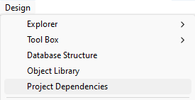
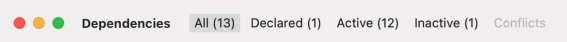

A 4D component is a set of 4D code and/or 4D forms representing one or more functionalities that you can add and use in your projects. For example, the [4D SVG](https://github.com/4d/4D-SVG) component adds advanced commands and an integrated rendering engine that can be used to display SVG files.

You can [develop](../Extensions/develop-components.md) and [build](../Desktop/building.md) your own 4D components, or download public components shared by the 4D community that [can be found on GitHub](https://github.com/search?q=4d-component\&type=Repositories).

## Componentes interpretados y compilados

Components can be interpreted or [compiled](../Desktop/building.md). La carpeta del paquete de un componente puede contener:

- either a Project folder (interpreted component)
- o un archivo .4DZ (componente compilado)

A 4D project running in interpreted mode can use either interpreted or compiled components. A 4D project running in compiled mode cannot use interpreted components. En este caso, sólo se pueden utilizar componentes compilados.

## Cargando componentes

### Básicos

To load a component in your 4D project, you can either:

- reference the component in the **dependencies.json** file (and, optionnally, the **environment4d.json** file)
- or, copy the component files in the [**Components** folder of your project](architecture.md#components).

If the same component is installed at different locations, a [priority order] is applied.

### dependencies.json

1. Reference the component name in the **dependencies.json** file of your 4D project. This manifest file must be saved in the **Sources** folder of the 4D project folder, e.g.:
   ```
   /MyProjectRoot/Project/Sources/dependencies.json
   ```
2. By default, copy the component's package folder (_i.e._ the project root folder of the component) at the same level as your 4D project's package folder, e.g.:
   ```
   /MyProjectRoot/
   /MyProjectComponentRoot/
   ```

Thanks to this architecture, you can simply copy all your components at the same level as your projects and reference them in your **dependencies.json** files if necessary. In addition, you can customize the path of your components, see below.

The **/Sources/dependencies.json** file contents must have the following structure:

```json
{
	"dependencies": {
		"myComponent1" : {},
		"myComponent2" : {}
	}
}
```

... where "myComponent1" and "myComponent2" are the name of the components, located at the same level as your project's package folder, that you want to be loaded in your project.

### environment4d.json

If you want to customize the location of the components that are [declared in the **dependencies.json** file](#dependenciesjson), you can use a **environment4d.json** file. This file allows you to declare the paths for the dependencies that are not stored at the same level as the project folder.

You can use absolute or relative paths, expressed in POSIX syntax as described in [this paragraph](../Concepts/paths#posix-syntax). Relative paths are relative to the environment4d.json file.

Ejemplos:

```json
{
	"dependencies": {
		"myComponent1" : "MyComponent1",
		"myComponent2" : "../MyComponent2",
        "myComponent3" : "file:///Users/jean/MyComponent3"
    }
}
```

The **environment4d.json** file can be stored in your project package folder or in one of its parent folders, at any level (up to the root). The benefit of this architecture is that you can store this environment file in a parent folder of your projects and decide not to commit it, allowing you to have your local component organization.

:::note

If a component path declared in the **environment4d.json** file is not found when the project is started, the component is not loaded and gets the _Not found_ [status](dependency-status), even if a version of the component exists next to the project's package folder.

:::

### Prioridad

Since components can be installed in different ways, a priority order is applied when the same component is referenced at several locations:

**Máxima prioridad**

1. Components stored in the [**Components** folder of the project](architecture.md#components).
2. Components declared in the **dependencies.json** file.
3. Internal User 4D components (e.g. 4D NetKit, 4D SVG...)

**Prioridad más baja**


When a component cannot be loaded because of another instance of the same component located at a higher priority level, it is given the _Overloaded_ [status](#dependency-status). The loaded component has the _Overloading_ [status](#dependency-status).

## Monitoring Project Dependencies

In an opened project, you can get information about dependencies and their current loading status in the **Dependencies** panel.

Para mostrar el panel Dependencias:

- with 4D, select the **Design/Project Dependencies** menu item (Development environment),<br/>
  

- with 4D Server, select the **Window/Project Dependencies** menu item.<br/>
  

A continuación se muestra el panel Dependencias. Dependencies are sorted by name in alphabetical order:


### Dependency Origin

The Dependencies panel lists all project dependencies, whatever their origin, i.e. wherever they come from. The dependency origin is provided by the tag under its name:


Se soportan los siguientes orígenes:

| Etiqueta de origen | Descripción                                                                    |
| ------------------ | ------------------------------------------------------------------------------ |
| Componente 4D      | Built-in 4D component, stored in the `Components` folder of the 4D application |
| Source             | Component declared in the [`dependencies.json`](#dependenciesjson) file        |
| Entorno            | Component declared in the [`environnement4d.json`](#environment4djson) file    |
| Project Component  | Component located in the [`Components`](architecture.md#components) folder     |

**Right-click** in a dependency line and select **Show on disk** to reveal the location of a dependency:


:::note

This item is not displayed if the dependency is inactive because its files are not found.

:::

### Filtering Dependencies

By default, all dependencies identified by the Dependency manager are listed, whatever their [status](#dependency-status). You can filter the displayed dependencies according to their status by selecting the appropriate tab at the top of the Dependencies panel:



- **Active**: Dependencies that are loaded and can be used in the project. It includes _overloading_ dependencies, which are actually loaded. _Overloaded_ dependencies are listed in the **Conflicts** panel, along with all conflicting dependencies.
- **Inactive**: Dependencies that are not loaded in the project and are not available. There are many possible reasons for this status: missing files, version incompatibility...
- **Conflict**: Dependencies that are loaded but that overloads at least one other dependency at lower [priority level](#priority). Overloaded dependencies are also displayed so that you can check the origin of the conflict and take appropriate actions.

### Dependency Status

Dependencies requiring the developer's attention are indicated by a **status label** at the right side of the line and a specific background color:


Las siguientes etiquetas de estado están disponibles:

- **Overloaded**: The dependency is not loaded because it is overloaded by another dependency with the same name at a higher [priority level](#priority).
- **Overloading**: The dependency is loaded and is overloading one or more other dependencies with the same name at a lower [priority level](#priority).
- **Not found**: The dependency is declared in the dependencies.json file but is not found.
- **Inactive**: The dependency is not loaded because it is not compatible with the project (e.g. the component is not compiled for the current platform).
- **Duplicated**: The dependency is not loaded because another dependency with the same name exists at the same location (and is loaded).

A tooltip is displayed when you hover over the dependency line, provding additional information about the status:


