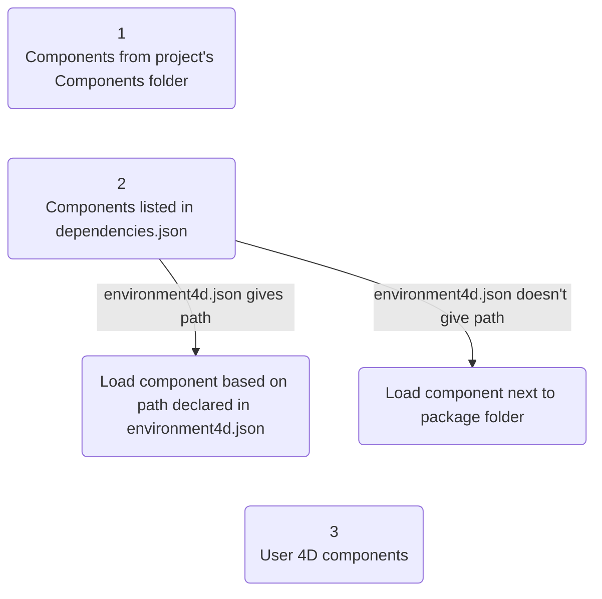
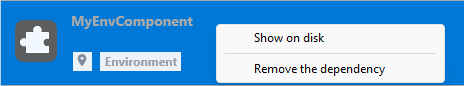
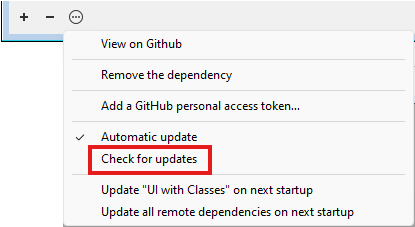
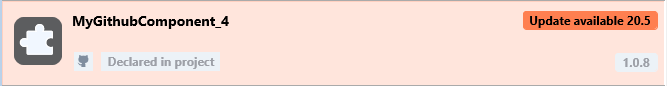
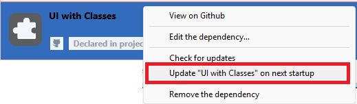
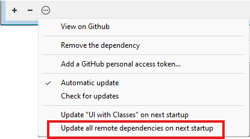

Un componente 4D es un conjunto de código y/o de formularios 4D que representan una o varias funcionalidades que pueden añadirse y utilizarse en sus proyectos. Por ejemplo, el componente [4D SVG](https://github.com/4d/4D-SVG) añade comandos avanzados y un motor de renderizado integrado que puede utilizarse para visualizar archivos SVG.

Puede [desarrollar](../Extensions/develop-components.md) y [crear](../Desktop/building.md) sus propios componentes 4D, o descargar componentes públicos compartidos por la comunidad 4D que [se pueden encontrar en GitHub](https://github.com/search?q=4d-component\\\\\\&type=Repositories).

Al desarrollar en 4D, los archivos de los componentes pueden almacenarse de forma transparente en su ordenador o en un repositorio Github.

## Componentes interpretados y compilados

Los componentes pueden ser interpretados o [compilados](../Desktop/building.md).

- Un proyecto 4D que se ejecuta en modo interpretado puede utilizar componentes interpretados o compilados.
- Un proyecto 4D que se ejecuta en modo compilado no puede utilizar componentes interpretados. En este caso, sólo se pueden utilizar componentes compilados.

### Package folder

La carpeta del paquete de un componente puede contener:

- ya sea una carpeta Proyecto (componente interpretado)
- for **compiled components**:
  - either a "Contents" folder containing a .4DZ file, a _Resources_ folder, an _Info.plist_ file (recommended architecture)
  - or directly a .4DZ file with other folders such as _Resources_.

:::note

The "Contents" folder architecture is recommended for components if you want to [notarize](../Desktop/building.md#about-notarization) your applications on macOS.

:::

## Cargando componentes

:::note

Esta página describe cómo trabajar con componentes en los entornos **4D** y **4D Server**. En otros entornos, los componentes se gestionan de manera diferente:

- en [4D en modo remoto](../Desktop/clientServer.md), los componentes son cargados por el servidor y enviados a la aplicación remota.
- en las aplicaciones fusionadas, los componentes se [incluyen en el paso de compilación](../Desktop/building.md#plugins--components-page).

:::

### Generalidades

Para cargar un componente en su proyecto 4D, usted puede:

- copiar los archivos del componente en la [carpeta **Components** de su proyecto](architecture.md#components),
- or, declare the component in the **dependencies.json** file of your project; this is done automatically for local files when you [**add a dependency using the Dependency manager interface**](#adding-a-github-dependency).

Los componentes declarados en el archivo **dependencies.json** pueden almacenarse en diferentes ubicaciones:

- al mismo nivel que la carpeta de paquetes de su proyecto 4D: esta es la ubicación predeterminada,
- en cualquier lugar de su máquina: la ruta del componente debe declararse en el archivo **environment4d.json**
- en un repositorio GitHub: la ruta del componente puede declararse en el archivo **dependencies.json** o en el archivo **environment4d.json**, o en ambos archivos.

Si se instala el mismo componente en distintos lugares, se aplica un [orden de prioridad](#priority).

### dependencies.json y environment4d.json

#### dependencies.json

El archivo **dependencies.json** hace referencia a todos los componentes requeridos en su proyecto 4D. Este archivo debe encontrarse en la carpeta **Sources** de la carpeta del proyecto 4D, por ejemplo.:

```
	/MyProjectRoot/Project/Sources/dependencies.json
```

Puede contener:

- nombres de componentes [almacenados localmente](#declaring-local-components) (ruta por defecto o ruta definida en un archivo **environment4d.json**),
- nombres de componentes [almacenados en repositorios de GitHub](#declaring-components-stored-on-github) (su ruta puede definirse en este archivo o en un archivo **environment4d.json**).

#### environment4d.json

El archivo **environment4d.json** es opcional. Permite definir **rutas personalizadas** para algunos o todos los componentes declarados en el archivo **dependencies.json**. Este archivo puede almacenarse en la carpeta del paquete del proyecto o en una de sus carpetas padre, en cualquier nivel (hasta la raíz).

Los principales beneficios de esta arquitectura son los siguientes:

- puede almacenar el archivo **environment4d.json** en una carpeta padre de sus proyectos y decidir no confirmarlo, permitiéndote tener su organización local de componentes.
- si quiere utilizar el mismo repositorio GitHub para varios de sus proyectos, puede referenciarlo en el archivo **environment4d.json** y declararlo en el archivo **dependencies.json**.

### Prioridad

Dado que los componentes pueden instalarse de distintas formas, se aplica un orden de prioridad cuando se hace referencia al mismo componente en varias ubicaciones:

**Máxima prioridad**

1. Componentes almacenados en la carpeta [**Components** del proyecto](architecture.md#components).
2. Componentes declarados en el archivo **dependencies.json** (la ruta declarada **environment4d.json** anula la ruta **dependencies.json** para configurar un entorno local).
3. Componentes 4D internos del usuario (por ejemplo, 4D NetKit, 4D SVG...)

**Prioridad más baja**



Cuando un componente no puede cargarse debido a otra instancia del mismo componente situada en un nivel de prioridad superior, ambos obtienen un [estado] específico (#dependency-status): el componente no cargado recibe el estado _Overloaded_, mientras que el componente cargado tiene el estado _Overloading_.

### Componentes locales

Declara un componente local en el archivo [**dependencies.json**](#dependencyjson) de la siguiente manera:

```json
{
    "dependencies": {
        "myComponent1" : {},
        "myComponent2" : {}
    }
}
```

... donde "myComponent1" y "myComponent2" son el nombre de los componentes a cargar.

De forma predeterminada, si "myComponent1" y "myComponent2" no están declarados en un archivo [**environment4d.json**](#environment4djson), 4D buscará la carpeta del paquete del componente (_es decir_, la carpeta raíz del proyecto del componente) al mismo nivel que la carpeta del paquete de su proyecto de 4D, por ejemplo:

```
	/MyProjectRoot/
	/MyProjectComponentRoot/
```

Gracias a esta arquitectura, puede simplemente copiar todos sus componentes al mismo nivel que sus proyectos y referenciarlos en sus archivos **dependencies.json**.

:::note

Si no desea utilizar la arquitectura **dependencies.json**, puede instalar componentes locales copiando sus archivos en la carpeta [**Components** de su proyecto](architecture.md#components).

:::

#### Personalizar rutas de componentes

Si la ruta de un componente declarado en el archivo **environment4d.json** no se encuentra cuando se inicia el proyecto, el componente no se carga y obtiene el estado _No encontrado_ [status](dependency-status), incluso si existe una versión del componente junto a la carpeta de paquetes del proyecto.

Puede utilizar rutas **relativas** o **absolutas** (ver abajo).

Ejemplos:

```json
{
	"dependencies": {
		"myComponent1" : "MyComponent1",
		"myComponent2" : "../MyComponent2",
    "myComponent3" : "file:///Users/jean/MyComponent3"
    }
}
```

:::note

Si desea personalizar la ubicación de los componentes locales, declare las rutas de las dependencias que no se almacenan en el mismo nivel que la carpeta del proyecto en el archivo [**environment4d.json**](#environment4djson).

:::

#### Rutas relativas frente a rutas absolutas

Las rutas se expresan en sintaxis POSIX como se describe en [este párrafo](../Concepts/paths#posix-syntax).

Las rutas relativas son relativas al archivo [`environment4d.json`](#environment4djson). Las rutas absolutas están vinculadas a la máquina del usuario.

Utilizar rutas relativas es **recomendable** en la mayoría de los casos, ya que ofrecen flexibilidad y portabilidad de la arquitectura de componentes, especialmente si el proyecto está alojado en una herramienta de control de código fuente.

Las rutas absolutas sólo deben utilizarse para componentes específicos de una máquina y un usuario.

### Configuración del repositorio GitHub

4D components available as GitHub releases can be referenced and automatically loaded and updated in your 4D projects.

:::note

En cuanto a los componentes almacenados en GitHub, tanto los archivos [**dependencies.json**](#dependenciesjson) como [**environment4d.json**](#environment4djson) admiten los mismos contenidos.

:::

#### Componentes almacenados en GitHub

Los componentes 4D disponibles en GitHub pueden ser referenciados y cargados automáticamente en sus proyectos 4D.

- Comprima los archivos componentes en formato ZIP.
- Nombre este archivo con el mismo nombre que el repositorio GitHub.
- Integre el archivo en una [versión GitHub](https://docs.github.com/en/repositories/releasing-projects-on-github/managing-releases-in-a-repository) del repositorio.

Estos pasos pueden automatizarse fácilmente, con código 4D o utilizando GitHub Actions, por ejemplo.

#### Declarando rutas

Declare un componente almacenado en GitHub en el archivo [**dependencies.json**](#dependencyjson) de la siguiente manera:

```json
{
	"dependencies": {
		"myGitHubComponent1": {
			"github" : "JohnSmith/myGitHubComponent1"
		},
		"myGitHubComponent2": {}
	}
}
```

... donde "myGitHubComponent1" está referenciado y declarado para el proyecto, aunque "myGitHubComponent2" sólo está referenciado. Necesita declararlo en el archivo [**environment4d.json**](#environment4djson):

```json
{
	"dependencies": {
		"myGitHubComponent2": {
			"github" : "JohnSmith/myGitHubComponent2"
		}
	}
}
```

"myGitHubComponent2" puede ser utilizado por varios proyectos.

#### Etiquetas y versiones

When a release is created in GitHub, it is associated to a **tag** and a **version**. The Dependency manager uses these information to handle automatic availability of components.

- **Etiquetas** son textos que hacen referencia única a una versión. En los archivos [**dependencies.json**](#dependencyjson) y [**environment4d.json**](#environment4djson), puede indicar la etiqueta de versión que desea utilizar en su proyecto. Por ejemplo:

```json
{
	"dependencies": {
		"myFirstGitHubComponent": {
			"github": "JohnSmith/myFirstGitHubComponent",
			"tag": "beta2"
		}
	}
}
```

- Una versión también se identifica por una **versión**. The versioning system used is based on the [_Semantic Versioning_](https://regex101.com/r/Ly7O1x/3/) concept, which is the most commonly used. Cada número de versión se identifica de la siguiente manera: `majorNumber.minorNumber.pathNumber`. Del mismo modo que para las etiquetas, puede indicar la versión del componente que desea utilizar en su proyecto, como en este ejemplo:

```json
{
	"dependencies": {
		"myFirstGitHubComponent": {
			"github": "JohnSmith/myFirstGitHubComponent",
			"version": "2.1.3"
		}
	}
}
```

Un rango se define mediante dos versiones semánticas, un mínimo y un máximo, con los operadores '\< | > | >= | <= | ='. El `*` se puede utilizar como un marcador de posición para todas las versiones. Los prefijos ~ y ^ definen versiones a partir de un número, y hasta respectivamente la siguiente versión mayor y menor.

Estos son algunos ejemplos:

- "latest": la versión que tiene el distintivo "latest" en las versiones de GitHub.
- "\*": la última versión lanzada.
- "1.\*": todas las versiones de la versión principal 1.
- "1.2.\*": todos los parches de la versión menor 1.2.
- ">=1.2.3": la última versión, a partir de la versión 1.2.3.
- ">1.2.3": la última versión, empezando por la versión inmediatamente posterior a la 1.2.3.
- "^1.2.3": la última versión 1, a partir de la versión 1.2.3 y estrictamente inferior a la versión 2.
- "~1.2.3": la última versión 1.2, a partir de la versión 1.2.3 y estrictamente inferior a la versión 1.3.
- "<=1.2.3": la última versión hasta la 1.2.3.
- "1.0.0 – 1.2.3" o ">=1.0.0 <=1.2.3": versión entre 1.0.0 y 1.2.3.
- "`<1.2.3 || >=2`": versión que no está entre 1.2.3 y 2.0.0.

Si no especifica una etiqueta o una versión, 4D recupera automáticamente la "última" versión.

The Dependency manager checks periodically if component updates are available on Github. If a new version is available for a component, an update indicator is then displayed for the component in the dependency list, [depending on your settings](#defining-a-github-dependency-version-range).

#### Repositorios privados

Si quiere integrar un componente ubicado en un repositorio privado, necesita decirle a 4D que utilice un token de conexión para acceder a él.

Para ello, en su cuenta GitHub, cree un token **classic** con derechos de acceso a **repo**.

:::note

Para más información, consulte la [Interfaz de tokens GitHub](https://github.com/settings/tokens).

:::

You then need to [provide your connection token](#providing-your-github-access-token) to the Dependency manager.

#### Caché local para dependencias

Los componentes GitHub a los que se hace referencia se descargan en una carpeta de caché local y, a continuación, se cargan en su entorno. La carpeta de caché local se guarda en la siguiente ubicación:

- en macOs: `$HOME/Library/Caches/<app name>/Dependencies`
- en Windows: `C:\Users\<username>\AppData\Local\<app name>\Dependencies`

...donde `<app name>` puede ser "4D", "4D Server" o "tool4D".

### dependency-lock.json

Se crea un archivo `dependency-lock.json` en la carpeta [`userPreferences`](architecture.md#userpreferencesusername) de su proyecto.

Este archivo registra información como el estado de las dependencias, rutas, urls, errores de carga, así como otra información. Podría ser útil para la gestión de la carga de componentes o la resolución de problemas.

## Monitoreo de dependencias del proyecto

In an opened project, you can add, remove, update, and get information about dependencies and their current loading status in the **Dependencies** panel.

Para mostrar el panel Dependencias:

- con 4D, seleccione el ítem de menú **Diseño/Dependencias del Proyecto** (entorno de desarrollo),<br/>
  

- con 4D Server, seleccione el ítem de menú **Ventana/Dependencias del Proyecto**.<br/>
  

A continuación, se muestra el panel Dependencias. Las dependencias se ordenan por nombre en orden alfabético:


The Dependencies panel interface allows you to manage dependencies (on 4D single-user and 4D Server).

### Filtering dependencies

Por defecto, se listan todas las dependencias identificadas por el gestor de dependencias, sea cual sea su [estado](#dependency-status). Puede filtrar las dependencias mostradas según su estado seleccionando la pestaña correspondiente en la parte superior del panel Dependencias:


- **Activo**: dependencias que están cargadas y pueden ser utilizadas en el proyecto. Incluye dependencias _overloading_, las cuales son realmente cargadas. Las dependencias _Overloaded_ se enumeran en el panel **Conflicts** junto con todas las dependencias en conflicto.
- **Inactivo**: dependencias que no están cargadas en el proyecto y no están disponibles. Hay muchas razones posibles para este estado: archivos que faltan, incompatibilidad de versiones...
- **Conflicto**: dependencias que se cargan pero que sobrecargan al menos otra dependencia de menor [nivel de prioridad](#prioridad). También se muestran las dependencias sobrecargadas para que pueda comprobar el origen del conflicto y tomar las medidas oportunas.

### Dependency status

Las dependencias que requieren la atención del desarrollador se indican mediante una **etiqueta de estado** a la derecha de la línea y un color de fondo específico:


Las siguientes etiquetas de estado están disponibles:

- **Overloaded**: la dependencia no se carga porque está sobrecargada por otra dependencia con el mismo nombre en un [nivel de prioridad] superior(#prioridad).
- **Overloading**: la dependencia está cargada y está sobrecargando una o más dependencias con el mismo nombre en un [nivel de prioridad] inferior(#prioridad).
- **Not found**: la dependencia se declara en el archivo dependencies.json pero no se encuentra.
- **Inactive**: la dependencia no se carga porque no es compatible con el proyecto (por ejemplo, el componente no está compilado para la plataforma actual).
- **Duplicated**: la dependencia no se carga porque existe otra dependencia con el mismo nombre en la misma ubicación (y está cargada).
- **Available after restart**: The dependency reference has just been added or updated [using the interface](#monitoring-project-dependencies), it will be loaded once the application restarts.
- **Descargado después de reiniciar**: la referencia de dependencias acaba de ser removida [utilizando la interfaz](#removing-a-dependency), se descargará una vez que la aplicación se reinicie.
- **Update available \<version\>**: A new version of the GitHub dependency matching your [component version configuration](#defining-a-github-dependency-version-range) has been detected.
- **Refreshed after restart**: The [component version configuration](#defining-a-github-dependency-version-range) of the GitHub dependency has been modified, it will be adjusted the next startup.
- **Recent update**: A new version of the GitHub dependency has been loaded at startup.

Al pasar el ratón por encima de la línea de dependencia, se muestra un mensaje que ofrece información adicional sobre el estado:


### Dependency origin

El panel Dependencias enumera todas las dependencias del proyecto, sea cual sea su origen, es decir, de dónde procedan. El origen de la dependencia lo suministra la etiqueta bajo su nombre:


Las siguientes opciones de origen son posibles:

| Etiqueta de origen                | Descripción                                                                        |
| --------------------------------- | ---------------------------------------------------------------------------------- |
| Componente 4D                     | Componente 4D integrado, almacenado en la carpeta `Components` de la aplicación 4D |
| dependencies.json | Componente declarado en el archivo [`dependencies.json`](#dependenciesjson)        |
| Entorno                           | Componente declarado en el archivo [`environnement4d.json`](#environment4djson)    |
| Componente del proyecto           | Componente ubicado en la carpeta [`Components`](architecture.md#components)        |

**Clic derecho** en una línea de dependencia y selecciona **Mostrar en el disco** para revelar la ubicación de una dependencia:



:::note

Este elemento no se muestra si la relación está inactiva porque no se encuentran sus archivos.

:::

El icono del componente y el logotipo de ubicación ofrecen información adicional:

- El logotipo del componente indica si es suministrado por 4D o por un desarrollador externo.
- Los componentes locales se pueden diferenciar de los componentes GitHub por un pequeño icono.


### Añadir una dependencia local

Para añadir una dependencia local, haga clic en el botón **+** en el área de pie de página del panel. Se muestra la siguiente caja de diálogo:


Asegúrese de que la pestaña **Local** esté seleccionada y haga clic en el botón **...**. Aparece una caja de diálogo estándar Abrir archivo, que le permite seleccionar el componente que desea añadir. Puede seleccionar un [**.4DZ**](../Desktop/building.md#build-component) o un archivo [**.4DProject**](architecture.md##applicationname4dproject-file).

Si el elemento seleccionado es válido, su nombre y ubicación se muestran en la caja de diálogo.


Si el elemento seleccionado no es válido, se mostrará un mensaje de error.

Haga clic en **Añadir** para añadir la dependencia al proyecto.

- Si selecciona un componente situado junto a la carpeta del paquete del proyecto (ubicación predeterminada), se declara en el archivo [**dependencies.json**](#dependenciesjson).
- Si selecciona un componente que no se encuentra junto a la carpeta del paquete del proyecto, se declara en el archivo [**dependencies.json**](#dependenciesjson) y su ruta se declara en el archivo [**environment4d.json**](#environmen4djson) (ver nota). El panel Dependencias le pregunta si desea guardar una [ruta relativa o absoluta](#relative-paths-vs-absolute-paths).

:::note

Si en este paso no se ha definido aún ningún archivo [**environment4d.json**](#environmen4djson) para el proyecto, se creará automáticamente en la carpeta del paquete del proyecto (ubicación por defecto).

:::

La dependencia se añade a la [lista de dependencias inactivas](#dependency-status) con el estado **Disponible después de reiniciar**. Se cargará cuando se reinicie la aplicación.

### Añadir una dependencia GitHub

Para añadir una [dependencia GitHub](#components-stored-on-github), haga clic en el botón **+** en el área de pie de página del panel y seleccione la pestaña **GitHub**.


Introduzca la ruta del repositorio GitHub de la dependencia. Podría ser una **URL del repositorio** o una **cadena de nombres de repositorio github/account/repository**, por ejemplo:


Una vez establecida la conexión, se muestra el icono de GitHub en el lado derecho del área de entrada. Puede hacer clic en este icono para abrir el repositorio en su navegador predeterminado.

:::note

Si el componente se almacena en un [repositorio privado de GitHub](#private-repositories) y falta su token personal, se muestra un mensaje de error y se muestra un botón **Añadir un token de acceso personal...**  (ver [Suministrar su token de acceso GitHub](#providing-your-github-access-token)).

:::

Define the [dependency version range](#tags-and-versions) to use for this project. By defaut, "Latest" is selected, which means that the lastest version will be automatically used.

Haga clic en el botón **Añadir** para añadir la dependencia al proyecto.

La dependencia de GitHub declarada en el archivo [**dependencies.json**](#dependenciesjson) y añadida a la [lista de dependencias inactivas](#dependency-status) con el estado **Disponible al reiniciar**. Se cargará cuando se reinicie la aplicación.

#### Defining a GitHub dependency version range

You can define the [tag or version](#tags-and-versions) option for a dependency:


- **Latest**: Selected by default and allows to download the release that is tagged as the latest (stable) version.
- **Hasta la próxima versión mayor**: define un [rango de versiones semánticas](#tags-and-versions) para restringir las actualizaciones a la próxima versión principal.
- **Up to Next Minor Version**: Similarly, restrict updates to the next minor version.
- **Versión exacta (Etiqueta)**: selecciona o introduce manualmente una [etiqueta específica](#tags-and-versions) de la lista disponible.

The current GitHub dependency version is displayed on the right side of the dependency item:


#### Modifying the GitHub dependency version range

You can modify the [version setting](#defining-a-github-dependency-version-range) for a listed GitHub dependency: select the dependency to modify and select **Modify the dependency...** from the contextual menu. In the "Modify the dependency" dialog box, edit the Dependency Rule menu and click **Apply**.

Modifying the version range is useful for example if you use the automatic update feature and want to lock a dependency to a specific version number.

### Updating GitHub dependencies

The Dependency manager provides an integrated handling of updates on GitHub. The following features are supported:

- Automatic and manual checking of available versions
- Automatic and manual updating of components

Manual operations can be done **per dependency** or **for all dependencies**.

#### Checking for new versions

Dependencies are regularly checked for updates on GitHub. This checking is done transparently in background.

:::note

If you provide an [access token](#providing-your-github-access-token), checks are performed more frequently, as GitHub then allows a higher frequency of requests to repositories.

:::

In addition, you can check for updates at any moment, for a single dependency or for all dependencies:

- To check for updates of a single dependency, right-click on the dependency and select **Check for updates** in the contextual menu.


- To check for updates of all dependencies, click on the **options** menu at the bottom of the Dependency manager window and select **Check for updates**.



If a new component version matching your [component versioning configuration](#defining-a-github-dependency-version-range) is detected on GitHub, a specific dependency status is displayed:



You can decide to [update the component](#updating-dependencies) or not.

If you do not want to use a component update (for example you want to stay with a specific version), just let the current status (make sure the [**Automatic update**](#automatic-update) feature is not checked).

#### Updating dependencies

**Updating a dependency** means downloading a new version of the dependency from GitHub and keeping it ready to be loaded the next time the project is started.

You can update dependencies at any moment, for a single dependency or for all dependencies:

- To update a single dependency, right-click on the dependency and select **Update \<component name\> on next startup** in the contextual menu or in the **options** menu at the bottom of the Dependency manager window:



- To update all dependencies at once, click on the **options** menu at the bottom of the Dependency manager window and select **Update all remote dependencies on next startup**:



In any cases, whatever the current dependency status, an automatic checking is done on GitHub before updating the dependency, to make sure the most recent version is retrieved, [according to your component versioning configuration](#defining-a-github-dependency-version-range).

When you select an update command:

- a dialog box is displayed and proposes to **restart the project**, so that the updated dependencies are immediately available. It is usually recommended to restart the project to evaluate updated dependencies.
- if you click Later, the update command is no longer available in the menu, meaning the action has been planned for the next startup.

#### Automatic update

The **Automatic update** option is available in the **options** menu at the bottom of the Dependency manager window.

When this option is checked (default), new GitHub component versions matching your [component versioning configuration](#defining-a-github-dependency-version-range) are automatically updated for the next project startup. This option facilitates the day-to-day management of dependency updates, by eliminating the need to manually select updates.

When this option is unchecked, a new component version matching your [component versioning configuration](#defining-a-github-dependency-version-range) is only indicated as available and will require a [manual updating](#updating-dependencies). Unselect the **Automatic update** option if you want to monitor dependency updates precisely.

### Providing your GitHub access token

Registering your personal access token in the Dependency manager is:

- mandatory if the component is stored on a [private GitHub repository](#private-repositories),
- recommended for a more frequent [checking of dependency updates](#updating-github-dependencies).

To provide your GitHub access token, you can either:

- click on **Add a personal access token...** button that is displayed in the "Add a dependency" dialog box after you entered a private GitHub repository path.
- or, select **Add a GitHub personal access token...** in the Dependency manager menu at any moment.


Luego puede introducir su token de acceso personal:


Solo puede introducir un token de acceso personal. Una vez se ha sido introducido un token, puede editarlo.

The provided token is stored in a **github.json** file in the [active 4D folder](../commands-legacy/get-4d-folder.md#active-4d-folder).

### Eliminando una dependencia

To remove a dependency from the Dependencies panel, select the dependency to remove and click on the **-** button of the panel or select **Remove the dependency...** from the contextual menu. Puede seleccionar varias relaciones, en cuyo caso la acción se aplica a todas las relaciones seleccionadas.

:::note

Sólo las dependencias declaradas en el archivo [**dependencies.json**](#dependenciesjson) pueden eliminarse mediante el panel Dependencias. Si no se puede eliminar una dependencia seleccionada, se desactiva el botón **-** y se oculta la opción de menú **Eliminar la dependencia...**.

:::

Aparece una caja de diálogo de confirmación. Si la dependencia se declaró en el archivo **environment4d.json**, una opción permite eliminarla:


Si confirma la caja de diálogo, la dependencia eliminada [estado](#estado-dependencia) se marca automáticamente como "Descargar tras reinicio". Se descargará cuando se reinicie la aplicación.
