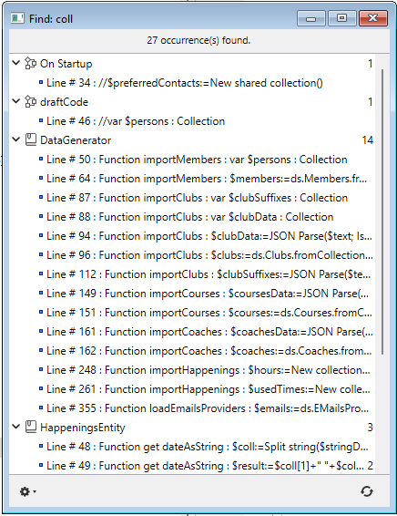
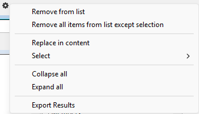
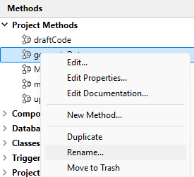

4D ofrece varias funciones de búsqueda y sustitución de elementos en todo el entorno de diseño.

- Puede buscar una cadena o un tipo de objeto (variable, comentario, expresión, etc.) en parte o en todo el proyecto en función de criterios personalizados ("empieza por", "contiene", etc.). Por ejemplo, puede buscar todas las variables que contengan la cadena "MiVar", solo en los métodos cuyo nombre empiece por "HR_".
- Los resultados se muestran en una ventana de resultados, donde es posible realizar sustituciones en los contenidos. También puede exportar estos resultados en un archivo de texto que puede importarse a una hoja de cálculo.
- Puede detectar variables y métodos que no se utilicen en su código y eliminarlos para liberar memoria.
- Puede renombrar un método proyecto o una variable en todo el entorno de diseño en una sola operación.

:::note

También hay funciones para buscar entre los métodos de su proyecto en el menú contextual de la página Métodos del Explorador: **Buscar los invocadores** (también disponible en el [Editor de código](../code-editor/write-class-method.md#search-callers) y **Buscar las dependencias**. Ambas funciones muestran los elementos encontrados en una [ventana de resultados](#results-window).

:::

## Buscar ubicación

Cuando se busca en el entorno Diseño, se buscan los siguientes elementos:

- Nombres de los métodos proyecto y las clases
- Contenido de todos los métodos y clases
- Nombres de tablas, campos y formularios
- Contenido de los formularios:
  - nombres y títulos de los objetos
  - nombres de mensajes de ayuda, imágenes, variables, hojas de estilo,
  - cadenas de formato de caracteres
  - expresiones
- Menús (nombres y elementos) y comandos asociados a los elementos de menú
- Listas de selección (nombres y elementos)
- Consejos de ayuda (nombres y contenido)
- Formatos / filtros (nombres y contenido)
- Comentarios en el Explorador y en el código

## Buscar en Diseño

### Iniciar una búsqueda

Especifique sus criterios de búsqueda en la ventana "Buscar en el diseño":

1. Haga clic en el botón Buscar () de la barra de herramientas 4D.
   O
   Seleccione el comando **Buscar en Diseño...** del menú **Editar**.

Aparece la ventana "Buscar en diseño":


Las áreas de "Buscar en el diseño" varían dinámicamente en función de las selecciones realizadas en los menús. Puede expandir esta ventana para que todas las opciones sean visibles:


2. Construya su búsqueda utilizando los diferentes menús y áreas de entrada del diálogo y, si es necesario, introduzca la cadena de caracteres a buscar. Estos elementos se describen en las secciones siguientes.

3. Define las [opciones de búsqueda](#searching-options) (si es necesario).

4. Haga clic en **OK** o presione la tecla **Entrada**.
   Cuando la búsqueda ha terminado, aparece la [ventana de resultados](#results-window) indicando los elementos encontrados.

:::note

Puede cancelar una búsqueda extensa que está en marcha usando el botón **x**; esto no cierra la ventana ni elimina los resultados que se han encontrado.

:::

Una vez ejecutada una búsqueda, el valor introducido en el área de búsqueda se guarda en la memoria. Este valor, así como todos los demás valores introducidos durante la misma sesión, pueden seleccionarse en el combo box.

### Buscar

Especifique el tipo de elemento a buscar utilizando el menú **Buscar**. Las siguientes opciones están disponibles:

- **Texto**: en este caso, 4D busca una cadena de caracteres en todo el entorno de diseño. La búsqueda se realiza en modo texto plano, sin tener en cuenta el contexto. Por ejemplo, puede buscar el texto "ALERT("Número de error: "+" o "botón27". En este modo, no puede utilizar el caracter comodín porque "@" se considera un caracter estándar.
- **El comentario**: esta búsqueda es básicamente la misma que la anterior, pero se restringe al contenido de los comentarios en el código (líneas que empiezan por //) y en la ventana del Explorador. Por ejemplo, puede buscar cualquier comentario que contenga la cadena "Pendiente de verificación".

:::note

El resultado final de ambos tipos de búsqueda depende del [modo de búsqueda](#search-mode) seleccionado.

:::

- **La expresión de lenguaje**: se utiliza para buscar cualquier expresión 4D válida; la búsqueda se realiza en el modo de búsqueda "contiene". La validez es importante porque 4D debe ser capaz de evaluar una expresión para poder buscarla. Por ejemplo, una búsqueda de la expresión "[clientes" (expresión no válida) no devolverá ningún resultado, mientras que "[clientes]" es correcta. Esta opción es especialmente adecuada para la búsqueda de asignaciones de valor y comparaciones. Por ejemplo:
  - Buscar "myvar:=" (asignación)
  - Buscar "myvar=" (comparación)
- **Un elemento del lenguaje**: permite buscar un elemento de lenguaje concreto por su nombre. 4D puede distinguir entre los siguientes elementos:
  - **Cualquier elemento del lenguaje**: todo elemento de la lista de abajo.
  - **Método proyecto o clase**: nombre de un método proyecto o clase, por ejemplo "M_Add" o "EmployeeEntity".
  - **Formulario:** nombre del formulario, por ejemplo "Entrada". El comando busca entre formularios proyecto y formularios tabla.
  - **Campo o Tabla**: nombre de una tabla o campo, por ejemplo "Clientes".
  - **Variable**: todo nombre de variable, como "$myvar".
    **constante 4D**: toda constante, como "Is Picture".
    **Cadena entre comillas**: constante de texto literal; es decir, cualquier valor entre comillas en el editor de código o insertado en áreas de texto del editor de Formularios (texto estático o cajas de grupo). Por ejemplo, una búsqueda de "Martin" devolverá resultados si su código contiene la línea: `ds.Customer.query("name = :1"; "Martin")`
  - **Comando 4D**: todo comando 4D, por ejemplo "Alert".
  - **Comando de plug-in**: comando de plug-in instalado en la aplicación.
  - **Propiedades**: un nombre de propiedad del objeto (incluye nombres de atributos ORDA). Por ejemplo, "lastname" encontrará "$o.lastname" y "ds.Employee.lastname".
- **Cualquier objeto**: esta opción busca entre todos los elementos del entorno Diseño. Sólo está disponible el filtro de fecha de modificación. Utilice esta opción, por ejemplo, para buscar "cualquier cosa modificada hoy".

### Modo de búsqueda

El menú de modo de búsqueda (es decir, "que", "que es" o "cuyo nombre") especifica cómo buscar el valor introducido. El contenido de este menú varía según el tipo de elemento a buscar seleccionado en la lista desplegable **Encontrar**.

- Opciones de búsqueda para Texto o Comentario:
  - **contiene**: busca la cadena especificada en todo el texto del entorno de diseño. Los resultados de la búsqueda de "var" pueden incluir "myvar", "variable1" o "aVariable".
  - **contiene la palabra completa**: busca en todo el texto del entorno Diseño la cadena como palabra entera. Los resultados de la búsqueda de "var" sólo incluyen apariciones exactas. No incluirán "myvar" pero sí, por ejemplo, "var:=10" o "ID+var" porque los símbolos: o + son separadores de palabras.
  - **Empieza por / termina por**: busca la cadena al principio o al final de la palabra (búsqueda de texto) o al principio o al final de la línea de comentario (búsqueda de comentario). En modo "El texto termina en", si busca "var" encontrará "myvar".
- Opciones de búsqueda para el elemento del lenguaje: el menú ofrece opciones estándar (coincide, contiene, empieza por, termina por). Tenga en cuenta que puede utilizar el comodín de búsqueda (@) con la opción "es exactamente" (devuelve todos los objetos del tipo especificado).

### Buscar en componentes

Cuando su proyecto actual hace referencia a [componentes editables](../Extensions/develop-components.md#editing-components), puede designar uno o todos sus componentes como objetivo de la búsqueda. Por defecto, una búsqueda se ejecuta sólo en el host. Para modificar el objetivo de una búsqueda, despliegue el menú **en el proyecto**:


Puede seleccionar como objetivo:

- el **proyecto local** (opción por defecto, la primera de la lista): la búsqueda sólo se ejecutará dentro del código y los formularios del proyecto local, excluyendo los componentes.
- el **proyecto local y todos sus componentes**: la búsqueda se ejecutará en el proyecto local y en todos sus componentes cargados.
- un **componente específico**, entre la lista de todos los componentes en los que se puede buscar: la búsqueda se limitará únicamente a este componente, excluyendo el host y los demás componentes.

:::note

Si no se encuentra ningún componente de búsqueda, no hay menú disponible.

:::

El menú **en la carpeta** se actualiza cuando seleccionas un proyecto ya que la disponibilidad de carpetas depende de los objetivos de búsqueda seleccionados. El menú se oculta cuando se selecciona la opción "proyecto local y todos sus componentes".

### Folder

El menú **en la carpeta** restringe la búsqueda a una carpeta específica del proyecto. Por defecto (opción "Nivel superior"), la búsqueda se realiza en todas las carpetas.

:::note

Las carpetas se definen en la página Inicio del Explorador.

:::

### Fecha de modificación del padre

Este menú restringe la búsqueda con respecto a la fecha de creación/modificación de su padre (por ejemplo, el método que contiene la cadena buscada). Además de los criterios de fecha estándar (es, es antes, es después, no es), este menú también contiene varias opciones que le permiten especificar rápidamente un período de búsqueda estándar:

- **es hoy**: período que comienza a medianoche (00:00 h) del día en curso.
- **es desde ayer**: periodo que incluye el día actual y el anterior.
- **es esta semana**: período que comienza el lunes de la semana en curso.
- **es este mes**: período que comienza el día 1 del mes en curso.

### Opciones de búsqueda

Puede seleccionar opciones que le ayuden a agilizar sus búsquedas:

- **Búsqueda en formularios**: cuando se deselecciona esta opción, la búsqueda se realiza en todo el proyecto, excepto en formularios.
- **Buscar en los métodos**: cuando se deselecciona esta opción, la búsqueda se realiza en todo el proyecto, excepto en los métodos.
- **Distingue entre mayúsculas y minúsculas**: cuando se selecciona esta opción, la búsqueda utiliza las mayúsculas y minúsculas de los caracteres tal y como se han introducido en el área Buscar.

## Ventana Resultados

La ventana Resultados lista todos los elementos encontrados que coinciden con los criterios de búsqueda establecidos mediante distintos tipos de búsqueda:

- [búsqueda estándar](#starting-a-search)
- [buscar elementos no utilizados](#find-unused-methods-and-global-variables)
- [buscar los llamantes](../code-editor/write-class-method.md#search-callers)
- búsqueda de las dependencias
- [renombrar los métodos y variables del proyecto](#renaming-project-methods-and-variables)

Muestra los resultados como una lista jerárquica organizada por tipo de elementos encontrados. Puede expandir o contraer todos los elementos jerárquicos de la lista mediante el menú de opciones (que se encuentra en la parte inferior izquierda de la ventana) o en el menú contextual.



Puede hacer doble clic en una línea de esta ventana para ver el elemento en su editor, como el [editor de código](../code-editor/write-class-method.md). Si realiza varias búsquedas, cada búsqueda abre su propia ventana de resultados, dejando abiertas las ventanas de resultados anteriores.

Cuando se ha encontrado más de una ocurrencia, la lista indica su **conteo** junto al nombre del elemento.

Cada línea puede mostrar un consejo que de información adicional, por ejemplo, la propiedad del elemento que coincide con los criterios, o el número de la página del formulario que contiene la ocurrencia.

Cuando un elemento encontrado pertenece a un componente, el **nombre del componente** aparece entre paréntesis a la derecha del nombre del elemento:


Una vez finalizada la búsqueda, puede utilizar el botón  para realizarla de nuevo con los mismos criterios y opciones.

### Menú de opciones

Puede realizar varias acciones utilizando el menú opciones:



- **Eliminar de la lista**: elimina los elementos seleccionados de la ventana de resultados. Más concretamente, esto le permite mantener en el contenido solo los elementos a los que se dirige una operación de sustitución o que se utilizan para arrastrar y soltar entre aplicaciones.
- **Eliminar todos los elementos de la lista excepto la selección**: borra todo de la ventana de resultados excepto los elementos seleccionados.
- [**Reemplazar en el contenido**](#replace-in-content): reemplaza una cadena de caracteres en los elementos seleccionados.
- **Seleccionar >**: selecciona un tipo de elemento (métodos proyecto, nombres de objetos, etc.) de entre todos los que se encuentran en la ventana Resultados. El submenú jerárquico también ofrece comandos para seleccionar (Todos) o deseleccionar (Ninguno) todos los elementos a la vez.
- **Contraer todo/Expandir todo**: expande o contrae todos los elementos jerárquicos de la lista de resultados.
- **Exportar resultados**: exporta información sobre los criterios de búsqueda y los elementos que aparecen en la ventana Resultados. Este archivo de texto puede importarse a una hoja de cálculo como Excel, por ejemplo. Para cada elemento, la siguiente información se exporta como valores separados por tabuladores en un archivo de texto:
  - Proyecto anfitrión o nombre del componente
  - Tipo (method, Class, formObject, trigger...)
  - Ruta
  - Propiedad (si es preciso): ofrece la propiedad del objeto que coincide con los criterios. Por ejemplo, una cadena de caracteres podría encontrarse en el nombre de una variable (propiedad variable) y en el nombre de un objeto (propiedad nombre) en el mismo formulario. Este campo está vacío cuando el elemento coincidente es el propio objeto.
  - Contenido (si es preciso): ofrece el contenido que realmente coincide con los criterios; por ejemplo, la línea de código que contiene la cadena solicitada.
  - Número de línea (para código) o número de página (para objetos de formulario)

## Reemplazar en el contenido {#replace-in-content}

La función Reemplazar en el contenido permite sustituir una cadena de caracteres por otra dentro de los objetos listados en la ventana Resultados. Está disponible en el [menú de opciones](#options-menu) de la ventana.

:::note

La opción de menú **Reemplazar en contenido** está desactivada si trabaja en una base de datos de sólo lectura (por ejemplo, en un archivo .4dz).

:::

Cuando seleccione este comando, aparece un cuadro de diálogo donde se introduce la cadena de caracteres que reemplazará todas las ocurrencias encontradas por la búsqueda inicial:


Las operaciones de sustitución funcionan del siguiente modo:

- La sustitución se realiza siempre entre todos los elementos que se encuentran en la lista y no sólo para una selección. Sin embargo, es posible limitar la operación de sustitución reduciendo primero el contenido de la lista mediante los comandos **Eliminar de la lista** o **Eliminar todos los elementos de la lista excepto la selección** del [menú opciones](#options-menu) o del menú contextual.
- Si la ventana Resultados incluye elementos de componentes, la sustitución se realizará también en el componente o componentes.
- Sólo las ocurrencias mostradas en la lista serán reemplazadas y sólo después de comprobar los criterios de búsqueda inicial para los casos en los que los objetos fueron modificados entre la búsqueda inicial y la operación de reemplazo.
- La sustitución se realiza en el código, las propiedades de los objetos de formulario, el contenido de los mensajes de ayuda, los filtros de entrada, los elementos de menú (texto del elemento y llamadas a métodos), las listas de opciones, los comentarios.
- Para cada objeto modificado, 4D comprueba si ya está cargado por otra máquina o en otra ventana. En caso de conflicto, aparece un cuadro de diálogo estándar que indica que el objeto está bloqueado. Puede cerrar el objeto y luego volver a intentarlo o cancelar su reemplazo. La operación de reemplazo continuará con los otros objetos de la lista.
- Si un método o formulario afectado por una operación "reemplazar en el contenido" está siendo editado actualmente por la misma aplicación 4D, se modificará directamente en el editor abierto (no aparece ninguna advertencia). Los formularios y los métodos modificados de este modo no se guardan automáticamente: tendrá que utilizar el comando **Guardar** o **Guardar todo** explícitamente para validar los cambios.
- Después de que un reemplazo se haga en una lista de elementos, aparecerá en cursiva. En la parte inferior de la ventana aparece un recuento de las sustituciones realizadas en tiempo real.
- Los elementos nunca son renombrados por la función **Reemplazar en contenido**, excepto los objetos formulario. Por lo tanto, es posible que ciertos elementos de la lista no se vean afectados por la operación de reemplazo. Esto puede ocurrir cuando sólo el nombre del artículo corresponde a los criterios de búsqueda iniciales. En este caso, los elementos de la lista no aparecen necesariamente todos en cursiva y el recuento final de sustituciones puede ser inferior al número de ocurrencias encontradas por la búsqueda inicial.

## Renombrar métodos del proyecto y variables {#renaming-project-methods-and-variables}

4D ofrece una función dedicada de renombrado con distribución en todo el proyecto para los métodos proyecto y variables en todo el proyecto.

El comando **Renombrar...** está disponible en el [Editor de código] (para los métodos proyecto y variables) y en el menú contextual del Explorador (para los métodos proyecto).



Cuando selecciona este comando, aparece un cuadro de diálogo donde introduce el nuevo nombre para el objeto:


El nuevo nombre debe cumplir las [reglas de nomenclatura](../Concepts/identifiers.md); de lo contrario, aparecerá una advertencia al validar el cuadro de diálogo. Por ejemplo, no se puede renombrar un método con un nombre de comando como "Alert".

Dependiendo del tipo de objeto que esté renombrando (método proyecto o variable), el cuadro de diálogo de renombrado puede contener también una opción de distribución:

- Método proyecto: la opción **Actualizar llamantes en toda la base de datos** renombra el método en todo el código del proyecto que lo referencia. También puede desmarcar esta opción para, por ejemplo, renombrar el método solo en el propio Explorador.
- Variable process: la opción **Renombrar la variable en toda la base de datos** renombra la variable en todo el código del proyecto que la referencia. Si desmarca esta opción, la variable sólo se renombra en el método actual.
- Variable local: no hay opción de distribución para este objeto; la variable sólo se renombra en el método o clase actual.

## Búsqueda de elementos no utilizados

Dos comandos de búsqueda específicos permiten detectar variables y métodos que no se utilizan en el código de su proyecto. A continuación, puede eliminarlos para liberar memoria. Estos comandos se encuentran en el menú **Edición** del entorno de diseño.

### Encontrar métodos y variables globales no utilizados

Este comando busca los métodos del proyecto, así como variables "globales" (variables proceso e interproceso) declaradas pero no utilizadas. Los resultados de la búsqueda aparecen en una [ventana de resultados](#results-window).

Se considera que un método proyecto no se utiliza cuando:

- no está en la Papelera,
- no se llama en ninguna en el código 4D,
- no es llamado por un comando de menú,
- no se llama como una constante cadena en el código 4D (4D detecta un nombre de método en una cadena incluso cuando va seguido de parámetros entre paréntesis).

Se considera que una variable proceso o interproceso no se utiliza cuando:

- está [declarada](../Concepts/variables.md#declaring-variables) en el código 4D,
- no se utiliza en ninguna otra parte del código 4D,
- no se utiliza en ningún objeto de formulario.

Tenga en cuenta que algunos usos no pueden ser detectados por la función, es decir, un elemento que se considera no utilizado puede serlo en realidad. Este es el caso del siguiente código:

```4d
var v : Text :="method"
EXECUTE FORMULA("my"+v+String(42))
```

Este código construye un nombre de método. El método proyecto *mymethod42* se considera no utilizado cuando en realidad se llama. Por lo tanto, es aconsejable comprobar que los elementos declarados como no utilizados son en realidad innecesarios antes de eliminarlos.

### Buscar variables locales no utilizadas

Este comando busca variables locales declaradas pero no utilizadas. Los resultados de la búsqueda aparecen en una [ventana de resultados](#results-window).

Se considera que una variable local no se utiliza cuando:

- está [declarada](../Concepts/variables.md#declaring-variables) en el código 4D,
- no se utiliza en ningún otro lugar dentro del mismo método.
