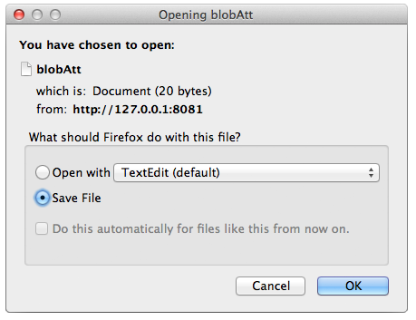

Pass "true" to save the BLOB as a document (must also pass `$expand={blobAttributeName}`)

## Descripción

`$binary` allows you to save the BLOB as a document.  You must also use the [`$expand`]($expand.md) command in conjunction with it.

Cuando haga la siguiente petición:

```
GET  /rest/Company(11)/blobAtt?$binary=true&$expand=blobAtt
```

Se le preguntará dónde guardar el BLOB en el disco:


