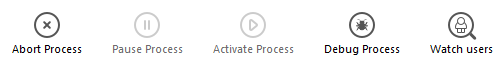

The **Processes** page lists all the processes underway.

The "Processes" button indicates, in parentheses, the total number of processes running in the server (this number does not take into account any display filters applied to the window nor the state of the **Display processes by groups** option).

You can change the order of the columns by simply dragging and dropping the column header areas. También puede ordenar la lista de los valores de las columnas haciendo clic en su encabezado.

Like the Users page, this page contains a dynamic [search/filtering area](users.md#searchfiltering-area) that can be used to reduce the number of rows displayed in the list to those that correspond to the text entered in the search area. The search/filtering is carried out in the Session and Process name columns.

There are also three shortcut buttons that can be used to filter by the type of process displayed in the window:

- **Users processes**: Processes generated by and for the user sessions. Estos procesos van precedidos de un icono en forma de una persona.
- **4D Processes**: Processes generated by the 4D Server engine. These processes are preceded by an icon in the form of a notched wheel.
- **Spare processes**: Processes that are inactive but kept temporarily and that can be reused at any time. Este mecanismo optimiza la reactividad de 4D Server. These processes are preceded by an icon in the form of a dimmed figure.

The **Display processes by groups** option lets you group together the internal processes of 4D Server as well as the client processes, for better readability. Cuando seleccione esta opción:

- the "twinned" 4D client processes (main 4D client process and 4D client base process, see [Process Type](#process-type)) are grouped as one,
- a "Task managers" group is created; it includes the internal processes dedicated to dividing up tasks (Shared balancer, Net session manager, Exclusive pool worker),
- a "Client managers" group is created; it includes various client internal processes.

The lower area of the window is used to display the graphic representation of the activity of the selected process(es).

> You can select several rows by holding down the **Shift** key for an adjacent selection or **Ctrl** (Windows) / **Command** (macOS) for a non-adjacent selection.

The activity of the process is the percentage of time that 4D Server has devoted to this process (ratio). La ventana ofrece la siguiente información para cada proceso:

- Tipo de proceso (ver abajo),
- Sesión/Información:
    - Proceso 4D - en blanco,
    - Proceso usuario - Nombre del usuario 4D,
    - Proceso web - ruta URL,
- Nombre del proceso,
- Number of the process (as returned by the [`New process`](https://doc.4d.com/4dv19/help/command/en/page317.html) command for example). El número de proceso es el número asignado en el servidor. In the case of a global process, this number may be different from that assigned on the client machine.
- Estado actual del proceso,
- Tiempo de ejecución (en segundos) del proceso desde su creación,
- Porcentaje de tiempo que 4D Server ha dedicado a este proceso (ratio).

## Tipo del proceso

Cada proceso se identifica con un icono y un tipo. El color y la forma del icono indican el tipo de proceso:

| icon                                       | type                                                                                                                                                               |
| ------------------------------------------ | ------------------------------------------------------------------------------------------------------------------------------------------------------------------ |
|   | Servidor de aplicación                                                                                                                                             |
|   | Servidor SQL                                                                                                                                                       |
|   | Servidor DB4D (motor de base de datos)                                                                                                                             |
|   | Servidor Web                                                                                                                                                       |
|   | Servidor SOAP                                                                                                                                                      |
|   | Proceso cliente 4D protegido (proceso de desarrollo de un 4D conectado)                                                                                            |
|   | Proceso cliente 4D principal (proceso principal de un 4D conectado). Collaborative process, equivalent on the server of the process created on the client machine) |
|   | Proceso cliente 4D principal (proceso paralelo a un proceso cliente 4D. Preemptive process responsible for controlling the corresponding main 4D client process)   |
|   | Proceso de reserva (antiguo o futuro "¨Proceso cliente 4D base de datos")                                                                                          |
|  | Worker servidor SQL                                                                                                                                                |
|  | Proceso worker servidor HTTP                                                                                                                                       |
|  | Proceso 4D client (proceso que se ejecuta en el 4D conectado)                                                                                                      |
|  | Stored procedure (process launched by a connected 4D and running on the server)                                                                                    |
|  | Método web (lanzado por 4DACTION por ejemplo)                                                                                                                      |
|  | Método web (apropiativo)                                                                                                                                           |
|  | Método SOAP (lanzado por un Web Service)                                                                                                                           |
|  | Método SOAP (apropiativo)                                                                                                                                          |
|  | Logger (registrador)                                                                                                                                               |
|  | Listener conexión TCP                                                                                                                                              |
|  | Gestor de sesiones TCP                                                                                                                                             |
|  | Otro proceso                                                                                                                                                       |
|  | Proceso worker (cooperativo)                                                                                                                                       |
|  | Proceso 4D client (apropiativo)                                                                                                                                    |
|  | Procedimiento almacenado (proceso apropiativo)                                                                                                                     |
|  | Proceso worker (apropiativo)                                                                                                                                       |

> Each main 4D client process and its "twinned" 4D client base process are grouped together when the **Display processes by groups** option is checked.

## Botones de administración

The page also has five control buttons that act on the selected process(es). Tenga en cuenta que sólo se puede actuar sobre los procesos usuario.

- **Abort Process**: can be used to abort the selected process(es). When you click on this button, a warning dialog box appears so that you can confirm or cancel the operation.

> You can also abort the selected process(es) directly without displaying the confirmation dialog box by holding down the **Alt** key while clicking on this button, or by using the [`ABORT PROCESS BY ID`](https://doc.4d.com/4dv19/help/command/en/page1634.html) command.

- **Pause Process**: can be used to pause the selected process(es).
- **Activate Process**: can be used to reactivate the selected process(es). The processes must have been paused previously (using the button above or by programming); otherwise, this button has no effect.
- **Debug Process**: can be used to open on the server machine one or more debugger windows for the selected process(es). When you click on this button, a warning dialog box appears so that you can confirm or cancel the operation. Note that the debugger window is only displayed when the 4D code is actually executed on the server machine (for example in a trigger or the execution of a method having the "Execute on Server" attribute).

> You can also debug a process directly without displaying the confirmation dialog box by holding down the **Alt** key while clicking on this button.

- **Watch users**: used to display, on the [Users page](users.md), all the processes of the selected user(s). Este botón se activa cuando se selecciona al menos un proceso de usuario.

