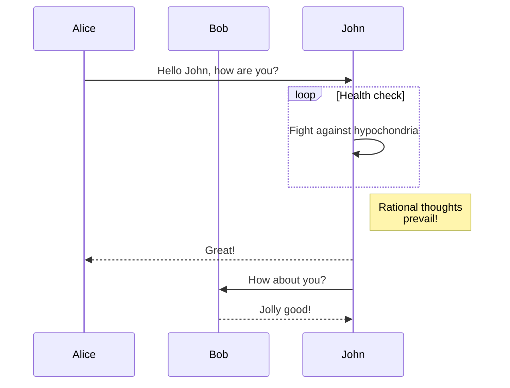

4D ofrece un conjunto de etiquetas de transformación que le permiten insertar referencias a las variables o a las expresiones 4D, o efectuar diferentes tipos de procesamiento en un texto fuente, llamado "plantilla". Estas etiquetas se interpretan durante la ejecución del texto fuente y generan un texto de salida.

This principle is used in particular by the 4D Web server to build [web template pages](WebServer/templates.md).

These tags are generally to be inserted as HTML type comments (`<!--#Tag Contents-->`) but an [xml-compliant alternative syntax](#alternative-syntax-for-4dtext-4dhtml-4deval) is available for some of them.

Es posible mezclar varios tipos de etiquetas. Por ejemplo, la siguiente estructura HTML es totalmente factible:

```html
<HTML>
<BODY>
<!--#4DSCRIPT/PRE_PROCESS-->   (Method call)
<!--#4DIF (myvar=1)-->   (If condition)
   <!--#4DINCLUDE banner1.html-->   (Subpage insertion)
<!--#4DENDIF-->   (End if)
<!--#4DIF (mtvar=2)-->
   <!--#4DINCLUDE banner2.html-->
<!--#4DENDIF-->

<!--#4DLOOP [TABLE]-->   (Loop on the current selection)
<!--#4DIF ([TABLE]ValNum>10)-->   (If [TABLE]ValNum>10)
   <!--#4DINCLUDE subpage.html-->   (Subpage insertion)
<!--#4DELSE-->   (Else)
   <B>Value: <!--#4DTEXT [TABLE]ValNum--></B><br/>   (Field display)
<!--#4DENDIF-->
<!--#4DENDLOOP-->   ](End for)
</BODY>
</HTML>
```



## Principios de uso de las etiquetas

### Parsing

Parsing the contents of a _template_ source is done in two contexts:

- Using the `PROCESS 4D TAGS` command; this command accepts a _template_ as input, as well as optional parameters and returns a text resulting from the processing.

- Using 4D's integrated HTTP server: [template pages](WebServer/templates.md) sent by means of the `WEB SEND FILE` (.htm, .html, .shtm, .shtml), `WEB SEND BLOB` (text/html type BLOB), `WEB SEND TEXT` commands, or called using URLs. En este último caso, por razones de optimización, las páginas con sufijo ".htm" y ".html" NO se analizan. In order to parse HTML pages in this case, you must add the suffix “.shtm” or “.shtml” (for example, http\://www\.server.com/dir/page.shtm).

### Tratamiento recursivo

Las etiquetas 4D se interpretan de manera recursiva: 4D siempre intenta reinterpretar el resultado de una transformación y, si se ha producido una nueva transformación, se realiza una interpretación adicional, y así sucesivamente hasta que el producto obtenido ya no requiera ninguna otra transformación. Por ejemplo, dada la siguiente instrucción:

```html
<!--#4DHTML [Mail]Letter_type-->
```

If the `[Mail]Letter_type` text field itself contains a tag, for example `<!--#4DSCRIPT/m_Gender-->`, this tag will be evaluated recursively after the interpretation of the 4DHTML tag.

Este poderoso principio satisface la mayoría de las necesidades relacionadas con la transformación de textos. Note, however, that in some cases this can also allow malicious code to be inserted in the web context, [which can be avoided](WebServer/templates.md#prevention-of-malicious-code-insertion).

### Identificadores con tokens

Para asegurar la correcta evaluación de las expresiones procesadas a través de las etiquetas, independientemente del lenguaje o de la versión de 4D, se recomienda utilizar la sintaxis tokenizada para los elementos cuyo nombre puede variar a lo largo de las versiones (comandos, tablas, campos, constantes). For example, to insert the `Current time` command, enter `Current time:C178`.

### Utilizando el "." como separador decimal

4D utiliza siempre el punto (.) as a decimal separator when evaluating a numerical expression using a 4D tag `4DTEXT`, `4DHTML`, and `4DEVAL`. Los parámetros regionales se ignoran. Esta funcionalidad facilita el mantenimiento del código y la compatibilidad entre los lenguajes y las versiones de 4D.

## 4DBASE

#### Sintaxis: `<!--#4DBASE folderPath-->`

The `<!--#4DBASE -->` tag designates the working directory to be used by the `<!--#4DINCLUDE-->` tag.

When it is called in a Web page, the `<!--#4DBASE -->` tag modifies all subsequent `<!--#4DINCLUDE-->` calls on this page, until the next `<!--........-->`, if any. If the`<!--#4DBASE -->` folder is modified from within an included file, it retrieves its original value from the parent file.

The _folderPath_ parameter must contain a pathname relative to the current page and it must end with a slash (`/`). La carpeta designada debe estar ubicada dentro de la carpeta Web.

Pase la palabra clave "WEBFOLDER" para restablecer la ruta por defecto (relativa a la página).

El siguiente código, que debe especificar una ruta relativa para cada llamada:

```html
<!--#4DINCLUDE subpage.html-->
<!--#4DINCLUDE folder/subpage1.html-->
<!--#4DINCLUDE folder/subpage2.html-->
<!--#4DINCLUDE folder/subpage3.html-->
<!--#4DINCLUDE ../folder/subpage.html-->
```

... es equivalente a:

```html
<!--#4DINCLUDE subpage.html-->
<!--#4DBASE folder/-->
<!--#4DINCLUDE subpage1.html-->
<!--#4DINCLUDE subpage2.html-->
<!--#4DINCLUDE subpage3.html-->
<!--#4DBASE ../folder/-->
<!--#4DINCLUDE subpage.html-->
<!--#4DBASE WEBFOLDER-->
```

Por ejemplo, para definir un directorio para la página de inicio:

```html
/* Index.html */
<!--#4DIF LangFR=True-->
    <!--#4DBASE FR/-->
<!--#4DELSE-->
    <!--#4DBASE US/-->
<!--#4DENDIF-->
<!--#4DINCLUDE head.html-->
<!--#4DINCLUDE body.html-->
<!--#4DINCLUDE footer.html-->
```

In the "head.html" file, the current folder is modified through `<!--#4DBASE -->`, without this changing its value in "Index.html":

```html
/* Head.htm */
/* the working directory here is relative to the included file (FR/ or US/) */
<!--#4DBASE Styles/-->
<!--#4DINCLUDE main.css-->
<!--#4DINCLUDE product.css-->
<!--#4DBASE Scripts/-->
<!--#4DINCLUDE main.js-->
<!--#4DINCLUDE product.js-->
```

## 4DCODE

#### Sintaxis: `<!--#4DCODE codeLines-->`

La etiqueta `4DCODE` permite insertar un bloque de código 4D de varias líneas en una plantilla.

When a `<!--#4DCODE` sequence is detected that is followed by a space, a CR or a LF character, 4D interprets all the lines of code up to the next `-->` sequence. El bloque de código en sí puede contener retornos de carro, saltos de línea o ambos; será interpretado secuencialmente por 4D.

Por ejemplo, puede escribir en una plantilla:

```html
<!--#4DCODE
//PARAMETERS initialization
C_OBJECT:C1216($graphParameters)
OB SET:C1220($graphParameters;"graphType";1)
$graphType:=1
//...your code here
If(OB Is defined:C1231($graphParameters;"graphType"))
    $graphType:=OB GET:C1224($graphParameters;"graphType")
    If($graphType=7)
        $nbSeries:=1
        If($nbValues>8)
            DELETE FROM ARRAY:C228 ($yValuesArrPtr{1}->;9;100000)
            $nbValues:=8
        End if
    End if
End if
-->
```

Aquí están las características de la etiqueta 4DCODE:

- The `TRACE` command is supported and activates the 4D debugger, thus allowing you to debug your template code.
- Todo error mostrará el diálogo de error estándar que permite al usuario detener la ejecución del código o entrar en el modo depuración.
- The text in between `<!--#4DCODE` and `-->` is split into lines accepting any line-ending convention (cr, lf, or crlf).
- The text is tokenized within the context of the database that called `PROCESS 4D TAGS`. Esto es importante para el reconocimiento de los métodos de proyecto, por ejemplo. The [Available through tags and 4D URLs (4DACTION ...)](WebServer/allowProject.md) method property is not taken into account.
- Incluso si el texto siempre utiliza Inglés-US, se recomienda utilizar la sintaxis token (:Cxxxx) para los nombres de comandos y de constantes para proteger contra eventuales problemas debido a los comandos o a las constantes que se están renombrando de una versión de 4D a otra.

> El hecho de que las etiquetas 4DCODE puedan llamar a cualquiera de los comandos del lenguaje 4D o a los métodos del proyecto podría considerarse un problema de seguridad, especialmente cuando la base de datos está disponible a través de HTTP. Sin embargo, como ejecuta código del lado del servidor llamado desde sus propios archivos de plantilla, la etiqueta en sí no representa un problema de seguridad. En este contexto, como para todo servidor web, la seguridad se maneja principalmente a nivel de los accesos remotos a los archivos del servidor.

## 4DEACH y 4DENDEACH

#### Syntax: `<!--#4DEACH variable in expression-->` `<!--#4DENDEACH-->`

The `<!--#4DEACH-->` comment allows iterating a specified item over all values of the _expression_. The item is set to a _variable_ whose type depends on the _expression_ type.

The `<!--#4DEACH-->` comment can iterate through three expression types:

- [collections](#--4deach-item-in-collection--): loop through each element of the collection,
- [entity selections](#--4deach-entity-in-entityselection--): loop through each entity,
- [objects](#--4deach-property-in-object--): loop through each object property.

El número de iteraciones se evalúa al inicio y no cambiará durante el proceso. La adición o eliminación de elementos durante el bucle no suele ser recomendable, ya que puede resultar en redundancia o perdidas de iteraciones.

### `<!--#4DEACH item in collection-->`

This syntax iterates on each _item_ of the _collection_. The code portion located between `<!--#4DEACH -->` and `<!--#4DENDEACH-->` is repeated for each collection element.

El parámetro _item_ es una variable del mismo tipo que los elementos de la colección.

The collection must contain only **elements of the same type**, otherwise an error is returned as soon as the _item_ variable is assigned the first mismatched value type.

El número de bucles se basa en el número de elementos de la colección. At each iteration, the _item_ variable is automatically filled with the matching element of the collection. Hay que tener en cuenta los siguientes puntos:

- If the _item_ variable is of the object type or collection type (i.e. if _expression_ is a collection of objects or of collections), modifying this variable will automatically modify the matching element of the collection (because objects and collections share the same references). Si la variable es de tipo escalar, sólo se modificará la variable.
- La variable _item_ obtiene el mismo tipo que el primer elemento de la colección. Si algún elemento de la colección no es del mismo tipo que la variable, se genera un error y el bucle se detiene.
- If the collection contains elements with a Null value, an error is generated if the _item_ variable type does not support Null values (such as longint variables).

#### Ejemplo con una colección de valores escalares

_getNames_ devuelve una colección de cadenas. The method has been declared as "[available through 4D tags and URLs](WebServer/allowProject.md)".

```html
 <table class="table">    

        <tr><th>Name</th></tr>

          <!--#4DEACH $name in getNames-->
        <tr>
            <td><!--#4DTEXT $name--></td>
        </tr>
          <!--#4DENDEACH-->
    </table>
```

#### Ejemplo con una colección de objetos

_getSalesPersons_ returns a collection of objects.

```html
    <table class="table">    
         <!--#4DCODE
            $salePersons:=getSalesPersons
          -->          
       <tr><th>ID</th><th>Firstname</th><th>Lastname</th></tr>

          <!--#4DEACH $salesPerson in $salePersons-->
        <tr>
            <td><!--#4DTEXT $salesPerson.ID--></td>
            <td><!--#4DTEXT $salesPerson.firstname--></td>
            <td><!--#4DTEXT $salesPerson.lastname--></td>
        </tr>
          <!--#4DENDEACH-->
    </table>
```

### `<!--#4DEACH entity in entitySelection-->`

Esta sintaxis itera en cada _entidad_ de la _entitySelection_. The code portion located between `<!--#4DEACH -->` and `<!--#4DENDEACH-->` is repeated for each entity of the entity selection.

The _entity_ parameter is an object variable of the entity selection class.

El número de bucles se basa en el número de entidades presentes en la selección de entidades. At each iteration, the _entity_ object variable is automatically filled with the matching entity of the entity selection.

#### Ejemplo con una tabla html

```html
    <table class="table">     

        <tr><th>ID</th><th>Name</th><th>Total purchase</th></tr>

          <!--#4DEACH $customer in ds.Customers.all()-->
        <tr>
            <td><!--#4DTEXT $customer.ID--></td>
            <td><!--#4DTEXT $customer.name--></td>
            <td><center><!--#4DTEXT String($customer.totalPurchase;"$###,##0")--></center></td>
        </tr>
          <!--#4DENDEACH-->
    </table>
```

#### Ejemplo con `PROCESS 4D TAGS`

```4d
var customers : cs.CustomersSelection
var $input; $output : Text

customers:=ds.Customers.all()
$input:="<!--#4DEACH $cust in customers-->"
$input:=$input+"<!--#4DTEXT $cust.name -->"+Char(Carriage return)
$input:=$input+"<!--#4DENDEACH-->"
PROCESS 4D TAGS($input; $output)
TEXT TO DOCUMENT("customers.txt"; $output)
```

### `<!--#4DEACH property in object-->`

This syntax iterates on each _property_ of the _object_. The code portion located between `<!--#4DEACH -->` and `<!--#4DENDEACH-->` is repeated for each property of the object.

The _property_ parameter is a text variable automatically filled with the name of the currently processed property.

Las propiedades del objeto se procesan según su orden de creación. Durante el bucle, se pueden añadir o eliminar propiedades en el objeto, sin modificar el número de bucles que quedarán en función del número original de propiedades del objeto.

#### Ejemplo con las propiedades de un objeto

_getGamers_ is a project method that returns an object like ("Mary"; 10; "Ann"; 20; "John"; 40) to figure gamer scores.

```html
    <table class="table">    
          <!--#4DCODE
           $gamers:=getGamers
          -->          

        <tr><th>Gamers</th><th>Scores</th></tr>

          <!--#4DEACH $key in $gamers-->
        <tr>
            <td ><!--#4DTEXT $key--></td>
            <td ><!--#4DTEXT $gamers[$key]--></td>
        </tr>
          <!--#4DENDEACH-->
    </table>
```

## 4DEVAL

#### Sintaxis: `<!--#4DEVAL expression-->`

#### Sintaxis alternativa: `$4DEVAL(expression)`

La etiqueta `4DEVAL` permite evaluar una variable o expresión 4D. Like the [`4DHTML`](#4dhtml) tag, `4DEVAL` does not escape HTML characters when returning text. However, unlike `4DHTML` or [`4DTEXT`](#4dtext), `4DEVAL` allows you to execute any valid 4D statement, including assignments and expressions that do not return any value.

Por ejemplo, puede ejecutar:

```
 $input:="<!--#4DEVAL a:=42-->" //assignment
 $input:=$input+"<!--#4DEVAL a+1-->" //calculation
 PROCESS 4D TAGS($input;$output)
  //$output = "43"
```

In case of an error during interpretation, the text inserted will be in the form: `<!--#4DEVAL expr-->: ## error # error code`.

> For security reasons, it is recommended to use the [`4DTEXT`](#4dtext) tag when processing data introduced from outside the application, in order to prevent the [insertion of malicious code](#prevention-of-malicious-code-insertion).

## 4DHTML

#### Sintaxis: `<!--#4DHTML expression-->`

#### Sintaxis alternativa: `$4DHTML(expression)`

Just like the `4DTEXT` tag, this tag lets you assess a 4D variable or expression that returns a value, and insert it as an HTML expression. Unlike the `4DTEXT` tag, this tag does not escape HTML special characters (e.g. ">").

Por ejemplo, aquí están los resultados del procesamiento de la variable de texto 4D myvar con las etiquetas disponibles:

| Valor myvar    | Etiquetas              | Result                      |
| -------------- | ---------------------- | --------------------------- |
| `myvar:="<B>"` | `<!--#4DTEXT myvar-->` | `&amp;lt;B&amp;gt;` |
| `myvar:="<B>"` | `<!--#4DHTML myvar-->` | `<B>`                       |

In case of an interpretation error, the inserted text will be `<!--#4DHTML myvar--> : ## error # error code`.

> For security reasons, it is recommended to use the [`4DTEXT`](#4dtext) tag when processing data introduced from outside the application, in order to prevent the [insertion of malicious code](#prevention-of-malicious-code-insertion).

## 4DIF, 4DELSE, 4DELSEIF y 4DENDIF

#### Syntax: `<!--#4DIF expression-->` {`<!--#4DELSEIF expression2-->...<!--#4DELSEIF expressionN-->`} {`<!--#4DELSE-->`} `<!--#4DENDIF-->`

Used with the `<!--#4DELSEIF-->` (optional), `<!--#4DELSE-->` (optional) and `<!--#4DENDIF-->` comments, the `<!--#4DIF expression-->` comment offers the possibility to execute portions of code conditionally.

The _expression_ parameter can contain any valid 4D expression returning a Boolean value. Debe indicarse entre paréntesis y cumplir con las reglas de sintaxis de 4D.

`<!--#4DIF expression-->` ... `<!--#4DENDIF-->` blocks can be nested in several levels. Like in 4D, each `<!--#4DIF expression-->` must match a `<!--#4DENDIF-->`.

In case of an interpretation error, the text "`<!--#4DIF expression-->`: A Boolean expression was expected" is inserted instead of the contents located between `<!--#4DIF -->` and `<!--#4DENDIF-->`. Likewise, if there are not as many `<!--#4DENDIF-->` as `<!--#4DIF -->`, the text "`<!--#4DIF expression-->`: 4DENDIF expected" is inserted instead of the contents located between `<!--#4DIF -->` and `<!--#4DENDIF-->`.

Using the `<!--#4DELSEIF-->` tag, you can test an unlimited number of conditions. Sólo se ejecuta el código que sigue a la primera condición evaluada como `True`. If no conditions are true, no statement is executed (if there is no final `<!--#4DELSE-->`).
You can use a `<!--#4DELSE-->` tag after the last `<!--#4DELSEIF-->`. If all the conditions are false, the statements following the `<!--#4DELSE-->` are executed.

Los dos códigos siguientes son equivalentes.

Código utilizando `4DELSE` solamente:

```html
<!--#4DIF Condition1-->
  /* Condition1 is true*/
<!--#4DELSE-->
    <!--#4DIF Condition2-->
        /* Condition2 is true*/
    <!--#4DELSE-->
        <!--#4DIF Condition3-->
            /* Condition3 is true */
        <!--#4DELSE-->
            /*None of the conditions are true*/
        <!--#4DENDIF-->
    <!--#4DENDIF-->
<!--#4DENDIF-->
```

Similar code using the `4DELSEIF` tag:

```
<!--#4DIF Condition1-->
     /* Condition1 is true*/
<!--#4DELSEIF Condition2-->
     /* Condition2 is true*/
<!--#4DELSEIF Condition3-->
    /* Condition3 is true */
<!--#4DELSE-->
    /* None of the conditions are true*/
<!--#4DENDIF-->
```

This example of code inserted in a static HTML page displays a different label according the `vname#""` expression result:

```html
<BODY>
...
<!--#4DIF (vname#"")-->
Names starting with <!--#4DTEXT vname-->.
<!--#4DELSE-->
No name has been found.
<!--#4DENDIF-->
...
</BODY>
```

Este ejemplo inserta diferentes páginas dependiendo del usuario que esté conectado:

```html
<!--#4DIF LoggedIn=False-->
    <!--#4DINCLUDE Login.htm -->
<!--#4DELSEIF User="Admin" -->
    <!--#4DINCLUDE AdminPanel.htm -->
<!--#4DELSEIF User="Manager" -->
    <!--#4DINCLUDE SalesDashboard.htm -->
<!--#4DELSE-->
    <!--#4DINCLUDE ItemList.htm -->
<!--#4DENDIF-->
```

## 4DINCLUDE

#### Sintaxis: `<!--#4DINCLUDE path-->`

This tag is mainly designed to include an HTML page (indicated by the _path_ parameter) in another HTML page. By default, only the body of the specified HTML page, i.e. the contents found within the `<body>` and `</body>` tags, is included (the tags themselves are not included). Esto le permite evitar conflictos relacionados con las metaetiquetas presentes en los encabezados.

However, if the HTML page specified does not contain `<body>``</body>` tags, the entire page is included. Depende de usted verificar la consistencia de las meta-etiquetas.

The `<!--#4DINCLUDE -->` comment is very useful for tests (`<!--#4DIF-->`) or loops (`<!--#4DLOOP-->`). Es muy conveniente incluir banners de acuerdo a un criterio o de forma aleatoria.
When including, regardless of the file name extension, 4D analyzes the called page and then inserts the contents (modified or not) in the page originating the `4DINCLUDE` call.

An included page with the `<!--#4DINCLUDE -->` comment is loaded in the Web server cache the same way as pages called via a URL or sent with the `WEB SEND FILE` command.

En _path_, coloque la ruta que va al documento a incluir. Warning: In the case of a `4DINCLUDE` call, the path is relative to the document being analyzed, that is, the "parent" document. Utilice la barra oblicua (/) como separador de carpetas y los dos puntos (..) para subir un nivel (sintaxis HTML). When you use the `4DINCLUDE` tag with the `PROCESS 4D TAGS` command, the default folder is the project folder.

> You can modify the default folder used by the `4DINCLUDE` tag in the current page, using the `<!--#4DBASE -->` tag (see below).

The number of `<!--#4DINCLUDE path-->` within a page is unlimited. However, the `<!--#4DINCLUDE path-->` calls can be made only at one level. This means that, for example, you cannot insert `<!--#4DINCLUDE mydoc3.html-->` in the _mydoc2.html_ body page, which is called by `<!--#4DINCLUDE mydoc2-->` inserted in _mydoc1.html_. Además, 4D verifica que las inclusiones no son recursivas.

In case of error, the inserted text is "`<!--#4DINCLUDE path-->` :The document cannot be opened".

Ejemplos:

```html
<!--#4DINCLUDE subpage.html-->
<!--#4DINCLUDE folder/subpage.html-->
<!--#4DINCLUDE ../folder/subpage.html-->
```

## 4DLOOP y 4DENDLOOP

#### Syntax: `<!--#4DLOOP condition-->` `<!--#4DENDLOOP-->`

Este comentario permite la repetición de una porción de código siempre que se cumpla la condición. The portion is delimited by `<!--#4DLOOP-->` and `<!--#4DENDLOOP-->`.

`<!--#4DLOOP condition-->` ... `<!--#4DENDLOOP-->` blocks can be nested. Like in 4D, each `<!--#4DLOOP condition-->` must match a `<!--#4DENDLOOP-->`.

Hay cinco tipos de condiciones:

### `<!--#4DLOOP [table]-->`

Esta sintaxis hace un bucle para cada registro de la tabla selección actual en el proceso actual. La parte de código situada entre los dos comentarios se repite para cada registro de selección actual.

> When the `4DLOOP` tag is used with a table, records are loaded in "Read only" mode.

El código siguiente:

```html
<!--#4DLOOP [People]-->
<!--#4DTEXT [People]Name--> <!--#4DTEXT [People]Surname--><br/>
<!--#4DENDLOOP-->
```

... podría expresarse en lenguaje 4D de la siguiente manera:

```4d
 FIRST RECORD([People])
 While(Not(End selec tion([People])))
    ...
    NEXT RECORD([People])
 End while
```

### `<!--#4DLOOP array-->`

Esta sintaxis hace un bucle para cada elemento del array. El elemento actual del array se incrementa cuando se repite cada porción de código.

> Esta sintaxis no se puede utilizar con arrays de dos dimensiones. En este caso, es mejor combinar un método con bucles anidados.

El siguiente ejemplo de código:

```html
<!--#4DLOOP arr_names-->
<!--#4DTEXT arr_names{arr_names}--><br/>
<!--#4DENDLOOP-->
```

... podría expresarse en lenguaje 4D de la siguiente manera:

```4d
 For($Elem;1;Size of array(arr_names))
    arr_names:=$Elem
    ...
 End for
```

### `<!--#4DLOOP method-->`

This syntax makes a loop as long as the method returns `True`. El método toma un tipo de parámetro Long Integer. First it is called with the value 0 to allow an initialization stage (if necessary); it is then called with the values 1 ,then 2, then 3 and so on, as long as it returns `True`.

For security reasons, within a Web process, the `On Web Authentication` database method can be called once just before the initialization stage (method execution with 0 as parameter). Si la autenticación es correcta, se procederá a la etapa de inicialización.

`C_BOOLEAN($0)` and `C_LONGINT($1)` MUST be declared within the method for compilation purposes.

El siguiente ejemplo de código:

```html
<!--#4DLOOP my_method-->
<!--#4DTEXT var--> <br/>
<!--#4DENDLOOP-->
```

... podría expresarse en lenguaje 4D de la siguiente manera:

```4d
 If(AuthenticationWebOK)
    If(my_method(0))
       $counter:=1
       While(my_method($counter))
          ...
          $counter:=$counter+1
       End while
    End if
 End if
```

El método `my_method` puede ser el siguiente:

```4d
 C_LONGINT($1)
 C_BOOLEAN($0)
 If($1=0) `Initialisation
    $0:=True
 Else
    If($1<50)
       ...
       var:=...
       $0:=True
    Else
       $0:=False `Stops the loop
    End if
 End if
```

### `<!--#4DLOOP expression-->`

With this syntax, the `4DLOOP` tag makes a loop as long as the _expression_ returns `True`. La expresión puede ser cualquier expresión booleana válida y debe contener una parte variable a evaluar en cada bucle para evitar bucles infinitos.

Por ejemplo, el siguiente código:

```html
<!--#4DEVAL $i:=0-->
<!--#4DLOOP ($i<4)-->
<!--#4DEVAL $i-->
<!--#4DEVAL $i:=$i+1-->
<!--#4DENDLOOP-->
```

...produce el siguiente resultado:

```

0

1
2
3
```

### `<!--#4DLOOP pointerArray-->`

In this case, the `4DLOOP` tag works like it does with an array: it makes a loop for each element of the array referenced by the pointer. El elemento actual del array se incrementa cada vez que se repite la porción de código.

This syntax is useful when you pass an array pointer as a parameter to the `PROCESS 4D TAGS` command.

Ejemplo:

```4d
 ARRAY TEXT($array;2)
 $array{1}:="hello"
 $array{2}:="world"
 $input:="<!--#4DEVAL $1-->"
 $input:=$input+"<!--#4DLOOP $2-->"
 $input:=$input+"<!--#4DEVAL $2->{$2->}--> "
 $input:=$input+"<!--#4DENDLOOP-->"
 PROCESS 4D TAGS($input;$output;"elements = ";->$array)
  // $output = "elements = hello world "
```

In case of an interpretation error, the text "`<!--#4DLOOP expression-->`: description" is inserted instead of the contents located between `<!--#4DLOOP -->` and `<!--#4DENDLOOP-->`.

Se pueden mostrar los siguientes mensajes:

- Tipo de expresión inesperado (error estándar);
- Nombre de tabla incorrecto (error en el nombre de la tabla);
- Se esperaba un array (la variable no es un array o es un array de dos dimensiones);
- El método no existe;
- Error de sintaxis (cuando el método se está ejecutando);
- Error de acceso (no tiene los privilegios de acceso adecuados para acceder a la tabla o al método).
- 4DENDLOOP expected (the `<!--#4DENDLOOP-->` number does not match the `<!--#4DLOOP -->`).

## 4DSCRIPT/

#### Sintaxis: `<!--#4DSCRIPT/MethodName/MyParam-->`

The `4DSCRIPT` tag allows you to execute 4D methods when processing the template. The presence of the `<!--#4DSCRIPT/MyMethod/MyParam-->` tag as an HTML comment launches the execution of the `MyMethod` method with the `Param` parameter as a string in `$1`.

> If the tag is called in the context of a Web process, when the page is loaded, 4D calls the `On Web Authentication` database method (if it exists). Si devuelve True, 4D ejecuta el método.

El método debe devolver texto en `$0`. If the string starts with the code character 1, it is considered as HTML (the same principle is true for the `4DHTML` tag).

For example, let’s say that you insert the following comment `“Today is <!--#4DSCRIPT/MYMETH/MYPARAM-->”` into a template Web page. When loading the page, 4D calls the `On Web Authentication` database method, then calls the `MYMETH` method and passes the string “/MYPARAM” as the parameter `$1`. The method returns text in $0 (for example "12/31/21"); the expression "`Today is <!--#4DSCRIPT/MYMETH/MYPARAM––>`" therefore becomes "Today is 12/31/21".

El método `MYMETH` es el siguiente:

```4d
  //MYMETH
 C_TEXT($0;$1) //These parameters must always be declared
 $0:=String(Current date)
```

> A method called by `4DSCRIPT` must not call interface elements (`DIALOG`, `ALERT`, etc.).

Como 4D ejecuta los métodos en su orden de aparición, es absolutamente posible llamar a un método que defina el valor de muchas variables a las que se hace referencia más adelante en el documento, sea cual sea el modo que esté utilizando. You can insert as many `<!--#4DSCRIPT...-->` comments as you want in a template.

## 4DTEXT

#### Sintaxis: `<!--#4DTEXT expression-->`

#### Sintaxis alternativa: `$4DTEXT(expression)`

The tag `<!--#4DTEXT expression-->` allows you to insert a reference to a 4D variable or expression returning a value. Por ejemplo, si se escribe (en una página HTML):

```html
<P>Welcome to <!--#4DTEXT vtSiteName-->!</P>
```

The value of the 4D variable `vtSiteName` will be inserted in the HTML page when it is sent. This value is inserted as simple text, special HTML characters such as ">" are automatically escaped.

También puede insertar expresiones 4D. You can for example directly insert the contents of a field (`<!--#4DTEXT [tableName]fieldName-->`), an array element (`<!--#4DTEXT tabarr{1}-->`) or a method returning a value (`<!--#4DTEXT mymethod-->`). La conversión de las expresiones sigue las mismas reglas que las de las variables. Además, la expresión debe cumplir con las reglas de sintaxis 4D.

> For security reasons, it is recommended to use this tag when processing data introduced from outside the application, in order to prevent the [insertion of malicious code](#prevention-of-malicious-code-insertion).

In case of an evaluation error, the inserted text will appear as `<!--#4DTEXT myvar--> : ## error # error code`.

- Debe utilizar las variables proceso.
- Puede mostrar el contenido de un campo imagen. Sin embargo, no es posible mostrar el contenido de un elemento del array de imágenes.
- Es posible mostrar el contenido de un campo objeto mediante una fórmula 4D. Por ejemplo, puede escribir `<!--#4DTEXT OB Get:C1224([Rect]Desc;\"color\")-->`.
- Normalmente se trabaja con variables de tipo texto. Sin embargo, también se pueden utilizar las variables BLOB. Basta con generar BLOBs en modo `Texto sin longitud`.

## Sintaxis alternativa para 4DTEXT, 4DHTML, 4DEVAL

Varias etiquetas de transformación 4D existentes pueden expresarse utilizando una sintaxis basada en el símbolo $:

#### $4dtag (expression)

puede utilizarse en lugar de

#### `<!--#4dtag expression-->`

Esta sintaxis alternativa sólo está disponible para las etiquetas utilizadas para devolver los valores procesados:

- [4DTEXT](#4dtext)
- [4DHTML](#4dhtml)
- [4DEVAL](#4deval)

(Otras etiquetas, como 4DIF o 4DSCRIPT, deben escribirse con la sintaxis normal).

Por ejemplo, puede escribir:

```html
$4DEVAL(UserName)
```

en lugar de:

```html
<!--#4DEVAL(UserName)-->
```

La principal ventaja de esta sintaxis es que permite escribir plantillas compatibles con XML. Algunos desarrolladores 4D necesitan crear y validar plantillas basadas en XML utilizando herramientas de análisis sintáctico XML estándar. Since the "<" character is invalid in an XML attribute value, it was not possible to use the "`<!-- -->`" syntax of 4D tags without breaking the document syntax. On the other hand, escaping the "<" character will prevent 4D from interpreting the tags correctly.

For example, the following code would cause an XML parsing error because of the first "<" character in the attribute value:

```xml
<line x1="<!--#4DEVAL $x-->" y1="<!--#4DEVAL $graphY1-->"/>
```

Utilizando la sintaxis $, el siguiente código es validado por el analizador:

```xml
<line x1="$4DEVAL($x)" y1="$4DEVAL($graphY1)"/>
```

Note that `$4dtag` and `<--#4dtag -->` are not strictly equivalent: unlike `<--#4dtag -->`, `$4dtag` processing does not interpret 4D tags [recursively](#recursive-processing). `$` tags are always evaluated once and the result is considered as plain text.

La razón de esta diferencia es evitar la inyección de código malicioso. As [explained below](#prevention-of-malicious-code-insertion), it is strongly recommended to use `4DTEXT` tags instead of `4DHTML` tags when handling user text to protect against unwanted reinterpretation of tags: with `4DTEXT`, special characters such as "<" are escaped, thus any 4D tags using the `<!--#4dtag expression -->` syntax will lose their particular meaning. However, since `4DTEXT` does not escape the `$` symbol, we decided to break support for recursion in order to prevent malicious injection using the `$4dtag (expression)` syntax.

Los siguientes ejemplos muestran el resultado del procesamiento en función de la sintaxis y la etiqueta utilizada:

```4d
  // example 1
 myName:="<!--#4DHTML QUIT 4D-->" //malicious injection
 input:="My name is: <!--#4DHTML myName-->"
 PROCESS 4D TAGS(input;output)
  //4D will quit!
```

```4d
  // example 2
 myName:="<!--#4DHTML QUIT 4D-->" //malicious injection
 input:="My name is: <!--#4DTEXT myName-->"
 PROCESS 4D TAGS(input;output)
  //output is "My name is: <!--#4DHTML QUIT 4D-->"
```

```4d
  // example 3
 myName:="$4DEVAL(QUIT 4D)" //malicious injection
 input:="My name is: <!--#4DTEXT myName-->"
 PROCESS 4D TAGS(input;output)
  //output is "My name is: $4DEVAL(QUIT 4D)"
```

Note that the `$4dtag` syntax supports matching pairs of enclosed quotes or parenthesis. Por ejemplo, suponga que necesita evaluar la siguiente cadena compleja (irreal):

```
String(1) + "\"(hello)\""
```

Puede escribir:

```4d
 input:="$4DEVAL( String(1)+\"\\\"(hello)\\\"\")"
 PROCESS 4D TAGS(input;output)
 -->output is 1"(hello)"
```
