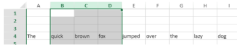

<!-- REF #_method_.VP DELETE COLUMNS.Syntax -->

**VP DELETE COLUMNS** ( *rangeObj* : Object )<!-- END REF -->

<!-- REF #_method_.VP DELETE COLUMNS.Params -->

<div class="no-index">

| Parámetros | Tipo   |    | Descripción  |
| ---------- | ------ | -- | ------------ |
| rangeObj   | Object | -> | Objeto rango |

</div>
<!-- END REF -->

## Descripción

El comando `VP DELETE COLUMNS` <!-- REF #_method_.VP DELETE COLUMNS.Summary -->elimina las columnas del *rangeObj*<!-- END REF -->.

En *rangeObj*, pase un objeto que contenga un rango de columnas a eliminar. Si el rango pasado contiene:

- de las columnas y de las líneas, sólo se eliminan las columnas.
- únicamente las líneas, el comando no hace nada.

> Las columnas se borran de derecha a izquierda.

## Ejemplo

Para eliminar las columnas seleccionadas por el usuario (en la imagen de abajo las columnas B, C y D):



utilice el siguiente código:

```4d
VP DELETE COLUMNS(VP Get selection("ViewProArea"))
```

## Ver también

[VP DELETE ROWS](vp-delete-rows.md)<br/>
[VP INSERT COLUMNS](vp-insert-columns.md)<br/>
[VP INSERT ROWS](vp-insert-rows.md)

