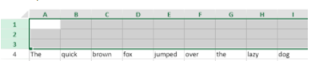

<!-- REF #_method_.VP DELETE ROWS.Syntax -->

**VP DELETE ROWS** ( *rangeObj* : Object )<!-- END REF -->

<!-- REF #_method_.VP DELETE ROWS.Params -->

| Parámetros | Tipo   |    | Descripción  |                  |
| ---------- | ------ | -- | ------------ | ---------------- |
| rangeObj   | Object | -> | Objeto rango | <!-- END REF --> |

#### Descripción

El comando `VP DELETE ROWS` <!-- REF #_method_.VP DELETE ROWS.Summary -->elimina las filas del *rangeObj*<!-- END REF -->.

En *rangeObj*, pase un objeto que contenga un rango de líneas a eliminar. Si el rango pasado contiene:

- tanto las columnas como las líneas, sólo se eliminan las líneas.
- sólo columnas, el comando no hace nada.

> \> Rows are deleted from bottom to top.

#### Ejemplo

Para eliminar las líneas seleccionadas por el usuario (en la imagen de abajo las líneas 1, 2 y 3):



utilice el siguiente código:

```4d

 VP DELETE ROWS(VP Get selection("ViewProArea"))
```

#### Ver también

[VP DELETE ROWS](vp-delete-columns.md)<br/>
[VP INSERT COLUMNS](vp-insert-columns.md)<br/>
[VP INSERT ROWS](vp-insert-rows.md)
