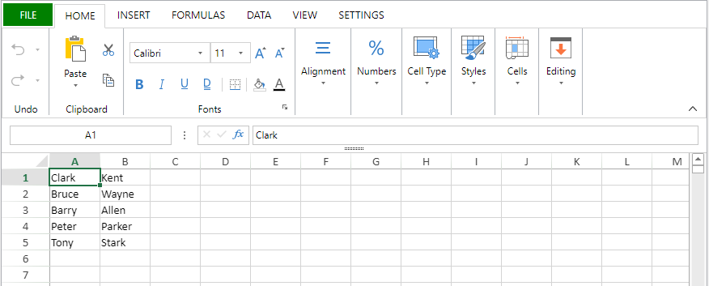

<details><summary>Historia</summary>

| Lanzamiento | Modificaciones                             |
| ----------- | ------------------------------------------ |
| 20 R2       | Soporte de documentos .sjs |

</details>

<!-- REF #_method_.VP EXPORT DOCUMENT.Syntax -->

**VP EXPORT DOCUMENT** ( *vpAreaName* : Text ; *filePath* : Text {; *paramObj* : Object} )<!-- END REF -->

<!-- REF #_method_.VP EXPORT DOCUMENT.Params -->

| Parámetros | Tipo   |    | Descripción                                  |                  |
| ---------- | ------ | -- | -------------------------------------------- | ---------------- |
| vpAreaName | Text   | -> | Nombre de objeto formulario área 4D View Pro |                  |
| filePath   | Text   | -> | Ruta de acceso del documento                 |                  |
| paramObj   | Object | -> | Opciones de exportación                      | <!-- END REF --> |

#### Descripción

El comando `VP EXPORT DOCUMENT` <!-- REF #_method_.VP EXPORT DOCUMENT.Summary -->exporta el objeto de 4D View Pro adjunto al área 4D View Pro *vpAreaName* a un documento en disco según los parámetros *filePath* y *paramObj*<!-- END REF -->.

En *vpAreaName*, pase el nombre del área 4D View Pro. Si pasa un nombre que no existe, se devuelve un error.

En *filePath*, pase la ruta de destino y el nombre del documento a exportar. Si no especifica una ruta, el documento se guardará en el mismo nivel que la carpeta Project.

Puede especificar el formato del archivo exportado incluyendo una extensión después del nombre del documento:

- 4D View Pro (".4vp")
- Microsoft Excel (".xlsx")
- PDF (".pdf")
- CSV (".txt", o ".csv")
- [Documento SpreadJS](https://developer.mescius.com/spreadjs/docs/features/spreadjs-file-format) (".sjs")

Si no se incluye la extensión, pero se especifica el formato en *paramObj*, el archivo exportado tendrá la extensión que corresponda al formato, excepto para el formato CSV (en este caso no se añade ninguna extensión).

El parámetro opcional *paramObj* le permite definir múltiples propiedades para el objeto 4D View Pro exportado y lanzar un método de retrollamada cuando la exportación haya finalizado.

| Propiedad            |                           | Tipo                        | Descripción                                                                                                                                                                                                                                                                                                                                                                                                                                                                                                                                                                                                                                                                                                                                                                                                        |
| -------------------- | ------------------------- | --------------------------- | ------------------------------------------------------------------------------------------------------------------------------------------------------------------------------------------------------------------------------------------------------------------------------------------------------------------------------------------------------------------------------------------------------------------------------------------------------------------------------------------------------------------------------------------------------------------------------------------------------------------------------------------------------------------------------------------------------------------------------------------------------------------------------------------------------------------ |
| format               |                           | text                        | (optional) When present, designates the exported file format: ".4vp" (default), ".csv", ".xlsx", ".pdf", or ".sjs". You can use the following constants:<li>`vk 4D View Pro format`</li><li>`vk csv format`</li><li>`vk MS Excel format`</li><li>`vk pdf format`</li><li>`vk sjs format`</li>4D adds the appropriate extension to the file name if needed. If the format specified doesn't correspond with the extension in *filePath*, it will be added to the end of *filePath*. If a format is not specified and no extension is provided in *filePath*, the default file format is used. |
| contraseña           |                           | text                        | Sólo Microsoft Excel (opcional) - Contraseña utilizada para proteger el documento MS Excel                                                                                                                                                                                                                                                                                                                                                                                                                                                                                                                                                                                                                                                                                                      |
| formula              |                           | 4D.Function | Método de retrollamada que se lanzará cuando la exportación haya finalizado. La utilización de un método de retrollamada es necesaria cuando la exportación es asíncrona (que es el caso de los formatos PDF y Excel) si necesita que se ejecute algún código después de la exportación. The callback method must be passed with the [`Formula`](../../API/FunctionClass.md#formula) command. See [Passing a callback method (formula)](#passing-a-callback-method-formula).                                                                                                                                                                                                                                 |
| valuesOnly           |                           | boolean                     | Especifica que sólo los valores de las fórmulas (si las hay) serán exportados.                                                                                                                                                                                                                                                                                                                                                                                                                                                                                                                                                                                                                                                                                                  |
| includeFormatInfo    |                           | boolean                     | True para incluir información de formato, false en caso contrario (por defecto es True). La información de formato es útil en algunos casos, por ejemplo, para una exportación a SVG. On the other hand, setting this property to **false** allows reducing export time.                                                                                                                                                                                                                                                                                                                                                                                                                                                                        |
| includeBindingSource |                           | boolean                     | Sólo 4DVP y Microsoft Excel. True (por defecto) para exportar los valores del contexto de datos actual como valores de celda en el documento exportado (los contextos de datos en sí no se exportan). False en caso contrario. El enlace de la celda siempre se exporta. For data context and cell binding management, see [VP SET DATA CONTEXT](vp-set-data-context.md) and [VP SET BINDING PATH](vp-set-binding-path.md).                                                                                                                                                                                                                                                                  |
| sheetIndex           |                           | number                      | PDF únicamente (opcional) - Índice de la hoja a exportar (empezando por 0). -2=all visible sheets (**default**), -1=current sheet only                                                                                                                                                                                                                                                                                                                                                                                                                                                                                                                                                                                                    |
| pdfOptions           |                           | object                      | PDF only (optional) - Options for pdf                                                                                                                                                                                                                                                                                                                                                                                                                                                                                                                                                                                                                                                                                                                                                           |
|                      | creator                   | text                        | nombre de la aplicación que creó el documento original a partir del cual se convirtió.                                                                                                                                                                                                                                                                                                                                                                                                                                                                                                                                                                                                                                                                                                             |
|                      | title                     | text                        | título del documento.                                                                                                                                                                                                                                                                                                                                                                                                                                                                                                                                                                                                                                                                                                                                                                              |
|                      | author                    | text                        | nombre de la persona que creó ese documento.                                                                                                                                                                                                                                                                                                                                                                                                                                                                                                                                                                                                                                                                                                                                                       |
|                      | keywords                  | text                        | palabras clave asociadas al documento.                                                                                                                                                                                                                                                                                                                                                                                                                                                                                                                                                                                                                                                                                                                                                             |
|                      | asunto                    | text                        | asunto del documento.                                                                                                                                                                                                                                                                                                                                                                                                                                                                                                                                                                                                                                                                                                                                                                              |
| csvOptions           |                           | object                      | CSV únicamente (opcional) - Opciones para la exportación en csv                                                                                                                                                                                                                                                                                                                                                                                                                                                                                                                                                                                                                                                                                                                                 |
|                      | range                     | object                      | Objeto rango de celdas                                                                                                                                                                                                                                                                                                                                                                                                                                                                                                                                                                                                                                                                                                                                                                                             |
|                      | rowDelimiter              | text                        | Delimitador de línea. Default: <code>"\r\n"</code>                                                                                                                                                                                                                                                                                                                                                                                                                                                                                                                                                                                                                                                                                                                                 |
|                      | columnDelimiter           | text                        | Delimitador de columna. Default: <code>","</code>                                                                                                                                                                                                                                                                                                                                                                                                                                                                                                                                                                                                                                                                                                                                  |
| sjsOptions           |                           | object                      | SJS only (optional) - Options for sjs export                                                                                                                                                                                                                                                                                                                                                                                                                                                                                                                                                                                                                                                                                                                                                    |
|                      | includeAutoMergedCells    | boolean                     | whether to include the automatically merged cells, default is false.                                                                                                                                                                                                                                                                                                                                                                                                                                                                                                                                                                                                                                                                                                                               |
|                      | includeBindingSource      | boolean                     | whether to include the binding source, default is true.                                                                                                                                                                                                                                                                                                                                                                                                                                                                                                                                                                                                                                                                                                                                            |
|                      | includeCalcModelCache     | boolean                     | whether to include the extra data of calculation. Can be faster when open the file with those data, default is false.                                                                                                                                                                                                                                                                                                                                                                                                                                                                                                                                                                                                                                                              |
|                      | includeEmptyRegionCells   | boolean                     | whether to include any empty cells (cells with no data or only style) outside the used data range, default is true.                                                                                                                                                                                                                                                                                                                                                                                                                                                                                                                                                                                                                                                             |
|                      | includeFormulas           | boolean                     | whether to include the formulas, default is true.                                                                                                                                                                                                                                                                                                                                                                                                                                                                                                                                                                                                                                                                                                                                                  |
|                      | includeStyles             | boolean                     | whether to include the style, default is true.                                                                                                                                                                                                                                                                                                                                                                                                                                                                                                                                                                                                                                                                                                                                                     |
|                      | includeUnusedNames        | boolean                     | whether to include the unused custom names, default is true.                                                                                                                                                                                                                                                                                                                                                                                                                                                                                                                                                                                                                                                                                                                                       |
|                      | saveAsView                | boolean                     | whether to apply the format string to exporting values, default is false.                                                                                                                                                                                                                                                                                                                                                                                                                                                                                                                                                                                                                                                                                                                          |
| excelOptions         |                           | object                      | Excel only (optional) - Options for Excel export                                                                                                                                                                                                                                                                                                                                                                                                                                                                                                                                                                                                                                                                                                                                                |
|                      | includeBindingSource      | boolean                     | Whether to include the binding source when exporting, default false.                                                                                                                                                                                                                                                                                                                                                                                                                                                                                                                                                                                                                                                                                                                               |
|                      | includeStyles             | boolean                     | Whether to include the style when exporting, default true.                                                                                                                                                                                                                                                                                                                                                                                                                                                                                                                                                                                                                                                                                                                                         |
|                      | includeFormulas           | boolean                     | Whether to include the formula when exporting, default true.                                                                                                                                                                                                                                                                                                                                                                                                                                                                                                                                                                                                                                                                                                                                       |
|                      | saveAsView                | boolean                     | Whether to apply the format string to exporting value when exporting, default false.                                                                                                                                                                                                                                                                                                                                                                                                                                                                                                                                                                                                                                                                                                               |
|                      | rowHeadersAsFrozenColumns | boolean                     | Whether to treat the row headers as frozen columns when exporting, default false.                                                                                                                                                                                                                                                                                                                                                                                                                                                                                                                                                                                                                                                                                                                  |
|                      | columnHeadersAsFrozenRows | boolean                     | Whether to treat the column headers as frozen rows when exporting, default false.                                                                                                                                                                                                                                                                                                                                                                                                                                                                                                                                                                                                                                                                                                                  |
|                      | includeAutoMergedCells    | boolean                     | Whether to include the automatically merged cells when exporting, default false.                                                                                                                                                                                                                                                                                                                                                                                                                                                                                                                                                                                                                                                                                                                   |
|                      | includeCalcModelCache     | boolean                     | Si desea incluir los datos adicionales de cálculo. Can be faster when open the file with those data, default false.                                                                                                                                                                                                                                                                                                                                                                                                                                                                                                                                                                                                                                                                |
|                      | includeUnusedNames        | boolean                     | Whether to include the unused custom name when exporting, default true.                                                                                                                                                                                                                                                                                                                                                                                                                                                                                                                                                                                                                                                                                                                            |
|                      | includeEmptyRegionCells   | boolean                     | Whether to include any empty cells(cells with no data or only style) outside the used data range, default true.                                                                                                                                                                                                                                                                                                                                                                                                                                                                                                                                                                                                                                                                 |
|                      | contraseña                | text                        | Password to set to open the workbook.                                                                                                                                                                                                                                                                                                                                                                                                                                                                                                                                                                                                                                                                                                                                                              |
| `\<customProperty>` |                           | any                         | Toda propiedad personalizada que estará disponible a través del parámetro $3 en el método de retrollamada.                                                                                                                                                                                                                                                                                                                                                                                                                                                                                                                                                                                                                                                                                         |

**Notas sobre el formato Excel**:

- Al exportar un documento 4D View Pro a un archivo con formato Microsoft Excel, pueden perderse algunos parámetros. Por ejemplo, los métodos y fórmulas 4D no son soportados por Excel. Puede verificar otras configuraciones con [esta lista de SpreadJS](https://developer.mescius.com/spreadjs/docs/excelimpexp/excelexport).
- La exportación en este formato se ejecuta de forma asíncrona, utilice la propiedad `formula` del *paramObj* para el código a ejecutar después de la exportación.
- Using *excelOptions* object is recommended when exporting in ".xlsx" format. Make sure to not mix this object with legacy first level properties (*password*, *includeBindingSource*...) to avoid potiental issues.

**Notas sobre el formato PDF**:

- Al exportar un documento 4D View Pro en PDF, las fuentes utilizadas en el documento se integran automáticamente en el archivo PDF. Sólo se pueden integrar las fuentes OpenType (archivos .OTF o .TTF) que tengan un tabla Unicode. Si no se encuentra un archivo de fuentes válido para una fuente, se utiliza una fuente por defecto.
- La exportación en este formato se ejecuta de forma asíncrona, utilice la propiedad `formula` del *paramObj* para el código a ejecutar después de la exportación.

**Notas sobre el formato CSV**:

- Al exportar un documento 4D View Pro al formato CSV, es posible que se pierdan algunos parámetros, ya que sólo se guardan el texto y los valores.
- Todos los valores se guardan como cadenas entre comillas. Para más información sobre valores separados por delimitadores, ver [este artículo en Wikipedia](https://en.wikipedia.org/wiki/Delimiter-separated_values).
- La exportación en este formato se ejecuta de forma asíncrona, utilice la propiedad `formula` del *paramObj* para el código a ejecutar después de la exportación.

**Notas sobre el formato de archivo SpreadJS**:

- Los [archivos SpreadJS](https://developer.mescius.com/spreadjs/docs/features/spreadjs-file-format) son archivos comprimidos.
- La exportación en este formato se ejecuta de forma asíncrona, utilice la propiedad `formula` del *paramObj* para el código a ejecutar después de la exportación.

Una vez finalizada la operación de exportación, `VP EXPORT DOCUMENT` activa automáticamente la ejecución del método definido en la propiedad *formula* del *paramObj*, si se usa.

#### Pasar un método retrollamada (fórmula)

Cuando se incluye el parámetro opcional *paramObj*, el comando le permite utilizar el comando [`Formula`](../../API/FunctionClass.md#formula) para llamar a un método 4D que se ejecutará una vez finalizada la exportación. El método de retrollamada recibirá los siguientes valores en parámetros locales:

| Parámetros |                               | Tipo    | Descripción                                                       |
| ---------- | ----------------------------- | ------- | ----------------------------------------------------------------- |
| param1     |                               | text    | El nombre del objeto de área 4D View Pro                          |
| param2     |                               | text    | Ruta de acceso del objeto 4D View Pro exportado                   |
| param3     |                               | object  | Una referencia al *paramObj* del comando                          |
| param4     |                               | object  | Un objeto devuelto por el método con un mensaje de estado         |
|            | .success      | boolean | True si exporta con éxito, de lo contrario False. |
|            | .errorCode    | integer | Código de error.                                  |
|            | .errorMessage | text    | Mensaje de error.                                 |

#### Ejemplo 1

Quiere exportar el contenido del área "VPArea" a un documento 4D View Pro en el disco:

```4d
var $docPath: Text

$docPath:="C:\\Bases\\ViewProDocs\\MyExport.4VP"
VP EXPORT DOCUMENT("VPArea";$docPath)
//MyExport.4VP se guarda en su disco
```

#### Ejemplo 2

Quiere exportar la hoja actual en PDF:

```4d
var $params:={}
$params.format:=vk pdf format
$params.sheetIndex:=-1
$params.pdfOptions:=New object("title";"Annual Report";"author";Current user)
VP EXPORT DOCUMENT("VPArea";"report.pdf";$params)
```

#### Ejemplo 3

Desea exportar un documento 4D View Pro en formato ".xlsx" y llamar a un método que inicie Microsoft Excel con el documento abierto una vez completada la exportación:

```4d
 var $params:={}
 $params.formula:=Formula(AfterExport)
 $excelOptions:={includeStyles:false;includeFormulas:true}
 $params.excelOptions:=$excelOptions
 VP EXPORT DOCUMENT("ViewProArea";"c:\\tmp\\convertedfile.xlsx";$params)
```

Método ***AfterExport***:

```4d
 #DECLARE($areaName : Text ; $filePath : Text ; $params : Object ; $status : Object )

 If($status.success=False)
    ALERT($status.errorMessage)
 Else
    LAUNCH EXTERNAL PROCESS("C:\\Program Files\\Microsoft Office\\Office15\\excel "+$filePath)
 End if
```

#### Ejemplo 4

Quiere exportar la hoja actual a un archivo `.txt` con valores separados por "|":



```4d
var $params:={}
$params.range:=VP Cells("ViewProArea";0;0;2;5)
$params.rowDelimiter:="\n"
$params.columnDelimiter:="|"
VP EXPORT DOCUMENT("ViewProArea";"c:\\tmp\\data.txt";New object("format";vk csv format;"csvOptions";$params))
```

Aquí está el resultado:


#### Ver también

[VP Convert to picture](vp-convert-to-picture.md)<br/>
[VP Export to object](vp-export-to-object.md)<br/>
[VP IMPORT DOCUMENT](vp-import-document.md)<br/>
[VP Print](vp-print.md)<br/>
[4D View Pro: Excel import/export update (blog post)](https://blog.4d.com/4d-view-pro-excel-import-export-update)
