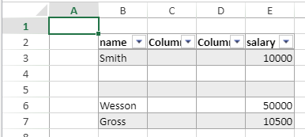

<details><summary>Historia</summary>

| Versión | Modificaciones |
| ------- | -------------- |
| v19 R7  | Añadidos       |

</details>

<!-- REF #_method_.VP INSERT TABLE ROWS.Syntax -->

**VP INSERT TABLE ROWS** ( _vpAreaName_ : Text ; _tableName_ : Text ; _row_ : Integer {; _count_ : Integer {; _insertAfter_ : Integer {; _sheet_ : Integer }}} )<!-- END REF -->

<!-- REF #_method_.VP INSERT TABLE ROWS.Params -->

| Parámetros  | Tipo    |    | Descripción                                                    |                  |
| ----------- | ------- | -- | -------------------------------------------------------------- | ---------------- |
| vpAreaName  | Text    | -> | Nombre de objeto formulario área 4D View Pro                   |                  |
| tableName   | Text    | -> | Nombre de la tabla                                             |                  |
| row         | Integer | -> | Índice en la tabla de la línea inicial a insertar              |                  |
| count       | Text    | -> | Número de líneas a añadir (debe ser >0)     |                  |
| insertAfter | Integer | -> | `vk table insert before` or `vk table insert after` _row_      |                  |
| sheet       | Integer | -> | Índice de la hoja (hoja actual si se omite) | <!-- END REF --> |

#### Descripción

The `VP INSERT TABLE ROWS` command <!-- REF #_method_.VP INSERT TABLE ROWS.Summary -->inserts one or _count_ empty row(s) in the specified _tableName_ at the specified _row_ index<!-- END REF -->.

In the _insertAfter_ parameter, you can pass one of the following constants to indicate if the row(s) must be inserted before or after the _row_ index:

| Constante                | Valor | Descripción                                                                               |
| ------------------------ | ----- | ----------------------------------------------------------------------------------------- |
| `vk table insert before` | 0     | Insert row(s) before the _row_ (default if omitted) |
| `vk table insert after`  | 1     | Insertar línea(s) después de la _línea_                                |

This command inserts some rows in the _tableName_ table, NOT in the sheet. El número total de líneas de la hoja no se ve afectado por el comando. Los datos presentes debajo de la tabla (si los hay) se desplazan automáticamente hacia abajo según el número de líneas añadidas.

If the _tableName_ table is bound to a [data context](vp-set-data-context.md), the command inserts new, empty element(s) in the collection.

If _tableName_ does not exist or if there is not enough space in the sheet, nothing happens.

#### Ejemplo

Usted crea una tabla con un contexto de datos:

```4d
var $context : Object
$context:=New object()

$context.col:=New collection
$context.col.push(New object("name"; "Smith"; "salary"; 10000))
$context.col.push(New object("name"; "Wesson"; "salary"; 50000))
$context.col.push(New object("name"; "Gross"; "salary"; 10500))

VP SET DATA CONTEXT("ViewProArea"; $context)

VP CREATE TABLE(VP Cells("ViewProArea"; 1; 1; 3; 3); "PeopleTable"; "col")
```


Si quiere insertar dos líneas y dos columnas en la tabla, puede escribir:

```4d
VP INSERT TABLE ROWS("ViewProArea"; "PeopleTable"; 1; 2)
VP INSERT TABLE COLUMNS("ViewProArea"; "PeopleTable"; 1; 2)
```



#### Ver también

[VP INSERT TABLE COLUMNS](vp-insert-table-columns.md)<br/>
[VP REMOVE TABLE ROWS](vp-remove-table-rows.md)
