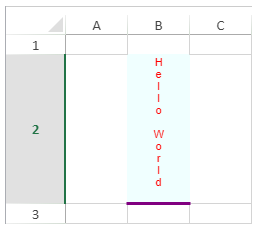

<!-- REF #_method_.VP SET CELL STYLE.Syntax -->

**VP SET CELL STYLE** ( _rangeObj_ : Object  ; _styleObj_  : Object) <!-- END REF -->

<!-- REF #_method_.VP SET CELL STYLE.Params -->

| Parámetros | Tipo   |    | Descripción  |                  |
| ---------- | ------ | -- | ------------ | ---------------- |
| rangeObj   | Object | -> | Objeto rango |                  |
| styleObj   | Object | -> | Objeto style | <!-- END REF --> |

#### Descripción

El comando `VP SET CELL STYLE` <!-- REF #_method_.VP SET CELL STYLE.Summary -->aplica el estilo o estilos definidos en el _styleObj_ a las celdas definidas en el _rangeObj_<!-- END REF -->.

En _rangeObj_, pase un rango de celdas donde se aplicará el estilo. Si _rangeObj_ contiene múltiples celdas, el estilo se aplica a cada celda.

> Borders applied with `VP SET CELL STYLE` will be applied to each cell of the _rangeObj_, as opposed to the [VP SET BORDER](vp-set-border.md) command which applies borders to the _rangeObj_ as a whole.

El parámetro _styleObj_ permite pasar un objeto que contiene propiedades de estilo. Puede utilizar una hoja de estilo existente o crear una nueva. Si _styleObj_ contiene a la vez una hoja de estilo existente y propiedades de estilo adicionales, se aplica primero la hoja de estilo existente, seguida de las propiedades adicionales.

Para eliminar un estilo y volver a la configuración de estilo por defecto (si la hay), pase un valor NULL:

- dar al parámetro _styleObj_ un valor NULL eliminará toda configuración de estilo del _rangeObj_,
- si se le da a un atributo un valor NULL, se eliminará este atributo específico de _rangeObj_.

For more information about style objects and style sheets, see the [Style Objects](../configuring.md#style-objects) paragraph.

#### Ejemplo

```4d
$style:=New object
$style.font:="8pt Arial"
$style.backColor:="Azure"
$style.foreColor:="red"
$style.hAlign:=1
$style.isVerticalText:=True
$style.borderBottom:=New object("color";"#800080";"style";vk line style thick)
$style.backgroundImage:=Null //eliminar un atributo específico
 
VP SET CELL STYLE(VP Cell("ViewProArea";1;1);$style)
```



#### Ver también

[VP ADD STYLESHEET](vp-add-stylesheet.md)<br/>
[VP Font to object](vp-font-to-object.md)<br/>
[VP Get cell style](vp-get-cell-style.md)<br/>
[VP Object to font](vp-object-to-font.md)<br/>
[VP SET BORDER](vp-set-border.md)<br/>
[VP SET DEFAULT STYLE](vp-set-default-style.md)
