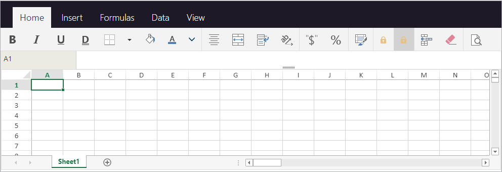

The 4D View Pro area properties can be configured using the Property list. Las propiedades de las hojas de cálculo están disponibles a través del lenguaje.

## Propiedades del área de formulario

Using the area's property list, you can set [4D View Pro object properties](FormObjects/viewProArea_overview.md#supported-properties) such as **Object Name**, [**Variable or Expression**](#4d-view-pro-form-object-variable), **Appearance**, **Action**, and **Events**.


### Selección de una interfaz usuario

You can select the interface to use with your 4D View Pro form areas in the **Property List**, under **Appearance**:


> You can also use the [`userInterface`](FormObjects/properties_Appearance.md#user-interface) and [`withFormulaBar`](FormObjects/properties_Appearance.md#show-formula-bar)(only with the "toolbar" interface) JSON properties.

Las interfaces permiten realizar modificaciones básicas y manipular los datos. User-defined modifications are saved in the 4D View Pro object when the user saves the document.

#### Cinta


#### Toolbar (Barra de herramientas)

Enabling the Toolbar interface displays the [**Show Formula Bar**](FormObjects/properties_Appearance.md#show-formula-bar) option. Cuando se selecciona, la barra de fórmulas es visible debajo de la interfaz Barra de herramientas.

Con barra de fórmula visible:



#### Funcionalidades

Both the Ribbon and the Toolbar interfaces group related features into tabs:

| Pestaña  | Acciones                        | Interfaz Cinta | Interfaz Barra de herramientas |
| -------- | ------------------------------- |:--------------:|:------------------------------:|
| File     | Gestión de archivos             |       X        |                                |
| Inicio   | Apariencia del texto            |       X        |               X                |
| Insertar | Añadir elementos                |       X        |               X                |
| Fórmulas | Cálculos de fórmulas y librería |       X        |               X                |
| Datos    | Gestión de los datos            |       X        |               X                |
| Mostrar  | Presentación visual             |       X        |               X                |
| Settings | Presentación de la hoja         |       X        |                                |

## Eventos formulario

The following form events are available in the Property List for 4D View Pro areas.

Some of the events are standard form events (available to all active objects) and some are specific 4D View Pro form events. Some standard form events provide extended information in the object returned by the [`FORM Event`](https://doc.4d.com/4dv19/help/command/en/page1606.html) command when they are generated for 4D View Pro areas. The following table shows which events are standard and which are specific or provide additional information to 4D View Pro areas:

| Evento 4D estándar                              | Eventos 4D View Pro específicos y extendidos          |
| ----------------------------------------------- | ----------------------------------------------------- |
| [On Load](../Events/onLoad.md)                  | [On VP Ready](../Events/onVpReady.md)                 |
| [On Getting Focus](../Events/onGettingFocus.md) | [On Clicked](../Events/onClicked.md)                  |
| [On Losing Focus](../Events/onLosingFocus.md)   | [On Double Clicked](../Events/onDoubleClicked.md)     |
| [On Unload](../Events/onUnload.md)              | [On Header Click](../Events/onHeaderClick.md)         |
|                                                 | [On After Edit](../Events/onAfterEdit.md)             |
|                                                 | [On Selection Change](../Events/onSelectionChange.md) |
|                                                 | [On Column Resize](../Events/onColumnResize.md)       |
|                                                 | [On Row Resize](../Events/onRowResize.md)             |
|                                                 | [On VP Range Changed](../Events/onVpRangeChanged.md)  |

## Opciones hoja

The 4D View Pro sheet options object allows you to control various options of your 4D View Pro areas. Este objeto es manejado por los siguientes comandos:

* [VP SET SHEET OPTIONS](method-list.md#vp-set-sheet-options)
* [VP Get sheet options](method-list.md#vp-get-sheet-options)

### Apariencia de la hoja

| Propiedad            |                        | Type         | Descripción                                                                                                                                                                                                                                                                                                  |
| -------------------- | ---------------------- | ------------ | ------------------------------------------------------------------------------------------------------------------------------------------------------------------------------------------------------------------------------------------------------------------------------------------------------------ |
| allowCellOverflow    |                        | boolean      | Especifica si los datos pueden desbordarse hacia las celdas vacías adyacentes.                                                                                                                                                                                                                               |
| sheetTabColor        |                        | string       | A color string used to represent the sheet tab color, such as "red", "#FFFF00", "rgb(255,0,0)", "Accent 5", and so on.                                                                                                                                                                                       |
| frozenlineColor      |                        | string       | A color string used to represent the frozen line color, such as "red", "#FFFF00", "rgb(255,0,0)", "Accent 5", and so on.                                                                                                                                                                                     |
| clipBoardOptions     |                        | entero largo | La opción portapapeles. Valores disponibles: `vk clipboard paste options all`, `vk clipboard paste options formatting`, `vk clipboard paste options formulas`, `vk clipboard paste options formulas and formatting`, `vk clipboard paste options values`, `vk clipboard paste options values and formatting` |
| rejilla              |                        | object       | Las opciones de la línea de rejilla.                                                                                                                                                                                                                                                                         |
|                      | color                  | string       | A color string used to represent the grid line color, such as "red", "#FFFF00", "rgb(255,0,0)", "Accent 5", and so on.                                                                                                                                                                                       |
|                      | showVerticalGridline   | boolean      | Especifica si se debe mostrar la línea de la cuadrícula vertical.                                                                                                                                                                                                                                            |
|                      | showHorizontalGridline | boolean      | Especifica si mostrar o no la línea de rejilla horizontal.                                                                                                                                                                                                                                                   |
| rowHeaderVisible     |                        | boolean      | Especifica si el encabezado de la línea es visible.                                                                                                                                                                                                                                                          |
| colHeaderVisible     |                        | boolean      | Especifica si el encabezado de la columna es visible.                                                                                                                                                                                                                                                        |
| rowHeaderAutoText    |                        | entero largo | Especifica si el encabezado de la linea muestra letras o números o está en blanco. Valores disponibles: `vk header auto text blank`, `vk header auto text letters`, `vk header auto text numbers`                                                                                                            |
| colHeaderAutoText    |                        | entero largo | Specifies whether the column header displays letters or numbers or is blank. Valores disponibles: `vk header auto text blank`, `vk header auto text letters`, `vk header auto text numbers`                                                                                                                  |
| selectionBackColor   |                        | string       | El color de fondo de la selección para la hoja. (formato RGBA preferido)                                                                                                                                                                                                                                     |
| selectionBorderColor |                        | string       | El color del borde de la selección para la hoja.                                                                                                                                                                                                                                                             |
| sheetAreaOffset      |                        | object       | Las opciones de sheetAreaOffset.                                                                                                                                                                                                                                                                             |
|                      | left                   | entero largo | El desplazamiento a la izquierda de la hoja desde la local.                                                                                                                                                                                                                                                  |
|                      | top                    | entero largo | El desplazamiento superior de la hoja desde el local.                                                                                                                                                                                                                                                        |
> Todas las propiedades son opcionales.

### Protección de la hoja

To lock the whole sheet, you only need to set the *isProtected* property to **true**. You can then unlock cells individually by setting the [locked](#layout) cell style property.

| Propiedad         |                          | Type    | Descripción                                                                                                                         |
| ----------------- | ------------------------ | ------- | ----------------------------------------------------------------------------------------------------------------------------------- |
| isProtected       |                          | boolean | Specifies whether cells on this sheet that are marked as protected cannot be edited.                                                |
| protectionOptions |                          | object  | A value that indicates the elements that you want users to be able to change. Si null : el parámetro protectionOptions se reinicia. |
|                   | allowSelectLockedCells   | boolean | Especifica si el usuario puede seleccionar celdas bloqueadas, opcional. True por defecto.                                           |
|                   | allowSelectUnlockedCells | boolean | Indica si el usuario puede seleccionar las celdas no bloqueadas, opcional. True por defecto.                                        |
|                   | allowSort                | boolean | Especifica si el usuario puede ordenar rangos, opcional. Falso por defecto.                                                         |
|                   | allowFilter              | boolean | Especifica si el usuario puede filtrar rangos, opcional. Falso por defecto.                                                         |
|                   | allowEditObjects         | boolean | Indica si el usuario puede editar los objetos flotantes, opcional. Falso por defecto.                                               |
|                   | allowResizeRows          | boolean | Indica si el usuario puede redimensionar las líneas, opcional. Falso por defecto.                                                   |
|                   | allowResizeColumns       | boolean | Indica si el usuario puede redimensionar las columnas, opcional. Falso por defecto.                                                 |
|                   | allowDragInsertRows      | boolean | Specifies whether the user can perform the drag operation to insert rows, optional. Falso por defecto.                              |
|                   | allowDragInsertColumns   | boolean | Specifies whether the user can perform the drag operation to insert columns, optional. Falso por defecto.                           |
|                   | allowInsertRows          | boolean | Indica si el usuario puede insertar las líneas, opcional. Falso por defecto.                                                        |
|                   | allowInsertColumns       | boolean | Indica si el usuario puede insertar las columnas, opcional. Falso por defecto.                                                      |
|                   | allowDeleteRows          | boolean | Indica si el usuario puede eliminar las líneas, opcional. Falso por defecto.                                                        |
|                   | allowDeleteColumns       | boolean | Indica si el usuario puede eliminar las columnas, opcional. Falso por defecto.                                                      |
> Todas las propiedades son opcionales.

## Formato de las celdas

Defining a format pattern ensures that the content of your 4D View Pro documents is displayed the way you intended. Formats can be set using the selected 4D View Pro [interface](#selecting-a-user-interface), or using the [VP SET VALUE](method-list.md#vp-set-value) or [VP SET NUM VALUE](method-list.md#vp-set-num-value) methods.

4D View Pro has built-in formats for numbers, dates, times, and text, but you can also create your own patterns to format the contents of cells using special characters and codes.

For example, when using the [VP SET VALUE](method-list.md#vp-set-value) or [VP SET NUM VALUE](method-list.md#vp-set-num-value) methods to enter amounts in an invoice, you may want the currency symbols ($, €, ¥, etc.) to be aligned regardless of the space required by the number (i.e., whether the amount is $5.00 or $5,000.00). You could use formatting characters and spectify the pattern _($* #,##0.00_) which would display amounts as shown:


Note that when creating your own format patterns, only the display of the data is modified. El valor de los datos permanece sin cambios.

### Formatos numérico y texto

Number formats apply to all number types (e.g., positive, negative, and zeros).

| Caracter  | Descripción                                                                                                                                                                                                                                      | Ejemplo                                                                                                                    |
| --------- | ------------------------------------------------------------------------------------------------------------------------------------------------------------------------------------------------------------------------------------------------ | -------------------------------------------------------------------------------------------------------------------------- |
| 0         | Marcador de posición que muestra ceros.                                                                                                                                                                                                          | #.00 mostrará 1.1 como 1.10                                                                                                |
| .         | Muestra un punto decimal                                                                                                                                                                                                                         | 0.00 mostrará 1999 como 1999.00                                                                                            |
| ,         | Muestra el separador de miles en un número. Thousands are separated by commas if the format contains a comma enclosed by number signs "#" or by zeros. Una coma a continuación de un marcador de posición de dígitos escala el número por 1.000. | #,0 mostrará 12200000 como 12,200,000                                                                                      |
| \_      | Salta el ancho del siguiente caracter.                                                                                                                                                                                                           | Usually used in combination with parentheses to add left and right indents, \_( and _) respectively.                     |
| @         | Formatter for text. Aplica el formato a todo el texto de la celda                                                                                                                                                                                | "\[Red]@" aplica el color de fuente rojo para los valores de texto.                                                       |
| *         | Repite el siguiente caracter para llenar el ancho de la columna.                                                                                                                                                                                 | 0*- will include enough dashes after a number to fill the cell, whereas *0 before any format will include leading zeros. |
| " "       | Muestra el texto entre comillas sin interpretarlo.                                                                                                                                                                                               | "8%" será mostrado como: 8%                                                                                                |
| %         | Muestra los números como un porcentaje de 100.                                                                                                                                                                                                   | El 8% se mostrará como 0,08                                                                                                |
| \#      | Marcador de posición de dígitos que no muestra ceros adicionales. If a number has more digits to the right of the decimal than there are placeholders, the number is rounded up.                                                                 | #.# mostrará 1.54 como 1.5                                                                                                 |
| ?         | Digit placeholder that leaves space for extra zeros, but does not display them. Normalmente se utiliza para alinear números por punto decimal.                                                                                                   | $?? $?? displays a maximum of 2 decimals and causes dollar signs to line up for varying amounts.                           |
| \        | Muestra el caracter que lo sigue.                                                                                                                                                                                                                | #.00\? #.00\? will display 123 as 123.00?                                                                                |
| /         | Cuando se utiliza con números, los muestra como fracciones. Cuando se utiliza con códigos de texto, fecha u hora, se muestra "tal cual".                                                                                                         | #/# mostrará .75 como 3/4                                                                                                  |
| \[ ]     | Crea formatos condicionales.                                                                                                                                                                                                                     | \[>100]\[GREEN]#,##0;\[`<=-100`]\[YELLOW]#,##0;\[BLUE]#,##0                                                        |
| E         | Formato notación científica.                                                                                                                                                                                                                     | #E+# - mostrará 2E+6 en lugar de 1,500,500                                                                                 |
| \[color] | Formatea el texto o el número en el color especificado                                                                                                                                                                                           | \[Green]###.##\[Red]-###.###                                                                                             |

#### Ejemplo

```4d
//Set the cell value as $125,571.35
VP SET VALUE(VP Cell("ViewProArea";3;2);New object("value";125571.35;"format";"_($* #,##0.00_)")
```

### Formatos fecha y hora

4D View Pro provides the following constants for ISO 8601 date and time patterns:

| Constante                                 | Value                                | Comentario                                                                                                                                                             |
| ----------------------------------------- | ------------------------------------ | ---------------------------------------------------------------------------------------------------------------------------------------------------------------------- |
| `vk pattern full date time`               | "*fullDateTimePattern*"              | ISO 8601 format for the full date and time in current localization. USA default pattern: "dddd, dd MMMM yyyy HH:mm:ss"                                                 |
| `vk pattern long date`                    | "*longDatePattern*"                  | ISO 8601 format for the full date in current localization. USA default pattern: "dddd, dd MMMM yyyy"                                                                   |
| `vk pattern long time`                    | "*longTimePattern*"                  | ISO 8601 format for the time in current localization. USA default pattern: "HH:mm:ss"                                                                                  |
| `vk pattern month day`                    | "*monthDayPattern*"                  | ISO 8601 format for the month and day in current localization. USA default pattern: "MMMM dd"                                                                          |
| `vk pattern short date`                   | "*shortDatePattern*"                 | Abbreviated ISO 8601 format for the date in current localization. USA default pattern: "MM/dd/yyyy"                                                                    |
| `vk pattern short time`                   | "*shortTimePattern*"                 | Abbreviated ISO 8601 format for the time in current localization. USA default pattern: "HH:mm"                                                                         |
| `vk pattern sortable date time`           | "*sortableDateTimePattern*"          | ISO 8601 format for the date and time in current localization which can be sorted. USA default pattern: "yyyy\'-\'MM\'-\'dd\'T\'HH\':\'mm\':\'ss"            |
| `vk pattern universal sortable date time` | "*universalSortableDateTimePattern*" | ISO 8601 format for the date and time in current localization using UTC which can be sorted. USA default pattern: "yyyy\'-\'MM\'-\'dd HH\':\'mm\':\'ss\'Z\'" |
| `vk pattern year month`                   | "*yearMonthPattern*"                 | ISO 8601 format for the month and year in current localization. USA default pattern: "yyyy MMMM"                                                                       |

#### Ejemplo

```4d
//Definir el valor de la celda como fecha y hora específicas
VP SET VALUE(VP Cell("ViewProArea";3;9);New object("value";!2024-12-18!);"time";?14:30:10?;"format";vk pattern full date time))
```

### Formato fecha y hora personalizados

To create your own date and time patterns, in your current localization, you can use combinations of the following codes:

|       | Code<br/>(no distingue entre mayúsculas y minúsculas) | Descripción                                                     | Ejemplo               |
| ----- | ----------------------------------------------------------- | --------------------------------------------------------------- | --------------------- |
| Fecha |                                                             |                                                                 | (January 1, 2019)     |
|       | m                                                           | Número de mes sin cero inicial                                  | 1                     |
|       | mm                                                          | Número de mes con cero precedente                               | 01                    |
|       | mmm                                                         | Nombre del mes, corto                                           | Jan                   |
|       | mmmm                                                        | Nombre del mes, long                                            | January               |
|       | d                                                           | Número del día sin el cero inicial                              | 1                     |
|       | dd                                                          | Número de días con cero precedente                              | 01                    |
|       | ddd                                                         | Día de la semana, corto                                         | Tue                   |
|       | dddd                                                        | Día de la semana, largo                                         | Tuesday               |
|       | yy                                                          | Año, formato corto                                              | 19                    |
|       | yyyy                                                        | Año, formato largo                                              | 2019                  |
| Hora  |                                                             |                                                                 | (2:03:05 PM)          |
|       | h                                                           | Hora sin cero precedente. 0-23                                  | 2                     |
|       | hh                                                          | Hora con cero precedente. 00-23                                 | 02                    |
|       | m                                                           | Minutos sin cero inicial. 0-59                                  | 3                     |
|       | mm                                                          | Minutos con cero precedente. 00-59                              | 03                    |
|       | s                                                           | Segundos sin cero a la izquierda. 0-59                          | 5                     |
|       | ss                                                          | Segundo con cero precedente. 00-59                              | 05                    |
|       | \[h]                                                       | Tiempo transcurrido en horas                                    | 14 (puede superar 24) |
|       | \[mm]                                                      | Tiempo transcurrido en minutos                                  | 843                   |
|       | \[ss]                                                      | Tiempo transcurrido en segundos                                 | 50585                 |
|       | AM/PM                                                       | Periodos del día. Se utiliza el fomato de 24 horas si se omite. | PM                    |
> The code 'm' is interpreted depending on its position in the pattern. If it's immediately after 'h' or 'hh' or immediately before 's' or 'ss', it will be interpreted as minutes, otherwise it will be interpreted as months.

### Símbolos adicionales

In addition to the special characters and codes described in the previous sections, there are additional characters and symbols that can be used in your format patterns. These additional characters and symbols do not require a \ or "" and do not impact the interpretation of the format pattern. Aparecen "tal cual" dentro del patrón.

| Caracter    | Descripción                                                                                 | Ejemplo              |
| ----------- | ------------------------------------------------------------------------------------------- | -------------------- |
| + y -       | Signos más y menos                                                                          | ### + ### = ###,### |
| ( )         | Paréntesis izquierdo y derecho                                                              | (-###.##)            |
| :           | Dos puntos                                                                                  | hh:mm:ss             |
| ^           | Caret                                                                                       | #\^#                |
| '           | Apostrofe                                                                                   | '######              |
| { }         | Paréntesis curvos                                                                           | {###,###,###}        |
| `< >` | Signos menor que y mayor que                                                                | ## >##              |
| =           | Signo igual                                                                                 | #+#=##               |
| /           | Barra inclinada hacia adelante. Cuando se utiliza con números, los muestra como fracciones. | mm/dd/yyyy           |
| !           | Signo de exclamación                                                                        | $###.00!             |
| &           | Ampersand                                                                                   | "Hello" & "Welcome"  |
| ~           | Tilde                                                                                       | ~##                  |
|             | Caracter de espacio                                                                         |                      |
| €           | Euro                                                                                        | €###.00              |
| £           | Libra esterlina                                                                             | £###.00              |
| ¥           | Yen japonés                                                                                 | ¥###.00              |
| $           | Signo dólar                                                                                 | $###.00              |
| ¢           | Signo de centavo                                                                            | .00¢                 |

## Atributos de impresión

4D View Pro print attributes allow you to control all aspects of printing 4D View Pro areas. Estos atributos son manejados por los siguientes comandos:

* [VP SET PRINT INFO](method-list.md#vp-set-print-info)
* [VP Get print info](method-list.md#vp-get-print-info)

### Columnas / Líneas

Column and row attributes are used to specify the beginning, end, and repetition of columns and rows.

| Propiedad         | Type         | Descripción                                                                                                                      |
| ----------------- | ------------ | -------------------------------------------------------------------------------------------------------------------------------- |
| columnEnd         | entero largo | The last row to print in a cell range. Default value = -1 (all rows)                                                             |
| columnStart       | entero largo | The first row to print in a cell range. Default value = -1 (all rows)                                                            |
| repeatColumnEnd   | entero largo | La última columna de un rango de columnas a imprimir a la izquierda de cada página. Default value = -1 (all rows)                |
| repeatColumnStart | entero largo | La primera columna de un rango de columnas a imprimir a la izquierda de cada página. Default value = -1 (all rows)               |
| repeatRowEnd      | entero largo | La última línea de un rango de líneas a imprimir en la parte superior de cada página. Valor por defecto = -1 (todas las líneas)  |
| repeatRowStart    | entero largo | La primera línea de un rango de líneas a imprimir en la parte superior de cada página. Valor por defecto = -1 (todas las líneas) |
| rowEnd            | entero largo | The last column to print in a cell range. Valor por defecto = -1 (todas las líneas)                                              |
| rowStart          | entero largo | The first column to print in a cell range. Valor por defecto = -1 (todas las líneas)                                             |

### Encabezados / Pies de página

Header and footer attributes are used to specify text or images in the left, right, and center header/footer sections.

| Propiedad         | Type                 | Descripción                                                                |
| ----------------- | -------------------- | -------------------------------------------------------------------------- |
| footerCenter      | text                 | El texto y el formato del pie de página central en las páginas impresas.   |
| footerCenterImage | picture &#124; text* | La imagen para la sección central del pie de página.                       |
| footerLeft        | text                 | El texto y el formato del pie de página izquierdo en las páginas impresas. |
| footerLeftImage   | picture &#124; text* | La imagen de la parte izquierda del pie de página.                         |
| footerRight       | text                 | The text and format of the right footer on printed pages.                  |
| footerRightImage  | picture &#124; text* | La imagen de la parte derecha del pie de página.                           |
| headerCenter      | text                 | El texto y el formato del encabezado central en las páginas impresas.      |
| headerCenterImage | picture &#124; text* | La imagen para la sección central del encabezado.                          |
| headerLeft        | text                 | El texto y el formato del encabezado izquierdo en las páginas impresas.    |
| headerLeftImage   | picture &#124; text* | La imagen de la sección izquierda del encabezado.                          |
| headerRight       | text                 | The text and format of the right header on printed pages.                  |
| headerRightImage  | picture &#124; text* | La imagen de la sección derecha del encabezado.                            |

\* If using text type, pass the filepath (absolute or relative) of the image. If you pass a relative path, the file should be located next to the database structure file. En Windows, la extensión del archivo debe ser indicada. No matter the type used to set an image, the image itself (not a reference) is stored in the 4D View Pro area and is returned by [VP Get print info](method-list.md#vp-get-print-info).

### Caracteres especiales

The following special characters allow the automatic addition or formatting of information in the header and footer when the 4D View Pro area is printed.

| Caracter | Descripción                       | Ejemplo                                                                | Result                                               |
| -------- | --------------------------------- | ---------------------------------------------------------------------- | ---------------------------------------------------- |
| &        | Escape character                  | (ver ejemplos más abajo)                                               |                                                      |
| P        | Página actual                     | printInfo.headerLeft:="Esta es la página &P."                          | Esta es la página 5.|                                |
| N        | Conteo de páginas                 | printInfo.headerLeft:="Hay &N páginas."                                | Hay 10 páginas.                                      |
| D        | Fecha actual (formato yyyy/mm/dd) | printInfo.headerLeft:="Es &D."                                         | Es 2015/6/19.                                        |
| T        | Hora actual                       | printInfo.headerLeft:="Es &T."                                         | Es 16:30:36.                                         |
| G        | Imagen                            | printInfo.headerLeftImage:=smiley<br/>printInfo.headerLeft:="&G" |  |
| S        | Strikethrough                     | printInfo.headerLeft:="&SEsto es texto."                               | ~~Esto es texto.~~                                   |
| U        | Subrayado                         | printInfo.headerLeft:="&UEsto es texto."                               | Esto es texto. (Underlined)                          |
| B        | Negrita                           | printInfo.headerLeft:="&BEsto es texto."                               | **Esto es texto.**                                   |
| I        | Itálica                           | printInfo.headerLeft:="&IEsto es texto."                               | *Esto es texto.*                                     |
| "        | Prefijo fuente                    | printInfo.headerLeft:="&\"Lucida Console\"&14This is text."          |  |
| K        | Prefijo de color de texto         | printInfo.headerLeft:="&KFF0000Esto es texto."                         | This is text (in red).                               |
| F        | Nombre del libro                  | printInfo.headerLeft:="&F"                                             | 2019 Monthly Revenue Forecasts                       |
| A        | Nombre de la hoja de cálculo      | printInfo.headerLeft:="&A"                                             | June 2019 revenue forecast                           |

### Márgenes

Margin attributes are used to specify the 4D View Pro area margins for printing. Expresado en centésimas de pulgada.

| Propiedad |        | Type         | Descripción                                                     |
| --------- | ------ | ------------ | --------------------------------------------------------------- |
| margin    |        | object       | Los márgenes de impresión                                       |
|           | top    | entero largo | Margen superior, en centésimas de pulgada. Por defecto = 75     |
|           | bottom | entero largo | El margen inferior, en centésimas del pulgada. Por defecto = 75 |
|           | left   | entero largo | Margen derecho, en centésimas de pulgada. Por defecto = 70      |
|           | right  | entero largo | Margen izquierdo, en centésimas de pulgada. Por defecto = 70    |
|           | header | entero largo | Header offset, in hundredths of an inch. Por defecto = 30       |
|           | footer | entero largo | Footer offset, in hundredths of an inch. Por defecto = 30       |

### Orientación

Orientation attributes are used to specify the direction the printed page layout.
> Este atributo define sólo la información de renderizado.

| Propiedad   | Type         | Descripción                                                                                                                              |
| ----------- | ------------ | ---------------------------------------------------------------------------------------------------------------------------------------- |
| orientation | entero largo | Orientación de la página. Valores disponibles: `vk print page orientation landscape`, `vk print page orientation portrait` (por defecto) |

### Página

Los atributos página se utilizan para especificar la configuración general de impresión del documento.

| Propiedad       | Type         | Descripción                                                                                                                                                                                                  |
| --------------- | ------------ | ------------------------------------------------------------------------------------------------------------------------------------------------------------------------------------------------------------ |
| blackAndWhite   | boolean      | Impresión sólo en blanco y negro. <p>Valor por defecto: false</p><p>**Nota**: los PDFs no se ven afectados por este atributo. Los colores en PDFs permanecen.</p>                                                                                                                          |
| centering       | entero largo | Como se centran los contenidos en la página impresa. Valores disponibles: `vk print centering both`, `vk print centering horizontal`, `vk print centering none` (por defecto), `vk print centering vertical` |
| firstPageNumber | entero largo | The page number to print on the first page.Default value = 1                                                                                                                                                 |
| pageOrder       | entero largo | Las páginas del pedido se imprimen. Valores disponibles: `vk print page order auto` (por defecto), `vk print page order down then over`, `vk print page order over then down`.                               |
| pageRange       | text         | El rango de páginas a imprimir                                                                                                                                                                               |
| qualityFactor   | entero largo | El factor de calidad para la impresión (1 - 8).  The higher the quality factor, the better the printing quality, however printing performance may be affected.<p>Por defecto = 2</p>                      |
| useMax          | boolean      | Sólo se imprimen columnas y líneas con datos.<p>Valor por defecto: true</p>                                                                                                                                       |
| zoomFactor      | real         | La cantidad para ampliar o reducir la página impresa.<p>Por defecto = 1</p>                                                                                                                               |

### Tamaño del papel

Paper size attributes are used to specify the dimensions or model of paper to use for printing. Hay dos maneras de definir el tamaño del papel:

* Tamaño personalizado - atributos de alto y ancho
* Tamaño estándar - atributo kind

| Propiedad |        | Type         | Descripción                                                                                                         |
| --------- | ------ | ------------ | ------------------------------------------------------------------------------------------------------------------- |
| paperSize |        | object       | Dimensiones del papel (alto, ancho) o formato específico (tipo) para la impresión.                                  |
|           | height | entero largo | La altura del papel, en centésimas del pulgada.                                                                     |
|           | ancho  | entero largo | Ancho del papel, en centésimas de pulgada.                                                                          |
|           | kind   | text         | Name of standard paper size (e.g., A2, A4, legal, etc.) returned by `Get Print Option`. Valor por defecto: "letter" |

* If the paper size is specified using the `height` and `width` properties,  [`VP Get print info`](./method-list.md#vp-get-print-info) returns a paper size with `custom` as value for `kind`.

* If you set the paper size using the `kind` property, you can use either:
  * one of the formats in the [SpreadJS format list](https://www.grapecity.com/spreadjs/docs/latest/online/SpreadJS~GC.Spread.Sheets.Print.PaperKind.html)
  * one of the formats returned by the [`PRINT OPTION VALUES`](https://doc.4d.com/4dv19/help/command/en/page785.html) command. In that case, [`VP Get print info`](./method-list.md#vp-get-print-info) returns the corresponding format with the height and width.

### Escala

El atributo de escala se utiliza para la optimización y el ajuste de la impresión.

| Propiedad      | Type         | Descripción                                                                                                                 |
| -------------- | ------------ | --------------------------------------------------------------------------------------------------------------------------- |
| bestFitColumns | boolean      | El ancho de la columna se ajusta para adaptarse al ancho del texto más grande para la impresión. Valor por defecto: "false" |
| bestFitRows    | boolean      | La altura de la línea se ajusta a la altura del texto más alto para la impresión. Valor por defecto: "false"                |
| fitPagesTall   | entero largo | The number of vertical pages (portrait orientation) to check when optimizing printing. Por defecto = -1                     |
| fitPagesWide   | entero largo | The number of horizontal pages (landscape orientation) to check when optimizing printing. Por defecto = -1                  |

### Mostrar / Ocultar

Show / Hide attributes are used to specify the visibility (printing) of 4D View Pro area elements.

| Propiedad        | Type         | Descripción                                                                                                                                                                                                     |
| ---------------- | ------------ | --------------------------------------------------------------------------------------------------------------------------------------------------------------------------------------------------------------- |
| showBorder       | boolean      | Prints the outline border. Default value = "true"                                                                                                                                                               |
| showColumnHeader | entero largo | Parámetros de impresión del encabezado de la columna. Valores disponibles: `vk print visibility hide`, `vk print visibility inherit` (por defecto), `vk print visibility show`, `vk print visibility show once` |
| showGridLine     | boolean      | Imprime las líneas de la cuadrícula. Valor por defecto: "false"                                                                                                                                                 |
| showRowHeader    | entero largo | Parámetros de impresión de los encabezados de línea. Valores disponibles: `vk print visibility hide`, `vk print visibility inherit` (por defecto), `vk print visibility show`, `vk print visibility show once`  |

### Marca de agua

Watermark attributes are used to superimpose text or an image onto the 4D View Pro area.

| Propiedad     |                | Type                 | Descripción                                                                                                                                                                            |
| ------------- | -------------- | -------------------- | -------------------------------------------------------------------------------------------------------------------------------------------------------------------------------------- |
| marca de agua |                | collection           | Colección de parámetros de marcas de agua.  Valor por defecto: indefinido                                                                                                              |
|               | \[ ].height   | entero largo         | La altura del texto/imagen de la marca de agua.                                                                                                                                        |
|               | \[ ].imageSrc | picture &#124; text* | El texto/imagen de la marca de agua.                                                                                                                                                   |
|               | \[ ].page     | text                 | La(s) página(s) donde se imprime la marca de agua. Para todas las páginas: "all". Para páginas específicas: números de página o rangos de páginas separados por comas. Ej.: "1,3,5-12" |
|               | \[ ].width    | entero largo         | El ancho del texto/imagen marca de agua.                                                                                                                                               |
|               | \[ ].x        | entero largo         | The horizontal coordinate of the top left point of the watermark text / image.                                                                                                         |
|               | \[ ].y        | entero largo         | The vertical coordinate of the top left point of the watermark text / image.                                                                                                           |

\* If using text type, pass the filepath (absolute or relative) of the image. If you pass a relative path, the file should be located next to the database structure file. En Windows, la extensión del archivo debe ser indicada. No matter the type used to set an image, the image itself (not a reference) is stored in the 4D View Pro area and is returned by [VP Get print info](method-list.md#vp-get-print-info).

## Style Objects

4D View Pro style objects and style sheets allow you to control the graphical aspects and the look of your 4D View Pro documents.

### Objetos de estilo & Hojas de estilo

Style objects contain the style settings. Se pueden utilizar en una hoja de estilo o por su cuenta. Style objects can also be used in addition to a style sheet so that different settings can be specified for individual cell ranges without affecting the rest of the document. You can use style objects directly with the [VP SET CELL STYLE](method-list.md#vp-set-cell-style) and [VP SET DEFAULT STYLE](method-list.md#vp-set-default-style) commands.

A **style sheet** groups together a combination of properties in a style object to specify the look of all of the cells in your 4D View Pro documents. Style sheets saved with the document can be used to set the properties for a single sheet, multiple sheets, or an entire workbook. When created, a 4D View Pro style sheet is given a name which is saved within the style sheet in the "name" property. This allows a style sheet to be easily used and, if thoughtfully selected, can facilitate its identification and purpose (e.g., Letterhead\_internal, Letterhead_external).

Style sheets are created with the [VP ADD STYLESHEET](method-list.md#vp-add-stylesheet) command and applied with the the [VP SET DEFAULT STYLE](method-list.md#vp-set-default-style) or [VP SET CELL STYLE](method-list.md#vp-set-cell-style) commands. You can  remove a style sheet with the [VP REMOVE STYLESHEET](method-list.md#vp-remove-stylesheet) command.

The [VP Get stylesheet](method-list.md#vp-get-stylesheet) command can be used to return the style object of a single style sheet or you can use the [VP Get stylesheets](method-list.md#vp-get-stylesheets) command to retrieve a collection of style objects for multiple style sheets.

### Propiedades del objeto de estilo

Ejemplo:

```4d
 $style:=New object
 $style.hAlign:=vk horizontal align left
 $style.font:="12pt papyrus"
 $style.backColor:="#E6E6FA" //color morado claro

 VP SET DEFAULT STYLE("myDoc";$style)
```

#### Background & Foreground

| Propiedad             | Type          | Descripción                               | Valores posibles                                                                                                                                                                                                                                                                                                                                                                    |
| --------------------- | ------------- | ----------------------------------------- | ----------------------------------------------------------------------------------------------------------------------------------------------------------------------------------------------------------------------------------------------------------------------------------------------------------------------------------------------------------------------------------- |
| backColor             | text          | Define el color del fondo.                | CSS color "#rrggbb" syntax (preferred syntax), CSS color "rgb(r,g,b)" syntax (alternate syntax), CSS color name (alternate syntax)                                                                                                                                                                                                                                                  |
| backgroundImage       | picture, text | Especifica una imagen de fondo.           | Can be specified directly or via the image path (full path or file name only). If the file name only is used, the file must be located next to the database structure file. No matter how set (picture or text), a picture is saved with the document. Esto podría afectar al tamaño de un documento si la imagen es grande. Nota para Windows: la extensión del archivo incluirse. |
| backgroundImageLayout | entero largo  | Define el diseño para la imagen de fondo. | `vk image layout center`, `vk image layout none`, `vk image layout stretch`, `vk image layout zoom`                                                                                                                                                                                                                                                                                 |
| foreColor             | text          | Define el color del primer plano.         | CSS color "#rrggbb" syntax (preferred syntax), CSS color "rgb(r,g,b)" syntax (alternate syntax), CSS color name (alternate syntax)                                                                                                                                                                                                                                                  |

#### Bordes

| Propiedad                                                                  |       | Type         | Descripción                                                                      | Valores posibles                                                                                                                                                                                                                                                                                                                                                 |
| -------------------------------------------------------------------------- | ----- | ------------ | -------------------------------------------------------------------------------- | ---------------------------------------------------------------------------------------------------------------------------------------------------------------------------------------------------------------------------------------------------------------------------------------------------------------------------------------------------------------- |
| borderBottom, borderLeft, borderRight, borderTop, diagonalDown, diagonalUp |       | object       | Define la línea de borde correspondiente                                         |                                                                                                                                                                                                                                                                                                                                                                  |
|                                                                            | color | text         | Define el color del borde. Por defecto = black.                                  | CSS color "#rrggbb" syntax (preferred syntax), CSS color "rgb(r,g,b)" syntax (alternate syntax), CSS color name (alternate syntax)                                                                                                                                                                                                                               |
|                                                                            | style | entero largo | Define el estilo del borde. Por defecto = empty. No puede ser null o indefinido. | `vk line style dash dot`, `vk line style dash dot dot`, `vk line style dashed`, `vk line style dotted`, `vk line style double`, `vk line style empty`, `vk line style hair`, `vk line style medium`, `vk line style medium dash dot`, `vk line style medium dash dot dot`,`vk line style medium dashed`, `vk line style slanted dash dot`, `vk line style thick` |

#### Fuentes y texto

| Propiedad       |            | Type         | Descripción                                                                                                                                                                                                                                                                                                                                                                         | Valores posibles                                                                                                                                                                                                  |
| --------------- | ---------- | ------------ | ----------------------------------------------------------------------------------------------------------------------------------------------------------------------------------------------------------------------------------------------------------------------------------------------------------------------------------------------------------------------------------- | ----------------------------------------------------------------------------------------------------------------------------------------------------------------------------------------------------------------- |
| font            |            | text         | Specifies the font characteristics in CSS font shorthand ("font-style font-variant font-weight font-size/line-height font-family"). Ejemplo: "14pt Century Gothic". Los valores font-size y font-family son obligatorios. If one of the other values is missing, their default values are used. Nota: si un nombre de fuente contiene un espacio, el nombre debe ir entre comillas. | A CSS font shorthand. 4D provides utility commands to handle font characteristics as objects: [`VP Font to object`](method-list.md#vp-font-to-object) and [`VP Object to font`](method-list.md#vp-object-to-font) |
| formatter       |            | text         | Patrón de propiedad valor/tiempo.                                                                                                                                                                                                                                                                                                                                                   | Formatos número/texto/fecha/hora, caracteres especiales. Ver [Formato de celda](#cell-format).                                                                                                                    |
| isVerticalText  |            | boolean      | Especifica la dirección del texto.                                                                                                                                                                                                                                                                                                                                                  | True = texto vertical, False = texto horizontal.                                                                                                                                                                  |
| labelOptions    |            | object       | Define las opciones de etiqueta de celda (opciones de marca de agua).                                                                                                                                                                                                                                                                                                               |                                                                                                                                                                                                                   |
|                 | alignement | entero largo | Especifica la posición de la etiqueta de la celda. Propiedad opcional.                                                                                                                                                                                                                                                                                                              | `vk label alignment top left`, `vk label alignment bottom left`, `vk label alignment top center`, `vk label alignment bottom center`, `vk label alignment top right`, `vk label alignment bottom right`           |
|                 | visibility | entero largo | Especifica la visibilidad de la etiqueta de la celda. Propiedad opcional.                                                                                                                                                                                                                                                                                                           | `vk label visibility auto`, `vk label visibility hidden`, `vk label visibility visible`                                                                                                                           |
|                 | foreColor  | text         | Define el color del primer plano. Propiedad opcional.                                                                                                                                                                                                                                                                                                                               | CSS color "#rrggbb" syntax (preferred syntax), CSS color "rgb(r,g,b)" syntax (alternate syntax), CSS color name (alternate syntax)                                                                                |
|                 | font       | text         | Specifies the font characteristics with CSS font shorthand ("font-style font-variant font-weight font-size/line-height font-family"). Los valores font-size y font-family son obligatorios.                                                                                                                                                                                         |                                                                                                                                                                                                                   |
| textDecoration  |            | entero largo | Especifica la decoración añadida al texto.                                                                                                                                                                                                                                                                                                                                          | `vk text decoration double underline`, `vk text decoration line through`, `vk text decoration none`, `vk text decoration overline`, `vk text decoration underline`                                                |
| textIndent      |            | entero largo | Define la unidad de indentación del texto. 1 = 8 píxeles                                                                                                                                                                                                                                                                                                                            |                                                                                                                                                                                                                   |
| textOrientation |            | entero largo | Define el ángulo de rotación del texto en una celda. Número entre -90 y 90                                                                                                                                                                                                                                                                                                          |                                                                                                                                                                                                                   |
| marca de agua   |            | text         | Define el contenido de la marca de agua (etiqueta de la celda)                                                                                                                                                                                                                                                                                                                      |                                                                                                                                                                                                                   |
| wordWrap        |            | boolean      | Especifica si el texto debe ser ajustado.                                                                                                                                                                                                                                                                                                                                           | True = texto ajustado, False = texto no ajustado                                                                                                                                                                  |

#### Disposición

| Propiedad   | Type         | Descripción                                                                                                                       | Valores posibles                                                                                                     |
| ----------- | ------------ | --------------------------------------------------------------------------------------------------------------------------------- | -------------------------------------------------------------------------------------------------------------------- |
| cellPadding | text         | Define el relleno de la celda                                                                                                     |                                                                                                                      |
| hAlign      | entero largo | Define la alineación horizontal del contenido de la celda.                                                                        | `vk horizontal align center`, `vk horizontal align general`, `vk horizontal align left`, `vk horizontal align right` |
| locked      | boolean      | Especifica el estado de protección de la celda. Note, this is only available if [sheet protection](#sheet-protection) is enabled. | True = bloqueado, False = desbloqueado.                                                                              |
| shrinkToFit | boolean      | Especifica si el contenido de la celda debe ser reducido.                                                                         | True = contenido reducido, False = sin reducción.                                                                    |
| tabStop     | boolean      | Especifica si el foco de la celda se puede ajustar utilizando la tecla Tab.                                                       | True = Tab key sets focus, False = Tab key does not set focus.                                                       |
| vAlign      | entero largo | Especifica la alineación vertical del contenido de la celda.                                                                      | `vk vertical align bottom`, `vk vertical align center`, `vk vertical align top`                                      |

#### Información de estilo

| Propiedad  | Type | Descripción                                                                                                                                                                                                                                                                                         |
| ---------- | ---- | --------------------------------------------------------------------------------------------------------------------------------------------------------------------------------------------------------------------------------------------------------------------------------------------------- |
| name       | text | Define el nombre del estilo                                                                                                                                                                                                                                                                         |
| parentName | text | Especifica el estilo en el que se basa el estilo actual. Values from the parent style will be applied, then any values from the current style are applied. Changes made in the current style will not be refelected in the parent style. Sólo está disponible cuando se utiliza una hoja de estilo. |

## Objeto 4D View Pro

The 4D View Pro [object](Concepts/dt_object.md) stores the whole spreadsheet contents. Es manejado automáticamente por 4D View Pro. You can set or get this object using the [VP IMPORT FROM OBJECT](method-list.md#vp-import-from-object) or [VP Export to object](method-list.md#vp-export-to-object) methods.

Contiene las siguientes propiedades:

| Propiedad    | Tipo de valor | Descripción                                            |
| ------------ | ------------- | ------------------------------------------------------ |
| version      | Longint       | Versión del componente interno                         |
| dateCreation | Timestamp     | Fecha de creación                                      |
| dateModified | Timestamp     | Fecha última modificación                              |
| meta         | Object        | Contenido gratuito, reservado para el desarrollador 4D |
| spreadJS     | Object        | Reservado para el componente 4D View Pro               |

## 4D View Pro Form Object Variable

The 4D View Pro form object variable is the [object](Concepts/dt_object.md) variable associated to the 4D View Pro form area. Gestiona la información utilizada por el objeto 4D View Pro.
> The 4D View Pro form object variable is for information purposes only (i.e., debugging). Bajo ninguna circunstancia debe modificarse.

Contiene las siguientes propiedades:

| Propiedad              | Tipo de valor | Descripción                                                                                                                                                                                                                                                                                                                  |
| ---------------------- | ------------- | ---------------------------------------------------------------------------------------------------------------------------------------------------------------------------------------------------------------------------------------------------------------------------------------------------------------------------- |
| ViewPro.area           | Text          | Nombre del área 4D View Pro                                                                                                                                                                                                                                                                                                  |
| ViewPro.callbacks      | Object        | Stores temporary information necessary for commands requiring callbacks such as importing and exporting.                                                                                                                                                                                                                     |
| ViewPro.commandBuffers | Collection    | Stores sequentially the commands called by the method and executes them as a batch (rather than individually) upon exiting the method, or if a command returns a value or the [VP FLUSH COMMANDS](method-list.md#vp-flush-commands) is called. This mechanism increases performance by reducing the number of requests sent. |
| ViewPro.events         | Object        | [Event](#form-events) list.                                                                                                                                                                                                                                                                                                  |
| ViewPro.formulaBar     | Boolean       | Indica si se muestra o no la barra de fórmulas. Disponible sólo para la interfaz de la "barra de herramientas".                                                                                                                                                                                                              |
| ViewPro.inited         | Boolean       | Indicates whether or not the 4D View Pro area has been initialized (see [On VP Ready](Events/onVpReady.md) event).                                                                                                                                                                                                           |
| ViewPro.interface      | Text          | Especifica el tipo de interfaz de usuario: "cinta", "barra de herramientas", "ninguna".                                                                                                                                                                                                                                      |
